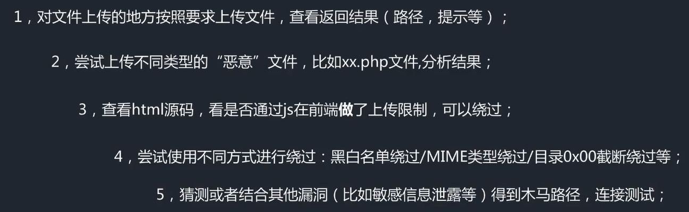
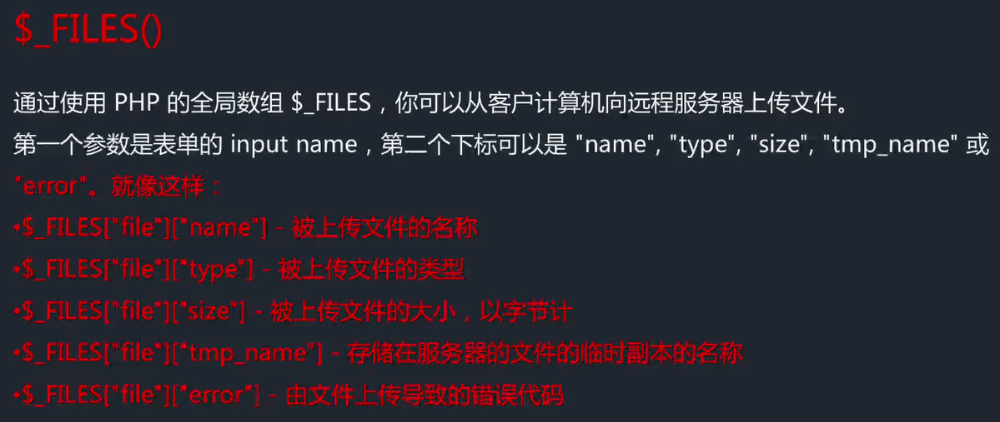

# 文案上传漏洞测试流程

# 制造包含恶意代码的图片（针对图片上传点）

- 注意包含恶意代码的图片上传成功后，直接访问该图片，代码不会执行，需要结合本地文件包含漏洞，将含有恶意代码的图片进行文件包含，从而触发其中的恶意指令，当使用include函数进行文件包含时，include函数会忽略图片中恶意代码之前的图片数据，从而将图片中恶意的php代码执行
# 文件上传功能中常见的$_FILES函数，该函数从http头中获取被上传的文件的相关信息
- 
# 文件上传功能中常见函数move_upload_file()，该函数由php提供，用于将上传的文件移动到新位置
# 在文件上传过程中，被上传的文件在服务器端可能被重新命名且保存在未知路径，此时即使带恶意代码的文件上传成功，也难以确定其位置从而实现访问