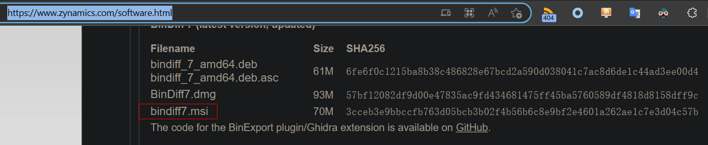
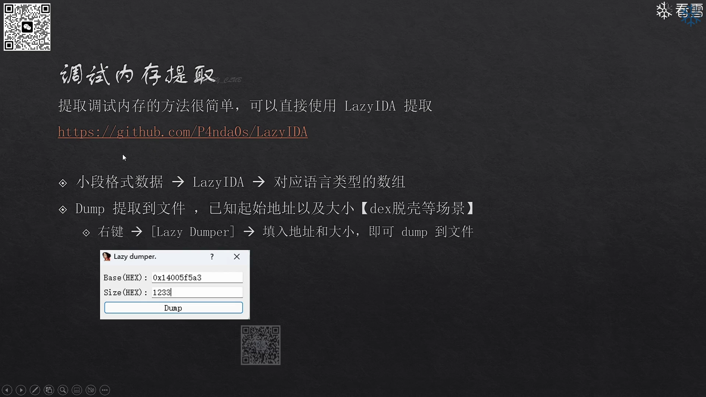
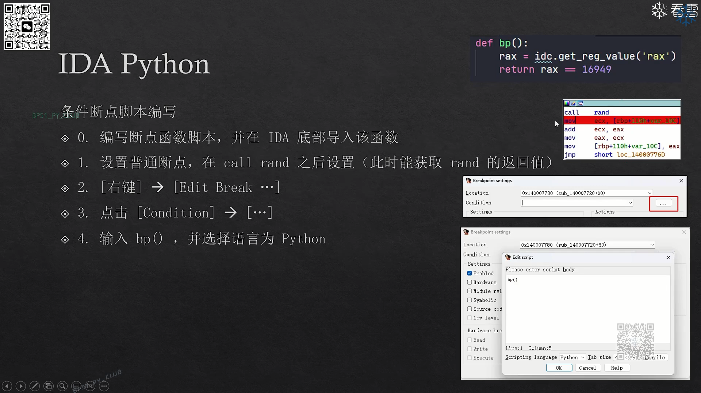
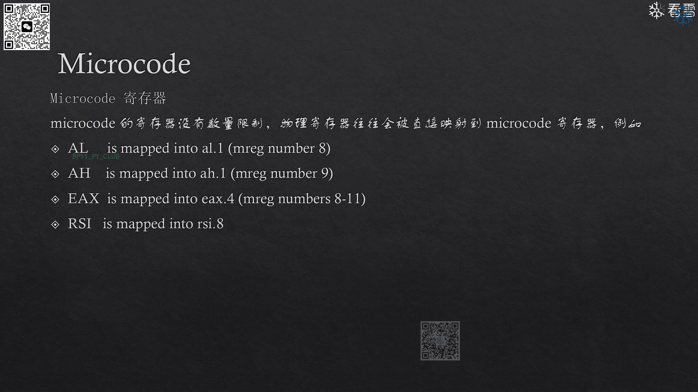
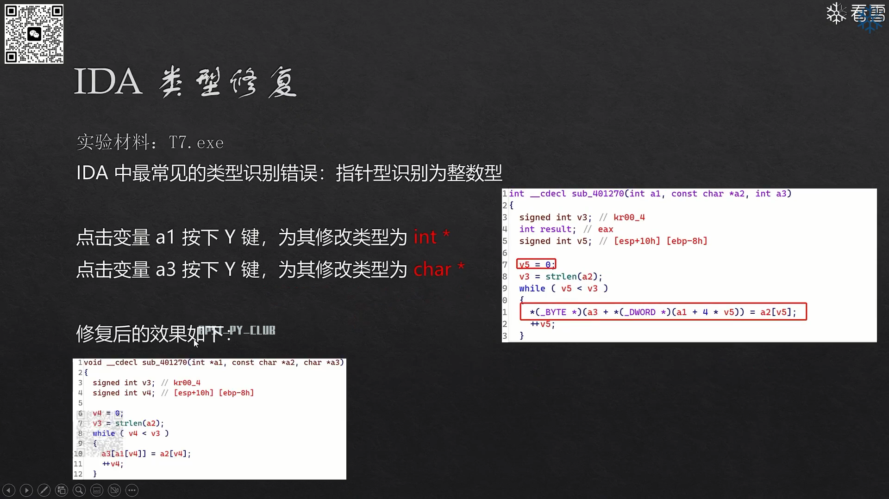

# 第一章 静态分析基础1
- python 3.8配合ida 7.7是最稳的版本
- tab或f5均可以用于将汇编代码切换为伪代码，且当在汇编代码中选中某一行代码或变量后，使用tab，可以在伪代码中显示该代码或变量的对应位置，同理在伪代码窗口中选中，tab键也可以切换到汇编代码窗口的对应位置
- hex窗口中可以修改目标程序的内存数据，并且将修改保存到目标程序 右键-》edit-》进行修改-》apply changes
- ctrl+a撤销上一次操作
- ida7.7中提供了锁定功能，可以将多个特定变量高亮显示
  - 

# 第二章 静态分析基础2
- 不同类型的整数
  - 
- 使用lazyIDA插件，从程序中直接提取数据
  - 
  - 
- u快捷键取消ida对当前地址的解释，即转换为单纯的db数据
- ida调用图，反汇编窗口 函数符号单选中 右键 Xref Graph to（查看哪些函数调用到了当前函数），右键 Xref Graph from（查看当前函数调用了哪些函数）
  - 可以通过写脚本规定图中所涉及的函数集合，从而仅分析我们关注的函数的调用关系
- ida中搜索一个常数（search——》immediate value）从而搜索对某个结构体固定偏移的引用，或搜索特定系统调用号（例如0x81 sys_exit）或逆向ollvm时，搜索特定常数从而找到对应的基本块代码 
  - 
- 指令文本搜索 search-》text，可以搜索特定指令名，例如SVC 系统调用命令
  - 
  - 可以通过搜索xor等特殊指令，从而定位到可能的加解密算法的位置
- 字节序列搜索
  - 
- ida代码提取，提取伪代码并编译
  - ida内置函数、类型定义在IDA.h 或Defs.h文件中，其中包含ida使用的一些宏，故该文件在理解ida伪代码以及编译伪代码时会用到
  - 
  - 
- patch数据
  - 
- ***ida符号恢复***
  - 
  - 需要安装bindiff的ida插件，bindiff官网下载下述msi程序，双击安装后会自动找到ida程序并安装插件
  - 
  - 
  - 即在将无符号的程序加载到ida中，在该ida界面中使用bindiff插件，加载有符号的程序生成的idb文件，从而实现有符号程序与无符号程序中的函数对比 （注意路径中不能包含中文）
  - 
    - 该步骤中点击导入符号后，会自动将有符号的idb中的符号信息导入到当前无符号的idb文件中

# 第三章 动态调试基础1
- windows本地调试
  - 
  - 动态调试过程中，寄存器值窗口中每个寄存器值后存在箭头，可以先点击汇编或hex窗口，之后点击该箭头，则汇编或hex窗口会跳转到该寄存器值所指向的数据 （可以点击栈窗口，之后点击寄存器窗口中寄存器rsp后的箭头，从而跳转到栈顶）
  - 
  - 
  - 动态调试过程中module窗口中显示了当前已经加载的so文件，双击对应so文件，可以查看对应so文件导出的函数，双击函数，可以在汇编窗口中看到该函数内容，安卓中分析so文件经常用到
  - 寄存器窗口右键，可以显示其他扩展寄存器
    - 
  - 双击寄存器值可以修改寄存器值
  - 可以在伪代码中下断点，也可以在汇编代码中下断
  - 动态调试过程中，右键特定汇编代码，setip，可以直接将从该位置处开始执行代码
    - 
  - 数据窗口右键，sycnc with 可以选择跟随某个寄存器
- 设置命令行参数
  - 
  - 上图中direction表示程序运行目录 input file表示程序文件所在目录
- 调试基本操作
  - 
  - 
- windows远程调试
  - 
  - 默认远程调试端口为23946
  - 
  - 远程调试过程中，ida会自动检索directory目录是否存在待调试程序，若directory目录下不存在待调试的文件，则ida会显示是否自动上传，故开始调试时，远程主机中不是必须存在待调试文件
- linux远程调试
  - 
- 动态链接库调试
  - 
  - 需要保证静态分析的动态库与宿主程序载入的库文件名相同，从而保证能够通过调试宿主程序从而实现动态库的调试
  - 手动设置加载基址 edit-》segment-》rebase program -》image base
- 安卓native库调试
  - 
  - 通过adb将安卓上的23946端口转发到本机端口，从而实现ida调试时，ip地址使用127.0.0.1 端口设置23946。即可实现动态调试
  - 
  - 选择要附件的宿主程序后，会跳出提示，显示两个动态库文件名相同，此时选择save，从而实现so文件动态调试
  - 
- 模拟路由器固件调试
  - 
  - 
  - ida调试器类型选择remote gdb
  - 

# 第四章  动态调试基础2
## 硬件断点
- 
- windows linux x86开启了硬件断点支持， 安卓中未开启硬件断点支持
- 
## 内存断点
- 
## api断点
- 
## 提取调试内存
- 
## 调试内存修改
- 
## 黑盒分析法
- 
## 调试过程中将鼠标移动到指定函数处，可以显示该函数的各个参数分别位于哪个寄存器中
- 
## trace分析
- 
- 
- 
- 
- 
- 使用指令级别的trace进行反调试
- 在已经开始调试的状态下进行trace调试
  - 
- 已经执行并被trace的指令会被染色
  - 
- 调试结束后，可以在traceing window中查看trace的结果
  - 
- 在trace windows窗口中右键，可以选择隐藏列或者关闭指令名称显示的选项，也可以选择copy all，从而将执行的汇编代码全部提取，提取后的汇编指令可以使用汇编器编译，再使用ida分析
## fork双进程调试
- 
- gdb支持子进程调试，ida不直接支持子进程调试
- 
- 调试过程中使用keypatch插件进行patch操作，从设置死循环代码
  - 
- 将原指令修改为B 指令跳转回之前的地址，形成死循环，有时安卓会杀死长时间不响应的进程，导致修改失败，故速度要快
  - 
- 修改完成后，让程序继续运行，取消附加调试，在死循环中下断点，重新附加调试新形成的子进程，断下后通过setip，从而开始调试关键代码
- 在调试子进程时，可以通过setip直接开始执行子进程代码，但有时程序需要两个进程同时存在并进行交互，此时就需要使用上述方法
- 针对难以调试的启动代码，此时也可以通过设置死循环，并下断，从而实现调试
## Frida辅助ida调试Linker或JNI_Onload
- 
- Firda可以以暂停模式启动app，此时so文件还未加载，所以可以针对so文件中init_array中的函数下断(此类函数在so文件加载后就被执行)
- 
- linker64中该函数用于调用so文件的init_array函数，故在此处下断
  - 

# 第五章  IDA疑难杂症
## ida中直接将某条指令强行解释为函数调用
- 
- 
- ***创建函数快捷键 p***
- 
- 
- 
- 将读取fs寄存器的指令解析为call，从而分别显示两个对fs寄存器的读取命令，避免ida将其优化为一条指令
- 
- 
## ida修复枚举值
- 快捷键m，ida内置了常见枚举值的定义，直接选择即可
- 
## ida修复栈不平衡
- 
- 
- 栈不平衡说明函数中一定有操作栈指针的指令被错误反汇编出来，此时要找到此类指令，并将其nop掉
- options-》general-》Stack Pointer 勾选，则此后图形视图中 汇编指令处可以显示此时栈顶偏移
- 
- 
- 分析函数中各个指令的栈偏移，发现大多数时候，函数内指令在栈偏移为d4的情况下运行，则此时d4应该是函数执行过程中保持的栈指针偏移，此时去找到哪条指令导致栈指针不平衡
- 
- 发现此处add esp，8指令不会被执行到，但是会导致栈指针增加，故此时会导致栈不平衡，此处应该将该指令nop
- 
- 使用keypatch插件将该指令nop掉
- 
- 
- 之后 U 快捷键取消函数定义，重新创建函数，（c键创建代码 p键创建函数）此时不再报错
## ida修复栈空间过大
- 
- 
- 
- 最后重新分析函数，仍报该错误，此时可以将错误分支上的代码（永远不会被执行到）都nop掉，从而解决问题

## switch跳转表修复
- 不同版本ida对跳转表等特征代码识别能力不同，高版本ida识别能力较强
- 
- 
- 
- 函数中存在跳转表的代码特征 伪代码中存在jmp rax等内联汇编 图形模式下存在大量没有头的代码基本块
  - 
  - 
  - 
- 找到switch case语句中关键变量 被赋值的位置创建跳转表，此处经过分析 eax寄存器即为switch的输入值寄存器
  - 
- 若创建失败，则重新载入分析目标程序即可
## 函数大小限制
- 
## golang反编译失败处理
- 
- 将问题函数的参数修改为一两个参数或没有参数，即可修复成功

# 第六章  IDA脚本编程
- 
- ida分为两种内存，本地内存（静态分析）和调试内存（动态调试）
- 
- 调试过程中寄存器读写 只有在调试过程中断点断下时才能用
  - 
  - 
- 调试过程中操作调试内存 
  - 
  - 
- 本地内存操作，静态分析过程中可以使用
  - 
- 反汇编操作
  - 
- 交叉引用分析
  - 
- ollvm批量断点设置
  - 
  - 
  - 在vscode中写好上述脚本后，可以直接复制，并在ida中python输入窗口中粘贴，并执行，
  - 另外一种执行python脚本方法
    - 
  - 新版ida中支持将所有断点全选，并打包到一个文件夹，可以右键批量禁用该文件夹下所有断点
    - 
- 杂项接口
  - 
  - 可以用于批量识别代码，批量创建函数
- 函数遍历
  - 
- 基本块遍历，前驱 后继
  - 
- 指令遍历
  - 
- 条件脚本编写，可以将条件断点作为hook使用，当指定断点触发后，执行指定脚本
  - 
  - 
  - 
- ida微码研究
  - 下图中包含ida反编译流程
  - 
  - ida微码位于汇编代码和伪代码之间，反汇编完毕后生成微码，进行微码的优化和变换，生成ctree，即伪代码的高级语法树，最后输出伪代码
  - 微码很类似汇编语言，存在指令 操作数，指定插件可以显示微码
    - 
  - 
  - 
  - 微码分为多个阶段
  - 微码会不断优化，从而更为精简，最终生成嵌套的微码
  - 
  - 
  - 
  - 打印指定函数的微码
  - 
  - 微码相关数据结构
  - 
  - 顶层结构，用于表示函数基本块信息
  - 
  - 基本块结构
  - 
  - 指令结构
  - 
  - 操作数结构
  - 
  - 插件实例
  - 
  - 
  - hexrays hooks
  - 
  - IDABeautify是基于微码实现的插件 可以实现直接根据需要修改ida反编译结果，例如删除错误处理的代码分支，或者将特定变量指定为一个固定值
  - IDAFrida选中一些函数，自动生成此类函数的hook脚本

# 第七章  C++逆向
- 
- 
- 
- 
- 下述结构基于linux x64结构
- 
- 
- 
- 
- 
- 
- 
- 
- 

# 第八章  类型修复
- 
- 
- 函数返回值修复
  - 若函数的返回值在所有代码中均不被使用，则可以将函数返回值设置为void，从而简化反编译的伪代码
  - 
  - ***Y快捷键修改函数原型 也可以用于修改变量类型 修改结构体中字段的数据类型***
  - 
- 指针被识别为整数型
  - 
  - 类型修复后，函数可读性大幅度增强
  - 
- 数组修复
  - 
  - 
  - 
  - 
  - 
  - 
  - 
- 修复枚举值
  - 
- 结构体修复 类的修复 两者类似
  - 
  - 
  - 
  - 
  - 
  - 
  - 
  - 
  - 
  - 
  - 
  - 
  -  
  - 开始创建结构体
  - 
  - 在ends的位置上按d键，即可添加新的字段，持续添加dq字段（因为是64位程序）将结构体大小扩展为0x70
  - 
  - 将指向该结构体的指针变量 的变量类型进行修改，可以采用y快捷键，也可右键如下操作，最终该指针类型被修改为结构体指针
  - 
  - 
  - 将函数参数类型修改为结构体指针后，函数内相关代码会被修改为引用结构体内成员的形式
  - 
  - 将代码中变量设置为结构体类型后，分析该变量的引用情况，从而倒推该结构体成员变量的信息，例如成员变量的数据类型，成员变量的含义等
  - ***查找对特定结构体成员变量的交叉引用时，x显示当前函数内的交叉引用信息，ctrl+alt+x显示全局交叉引用信息（全局交叉引用）***
    - 如果您有一个经过良好分析的数据库，程序使用了自定义类型，并且已正确设置了函数原型，则可以要求反编译器分析所有函数并构建对结构字段，枚举成员或整体的交叉引用列表本地类型。默认热键为“CTRI”–“AIT”–“X” 。
- 虚表修复
  - 
  - 虚表在c++中被用于实现多态
  - 若虚表存在，则类的第一项数据指针指向虚表
  - 虚表是一个函数表
  - 
    - 根据虚表创建一个相同的结构体
  - 
    - 创建类结构体，并将第一个成员设置为虚表结构体的指针类型，之后将代码中关键指针设置为类指针类型，从而完成修复
  - ***此后可以对虚表中的函数交叉引用，并使用ctrl+alt+x查找全局交叉引用***
  - 

# 综合实战
- 该实战中，分析一个apk的加密算法，并尝试实现对加密数据的解密
- 加密算法位于so文件中
- 定位到加密算法位置，从内存中提取出密钥信息，加密类型为aes，为对称加密，故从apk的log中获得加密后的数据，假设设备使用标准aes算法，尝试使用标准aes算法和得到的密钥解密密文，失败，说明此时apk使用魔改版的aes加密算法，此时需要逆向
- 逆向魔改aes加密算法，可以关注输入数据的变化以及中间结果，使用同一输入，对比标准aes算法的中间结果的输出和魔改aes算法的中间结果输出，从而定位到魔改aes算法和标准aes算法不同的地方
- 此处选择state变量作为aes算法的中间变量进行观察和对比
- 标准aes中，在源码中插入代码，打印state变量情况，在魔改aes代码中，通过idapython脚本的方法，设置条件断点，执行python脚本，打印state变量情况
- 最终发现魔改版的aes算法在标准aes算法的基础上多加密了一轮，故只要标准AES算法多加密一轮，即可还原魔改aes，并成功解密对应加密数据

