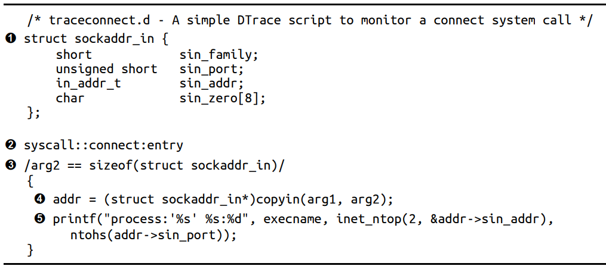
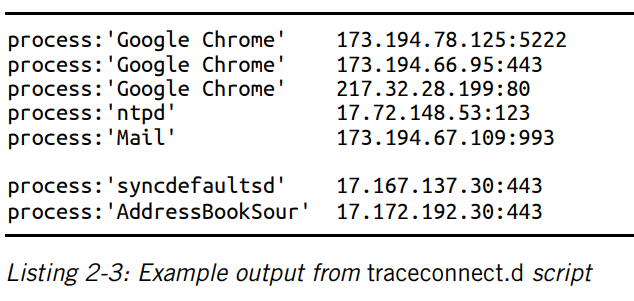
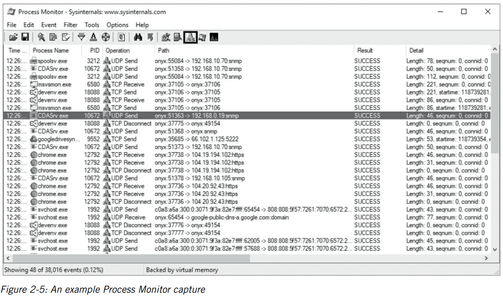
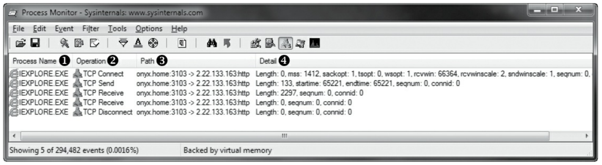
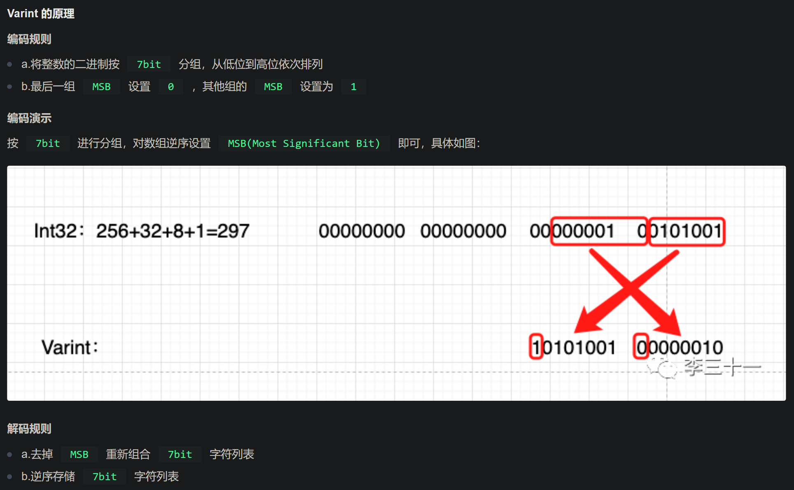
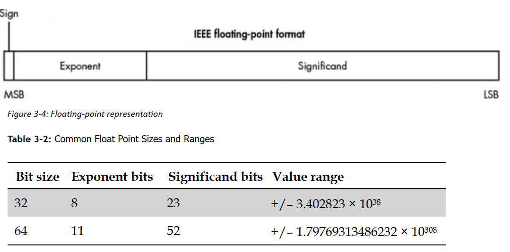

https://app.txyz.ai/ 不支持超过300页的pdf 尝试将该pdf分割，可以辅助阅读英文数据

James Forshaw 的“ATTACKING NETWORK PROTOCOLS”是一本综合指南，从黑客的角度深入探讨了网络协议的捕获、分析和利用。该文档涵盖了各种主题，例如网络基础知识、捕获应用程序流量、网络协议结构、高级流量捕获、线路分析、应用程序逆向工程、网络协议安全、实施网络协议、识别漏洞和利用安全漏洞。作者是 Google Project Zero 的著名计算机安全研究员，他提供了对加密算法、漏洞根本原因以及查找和利用安全漏洞的技术的见解。该文档还包括一个详细的网络协议分析工具包，用于被动和主动网络捕获、Web 应用程序测试、模糊测试、数据包生成、漏洞利用框架、网络欺骗、可执行逆向工程等。

捕获、分析和利用网络协议的综合指南
涵盖网络基础知识、应用程序流量捕获、协议结构、安全性、漏洞和漏洞利用等主题
作者：James Forshaw，Google Project Zero 的著名计算机安全研究员
包括对加密算法、漏洞根本原因和漏洞利用技术的见解
为各种网络相关任务提供详细的网络协议分析工具包

# 第一章 网络基础
- 网络协议具有多种功能，包括以下一项或多项功能：
  - 维护会话状态 协议通常实现创建新连接和终止现有连接的机制。
  - 通过寻址识别节点 数据必须传输到网络上的正确节点。一些协议实施寻址机制来识别特定节点或节点组。
  - 控制流量 通过网络传输的数据量是有限的。协议可以实现管理数据流的方法，以提高吞吐量并减少延迟。
  - 保证传输数据的顺序 许多网络不能保证数据发送的顺序与接收的顺序一致。协议可以对数据进行重新排序，以确保以正确的顺序传输数据。
  - 检测和纠正错误 许多网络并非 100% 可靠；数据可能会损坏。检测损坏并理想情况下纠正损坏非常重要。
  - 格式化和编码数据 数据并不总是采用适合在网络上传输的格式。协议可以指定数据编码方式，例如将英文文本编码为二进制值

# 第二章抓包流量
- ***要从以太网接口（有线或无线）捕获流量，捕获设备必须处于混杂模式。处于混杂模式的设备会接收并处理它看到的任何以太网帧，即使该帧不是发往该接口的。***捕获在同一台计算机上运行的应用程序很容易：只需监视出站网络接口或本地环回接口（更好地称为 localhost）。否则，您可能需要使用网络硬件（例如集线器或配置的交换机）来确保将流量发送到您的网络接口。
- 使用wireshark的流跟踪功能，可以恢复收到的tcp数据包的顺序

- linux中使用strace程序监控目标程序的网络连接系统调用（socket bind listen recv send），从而实现网络嗅探
  - 将/path/to/app替换为您要测试的应用程序，并将args 替换为必要的参数，以记录该应用程序使用的网络系统调用：
    - strace –e trace=network,read,write /path/to/app args

- linux中使用Dtrace监控网络连接，从而实现网络嗅探
  - 使用 DTrace 监控出站 IP 连接的脚本示例
    - 
  - 运行此脚本，请将其复制到名为traceconnect.d的文件中，然后运行命令dtrace -s traceconnect.d以 root 用户身份运行。当您使用网络连接应用程序时，输出应如清单
    - 

- windows中流量捕获
  - 与类 Unix 系统相比，Windows 无需直接系统调用即可实现其用户模式网络功能。网络堆栈通过驱动程序公开，建立连接时使用文件open、read和write系统调用来配置要使用的网络套接字。即使 Windows 支持类似于strace的功能，这种实现也使得监控​​网络流量与其他平台处于同一级别更加困难。
  - 使用Microsoft 的 Process Monitor 工具。图2-5 显示了仅过滤网络连接事件时的主界面，图中圈出的过滤器将仅显示与受监控进程的网络连接相关的事件
    - 
  - 显示单个进程的网络连接情况
    - 

- 主动网络流量捕获
  - 网络代理
  - 端口转发

- 待看.......................

# 第三章 网络协议结构
## 二进制协议结构
- 最小分析单位是位，即bit。一般以8bit即一字节为单位进行分析
### 二进制中数据可以表示的数值
- 无符号整数
- 有符号整数
- 可变长度整数  
  - 是一种压缩整型数值的方法，例如使用4字节表示一个整数，则该整数为1时，需要发送31bit的0和1bit的1，从而造成长度的浪费
  - 通过可变长度整数，可以将整数以更短的形式存储，具体编码规则如下
    - 
- 浮点数据
  - 两种浮点数据表示：
    - 单精度，二进制表示，即 32 位值；
    - 双精度，即 64 位值。
    - 每种格式都指定了有效数字和指数的位置和位大小。还指定了符号位，表示该值是正数还是负数。
  - 
- 布尔值
- 位标志
  - 例如tcp传输过程中，syn数据包和ack数据包是使用标志位进行标识
- 字节序
  - 大端：将高有效数据位存储在低地址
  - 小端：将低有效数据位存储在低地址
  - Internet RFC 总是使用大端作为其指定的所有网络协议的首选类型（除非有其他遗留原因），因此大端被称为网络顺序
  - 计算机可以根据处理器架构的不同，使用大端或小端架构
- 文本和人类可读数据

