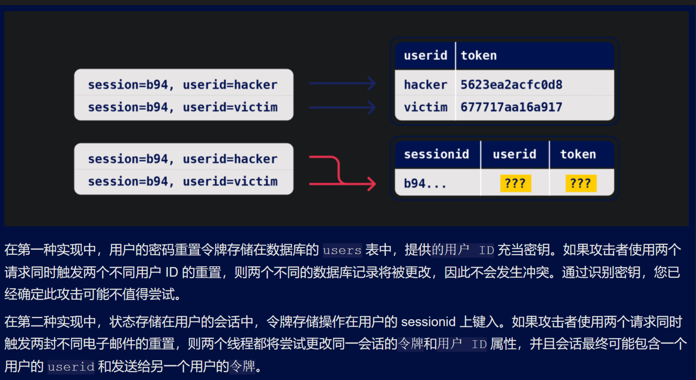

# 协议多进程条件竞争漏洞
- 先弄清协议处理有哪些进程，此类进程共享哪些代码
- https://developer.aliyun.com/article/676235
  - 该漏洞一般出现在与数据库系统频繁交互的位置，例如金额同步、支付等较敏感操作处，也会出现在文件的操作的地方
  - 为了避免出现竞争条件，进入临界区要遵循：
    - 任何两个进程不能同时进入访问同一临界资源的临界区 （定位同一变量是否在不同临界区被使用）
    - 进程的个数，CPU个数性能等都是无序的，随机的 （确定程序进程数量，对应平台cpu数量）
    - 临界区之外的进程不得阻塞其他进程进入临界区
    - 任何进程都不应被长期阻塞在临界区之外
- https://m.freebuf.com/articles/web/374804.html
  - 2023 Black Hat _ 服务器端漏洞篇之条件竞争专题 - FreeBuf网络安全行业门户 (2023_12_10 16_15_33).html
  - racewhitepaper.pdf
  - 当网站在处理不过来同时发过来的请求时，就会存在 ***多个不同的线程同时与相同的数据进行交互***，从而导致应用程序做出匪夷所思的行为。
  - bp支持新功能，并发发送多个http请求
  - "竞争窗口"，表示可能发生碰撞的时间段，比如与数据库的两次交互之间的几分之一秒
  - "time-of-check to time-of-use" (TOCTOU)缺陷
  - ***实际上，明面上看是一个请求，但是可能背后需要通过多个步骤的请求序列完成，但是这个序列对于用户是隐藏起来的，在用户侧只能看到进入序列之前和从序列出来即发出请求以及得到响应这两个动作，burp称中间的这个序列为"子状态"。***
  - 如果我们能够发现可以与相同数据同时交互多次的缺陷就会允许我们利用子状态中的逻辑缺陷来实现某些意想不到的效果，例如突破限制
  - PortSwigger Research的白皮书《Smashing the state machine: The true potential of web race conditions》
    - https://portswigger.net/research/smashing-the-state-machine
    - 黑盒测试方法论 白盒代码审计很难发现此类问题
    - 测试前
      - 识别需要被绕过的关键对象或防护机制
      - 对于每个对象，标识所有写入或从中读取数据的端点，即找到所有能改变该对象状态的请求（密码写入数据库）
      - 标识所有使用该对象的请求（登录请求取出密码进行验证）
      - 寻找有价值的端点，需要多线程并发地对同一个数据进行操作（定位该数据和内容）
      - 排除一些端点
        - 冲突的关键是共享资源上的两个并发操作。我们可以使用三个关键问题来排除不太可能引起冲突的端点。对于每个对象和关联的端点，询问：
          - 状态如何被存储，如果是在服务端持久存储，则适合利用，在客户端存储的状态数据不受子状态影响
          - 该端点触发的操作是编辑数据（更改帐户的主要电子邮件地址）还是追加数据（添加额外的电子邮件地址），前者更有冲突的可能，后者不太可能受到除限制超限攻击之外的任何攻击。
          - 端点根据什么对对象进进行操作，如果要对同一个对象进行操作，则需要两端点使用相同的操作根据 登录功能（端点）- 操作对象（登录记录） - 密钥（操作根据）即通过密钥查找登录记录
          - 
    - 测试中
      - 准备请求、目标终结点和参数的混合，以触发所有相关的代码路径。在可能的情况下，使用多个请求多次触发每个代码路径，并使用不同的输入值。
      - 将请求组中请求按正常序列依次发送，获得正常情况下的处理基准（通过发送请求混合，在每个请求之间间隔几秒钟，对终结点在正常情况下的行为进行基准测试。）
      - 将上述请求组中的请求并发发送，只需要寻找我们在基准测试期间观察到的情况是否存在某种形式的偏差就行，包括一个或多个响应的变化，但也可能会产生二阶效应，例如不同的电子邮件内容或后续应用程序行为的明显变化。
      - 通过上述操作，证明子状态的存在，需要发送大量请求，以最大限度地提高可见副作用的可能性，并减轻服务器端抖动。可以把它看作是一个基于混沌的策略——如果我们看到一些有趣的东西，我们就会弄清楚以后到底发生了什么。
      - 几乎任何事情都可以成为线索，但要密切注意请求处理时间。如果它比您预期的要短，这可能表明数据正在传递到单独的线程，从而大大增加了漏洞的可能性。如果它比预期的要长，这可能表示资源限制， 或者应用程序正在使用锁定来避免并发问题
    - 证明猜想
      - 尝试了解正在发生的事情，删除多余的请求，并确保可以复现。
      - 一些提示
        - 当您发送一批请求时，您可能会发现早期请求对会触发易受攻击的最终状态，但后来的请求会覆盖/使其无效，并且最终状态无法利用。在这种情况下，您需要消除所有不必要的请求 - 两个请求就足以利用大多数漏洞。
        - 减少到两个请求将使攻击对时间更加敏感，因此您可能需要多次重试攻击或将其自动化。
        - 最后，别忘了升级！将每个竞争条件视为 ***结构性弱点***，而不是孤立的漏洞。高级竞争条件可能会导致不寻常且独特的基元，因此达到最大影响的路径并不总是显而易见的。
    - 高级的条件竞争可能会导致不寻常且独特的基元，因此想达到最大危害的路径并不是显而易见的。我们应该把每个条件竞争串联起来看，而不是当成单独的漏洞。
  - 多端点条件竞争的一些问题
    - 并发向多个端点发送请求，要求该多个端点的处理流程中涉及相同的关键变量，在时间窗口内，该变量可以改变程序逻辑
    - 多端点条件竞争测试过程中，即使并行发送情趣，在目标处理过程中的延迟仍可能导致关键请求无法在时间窗口内到达竞争区代码
    - 可能导致该问题的原因 
      - 网络架构引入的延迟 - 例如，每当前端服务器与后端建立新连接时，可能会出现延迟。使用的协议也会产生重大影响。
      - 端点的特定处理引入的延迟 - 不同端点的处理时间本质上有所不同，有时差异很大，具体取决于它们触发的操作。
    - 解决方案：请求预热
      - 后端连接延迟通常不会干扰条件竞争攻击，因为它们通常会同等地延迟并行请求，因此请求保持同步。
      - 必须能够将这些延迟与端点特定因素引起的延迟区分开来。实现此目的的一种方法是通过一个或多个无关紧要的请求"预热"连接，看看这是否可以平滑剩余的处理时间。在Repeater中，我们可以尝试将主页的GET请求添加到分组的开头，然后使用Send group in sequence (single connection)发送请求。
      - 如果第一个请求仍然有较长的处理时间，但其余请求现在都在很短的时间内处理，我们可以忽略明显的延迟并继续正常测试。
      - 如果即使使用单数据包技术，仍然在单个端点上看到不一致的响应时间，这表明后端延迟正在干扰攻击。我们可以通过在跟进主要攻击请求之前使用Turbo Intruder发送一些连接预热请求来解决此问题。
    - 解决方案：滥用速率或资源限制
      - 我们可以通过滥用常见的安全功能来解决此问题。如果请求发送速度过快，Web服务器通常会延迟处理请求。通过发送大量虚拟请求来故意触发速率或资源限制，可能会导致适当的服务器端延迟。即使需要延迟执行，这也使得单数据包攻击可行
  - 单端点的并发执行
    - 向单个端点发送多个请求，有时也能触发条件竞争漏洞
  - 局部条件竞争
    - 局部构造条件竞争 许多应用程序通过多个步骤创建对象，这可能会引入对象可被利用的临时中间状态。例如，当注册新用户时，应用程序可以在数据库中创建用户并使用两个单独的SQL语句设置其API密钥。这会留下一个用户存在的小窗口，但他们的API密钥尚未初始化。
  - 时间敏感型攻击
    - 有时候可能找不到竞争条件，但以精确的时间传递请求的技术仍然可以发现其他漏洞的存在。其中一个例子是使用高分辨率时间戳而不是加密安全随机字符串来生成安全令牌。考虑仅使用时间戳随机化的密码重置令牌。在这种情况下，可能会为两个使用相同令牌的不同用户触发两次密码重置。我们可以通过对并发的两个请求计时来判断是否得到由相同时间戳生成的令牌
    - 定位使用时间相关值的变量的使用
  - 防范条件竞争漏洞
    - 当单个请求可以通过不可见的子状态转换应用程序时，理解和预测其行为是极其困难的
    - 避免混合来自不同存储位置的数据 关注不同存储位置数据的混合
    - 通过使用数据存储的并发功能，确保敏感端点使状态更改原子化。例如，使用单个数据库事务来检查付款是否与购物车价值匹配并确认订单。 即关注对多个端点提供数据支持的对象
    - 作为深度防御措施，请利用数据存储完整性和一致性功能(例如列唯一性约束)。
    - 不要尝试使用一个数据存储层来保护另一层的安全。例如，会话不适合防止对数据库的限制溢出攻击。
    - 确保会话处理框架保持会话内部一致。单独更新会话变量而不是批量更新可能是一种看上去很好的优化，但这是极其危险的。
    - 在某些架构中，完全避免服务器端状态可能是合适的。相反，我们可以使用加密将状态推送到客户端，例如使用JWT。
- https://www.venustech.com.cn/new_type/aqldfx/20210310/22463.html

- 古河 blackhat 2023 关于协议的条件竞
- 脏牛（dirty cow）属于条件竞争，需要了解