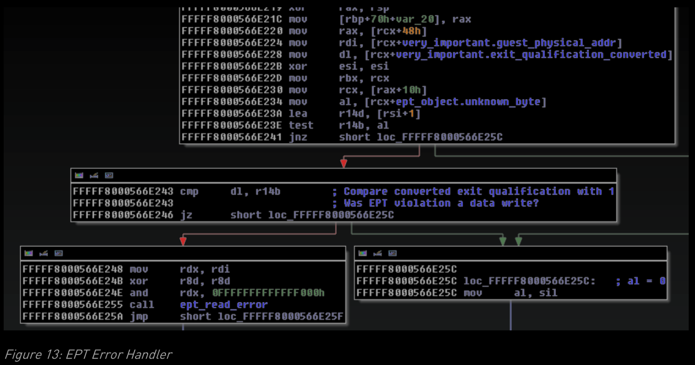

- https://static.ernw.de/whitepaper/ERNW_Newsletter_43_HyperV_en.pdf
- 本地文件：ERNW_Newsletter_43_HyperV_en.pdf
- Hyper-V 是 1 类管理程序，因此直接在硬件上运行，而不依赖于底层操作系统。对于许多用户来说，这可能非常令人惊讶，因为安装过程从常规 Windows Server 安装开始，并且 Hyper-V 作为附加角色添加。然而，在安装过程中，Windows 操作系统变成了一个（高度特权的）Hyper-V 分区，并在下一次重新启动后处于管理程序的控制之下。
- 图 1 显示了 Hyper-V 架构的概览。 Microsoft 将虚拟化操作系统称为分区，并区分（特权）根分区和它的（非特权）子分区。根分区负责所有其他分区的管理和配置，并且完全受虚拟机管理程序的信任（类似于 Xen 的 Dom0）。 Hyper-V支持未经修改的操作系统，不知道自己运行在虚拟环境中，称为unenlightened。为了使这成为可能，管理程序透明地模拟了所有现代操作系统都支持的某些标准设备
- 明确支持 Hyper-V 的开明操作系统可以利用更高级的功能来提高性能。首先，他们可以使用超级调用直接与虚拟机管理程序进行通信，这种机制非常类似于操作系统内核的标准系统调用接口。超级调用是公开记录的 Hyper-V API 之一，在第 0 章中进行了描述。此外，VMBus 机制用于促进子分区和根分区之间的直接高速通信。这主要用于所谓的合成设备，可以被所有开明的分区使用，并且比它们的模拟对应物快得多。
- 由于 Microsoft 决定尽可能减少 Hyper-V 管理程序，因此大部分功能都外包给了根分区。这包括模拟以及合成设备和所有高级管理界面。这一决定将管理程序代码本身的复杂性显着降低到大约 100.000 行代码。然而，它对整个 Hyper-V 环境的安全性影响有限，我们将在后面进行演示。
# VMWP、VSC 和 VSP
- 图 2 显示了根分区内的核心组件和开明的子级。***每个子分区都有一个相应的虚拟机工作进程 (VMWP)，它作为根分区中的普通用户空间进程运行。***工作进程执行管理职责，如快照或迁移。但它也实现了上述设备仿真，以及一些对性能不重要的合成设备。
- 在用户空间进程中实现这些功能有很多优点：首先，导致崩溃或高资源消耗的错误不会影响根分区、其他 VM 或整个管理程序的稳定性。其次，工作进程可以以低权限执行。这意味着能够利用设备仿真层中的漏洞的攻击者仍然需要执行特权升级才能完全破坏根分区。但是，由于需要额外的上下文切换，用户空间实现不适合网络和存储等性能关键设备。
- 此类设备(例如存储和网络等性能关键设备)在虚拟化服务提供商 (VSP) 中实现。 ***VSP 是在根分区内核中运行的驱动程序，因此对于攻击者来说是非常有趣的目标。 VSP 在子分区中的对应物是虚拟化服务客户端 (VSC)。***所有现代版本的 Windows 都已包含这些内核驱动程序，并为合成设备提供操作系统支持。此外，Linux 和 FreeBSD 包括由 Microsoft 工程师提供的多个 VSC 的开源实现。对于 Linux，此代码称为 Linux 集成服务，现在直接包含在内核树中。但是，也可以在 Github 存储库中找到具有附加功能的更新版本3。
- 仅设备支持对于虚拟化解决方案是不够的，管理程序的核心任务是 CPU 和内存的虚拟化。与几乎所有 x86-64 管理程序一样，Hyper-V 使用硬件辅助虚拟化。这意味着Hyper-V 使用扩展的虚拟化指令集 Intel VT4 和 AMD-V5。因为我们所有的研究都是在英特尔硬件上进行的，所以我们将在本文中使用英特尔特定的术语。
# 硬件辅助虚拟化
- 英特尔 VT 增加了对两种不同处理器操作模式的支持：VMX 根模式和 VMX 非根模式。管理程序在 VMX 根模式下运行，而所有分区都在非根模式下运行。
- 在非 root 模式下运行的 VM 不会对性能产生任何影响，但某些事件可能会触发上下文切换回虚拟机管理程序。这些上下文切换称为 VM 退出，可能由于多种原因而发生，例如执行某些指令（例如中断处理）或访问特殊系统寄存器。
- 英特尔 VT 的目标之一是对客户操作系统透明。因此，由指令或系统寄存器访问触发的 VM 退出需要虚拟机管理程序完全模拟它们的行为。虽然这对于许多退出原因来说是微不足道的，但是对 x86 架构的所有极端情况的完全支持是困难的并且容易出错。硬件辅助虚拟化的安全问题的完整讨论超出了本文的范围6，但是后面的部分将更详细地描述 VT 架构的几个属性。
- 尽管 Intel VT 设计为对来宾操作系统透明，但 ***Hyper-V 对可见区的支持要求虚拟化操作系统可以检查它是否在 Hyper-V 中运行。这由下一节中描述的专用接口发现机制支持。***
# 接口发现
- 当虚拟化分区执行 CPUID 指令时，会触发 VM 退出，并且 Hyper-V 通过添加 Hyper-V 特定信息来修改典型的 CPUID 返回值。 EAX=1 的 CPUID 调用将产生一个设置了 MSB 的 ECX 寄存器。这表明存在管理程序。可以通过执行输入值介于 0x40000000 和 0x40000006 之间的 CPUID 来查询有关 Hyper-V 版本和分区权限的更多信息。右图显示了在 Windows Server 2012 Hyper-V 系统上执行的小型包装实用程序的输出
- 有趣的是，返回的信息包括 HyperV 的确切版本，以及调用分区的超级调用权限。这些详细信息可以帮助攻击者确定是否存在某些漏洞并允许更好地定位攻击。
- 此外，在 Azure VM 中使用此接口发现机制会返回非常有趣的结果，如下一节所述。
# Azure 管理程序 = Hyper-V ？
- 官方称，微软 Azure 云运行在一个名为“Azure 虚拟机管理程序”的虚拟机管理程序上，与 HyperV 不同。但是，即使粗略地看一下 Azure VM，也可以看出这两个虚拟机管理程序至少是密切相关的。图 4 显示了运行标准 Hyper-V VSC 服务并在 Azure VM 中执行 CPUID 指令的 Azure VM 的屏幕截图。
- 此外，我们可以使用上一节讨论的接口发现机制。图 5 显示了 CPUID 命令的输出：唯一可识别的区别在于服务包和服务分支编号。甚至分区权限也与默认 Hyper-V VM 的权限相同
# 学习Hyper-V信息来源
- Hypervisor 顶级功能规范：该规范包括对 Hypercall API 和接口发现机制的详细讨论。
- 专利申请：多个公开专利申请描述了Hyper-V 的实现细节。这包括用于子-父通信的机制以及协议规范。虽然与普通技术文档相比，大多数应用程序都很难阅读，但它们仍然有助于了解内部命名法和高级架构。
- http://blogs.msdn.com/b/virtual_pc_guy/archive/2014/02/17/updated-hypervisor-top-level-functionalspecification.aspx 
- http://www.faqs.org/patents/app/20120084517
- Linux 集成服务9：如前所述，Linux 集成服务是 VSC、VMBus 和 Linux 超级调用 API 的开源实现。它们有助于理解 Hyper-V 的这些部分中的实现细节，并且在开发评估和攻击这些 API 的工具时非常有用。
- Singularity Header Files 10：Singularity 是微软研究院开发的开源研究操作系统。它的 SVN 存储库包含许多专有的 Windows 头文件，其中包括几个用于 Microsoft Hyper-V 来宾界面的文件。
-  通用标准认证文件11：通用标准认证需要提供全面的文件。该文档是公开的。
- 9 https://github.com/LIS 
- 10 https://singularity.svn.codeplex.com/svn/base/Windows/Inc/ 
- 11 http://www.commoncriteriaportal.org/files/epfiles/0570b_pdf.pdf
-  二进制文件：当然，最准确和最详细的信息可以从实现本身中提取出来。表 1 列出了我们在研究期间分析的几个文件。下一节描述了反转这些文件所涉及的一些挑战。
  - 
# 逆向工程陷阱
- Hyper-V 的逆向工程/它的一些核心功能，我们必须克服几个挑战。这些挑战对于任何分析 Hyper-V 的安全研究人员都非常重要，我们希望以下小节中的描述能够提供有用的见解。
## 符号移植
- 要了解安全相关核心功能（如 VM 退出处理或hypercall API）的实现，必须执行核心虚拟机管理程序二进制文件的逆向工程。我们的研究是在英特尔硬件上进行的，因此我们使用了 hivx64.exe。在尝试初步了解包含的功能时，我们必须克服一些挑战。
- 首先，二进制文件没有可用的公共调试符号。这增加了识别安全相关代码区域所需的工作量。其次，通过搜索调试输出和其他人类可读字符串来识别有趣功能的标准方法不起作用，因为管理程序本身中此类功能的数量非常少。最后，我们不能依赖已知 API 或库的使用。与用户空间程序或内核驱动程序相比，管理程序是单个静态链接的可执行文件
- 但是，我们可以使用一些技术来识别有趣的功能：一位名叫 Gerhart 的研究人员在 securitylab.ru12 上的详细博客文章中描述了他的符号移植方法：hvix64.exe 与 winload.exe 和 hvloader.exe 共享很多代码。公共调试符号对它们都可用。使用流行的 BinDiff13 软件，我们可以识别共享函数并将包含的符号移植到我们的可执行文件中。不幸的是，共享功能主要涉及网络代码、USB 堆栈以及 WinDBG 调试器存根，对于我们识别攻击面的目标来说并不是那么有趣。
## VMCS
- 如前所述，管理程序不能依赖任何外部库。它使用的唯一有用的记录功能是用于配置和管理不同虚拟机的 Intel VMX 指令。如英特尔官方手册第 3 卷所述，VMX 的核心部分是称为 VMCS（虚拟机控制结构）的数据结构。 VMCS 分为四个逻辑部分：
-  访客状态区域
-  主机状态区域 
-  VM-execution、VM-exit 和 VM-entry 的控制字段 
-  VM-exit 信息字段
- Guest-state 区域用于存储 VM 在退出并将控制权交给管理程序时的处理器状态。这包括某些控制寄存器，以及 MSR 和段选择器，但最重要的是 RIP、RSP 和 RFLAGS 的值。当虚拟机管理程序处理了 VM 退出并且虚拟机继续运行时，处理器状态从其 VMCS 加载，并且可以（可能）透明地继续执行。
- ***Host-state区域在 VM 退出期间加载，并描述了管理程序在处理这些退出时的初始状态。这让我们特别感兴趣，因为存储的 RIP 和 RSP 值允许我们快速识别主退出处理程序及其堆栈位置。***
- VM-execution control的控制字段控制 VMX 非根模式下的操作。这些字段控制中断和某些类型指令的处理，并决定哪些操作触发 VM 退出。它们是安全研究的一个有趣目标，因为不安全的控制字段设置会导致严重的逻辑缺陷。
- 最后，VM 退出信息字段包含有关 VM 退出原因的信息。这些信息在整个 VM 退出处理程序中使用，因此从逆向的角度来看是非常相关的。
- 使用专用指令读取和写入 VMCS 字段：VMREAD 和 VMWRITE。两条指令都需要一个编码参数来描述访问的 VMCS 字段15。对于我们的研究，我们决定以半自动化的方式使用这些信息。使用 IDAPython 脚本，我们将所有 VMCS 访问翻译成人类可读的版本。这简化了对涉及 VMCS 字段的所有代码部分的理解，并允许我们识别主要功能，例如 VM 退出处理和超级调用处理程序。
## 调试
- 尽管静态分析被证明是可行的以获得初步理解，但我们很快决定需要额外的动态分析来进行更全面的分析。
- 有趣的是，Hyper-V 使用 Microsoft 的 WinDBG 集成了调试功能。调试 Hyper-V 本身的工作方式与调试 Windows 内核的方式几乎相同，但由于缺少符号和功能而不太舒服16。
- 支持火线、以太网和 USB 等不同的访问方法，但在实践中，我们在具有标准串行端口的物理硬件上获得了最可靠的结果17。尽管使用物理硬件调试管理程序绝对是可能的，但基于虚拟化的方法会更舒服。幸运的是，当前版本的 VMware Workstation 和 VMware Fusion 支持称为嵌套虚拟化的功能。嵌套虚拟化允许在虚拟机内使用 Intel VT，并可以将 Hyper-V 作为普通 VM 运行。
- 通过虚拟化 Hyper-V 本身，我们获得了许多优势。除了上面提到的 WinDBG 接口，我们现在还可以使用 VMware 的内置 GDB 存根作为替代调试环境。此外，快照可用作获取物理内存转储的简单快捷方式。 VMware Workstation/Fusion 还支持在虚拟机之间共享串行端口，这使得调试器和被调试者都可以在虚拟机中运行18。
- 虽然这仍然不能带来舒适或功能丰富的调试环境，但事实证明它足以执行我们研究所需的分析。
# 攻击面和测试方法
- 根据第 2 章中介绍的架构概述，我们将以下组件确定为 VM 突围攻击的潜在和最有希望的目标：
  -  设备仿真  VMBus 和合成设备  超级调用 API  （VM 退出处理）
- 以下部分将更详细地描述这些组件中的每一个，并介绍我们查找安全问题的方法。我们还没有对一般的 VM 退出处理进行粗略的评估，因此不会在本章中包含这个主题。
## 设备仿真
- 设备虚拟化是每个虚拟化解决方案的核心职责之一。虽然合成设备具有更好的性能特征和更健全的界面，但它们不足以用于通用虚拟化。没有明确支持这些设备的旧操作系统仍然依赖于虚拟环境中“标准”硬件的可用性。这个问题通常使用设备仿真来解决，其中具有广泛支持的旧硬件由管理程序仿真。
- 由于仿真设备的高度复杂性和高性能要求，设备仿真往往是虚拟化软件的薄弱环节。 ***2007 年，Tavis Ormandy 描述了他在多个虚拟化解决方案中对模拟设备进行模糊测试的方法，该方法发现了多个漏洞。***此外，设备仿真层是 Xen 和 KVM 管理程序的热门目标，它们使用 QEMU 来实现其设备。
- Hyper-V 支持许多用于普通 VM 的模拟设备：
  - 网络适​​配器  S3 Trio 显卡  键盘/鼠标  IDE 控制器
- ***所有这些都在 VM 工作进程 vmwp.exe 中实现。***因为模拟设备的攻击面很容易理解，并且对它们进行模糊测试不需要特定于单个虚拟机管理程序的知识，所以我们没想到会有很多结果。所有设备的基本模糊测试触发了 VM 的永久崩溃，这是由工作进程中的断言触发的。此外，我们能够以 100% 的 CPU 消耗冻结工作进程，这需要使用父分区的任务管理器进行硬杀。对于某些云环境，这可能是一个相关问题，但不会以任何方式影响其他 VM，因此并不重要。
- 对 vmwp.exe 二进制文件的进一步静态分析显示了许多防御性检查，并且没有明显的安全漏洞。
## VMBus 和合成设备
### 虚拟总线(VMBus)
- 如前所述，VMBus 是一种用于分区之间通信的机制。在 Hyper-V 的默认配置中，只允许子分区和根分区之间进行通信。 VMBus 本身是使用映射到多个分区的内存页面实现的，默认情况下映射到根分区和目标子分区。这意味着通过总线发送的数据不需要“通过”管理程序进行复制，从而减少了必要的上下文切换次数，从而显着提高了性能。
- VMBus 通信被分成多个通道，其中每个通道都包含一个传入和传出环形缓冲区。由于环形缓冲区空间非常有限，性能关键组件使用称为访客物理地址描述符列表 (GPADL) 的附加机制，它允许根分区直接将访客内存的其他页面映射到其自己的地址空间。
- VMBus 基础设施的主要消费者是合成设备。这包括存储和网络，还包括视频驱动程序和一些额外的实用程序服务（例如时间同步、虚拟机的动态内存分配和键值服务）。
- 如 2.2 节所述，存储和网络是作为内核驱动程序实现的。这使它们成为有趣的目标，因为这些驱动程序中的漏洞（例如，解析来自攻击者控制的分区的输入）将导致对根分区的内核空间以及整个根分区的直接危害。相比之下，视频驱动程序以及所有实用程序服务都是作为 VM 工作进程的一部分实现的。
### 存储
- 对于我们的研究，我们首先关注的是存储 VSP。它的设计非常有趣，因为 VSC 通过 VMBus 发送（在其他数据包类型中）封装的 SCSI 命令，然后由 Storage VSP 解析并转换为简单的文件访问操作。图 6 突出显示了在受启发的 Linux 客户机上实现合成存储设备所涉及的组件。
  - 
- 子分区中的存储 VSC 将 SCSI 命令封装在所谓的 vstor 数据包中。该数据包由 VMBus 驱动程序封装成 VMBus 数据包，并通过上述环形缓冲区进行传输，VMBus 驱动程序的根分区将数据包交给 storvsp.sys 驱动程序，后者将其分派到 vhdump.sys 驱动程序中的相应处理函数中。图 7 显示了此类 SCSI 命令处理程序的示例。注意 BSWAP 指令的使用，该指令用于在大端 SCSI 协议和小端系统架构之间进行转换。
  - 
- 为了评估存储 VSP 的安全性，我们再次从基本的模糊测试开始。这种幼稚的方法被证明是不可行的，因为对 vstor 和 vmbus 数据包进行模糊测试会导致存储 VSC 永久崩溃，从而导致整个子分区崩溃。为了解决这个问题，我们改进了我们的模糊测试框架，以允许对执行的 SCSI 命令进行细粒度模糊测试：我们的模糊测试器使用 kprobes19 接口，它允许挂钩几乎任意的内核函数。通过挂钩通用 VMBus packet_send 函数并根据调用者操作传递的参数，我们可以将模糊测试限制为不会触发永久 VM 崩溃的数据。当然，这减少了主动模糊测试的表面，因此需要为这种方法提供手动分析。
- 最后，我们没有在存储 VSP 中发现任何严重漏洞。但是，我们的分析非常有限，并且由于常规模糊测试的无效性，手动分析肯定是必需的。
# HYPERCALL API 
- 我们要在本文中讨论的最后一个组件是 Hypercall API。***Hyper-V 中的hypercall类似于系统调用，但在来宾内核和虚拟机管理程序之间运行。***启发式分区使用它们来提高性能并启用诸如 VMBus 之类的高级功能。此外，根分区使用admin hypercall管理所有其他分区。 API 本身非常强大，包括创建和销毁新分区或设置和读取不同 VM 的寄存器值的能力。当然，此类功能受到权限检查的保护，通常仅限于根分区。
- 与 VMBus 及其合成设备相比，Hypercall API 由 Microsoft 在 Hypervisor 顶级功能规范中完整记录。例如，图 8 显示了 HvGetVPRegisters 超级调用的接口描述，它允许对虚拟机的寄存器进行读取访问。所有其他可用的超级调用都以相同的格式记录。
- 为了审计hypercall，我们首先必须识别相应的处理函数。使用第 2.7.2 节中概述的方法，我们可以通过搜索相应的 VMWRITE 指令来快速识别主 VM 退出处理程序，如图 9 所示。
- 
- 所有虚拟机管理程序的 VM 退出处理程序都遵循相同的基本结构： „ 存储访客状态 „ 根据退出原因分派到不同的处理程序函数 „ 恢复访客状态
- 基本hypercall的接口是这样工作的：  调用号存储在 RCX 中，  指向输入的客户物理地址存储在 RDX 中，  指向输出的可写内存区域的 GPA 存储在 R8 中。
- 最后，执行 VMCALL 指令以触发 VM 退出。通过识别当 VMCS 退出原因等于 VMCALL 时调用的函数，我们可以识别负责处理超级调用的代码。
- 通过分析这个函数，我们可以快速识别出处理hypercall的主要数据结构，如图 10 所示。
  - 
- 使用这种数据结构，可以快速识别所有相关的处理函数。在审核单个超级调用处理程序的漏洞时，我们有几个优势：首先，处理程序函数本身是相对隔离的。它们只有一个目的，这使得识别被调用函数的功能变得更容易。其次，由于输入和输出接口由顶级规范记录，因此对实际代码流的推理相对容易。
- 图 11 显示了 HvGetPartitionId 超级调用的处理函数。在每个处理函数的开始，RCX 寄存器指向输入位置，而 RDX 指向输出。两个内存区域都不会直接映射到 VM 内存。相反，在启动处理程序之前复制输入，并在处理程序完成后将输出写入 VM 内存。这消除了在处理程序正在运行时操纵超级调用输入的可能性，因此删除了整个漏洞类。
- 在实际审核超级调用处理程序本身的漏洞时，我们可以快速发现一个大问题：最有趣的功能仅对根分区可用，并受到严格的早期权限检查的保护。但是，在实际的超级调用处理程序执行之前会执行很多检查。当我们查看它们时，我们很快发现了一个导致 MS13-092 的关键问题。
  - 
# MS13-092
- 在调用实际的超级调用处理程序之前，会执行多次完整性检查。例如，必须确保超级调用实际上来自 VM 的 ring 0。此外，还会执行输入和输出 GPA 的完整性检查。它们是否正确对齐？他们看起来“理智”吗？
- 其中一项检查如图 12 所示： 输入 GPA 存储在 RSI 寄存器中，并根据位图进行检查。如果输入 GPA 太大，则会引发错误情况。该漏洞位于错误处理函数之一的调用堆栈的更深处：
  - 
- 图 13 显示了负责处理 EPT 错误的函数。当 VM 触发正常的 EPT 违规时调用它，并且在设置了上述错误条件时调用它。
  - 
- 如果 EPT 违规是由内存读取触发的，则会调用我们命名为 ept_read_error 的函数。在提供无效输入 GPA 作为超级调用参数后执行的代码路径也是如此。在函数的开头，RDX 包含攻击者控制的输入 GPA。然后将 RDX 复制到 RAX，向右移动 12 位。然后，此值用作对包含页表条目 (PTE) 的 VM 的页表的索引。
  - 
- 页表的目的是将客户物理页映射到系统页表条目。每个虚拟机都有一个这样的表，有趣的是，它们以恒定的偏移量相互分配。
- 因为输入 GPA 几乎可以任意大，所以可以使用数组访问来访问页表范围之外的内存。现在通过触发无效的内存访问来使管理程序崩溃非常容易。输入 GPA 设置为 0x4141414141 的任何有效 hypercall 都足以导致 Hyper-V 蓝屏和整个管理程序的拒绝服务 (DoS) 情况，当然包括在其上运行的所有来宾：
  - 
- 我们向 Microsoft 报告了此错误，并于 2013 年 11 月在公告 MS13-09222 中对其进行了修补。有趣的是，微软将此错误评为不同分区之间的潜在权限升级。因此，我们决定更深入地挖掘如何将这个漏洞从 DoS 转变为 PrivEsc。
- 图 16 显示了易受攻击函数的简化版本。在大多数情况下，它会简单地返回 0，并且仅在 PTE 中的页框号（PFN）等于某个值时才执行相关操作。
分析微软提供的补丁，发现唯一明显的变化是在函数前面的额外大小检查，当它失败时强制返回 0。这意味着在易受攻击的函数返回 0 之后执行的所有代码路径对于利用该漏洞都不感兴趣。
  - 
- 总之，我们必须找到一种方法来读取包含“特殊”PFN 编号的 PTE（来自不同的 VM），以触发潜在的恶意内存访问。使用纯静态分析，我们无法识别此 PFN 的用例，并且我们实验室中的 VM 没有使用它。这可能意味着它仅在可能依赖于配置的某些情况下使用。由于 64 位地址空间的大小以及上述输入 GPA 值的上限，尝试读取完全由攻击者控制的值会失败。
- 如果攻击者能够通过此检查，他就可以获得有趣的代码。然而，他唯一能影响的两个值是 PTE 和输入 GPA。由于提到的 PFN 检查，这些都受到了很大的限制，因此他只能对接下来的执行步骤产生最小的影响。
- 虽然绝对不可能将读取冲突转换为某种写入内存损坏，但将 PTE 从一个 VM 映射到另一个 VM 的可能性也是一个问题。虽然我们确信没有简单的方法可以利用这个特定问题，但我们将进一步分析补丁和由此产生的行为，并鼓励其他研究也这样做。
# 进一步研究和结论
- 本文总结了我们对 Hyper-V 安全性的研究。虽然大部分时间都花在详细了解架构和映射 VM 突围攻击的攻击面，但我们也确实发现了处理超级调用的关键漏洞。
- 基于这项工作，我们计划对其他 VSP 进行更详细的分析，并开发技术来提高我们的模糊测试能力（主要是提高崩溃恢复/减少客户机崩溃的总量/需求）。此外，分析不同 Hyper-V 版本的静默补丁漏洞似乎是一项很有前途的活动，正如我们计划在今年晚些时候展示的那样。
- 我们的研究表明，虚拟机管理程序是具有重大攻击面的大型复杂软件。即使“虚拟气隙”这个词现在很流行，我们的研究表明，这个差距比物理的要小得多。虽然 Hyper-V 是可靠的软件，并且在开发时考虑到了安全性，但它仍然存在严重的安全漏洞。这应该会激励其他研究人员也使用我们的研究结果，并按照古老的黑客精神让理论付诸实践，并介入分析 Hyper-V 的巨大攻击面！
