# 第一讲 虚拟化技术大局观
## bochs
- 下载安装vs2022 https://blog.csdn.net/hehongonghh/article/details/119347610
- setjump函数
  - 用于保存异常上下文
  - 类似于c++中的try catch
- bochs中可以运行hyper-v，从而实现对hyper-V每个指令的运行
- cpu.cc中存在循环用于模拟cpu取指令，执行指令
- bochs支持与gdb联动
- bochs源码中包含一个完整bios源码   
## 虚拟机中的指令如何被执行（cpu模拟）
- 
- CSIM:完全软件解释执行，即纯解释执行，模拟cpu从指令缓存中读取每一条汇编指令，根据汇编指令的不同进入不同处理函数，模拟cpu针对每条汇编指令实现对应的处理函数，从而实现该指令的功能
  - bochs
- BT:二进制翻译，分为静态翻译和动态翻译，当前普遍使用动态翻译，当首次遇到要执行的虚拟机指令时，会进行翻译，找到等价指令，并保存到目标内存，再次遇到该指令后，则无需翻译，
  - 
  - 可以以函数为单位进行二进制翻译，当该函数将要被执行时对其进行翻译，翻译后保存在目标内存中，下次可以直接执行该函数
  - intel的Houdini
- DEX:真实cpu直接执行虚拟机指令，需要硬件支持，需要干预虚拟机中的敏感指令（否则敏感指令直接在cpu执行会影响虚拟机之外的程序环境） 是主流方案 包括vmware virtualbox均使用直接执行方式 
  - 
  - 虚拟机中的特权指令需要执行时，程序执行流程会中断到VMM中，由VMM进行处理
  - 虚拟机中的敏感指令执行时不进行中断，仅进行翻译，翻译有两种方法
    - para-virtualization 半虚拟化
      - 修改代码并重新翻译
      - Xen+linux VM
      - linux内核代码有半虚拟化支持 para-virtualization，用于将内核中的敏感指令替换掉（通过patch将内核中敏感指令替换为函数调用，当虚拟机中触发敏感指令时，会触发该函数调用，该函数调用会导致代码跳到box外执行），当linux运行在box中，但宿主机不支持vt技术，则需要linux内核支持半虚拟化，从而保证linux可以正常运行在虚拟机中（如果cpu支持虚拟化，则可以不需要linux内核支持半虚拟化(即打补丁)，cpu可以安全执行此类敏感指令）
        - 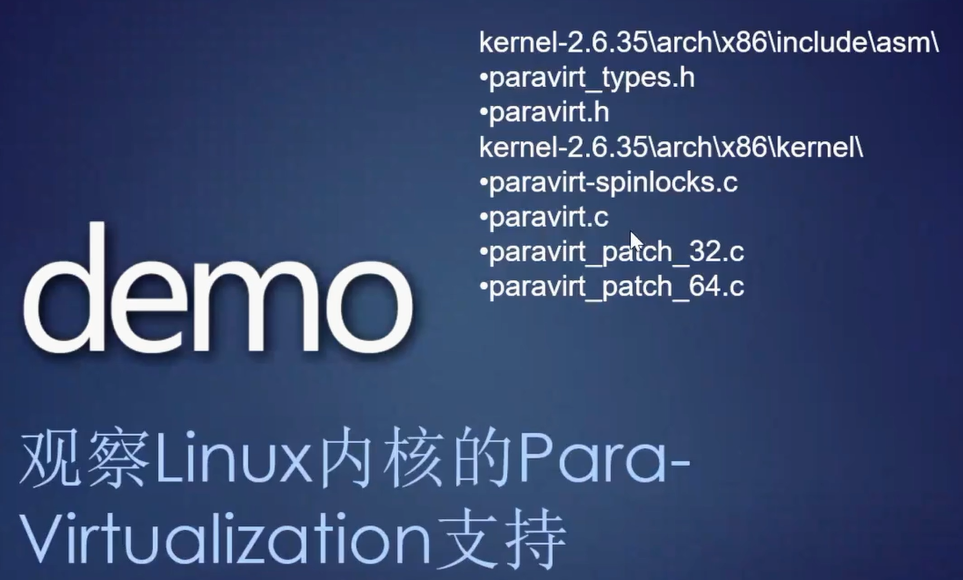
      - 半虚拟化修改内核源码重新编译，需要内核配合，微软由于不开源，故无法半虚拟化，只能进行二进制翻译或patching
    - binary translation/patching
      - static patch
      - dynamic path
  - 普通指令直接运行在真实cpu中
- 根据波戈1号定理，可以将指令分为三种，一般指令，敏感指令，特权指令，若要实现虚拟化，则敏感指令必须为特权指令的一部分（可以简单理解为敏感指令均在内核空间，具有高特权级），如果在低特权级（即虚拟机）中执行敏感指令则会中断到高特权级(即VMM)
  - x86中并非所有敏感指令均为特权指令(例如pushf phpf，在用户空间即可执行)，故intel推出vt从而支持虚拟化
  - 
- linux中目前主要虚拟化由KVM负责，KVM实际上运行在box之外，此外内核中也存在para-virtualization机制，也可以用于支持虚拟化，para-virtualization机制半虚拟化的代码运行在box中，主要目的是针对linux内核中的敏感指令打补丁，从而保证即使硬件不支持虚拟化，linux内核仍可以运行在虚拟机中，用于使linux在虚拟机中运行更加流畅
## 设备模拟
- 相关代码位于bochs中的iodev目录下
  - 
- qemu这方面做的好，很多时候设备模拟会使用qemu
- 模拟与仿真存在区别
  - 
  - SoftSDV使用仿真的思想进行全系统模拟
- 查看设备的io端口，当对硬盘等存储设备进行模拟时，会看到代码通过指定设备端口访问设备，从而实现读写设备内容，状态等
  - 
- boch中程序执行流程从io到指定的设备
  - 
  - 上图的bx_inp函数访问完成后，进入指定设备中
  - 
  - 上图回调函数调用后，进入硬盘的处理函数中
  - 
- simics（商业化工具，用于做全系统仿真） 前身为softsdv，全系统仿真，可以针对计算机中硬件、设备、总线、cpu、gpu等全部实现软件模拟，可以用于芯片有效性验证
  - 
  - 
  - 
  - 全系统仿即对计算机系统的所有组件进行仿真(包括总线等等)，优势在于可以方便调试，随时停止在指定位置处进行调试
## 虚拟机核心问题
- 保护敏感数据
- 限制敏感指令
## 虚拟机的设计考虑
- 
## 两种虚拟机
- 
- 硬件上直接运行虚拟机操作系统(作为vmm)，vmm中运行虚拟机（vm） 
  - hyper-V 
  - Xen
- 硬件上先运行传统操作系统，后者中运行虚拟机软件(作为vmm)，vmm中运行虚拟机（vm）
- 部分教材中根据虚拟机ABI(指和cpu之间的接口(或理解为软件和硬件之间的接口)，在操作系统未出现之前，硬件和上层之间的接口)API的调用，可以分为系统虚拟机（直接调用ABI，和硬件直接通讯）和进程虚拟机(直接调用操作系统提供的api），此处和类型1和类型2是对应的

# 第二讲 CPU的虚拟化支持——VMX 解析
## 基于硬件的虚拟化（HVM）
- 
- 是综合考虑性能以及安全性的结果
- 使用硬件保证虚拟机对宿主机的安全性
- 半虚拟化是在没有hvm的前提下所使用的技术，如果有了hvm，则无需半虚拟化，即可安全物理cpu上以不同权限运行虚拟机指令
- vanderpool：intel vt虚拟化技术的代号
## intel虚拟化技术VT
- 当intel cpu支持虚拟化技术之后，cpu运行流程发生变化，cpu可以执行一系列vmx指令，从而实现cpu的虚拟化支持特性
- 
- 
- 当cpu上电后，cpu可以通过vmxon指令打开虚拟化支持，将cpu自身转化为vmm形式，即进入虚拟机监视器状态，此时cpu享有高特权，且高于传统内核特权
- 如果此时cpu要执行操作系统内核代码，执行vmentry指令进入虚拟机开始执行普通内核代码，当执行到普通内核敏感指令时，cpu通过vmexit指令回到vmm状态，由vmm干预敏感指令的执行，之后可以通过vmentry重新进入虚拟机内核执行，退出vmm时可以执行vmxoff
## 陷阱、中断两种机制为计算机操作系统提供了一种机制，当执行当前指令遇到陷阱或中断时，可以跳转到另一段程序中执行(通常是高特权)，处理完成后返回之前的指令继续向后执行，为处理中断和异常，编写的代码逐渐形成了操作系统，
## 当前一个用户进程触发中断或陷阱时，会在当前进程的上下文中对中断和陷阱进行处理，即中断和陷阱会在任意进程上下文中进行处理，这也是当前中断陷阱处理函数难以编写的原因
## 当极其特殊的异常发生时，程序会切换到系统线程中处理，普通中断和陷阱发生时会在本来的进程上下文处理
## 操作系统传统特权级 用户层 内核层
- 
## 新的特权层级
- 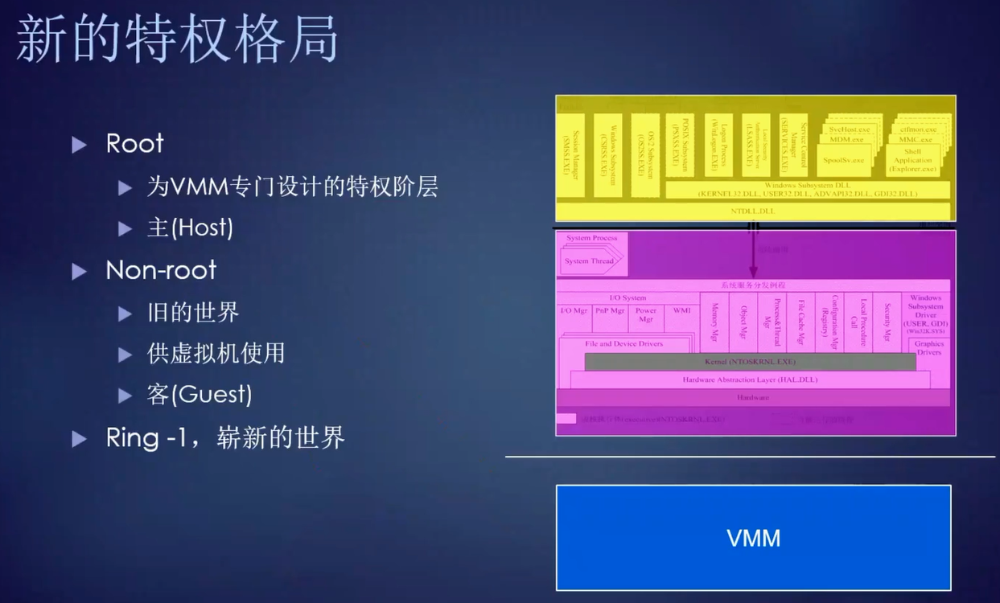
- 用户层(R3)执行关键操作时可能会陷入内核层(R0)，内核层(R0)执行关键操作时可能会陷入VMM(R-1)
## 程序复杂度的发展
- 
## 什么样的指令会陷入vmm
- 虚拟机中执行违例、犯规功能时，虚拟机可以指定何种功能属于违例行为
- cpu执行特定的指令
  - 例如：x86中的cpuid指令执行后往往会陷入vmm
## VMX管理指令
- 
- vmentry是总的说法，对于x86cpu，对应的vmx指令即vmlaunch，对应的vmexit对应的vmx具体指令是vmresume
## VMXON
- 
- 
- 
- x86cpu启动上电后进入操作系统，处于普通的保护模式，不进入操作系统，则cpu处于普通的实模式。虚拟化的vt模式不是默认打开的，而是需要复杂的前提
- 开启vt模式前（即执行vmxon指令之前)需要准备好内存区（vmxon regin），该内存区一般为两个内存页大小，即8k(对于x86的bluepill项目而言)，有一个指针指向该内存，该指针一般称为vmxptr，vmm也会记录该内存区域位置
- vmxon regin 的前四个字节写版本id， 通过读取cpu的msr寄存器获取该版本id (对于x86) ，再写到vmxon regin内存区  msr寄存器类似cpu的配置文件，提供了cpu的可配置性
- vmxon regin是vmx技术运行所占用的内存空间，vmx的复杂逻辑用固件实现，固件执行过程中需要使用主内存，即vmx实际运行时并未占用cpu内部的静态ram，而是运行在cpu外部主内存 若能通过漏洞修改vmxon regin，则可造成严重问题，需要硬件重启才能恢复
- vmxon regin分配完毕后不可读，会造成未预期行为，实际读取到后仅能读取出二进制信息
- 每个cpu均需要分配vmxon regin区域，且每个cpu均需执行vmxon指令，因为每个cpu均可能执行vm，该特性为cpu的对称多处理特性，即多cpu在执行过程中不会将特定任务分配到特定cpu执行，而是所有cpu均有相等的概率执行到任意一个任务
- kvm中执行vmxon指令，每个vmm中只要运行在x86中均会实现执行vmxon的指令，从而利用intel cpu提供的虚拟化机制，不考虑嵌套虚拟化的情况下（intle对嵌套虚拟化支持的不好），每个cpu只能执行一次vmxon指令
  - 
  - 
  - 
  - 
    - 独占性实例：当win10系统启用了hyper-V后，cpu已经执行了vmxon，此时在win10中再次打开virtualbox中的虚拟机可能会失败，因为virtualbox尝试再次执行vmxon失败
## VMCS
- 
- VMCS是每个虚拟机都要有的关键结构体，用于支撑vm的管理，即虚拟机控制结构体
- 每个虚拟机中至少有一个vmcs，而vmcs的具体数量要看该vm被分配了多少个虚拟cpu，每个虚拟cpu均需要一个vmcs
- 一个vmcs中存放一个逻辑cpu的信息
- 绑定亲缘性：假设设备存在16个cpu，让前两个cpu仅处理1号虚拟机中的程序，此时即1号虚拟机和该两个cpu形成绑定亲缘性
- 在不绑定亲缘性时，16个cpu中共的每个cpu均可执行1号虚拟机中的程序，当开始执行时，该cpu需要获得虚拟机对应的vmcs，以此恢复虚拟机环境，进而执行  
- VMCS中主要用于定义虚拟机规则，例如给虚拟机多大权力，什么事件发生时需要vmm介入（例如让虚拟机直接访问某个io端口），什么事情发生时vm可自行处理
- 
- VMCS中分为多个区域，用于状态保存，在状态转换过程中用于恢复和保存虚拟机状态和主机状态，也包含相关控制字段，用于规定什么情况下vm可以自行处理，什么情况下需要vmm接入
- 
- VMCS中存在异常位图作为控制字段，当指定异常发生时需要vmm干涉(即执行vmexit)则该位对应bit值为1
  - 例如虚拟机中存在调试器，会执行int3断点指令，对于此类异常，对应异常位图中的bit位应该为1，即不陷入vmm，虚拟机自行处理即可
  - 例如虚拟机中的页错误，则发生时需要程序执行流程陷入vmm处理
- 
  - io位图中，bit位为1是，说明vm访问对应设备时（具体而言是访问设备对应的io端口）需要陷入vmm（即执行vmexit），否则vm可以直接访问设备io端口
- 工程上来说，0号虚拟机作为最先运行的虚拟机，通常与其他虚拟机不同，具有一些特权，承担一些其他虚拟机的管理任务，例如通常使用vm0管理硬件资源
## VMEXIT
- 
- 几种会触发vmexit的情况
  - vm中执行敏感指令、特殊指令(cpuid)
  - vm中访问io
  - vm中触发违例
  - vm中接收到硬件中断(可以设置指定vm中的虚拟cpu接收硬件中断)
- 当vmexit发生时，可以查询vmcs中的一些标志位，结合intel手册，理解vmexit发生的原因
- vm由于访问io触发vmexit
  - 
  - 
  - vm通过io访问cmos，导致虚拟机退出
    - 
  - vm访问内存映射io退出
    - 
  - vm访问APIC退出 apic是cpu中断机制，vm中也需要模拟cpu的中断机制
    - 
    - 
    - 
- x86中两种io
  - 
  - PIO一共有64k
  - MIO 是映射到物理内存的IO，ARM中也有此类io
- 半虚拟化的目的可以看作通过打补丁，让vm执行敏感指令时调用vmexit，从而进入vmm接受监管
## 当前设备模拟器中重要工作是对特定设备端口注册io回调函数(即io处理器)
  - 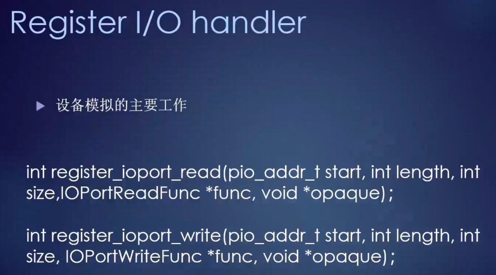
  - 针对设备模拟器重点在于实现针对io的读写回调函数，从而处理vm中对该设备id读写操作
## VMM具有排他性，在同一层不会有两个vmm，对于虚拟化嵌套，则vmm不在同一层工作
## 对于每个vm，vmm可以将真实设备赋予vm(设备穿透)，也可以仅将设备模拟器赋予vm
- 例如使用vm0管理硬件资源时，可以用设备穿透让vm0直接管理物理设备，但其他vm访问的都是设备模拟器
## 调试kvm常用指令
- 
## bluepill 执行该项目后，会导致windows vista在虚拟机中执行 
- 
- 
- 
- 
- 
- 针对所有cpu执行吞下蓝丸的函数，从而进入box
  - 
- 
- 
- 
- 
- 
## 临时禁用hyper-V后才能加载bluepill
- 
## 在broch中体验blue pill
- 
- 
- 
- 
## 课后作业
- 
- sdm中集合了intel虚拟化的手册

# 第三讲 VMM解析之XEN
## XEN架构
- 
- 
- 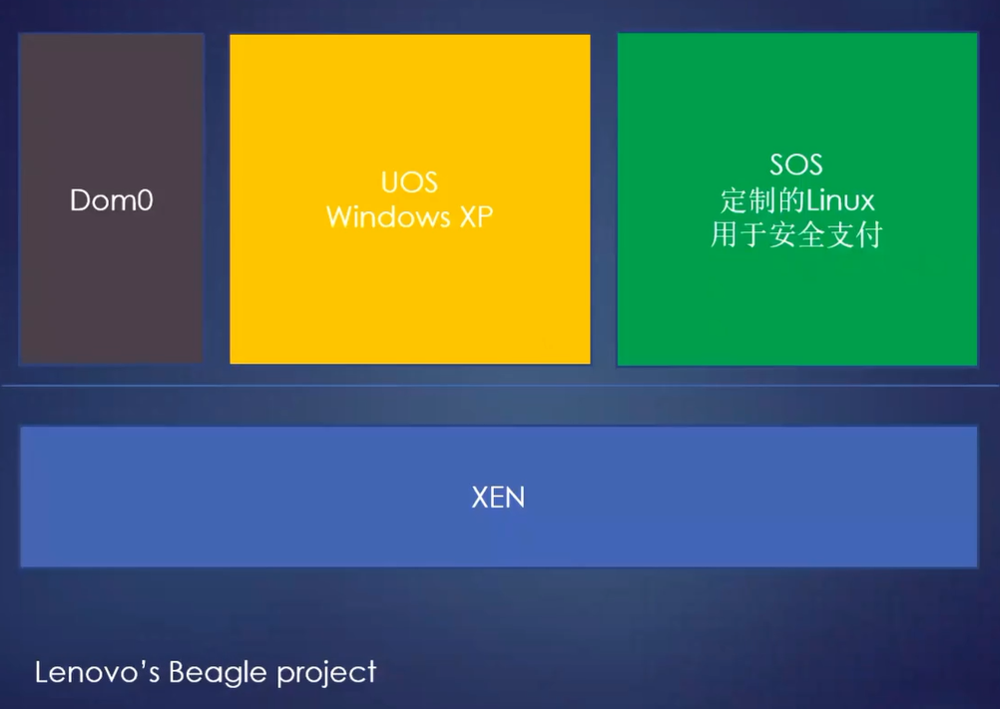
- DOM0是xen启动后创建的第一个虚拟机(相较于之后创建的其他vm具有较高特权)，用于作为hypervisor的控制台和界面，xen是第一种类型的虚拟机，故hypervisor以-1权限直接运行在虚拟机上，权限较高且操作敏感，故将一部分功能实现在DOM0中
- 有证据表明亚马逊的EC2是基于xen的
- DOM0之后创建的虚拟机在权限上也可能有所不同
## xen源码
- 
- 
- coverity是一个静态分析软件，可以用于扫描代码中的安全漏洞
## 实验环境 用户名root 密码xenroot
- 
- 
## xen调试
- 
- xen工作在-1层，调试困难，可以使用串口打印实现一定程度的调试
- 视频中显示了如何通过串口+virtualbox实现xen串口调试
  - 虚拟机软件可以为虚拟机创建对应的串口设备，通过连接该串口，可以看到设备的串口输出
- 根据串口输出，可以跟踪hypervisor的启动过程
## xen启动过程
- 
- x86的cpu上电，开始执行BIOS或EFI，之后执行硬盘引导扇区中的bootloader，xen从bootloader开始接管执行权限，xen支持多种bootloader 包括grub uboot
- 
- xen会修改grub的配置，将本来kernel的位置换成xen的包，并给予其命令行参数，原始的kernel会以module的形式配置在grub中，可以视为hpypervisor将内核的位置顶替掉了。
- grub将xen当作kernel加载完毕后，开始执行xen入口函数，即__start_xen，该函数中进行最早的初始化，初始化完毕后，执行init_done，该函数中调用IdleLoop，且不会返回
- E820表关于物理内存布局，需要固件准备好
- 
- 
  - 0号cpu从start_xen开始执行，其他cpu从__cpu_up开始启动
- 
  - xen启动的关键之一是所有cpu均需执行vmxon(调用start_vmx)，从而进入vmm
- 
- 
  - 创建DOM0后hypervisor的核心工作就是管理DOM，DOM即虚拟机(vm)，XEN将vm称之为DOM  hyper-V将vm称之为partition 即分区
- 
  - DOM0创建完成后，htpervisor进入被动状态，进行一些资源调度，cpu切换
## 在DOM0中启动虚拟机
- 
  - xl工具根据配置文件在DOM0中生成虚拟机
- 
- 视频中进行相关演示
## 设备虚拟化
- 虚拟机的改进性能主要针对设备模拟的性能改进，因为当前硬件支持虚拟化中，cpu直接执行虚拟机代码，故设备模拟性能是关键
- 
- 普通的设备虚拟化基于qemu，虚拟出的设备型号较为老旧
- 
- xen早期实现中修改qemu从而支持设备模拟，形成了ioemu，qemu可以用于虚拟化cpu，但xen中仅用其虚拟化设备
- 
- 
- 
- 
- 
- 从上图可以看到虚拟机中io请求发生时，触发vmxexit进入vmm，vmm接收到io请求后无法直接处理和响应，需要将相关io请求写入共享内存，该DOM0通过读取共享内存获得io请求信息，DOM0中IOEMU处理该io请求，并将请求数据写入共享内存返回给vmm，vmm接收到该数据，即将其响应给虚拟机，并vmxon进入虚拟机继续执行，该过程中通过共享内存进行通讯，导致设备模拟速度较慢
- 每运行一个dom，其中至少有一个qemu
## qemu中模拟固件的代码
- 
## hvm虚拟机的入口
- 
## 通过设备直通解决设备模拟的性能问题
- 
- 
- 
## XEN 支持ARM处理器
## 专门开始一个DOM用于模拟设备，避免DOM0单独进行设备模拟， 称为stub domain
- 
- 当前倾向于每一个guest均有一个自己的专门负责设备模拟的stub domain
- 
- stub domain中运行mminimal os操作系统
## xen应用
## 另一个提升设备模拟的思路是在vm中针对设备驱动进行path，类似于针对kernel的半虚拟化，从而提高设备模拟效率

# 第四讲 VMM解析之KVM
- 将kvm合并到linux内核代码树中
  - 
- kvm开发团队被redhat收购，上层应用由radhat进行开发
  - 
## kvm架构
- 
- kvm只支持硬件辅助的虚拟化，即cpu必须支持hvm，即必须存在-1层的hypervisor，上图中未画-1层
- 上图中kernel中包括了hypervisor的功能，类比xen架构task相当于DOM0中运行的提供设备模拟等功能的进程，带有guest的task相当于创建的虚拟机
- kvm与xen架构图可能不同，但也有很多东西是相同的
- 
- 根据上图，kvm和xen主要区别在于hypervisior复用了dom0的内核(即复用了linux内核)，dom0是一个特殊的虚拟机，kvm相当于将dom0这个虚拟机拆开，dom0内核和hypervisior合二为一（理解上可以将其分开理解，部分代码是分开实现的，特别是在kvm的arm实现上）
- 上上图中的普通task可以视为上图中dom0的进程，因为dom0内核和hypervisior合二为一，所以此类进程运行在dom0内核(合并后的)空间中
- 合并的优势在于通过将kvm和linux内核绑定，结合复用了linux内核的大量代码，复用了linux内核进程空间（此种虚拟机复用宿主机进程空间的设计现如今在vmware virtualbox qemu borch均存在，例如virtualbox运行一个虚拟机，则宿主机中会多一个进程）
- 虚拟机分为类型1（xen hyper-v）和类型2（virtualbox），前者运行在硬件上，不依赖现有操作系统，不复用现有操作系统设施，后者运行在已有的操作系统中，且会复用已有的操作系统的资源（例如virutalbox在宿主机操作系统中创建一个进程运行虚拟机，即复用了操作系统的进程设施），复用现有操作系统的设施是类型2虚拟机的主要特征
- kvm既有类型1的特征，也具有类型2的特征，是一个大杂烩
  - 类型2的特征，即在宿主操作系统中创建一个进程来容纳一个虚拟机，该进程中可能有两套代码，一套是进程本身的代码(即上上图中的task)一套是虚拟机的代码(即上上图中与task贴近的guest)，此时cpu可以在内核+hypervisor的高特权空间的代码中运行，可以在task普通进程代码中运行，还可以在guest模式下运行虚拟机中的代码(即运行盒子中的代码)，如下图
    - 
- 在kvm中hypervisor复用linux内核，vm复用linux进程
- 启动kvm后，启动windows虚拟机，此时nt内核还是运行在0环
- 启动kvm后，启动linux虚拟机，此时nt内核还是运行在0环，但宿主机的linux内核不能认为工作在0环，因为kvm将linux和hypervisior合二为一了，所以此时宿主机linux内核具有部分-1层的权限
## KVM代码形式
- 
- kvm以驱动形式存在于linux内核中（x86实现，在ram中有所差别），这也是类型2虚拟机的特征
- kvm源码中与cpu无关的通用代码放在virt-》kvm目录下（不到10k行），与cpu相关的放在对应的cpu目录下
- 
- 通用代码中最重要的结构体是struct kvm，该结构体是对虚拟的概括，每一个虚拟机对应一个该结构体实例，该结构体很大，有几千字节
- 
- 该结构中代表了vm的核心资产
- 
- 各个cpu厂商定义不同的kvmarch结构体，用于表示不同的cpu架构
- 从代码层面讲，kvm分为如下几个部分
  - 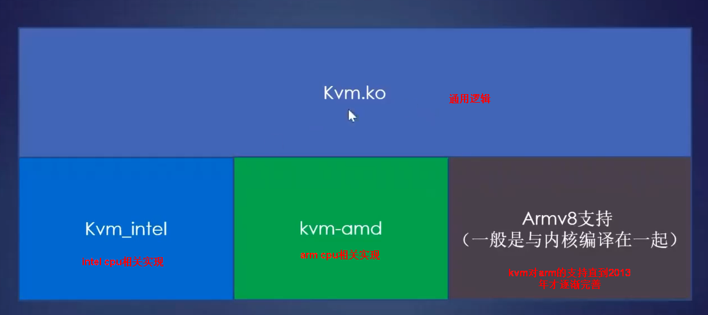
- 不同cpu厂商的代码
  - 
## kvm对arm的支持
- 
- 
- x86平台下kvm将hypervisior和linux内核合并，但arm平台下的kvm会将hypervisor独立进行实现，这是arm硬件虚拟化特征导致的
- kvm在x86中更类似于类型二虚拟机，但在arm中更像类型一虚拟机
## kvm的部件和启用
- 
- 
- 
- 
  - 可以如上图为kvm安装管理界面
- kvm中打开虚拟化支持，即执行vmxon
  - 
  - 
  - 
## vmexit指令执行代价较高，至少需要几千个时钟周期，因为会涉及环境和状态的保存和恢复，从而导致vmexit执行时涉及vmcs以及cpu多个寄存器的读写操作，目前一个优化思路是尽量减少vmexit指令
## kvm技术上来看和virtualbox非常相似
## kvm创建虚拟机
- 通过管理进程发起，进入kvm的核心代码kvm_create_vm，分配关键结构体kvm_create_vm，创建虚拟机关键资源(vcpu mmu apic)
-   
- 
  - 创建虚拟机会调用kvm_create_vm，该函数中分配kvm_create_vm
- 
  - 使用gdk7调试该过程
- 
- 创建虚拟内存管理器，即管理进程通过调用ioctl为新的vm创建内存单元，从而以普通进程的内存模拟虚拟机设备的内存，即利用宿主机器进程的地址空间来作vm的内存空间使用
- 以上说法是简化版，实际上虚拟内存工作时，实际上的流程是guest虚拟内存-》guest物理内存-》宿主进程虚拟内存
- kvm有两种支持的虚拟内存技术，1、影子内存 2、硬件支持的嵌套的页表，两者原理上比较类似
- 
  - 创建虚拟的本地中断管理器(apic)
  - 如今虚拟机中也存在多个cpu，故多cpu之间需要相互通讯，从而支持跨cpu的中断，即IPI
  - apic用于协助cpu协调中断事务，可以用于过滤cpu处理哪些优先级以上的中断
  - apic也可用于多cpu通讯，实现多cpu之间的中断协调
## io处理
- 处理io是开发一个虚拟机主要要实现的技术，针对虚拟机性能的优化主要是优化vmexit，即优化设备模拟
- 
- 
- 
  - x86的io有两种类型。一种类型是64k专用io空间有端口，即有端口形式的io，此类io会在kvm中注册读写回调，一旦vmexit发生，则根据回调函数找对应的handler处理
  - kvm中将此类io称为fast io
- 
  - kvm关键结构中有bus数组，kvm中将x86io当作一种总线，相应处理交给kvmiobus，iobus有一定的range范围，某特定范围用于处理某特定设备的io
- 
- 
  - x86中另一种io是内存映射io，其更广泛，效率更好，该类io调用耗时更长
  - 此类内存映射io访问的也是内存地址
- 
  - apic模拟代码，kvm的设备模拟有一部分是在内核空间中做的，例如apic这样的核心机制，但对于硬盘，鼠标键盘等，在用户空间模拟，速度更慢，用空间的设备模拟使用qemu-kvm实现，qemu是完全虚拟化，性能不好
- 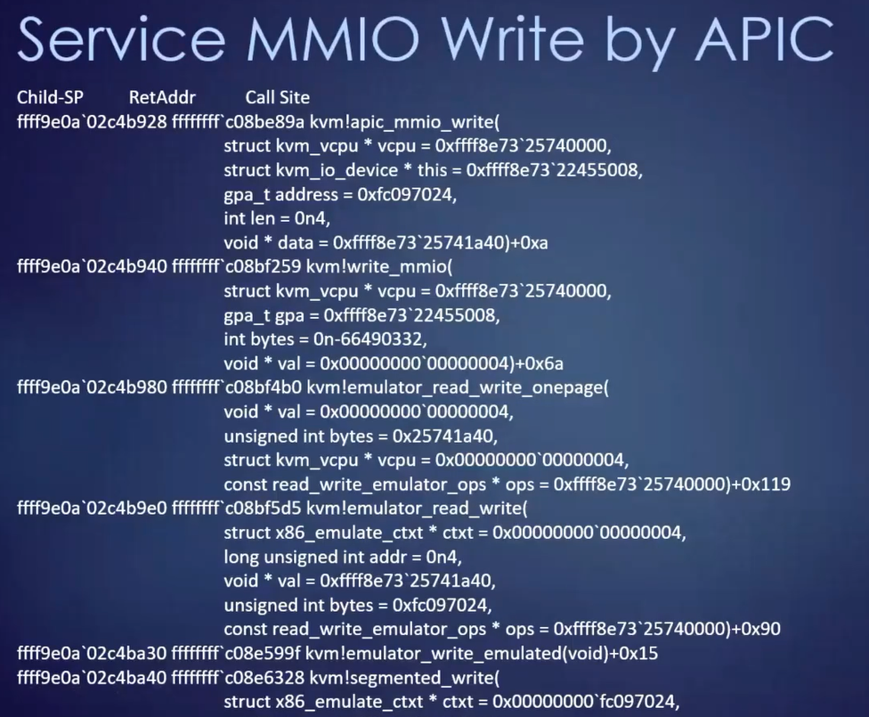
- 
- 
  - 使用设备半虚拟化方式，提升设备模拟效率，注意该概念和cpu的半虚拟化和全虚拟化分开
  - 设备全虚拟化意味着虚拟机中的代码无需在设备模拟方面进行配合，整个设备的虚拟化均在虚拟机之外实现，qemu是全虚拟化，例如虚拟机访问cms，只要按标准访问指定端口，即可vmexit出来，将程序执行流程交给vmm，此时虚拟机中无需修改访问cmos的代码
  - 设备半虚拟化意味着虚拟机中访问设备的代码会配合虚拟化技术，即虚拟机中加入特定的设备驱动配合虚拟化，相对全虚拟化技术性能较好
  - virtulbox中实现文件拖拽前需要安装增强功能，即安装对应驱动，从而实现设备半虚拟化
  - 设备半虚拟化可以减少vmexit，从而提高性能，目前云上普遍使用设备半虚拟化思想
- 
  - 实现设备半虚拟化的框架，使用在虚拟机内部
## 虚文件接口，即kvm虚拟机编程接口
- 
- 
- 
- 
- 
- 
  - arm中的hypercall指令
  - hypercall用于主动触发vmexit 从而进入vmm
- 
- 
  - x86上的hypercall指令
- 

# 第五讲 VMM解析之Hyper-V
## hyperv前生virtual PC的架构
- vpc属于类型2的虚拟机，类型二的虚拟机一般需要以现有操作系统驱动的方式获得高特权，继而初始化虚拟化的基础设施，之后以进程的方式运行虚拟机，结合辅助性的驱动，用于和宿主机进行网络和资源的协作
- 
- 
- 
  - 类型2的虚拟机的架构一般如上图，vmm的一部分和kerne在同一层面，从而进行交互，另一部分下沉到-1层
- 
## 调试virtual PC
- 
- 
- 
- 
## hyper-v的使用
- 
- 
- hyperv分为两条线，作为服务器这条线仍然是不免费的
- 
- 
- 
- 
- 
  - 微软支持两代虚拟机，第一代是微软为了支持较老的技术特性创建的虚拟机
- 
  - 两代虚拟机的差别，新一代虚拟机会专门制定底层协议，针对虚拟机的使用场景开发虚拟硬件标准，根据此类标准，开发虚拟机中使用的硬件驱动，从而提高虚拟机效率
- 
  - 开启hyperv之后，使用hvperv打开virtualbox的VHD(虚拟硬盘)，则启动失败，理论上兼容，但实际存在问题
- 
  - hyperv的两种虚拟硬盘
- 
  - hyperv支持创建空白硬盘，并将真实硬盘中的数据复制进去，复制后的虚拟硬盘文件大小和实际真实硬盘的大小完全相同
- 
  - 将真实硬盘c复制到虚拟硬盘后，尝试用hyper-v启动，但失败
- 
  - 上述基础上，使用第二代虚拟机，硬盘复制后成功启动UEFI，但无法进一步启动操作系统，根据报错信息1，说明当前镜像hash指不被允许，原因在于第二代虚拟机支持安全启动
- 
- 
  - 确定原因后，关闭hyperv的安全启动，重新启动，发现进入grub，原因在于硬盘上存在双系统，此时需要输入命令行，使grub启动windows的bootloader，进一步启动操作系统
- 
  - 内存管理导致蓝屏
## hyper-v架构和关键特征
- 
- parent partition和xen的DOM0是相同的角色，可以称为父分区
- child partition即普通虚拟机，微软将其分为两类hyper-v aware 和non-hyper-v aware，前者表示hyper-v认识的操作系统，可以是windwos虚拟机，也可以是linux，微软可以在其中安装驱动或设备软件提升用户体验，此类软件可以称为plugin或addon或集成服务，后者表示hyper-v不认识的操作系统，其中不会安装plugin
- 
- 
  - hyper-v不仅模仿了xen的架构，甚至参考了部分xen的代码，在微软看来，kvm属于类型二的虚拟机，故与hyper-v想做类型1虚拟机的目标不符，故未进行参考
- 开启hyperv-v之后，windows操作系统在父分区中运行，而hyper-v则运行在-1层，此时nt内核仍运行在ring0，对于linx也类似，即启动hyper-v之后，linu系统或windows系统还是运行在0环中
- 微软WSL1和WSL2的区别
  - WSL1使用windows技术实现
  - WSL2使用虚拟化技术实现
- 观察windows是否运行在hyperv上
  - 如果进程列表中出现Secure System，说明当前windows运行在hyper上(可能是父分区或子分区)
  - 执行cpuid指令可以判断当前windows是否运行在hyperv下
## 微软hyperv悬赏计划
- 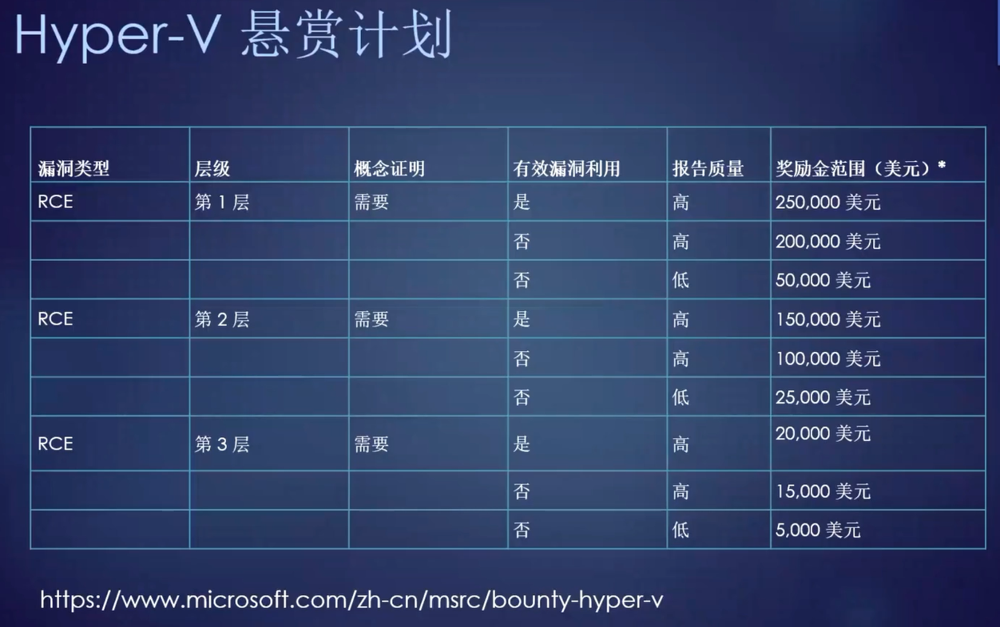
- 
  - 第一层：vmm或父分区中的内核层
  - 第二层：vm工作进程和父分区的用户空间中的几个进程
  - 第三层：传统的hyper-v组件，网络和硬件模拟逻辑
## 根区(即父分区)
- 
  - 细分可以分为很多个工作进程和后台服务以及内核空间的驱动
- 
- 
- 
- 
  - 是管理虚拟机的核心进程，会用于发起创建新的虚拟机
  - VMMS内部分为若干个组件
    - WMI Provider：wmi是微软传统it运维技术，hyperv管理器是wmi的消费者或界面，但实际功能并不在hyperv管理器中实现，其仅仅是一个界面，界面中实际创建硬盘、虚拟机等操作会调用WMI Provider实现，微软关于wmi有一套复杂技术，该技术支持脚本编程，故运维人员可以通过编写脚本启动、管理虚拟机
    - single port listener for RDP：远程桌面，即在hyperv管理器右键虚拟机选择连接后，会连接并显示虚拟机的远程桌面，从而方便操作虚拟机，显示的虚拟机操作窗口是客户端程序vmconnect.exe提供的
    - 虚拟机快照技术也是vmms提供
- 除了vmms还有一系列后台服务，用于虚拟化设备以及同步时间，可以使用调试器进行调试
- 
- 内核态驱动vid，是根分区的内核态模块，在0环，会与hypervisior交互，其中有大量hypercall，调用后会跳到-1层
- 
## 客区(即子分区)
- 
  - 子分区可以分为enlightened和unenlightened，即之前分析的aeare和non-aware
- 
- 
  - 每运行一个子分区，均会创建一个宿主进程vmmem，用于代表一个内存空间，以pico进程形式运行，即nt内核给予该进程特殊空间，若该进程出现问题，会先陷入hypervisior，hypervisior再与根分区进行联系，根分区中能看到该vmmem，目的就是管理，该进程有时会有很高的开销和cpu占用
- 关于pico进程
  - 
  - win10中将nt中的进程分为三种
    - 传统nt进程
    - 最小化进程 需要敏感代码创建，创建方法未公开
    - pico进程 需要敏感代码创建，创建方法未公开
  - 后两者在win10中类似，是内核创建的一片空间，可以执行任意操作
  - 对于传统nt进程，一旦内核创建，就会向其中放入例如特殊ntdll以及映射特殊内存页面，对于最小化进程和pico进程，该两类进程创建后不会向其中放东西，让其执行进程本身想执行的内容
  - pico进程可以看作最小化进程的特例，在最小化进程的基础上，pico进程可以得到内核的部分协助，例如该进程中发生异常后，可以由内核进行异常分发，wsl1使用的是pico进程的基本原理
- 
  - vmmem是虚机空间的代表，vmwp是用于模拟设备的
- 
- 
  - vmwp中load很多驱动，此类驱动中多涉及设备模拟和vm中的特殊交互
- winhv是微软提供的编程接口，是分区与hypervisior的分区接口，可以通过该接口调用到hyperv中，hyperv可能会将请求转到父分区
- 
-   
- 微软的集成服务，是装虚拟机中的，主要用于同步时间，心跳，硬盘影子备份等，***该服务有linux版本，是开源的***
- 
- hyperv在一些场景中支持嵌套虚拟化，例如win10开启了hyperv后，仍可以开启virtualbox，此时virtualbox的半虚拟化接口需要选择为hyperv，注意理论上是支持的，但存在一定风险
  - 
- 硬件也会影响hyperv是否支持嵌套虚拟化，amd在硬件下是支持嵌套虚拟化的，intel本身对嵌套虚拟化的支持存在限制
## hyperv调试
- 
- 
  - guest分区使用模拟串口进行调试
- 
- 
- 
- 
  - x86中-1层代码的文件名为hvix64.exe，该模块微软未公开符号，微软公开了hyperv的大多数模块，但-1层的代码未公布符号，但提供了windbg的扩展来帮助调试-1层代码，如下图
  - 
  - 
- 若要调试根分区用户空间进程，可以用windbg附加到特定进程即可(以管理员权限运行)，例如附加到vmwp的虚拟机工作进程
  - 
  - 
## VBS 自学，不讲
- 
- 微软第九频道上有课程录像

# 第六讲 KVM中的设备虚拟化
- 
- 
  - 设备模拟的不同方案
    - 软件模拟
      - 完全虚拟化 完全按照硬件协议
      - 半虚拟化 在虚拟机中有相关辅助代码
    - 设备直通
      - 硬件无虚拟化支持
      - 硬件有虚拟化支持 （以下内容主要讨论该情况）
## 设备直通，即vm直接访问设备，穿透vmm
- 
- 对于xen的情况，上图中当linux中访问显卡，会触发vmexit到vmm，后者再与dom0中的qemu进行通讯，qemu再访问实际显卡，从而实现功能
- 根据对应关系，设备直通可以分为一对一直通以及一对多直通
- 
  - 上图hyperv中创建虚拟时可以选择物理硬盘，从而实现一对一直通，此时该硬盘无法给主机以及其他虚拟机使用，要实现上述一对一直通，需要保证物理硬盘脱机，即不能有其他主机或虚拟机使用该硬盘
  - 一对一直通不需要硬件虚拟化支持，由vmm进行设备访问、DMA地址、中断的协调
- 
  - 一对多直通通常需要设备有虚拟化支持，且对应固件需要进行定制，英伟达gpu支持一对多，但保密
  - 一对多主要难题在于多个虚拟机对设备进行冲突操作
- 支持一对多的设备均会有FLR功能，即功能层面的复位
  -   
  - intel支持设备虚拟化的fpga高级网卡
  - 
- PCI总线
  - 
  - root complex是PCI总线的根节点
  - FLR中的function指的是上图中设备的功能单元，此类功能单元对在软件之间有明确的接口
  - 
  - PCI总线要与总线上的设备通讯，每个设备需要一个地址，每个地址包含三部分：总线号、设备号、功能号，简称bdf，地址中总线号、设备号、功能号的二进制位数限制了PCI总线中所能承载的总线数、设备数、功能数
  - 
  - 硬件设计过程中需要也根据bdf思路分为不同的模块进行设计，即整体实现模块化
- PCI和PCIe是近亲
## iommu
- 
  - cpu和外设间传递数据的方式
  - io端口：cpu通过io指令在设备之间传递数据，例如x86中cpu读取cmos使用的就是io端口(70)
    - 优点是简单，in 70:表示读70端口     out 70：表示写70端口
    - 有些过时
  - 内存映射io：将设备内存映射到物理地址空间中，cpu访问特定物理内存地址时，即访问到特定设备内存
    - 
    - 该方法较为灵活，可以用于读写十几个字节或者写指定寄存器
    - 
    - 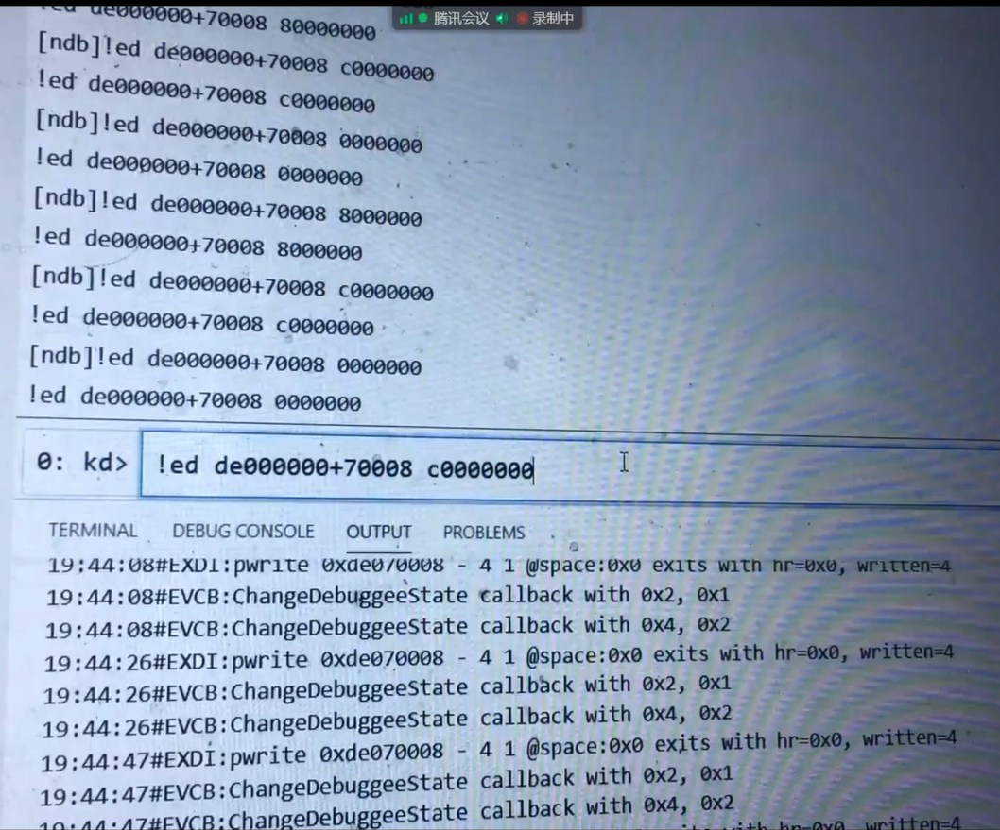
    - 针对gdk7，使用windbg调试器中的!ed命令在指定物理地址中写入数据(c0000000)，该物理地址对应的是intel的gpu中的某个寄存器，向其中写数据相当于设置寄存器的值，从而可以使gpu处于开启或关闭的状态，从而开启或关闭gdk7的桌面显示
    - 主板上的芯片组会协调主板上PCI总线的工作流程，控制cpu何时访问设备内存，何时访问计算机物理内存，内存映射io通过主板芯片组，让cpu象访问内存一样访问设备
  - DMA 直接内存访问
    - cpu发起DMA后设备将设备指定内存区域的内存块传到计算机内存中，传递完成后设备向cpu发起中断
    - 该方法用于批量传递数据，例如一次传递一页的数据
- 虚拟化的情况下，地址的翻译机制
  - 
  - 
- 在支持设备直通的虚拟化环境下，虚拟机cpu通过DMA方式与真实设备实际进行通讯时可能遇到问题
  - 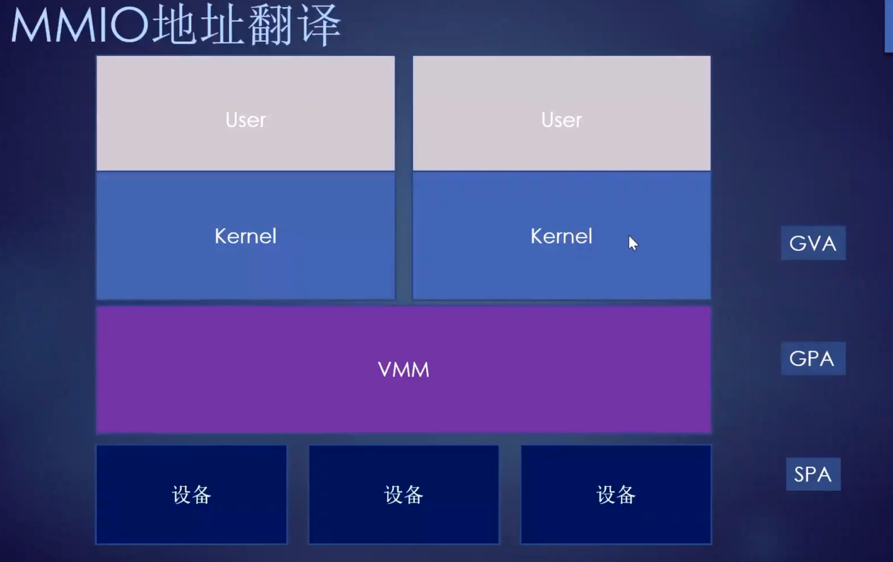
  - vm中分为内核空间和用户空间，vm中的驱动通常在内核空间，内核空间中的驱动知道GPA（作为映射，也可以拿到GVA）
  - vm驱动进行DMA操作时，会将GPA写入设备，从而设备会将cpu所需内存写入指定位置处，如果设备将vm驱动传入的GPA当作SPA处理，则会向GPA的内存位置写入数据，此时会导致物理内存被写坏，从而导致异常，该异常是设备发起的将内存写入错误位置，cpu调试无法解决该问题
  - 以上问题的根源在于vm驱动需要将SPA写入设备，才能正常完成DMA操作，为了实现该目标且避免vmm介入，则通过硬件辅助支持，intel Q35芯片组引入了VT-d技术，从而提供了该虚拟化特性的支持，该芯片组会将GPA翻译为SPA，从而保证vm中cpu的DMA操作 前述翻译过程也可以称为DMA映射
    - 
    - 
    - 
    - 
    - 
    - 
    - 
- amd对设备直通的支持 IOMMU (区别于intel的VT-d),顾名思义，IOMMU即针对io地址进行自动翻译 IOMMU也实现在芯片组中
  - 
  - 
  - 
    - MMU与IOMMU对比
    - cpu中的MMU实现在cpu内部，mmu实现了cpu访问地址虚拟化，进一步实现了多任务，IOMMU实现了设备访问地址的虚拟化
    - IOMMU相当于让设备端访问内存时也使用虚拟地址
  - 
  - 
    - IOMMU的思想是通过页表实现内存地址的虚拟化
  - 
  - 
    - iommu已经成为操作系统中的标准设置，已经集成在linux内核中
  - 
- 三大厂商对IOMMU的支持形成了各自的方案
  - 
- arm的iommu实现被称为smmu，即系统的mmu
  - 
  - 
  - 
  - 
  - 
  - 
    - nxp对arm的smmu的实现
- iommu的价值
  - 
## SR-IOV
- SR-IOV是PCI标准化组织定的标，准用于解决设备层面的一对多设备直通问题
  - 
  - 
    - 该标准主要用于指导设备厂商生产支持一对多设备直通的设备虚拟化的设备
    - 主要思想是让设备功能块之下还存在多个虚拟功能块，从而不同vm在使用不同设备时，实际就可以使用不同的虚拟功能块，从而实现一对多的设备虚拟化
    - 为了支持虚拟功能块，标准组织对PCI的协议进行了扩展，从而支持定位PCI总线中不同设备的不同虚拟功能块的定位
  - 
  - 
  - 
  - 
## DPU
- 
  - SDN ：软件定义网络，即机房中的路由器、交换机等设备的功能使用软件实现
- 英伟达推出DPU，用于加速网络，即网络数据层，用于加速处理网络数据包和网络协议，用于满足高性能机房的需要
  - 
  - 
  - 
  - 
  - 
  - 
  - 
  - 
  - 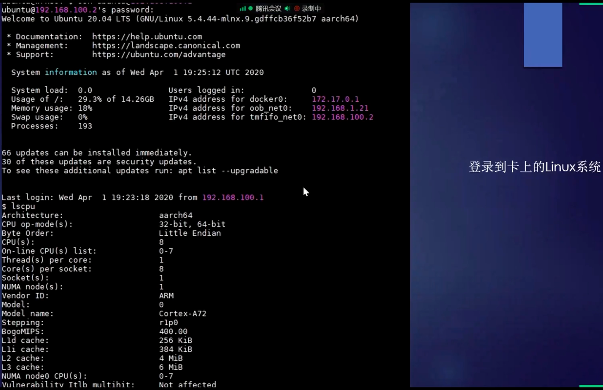
  - 
  - 
  - 
  - 
  - 
  - 
- intel的加速网卡
  - 
  - 
## 网络设备的设备虚拟化是热点
## 设备虚拟化，软件层面实现
- 微软的实现
  - 
  - 
  - 
  - 
  - 
  - 
  - 
  - 
- kvm的实现
  - 
  - 
  - 
  - 
  - 
  - 

# 第七讲 Hyper-V中的设备虚拟化 vmbus
## 软件模拟设备
- virtualbox通过软件模拟在设备中模拟出较为老旧的硬件
  - 
  - 此类模拟方法存在如下问题
  - 
  - 
- 为克服以上问题，微软提出vmbus的技术
- vmbus的主要为提升模拟设备的效率，以往设备模拟的思路是用软件模拟老版本的硬件，硬件如何做软件就如何做，vmbus的思想是定义一个软件的硬件标准，即类似于vmbus，微软hyper-vGPU等，当今vmware，virtualbox、hyper-v中均存在实现该思路的模拟设备
  - 上述思路即盒子外定义新的硬件标准，提供符合新标准的假硬件，盒子内安装新标准的假硬件对应的驱动
## VMBUS概述
- 当前硬件总线 x86中流行PCI ARM中流行AHB
- 从软件角度定义一套总线
  - 
  - vmbus需要虚拟机内部配合，属于设备的半虚拟化
    - win10中已经自带相应驱动，可以在作为虚拟机时使用vmbus
    - linux虚拟机中微软也加入了支持
- vmbus整体架构
  - 
  - 根分区提供vmbus，虚拟机创建后使用vmbus相互通讯，该通讯方式无需频繁访问io端口，从而减少vmexit，进而提升设备模拟效率
## 演示VMBUS
- Hyper-v中没有象其他虚拟机一样模拟旧版的鼠标键盘设备，而是自己创建hyper-v的键盘设备，使用该设备时通过VMBUS返搜索并返回该设备的信息，且VMBUS下挂载一系列虚拟设备，故设备树平坦，从而使设备枚举很快
  - 
- vmbus下模拟的hyper-v GPU中没有io端口相关信息，仅有内存范围信息，从而简化设备访问与使用
  - 
  - 
- hyper为虚拟设备实现了对应驱动
  - 
- 对应的注册表项目也变得简洁，nt内核启动后从CurrentControlSet-》Enmu以下开始枚举设备
  - 
## VMBUS
- 根分区中的对应驱动称为vmbusr
  - 
- 根分区中使用driverquery可以查询vmbusr 
  - 
- 使用软件模拟总线的优势 可以调整总线的网络性能以及流量控制
  - 
- vmware、vitualbox中均存在类似vmbus思路的组件（即软件定义的硬件标准），但是其名称是不一样的
## 调试
- 根分区运行windbg，通过虚拟串口和虚拟机中的win10调试引擎通信，实现内核调试
  - 需要给虚拟机配置虚拟串口
  - 
  - 
    - gew10 是虚拟机名称， 1表示1号串口
  - 虚拟机中需要启用内核调试（需要管理员权限），并重启虚拟机
    - 
  - 宿主机中windbg连接，windbg调试过程中使用lm命令列出驱动模块，其中包含vmbus模块和winhv模块（winhv模块是nt内核中负责与-1层交互的接口，该模块中存在啊hypercall接口）
    - windbg连接，选择kernel debug
      - 
    - 连接刚创建的串口的名称
      - 
    - 主动发起中断
      - 
    - lm vm winhv可以查看该模块的特征，
      - 
      - 
    - winhv模块是nt内核中负责与-1层交互的接口，该模块中存在啊hypercall接口，可以针对其下断点 
      - 
      - 
      - 
    - 执行并触发断点
      - 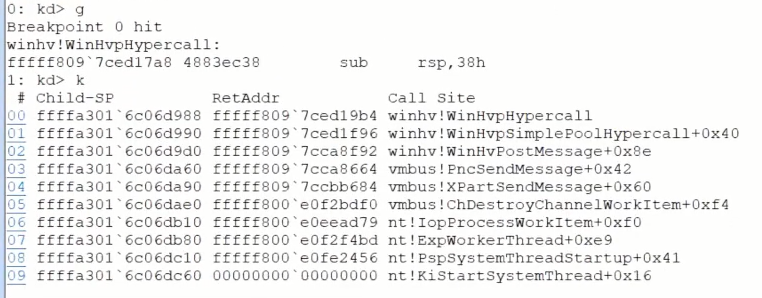
    - 跟踪并调试，当执行vmcall指令时会跳转到-1层执行代码，当前调试方式无法执行到-1层，故会无法跟进vmcall执行，该指令执行完毕后会即返回，vmcall为intelcpu为支持虚拟化专门引入的，该指令需要在虚拟机中的内核特权级执行
      - 
    - 调试过程中在数据区设置软件断点，导致数据被写坏，再次运行，虚拟机panic
      - 
- GPADL
  - 
- 部分hypercall
  - 
- 执行cpuid指令判断当前环境是否是虚拟化的（来自微软hypercall公开文档）
  - 
## qemu的支持
- hypercall公开文档，使得qemu、virualbox等虚拟化方案可以与hyper-v协作，例如当开启hyperv时，根分区中的virtualbox可以利用hyperv的接口继续实现功能，下图中显示可以在根分区中执行qemu创建虚拟机，该虚拟机使用hyperv提供的机制进行虚拟化加速
  - 
- virtualbox中支持hyperv接口
  - 
- 在win10中构建qemu 
  - 
  - windows中配置qemu时检测到hyper-v
  - 
  - 
  - 
  - 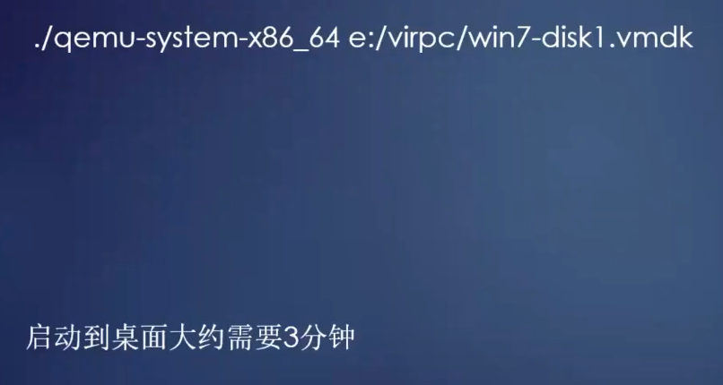
  - 指定使用hyperv加速，运行win7操作系统，此时win7虚拟盘是virtualbox生成的
  - 
  - 
## kvm的模仿
- 当在kvm方案中运行windows虚拟机，则可以使用vmbus加速
  - 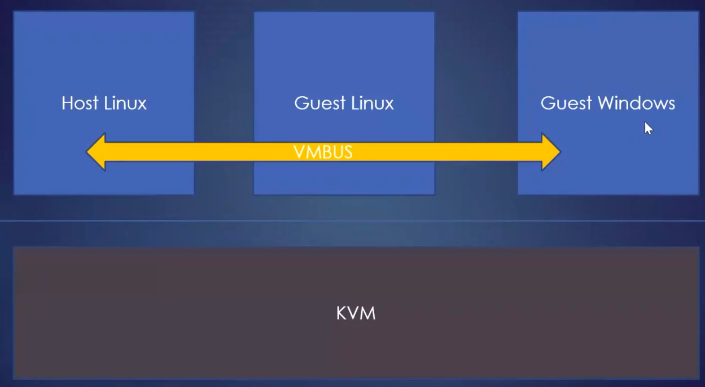
- linux内核中断vmbus代码
  - 
  - 
  - 
  - 
    - hv.c中实现的功能类似于hypercall
## vmbus的攻击面
- 
  - 25w美金
## GPU加速
- 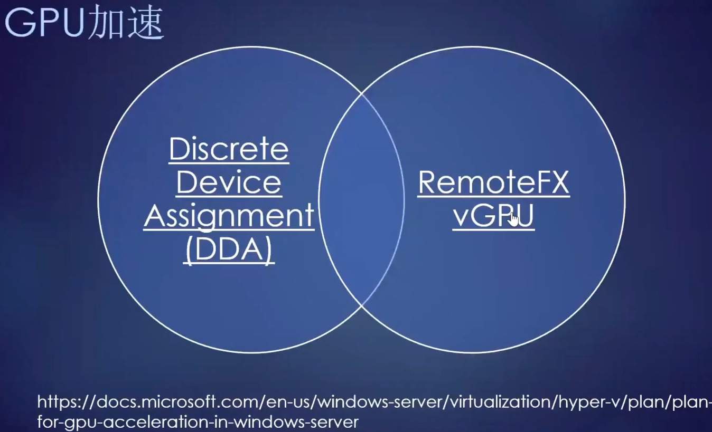
- 目前各个虚拟化方案厂商竞争的核心在于模拟设备加速