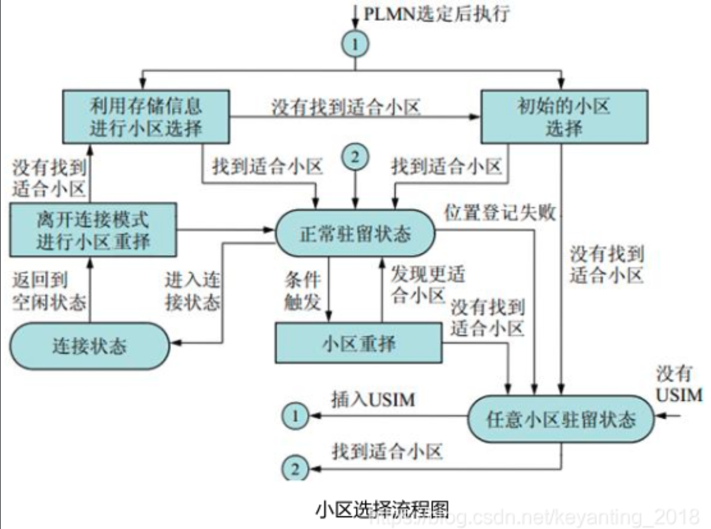

# https://blog.csdn.net/HiWangWenBing/article/details/112293396

# https://blog.csdn.net/HiWangWenBing/article/details/115207132
- ONAP是什么
  - 
- 关键技术-虚拟化
  - 

# https://blog.csdn.net/HiWangWenBing/article/details/116333795
- MME：处理信令
- SGW：处理数据
- 4g网络架构
- 
- 2G/3G/4G共同相同的核心网
- 

# https://blog.csdn.net/HiWangWenBing/article/details/116348707
- [4G&5G专题-75]：流程 - 4G LTE无线接入网中运营商标识、基站标识、终端标识大全_gt点码和漫游号-CSDN博客 (2023_12_31 17_06_12).html
- 4G LTE无线接入网中运营商标识、基站标识、终端标识大全
- 其中终端标识涉及了 手机号，基带芯片编号等等 具体如下
  - 基带芯片标识：IMEI  -- 存在于基带芯片中
    - 
  - SIM卡标识：IMSI 、TMSI、P-TMSI、G-UTI --存在于SIM卡中
  - 手机号标识：MSISDN、MSRN  -- 存在于核心网数据库中

# https://blog.csdn.net/HiWangWenBing/article/details/116352459
- [4G&5G专题-76]：流程 - 4G LTE PLMN选择、扫频、小区搜索、系统消息读取、小区选择过程_4g终端获取系统消息,选择波束-CSDN博客 (2023_12_31 17_50_48).html
  - 
- ***4G LTE设备从启动到连接到特定小区的过程***
  - PLMN选择 ，PLMN即运营商，中国电信、中国移动、中国联通均属于PLMM，文中给出PLMM的选择流程
  - 小区搜索
    - 我们在装入SIM卡，打开手机后，通常不能立即接打电话，而是要经历短暂的“搜信号”过程。当运营商的信号图标出现在手机顶部后，才可以正常的通讯。这个短暂的“搜信号”动作，其实就包含了小区搜索、读取系统广播和网络侧注册登记。这些过程结束了，手机上的信号标识出现，说明此时UE已经驻留到该小区，后续UE就可以在该小区进行业务操作了。小区搜索是移动通信系统中非常关键的步骤，也是终端与网络侧建立通信链路的第一步，如图所示。
      - 
    - 在指定频点、小区或者候补频点、小区搜索失败或者这些信息不存在时，会进行全频段扫描，搜索 UE 能力支持频段范围内存在的所有小区。
      - 其中就涉及RRC，相关协议
    - 小区搜索流程
      - 在移动通信系统应用中，终端开机后必须尽快搜索到一个合适的小区（如从射频连接器端测得的功率最大的小区），然后与这个小区达到时隙和频率上的同步，才能获取本小区的详细信息。
      - 终端只有在attach到小区后才能使用网络的服务。
      - 通常把从开机搜索到登录到合适小区的过程定义为小区初始搜索（initial cell search）过程，简称小区初搜。
  - 读取系统消息MIB
    - 系统信息是由基站侧不断的重复广播的，这样无论UE什么时候开机，都能及时的获取到系统信息。
    - UE从默认的时频资源处读取系统消息，并使用读到的消息对UE的L1，L2进行配置，之后才能小区的选择和驻留。
    - 系统消息分为1个主MIB消息，1个SIB1消息 + 12个其他SIBx消息组成。如下图所示：
  - 读取系统消息SIB
    - 这部分文中概述了各个SIB的不同之处，包括从SIB1到SIB13 ,其中SIB1是最重要的
  - 小区选择与驻留
    - 至此，手机获取了覆盖范围内的所有的小区信息。
    - 现在，手机就需要做出一个选择，选择需要驻留的小区。
  - 选择驻留小区后，手机就进入idle状态，然后，不断地监控小区的广播信息，实质上就是通过广播找到了基站
  - 但此时，基站和核心网都不知道该终端的存在，也没有为终端分配任何无线资源。
  - 直到终端发起 ***随机接入***，申请上行无线资源，并到核心网进行注册，网络才能识别到该终端的存在，终端才能利用网络进行接入服务。

# https://blog.csdn.net/HiWangWenBing/article/details/116357792
- [4G&5G专题-77]：流程 - 4G LTE 接入网的随机接入流程_ra-rnti与随机接入前导码-CSDN博客 (2023_12_31 18_22_09).html
- 文章描述了 4G LTE 接入网的随机接入流程
- 手机通过基站的大喇叭：广播信道（频率同步FCCH、时隙同步SCH、广播控制信道BCCH）广播的信息找到了基站。但这并不代表手机就可以使用基站的无线资源访问无线网络。蜂窝无线通信与WIFI通信不同，WIFI访问无线资源是不需要申请的，先访问，再看有没有冲突，采用的是公平竞争策略。然后蜂窝无线通信是彻底的中央集权制策略，手机必须先申请无线资源，由基站统一分配载波与时隙后才能使用无线资源。这里其实有一个悖论：没有无线资源，就无法访问基站，要访问基站需要预先申请无线资源，这是一个死循环。蜂窝无线通信是如何解决这个问题呢？蜂窝无线通信借用了医院在解决类似的紧张的专家资源分配的方法：在固定的窗口、固定的时间段，预约挂号！超过挂号时间、或者资源全部用完，挂号失败。挂号成功后，给病人分配医生载波资源以及对应时隙，病人才能享受到看病服务，这个过程在蜂窝无线通信中称为“随机接入过程”！
- 随机接入过程是指从用户发送随机接入前导码开始尝试接入网络到与网络间建立起基本的信令连接之前的过程。
- 随机接入过程是在手机通过小区搜索完成小区选择和驻留之后，是手机在完成与基站的下行同步之后，发起的一个新的流程。
- 随机接入分类
  - 竞争性随机接入流程
  - 非竞争性随机接入流程
- 竞争性随机接入流程
  - 
- 非竞争性随机接入流程
  - 

# https://blog.csdn.net/HiWangWenBing/article/details/116357829
- [4G&5G专题-78]：流程 - 4G LTE 核心网的Attach流程_attach request-CSDN博客 (2024_1_2 09_33_40).html
- ***重要文章，详细描述了ue从最开始连接到基站到完成核心网注册的全过程***
- 随机接入过程与核心网attach过程
  - 接入网随机接入过程是UE向基站注册，获取空口上行同步和获取上行无线资源，在基站侧建立UE的默认的RRC信令连接（SRB0)的上下文。
  - 核心网Attach流程流程是UE向核心网注册，获取核心网对UE的身份验证，获取UE的IP地址以及核心网的资源，在核心网侧建立UE的S1连接的上下文和NAS信令的上下文。
## 基站与ue建立RRC信令连接
- Radio Bearer (RB)是RRC层的概念，是基站为UE分配的不同层协议实体及配置的总称，包括PDCP协议实体、RLC协议实体、MAC协议实体和PHY分配的一系列资源等。
- RRC层的无线承载分为小区系统级静态无线承载和手机专有级动态无线承载。
- SRB是系统的信令消息实际传输的通道，
- DRB是用户数据实际传输的通道。
- RRC是管理RB的协议实体，通过RRC信令的交互完成RB的建立、修改以及释放等功能。
- 通俗的讲RRC连接指的是UE和eNodeB之间建立的SRB1,因为标准规定SRB0是不需要建立的，UE在RRC_IDLE状态就可以获得SRB0的配置和资源，如果需要可以直接使用。
- ***手机与基站建立RRC连接的过程是：***
  - SRB0：SRB0是缺省承载，UE在随机接入成功后，进入RRC_IDLE时，该承载就建立起来。
  - 通过默认信令承载SRB0，建立手机与基站之间的业务信令承载SRB1，SRB1建立之后UE就进入RRC_Connected状态；
  - 通过业务信令承载SRB1，建立手机与核心网之间的NAS信令承载SRB2；SRB2专门用于传输核心网NAS信令； RRConnectionSetup消息用于建立SRB1.
  - 通过业务信令承载SRB1，建立手机与基站之间的业务数据承载DRB1或DRB2, 不同的业务数据，需要建立不同的DRBx。
  - 在业务传输过程中，通过SRB1进行管理
  - 当业务结束后，通过业务信令承载SRB1上传输的信令，可以将所有的DRB、SRB1和2，使得UE进入到RRC_IDLE状态，在需要时UE唯一可以使用的资源就是SRB0，而且需要在完成随机接入之后进行。

## RRC连接状态
- 
- RRC idle：随机接入成功，但手机和基站时间还没有建立RRC信令连接。
- RRC Connected：手机和基站时间建立起RRC信令连接。手机可以通过RRC连接发送信令请求，基站也可以通过RRC连接给手机发送信令。也就是，基站为终端分配号了用于传送RRC信令的空口无线资源。

## 核心网attach流程
- 核心网Attach流程流程是UE向核心网注册，获取核心网对UE的身份验证，获取UE的IP地址以及核心网的资源，在核心网侧建立UE的S1连接的上下文和NAS信令的上下文。
- NAS与AS
  - AS: Access Signal: 手机与基站之间的RRC信令
  - NAS: Non-Access Signal：手机与核心网之间的信令
- attach主要流程相关图片
  - 
  - 
- attach三大步骤
  - （1）控制面承载连接过程
  - （2）安全鉴权过程
  - （3）用户面承载建立过程
  - 
## 从随机接入到attach的整体流程
- 
- 具体每一步骤见资料，均存在解读 很精彩

## 信令连接的释放
- 
- 

# 上述三篇文章介绍了手机连入网络的整体过程，即 小区选择-》随机接入-》attach 整体流程完成后，ue成功注册到核心网中

# https://blog.csdn.net/HiWangWenBing/article/details/116398252
- [4G&5G专题-79]：流程 - 4G LTE 寻呼流程Paging_4g网络架构中paging流程-CSDN博客 (2024_1_9 19_51_26).html
## 寻呼的概念 ：接入网或核心网查找手机并唤醒（即建立RRC连接）的过程
- 所谓寻呼Paing，就是网络（接入网或核心网）寻找手机或唤醒手机的过程。
- 因为手机是移动的，其位置是动态变化的，且手机可能异常关机或进入低功耗状态，手机并非时时刻与基站或核心网保持RRC连接。
- 网络中有其他用户需要呼叫手机时，网络就需要找到该手机，且然后唤醒手机， 通知该手机，申请上行资源，重新建立RRC连接。
## 寻呼的前提
- 该手机的RRC连接已经释放，处于RRC idle状态，也就是说SRB1和SRB2、DRB等承载都已经释放，基站一侧只为该终端保留了SRB0承载的资源。
- 这时候才需要发起寻呼流程，通知终端发起新的RRC连接。
- 如果手机已经处于RRC连接状态，基站只需要通过SRB1、核心网只需要通过SRB2承载通知手机即可，并通过已有的DRB承载发送数据。\
## 寻呼的触发源与触发条件
- 
- 从MME触发 （手机已经注册到核心网中，一般不作为攻击面）
  - mme-》基站-》ue
- 从基站触发
  - 只能寻呼通知小区内EMM注册态的UE 什么是EMM注册态？？？
  - 经查。EMM（Evolved Mobile Station (UE) Mobility Management）注册态指的是用户设备（UE）在核心网（EPC）中注册的状态。这种状态是UE与核心网之间建立的一种关系，使得UE能够接收到网络发送的数据和呼叫。在EMM注册态下，UE已经完成了附着（Attach）过程，并且与核心网建立了必要的信令连接。
  - ***说明该情况下 手机已经注册到核心网，故不作为攻击面***
    - 
## 寻呼流程
- 
- 图中给出了核心网关键要素的架构，即 MME、SGW和PGW 使用llm解释
  - 在LTE（Long-Term Evolution）网络架构中，MME（Mobility Management Entity）、SGW（Serving Gateway）和PGW（Packet Data Network Gateway）是核心网（EPC，Evolved Packet Core）中的三个关键组件。它们在移动网络中扮演着不同的角色和功能。
    - MME（Mobility Management Entity）： ***负责移动管理***
      - MME是LTE网络中的移动性管理实体，负责处理移动台的控制平面功能。它是与移动台和其他网络元素之间的关键接口，主要负责以下功能：
      - 移动台的身份验证、鉴权和位置管理。
      - 移动台的接入控制和权限管理。
      - 移动台的安全性管理和加密功能。
      - 移动台的移动性管理，包括跟踪区域更新和移动台的切换。
      - 网络间的会话管理和承载控制。
    - SGW（Serving Gateway）：***负责路由转发***
      - SGW是LTE网络中的服务网关，负责处理用户数据的转发和路由。它的主要功能包括：
      - 处理用户数据的分组转发，将数据从eNodeB（LTE基站）转发到PGW或其他网络。
      - 执行移动性管理功能，包括切换和跟踪区域更新。
      - 处理用户流量的策略和质量控制。
      - 支持数据的分组转发和分组拆分。
      - 支持用户数据的加密和解密。
    - PGW（Packet Data Network Gateway）：***负责连接到外部网络***
      - PGW是LTE网络中的分组数据网络网关，作为LTE网络与外部IP网络（如互联网）之间的接口。它的主要功能包括：
      - 提供移动设备与外部数据网络之间的接入。
      - 为移动设备分配IP地址。
      - 支持移动设备的流量控制和策略管理。
      - 支持移动设备的流量分析和计费。
      - 支持移动设备的安全性管理，包括防火墙和数据包过滤。
  - 总体而言，MME、SGW和PGW是LTE网络中的核心网组件，它们共同协作以管理移动设备的移动性、数据转发和连接到外部网络的接入。这些组件的协同工作确保了LTE网络的可靠性、安全性和高效性能。

- 详细过程见文章内容

- 上述元素组成了LTE的网络架构
- 

# https://blog.csdn.net/HiWangWenBing/article/details/116401791
- [4G&5G专题-80]：流程 - 4G LTE 跟踪区TA以及跟踪区位置更新流程TAU_5g位置更新-CSDN博客 (2024_1_10 19_54_12).html

- 该文章介绍了lte中跟踪区的概念，该概念被用于核心网对ue进行位置管理，例如当核心网寻呼指定ue时，就需要定位到其位置，故有了跟踪区概念，ue移动时可能会切换到不同的跟踪区，这就涉及跟踪区更新问题
- 整体还是在完成核心网注册框架下

# https://blog.csdn.net/HiWangWenBing/article/details/116403065
- [4G&5G专题-81]：流程 - 4G LTE 小区切换流程大全_4g切换流程-CSDN博客 (2024_1_10 20_13_19).html

- 从小区切换的范围，把切分为：（1）基站内部小区间切换（2）基站间小区间切换（3）MME间小区间切换
- 其中基站内部小区切换 只在ue和基站之间交互，不涉及核心网，故存在攻击面，关注

UE上报合适的测量报告（Measure Reports），触发基站切换
- 
  - 基站下发切换命令给UE，即下发带有Mobility ControlInfo信元的RRC重配置消息（RRC Connection Reconfiguration），该信元标识此条消息为切换命令
  - UE接收到Mobility ControlInfo信元后，采用消息中携带的配置接入目标小区，接入成功后在目标小区上报重配置完成信息（RRC Connection Configuration Complete），切换成功
  - 基站收到切换成功的消息后，按照新小区的配置给UE重新下发测量配置，即带有Measurement Control信元的RRC重配置消息
  - UE接收到新的测量配置后，回复RRC Connection Configuration Complete

- 另外两种切换均涉及核心网操作，暂不作为攻击面
  
# https://blog.csdn.net/HiWangWenBing/article/details/116406989
- [4G&5G专题-82]：流程 - 4G LTE 去附着De-Attach流程_核心网4g附着流程-CSDN博客 (2024_1_10 20_18_25).html
- 去附着流程允许UE通知网络侧，UE不想再进入EPS，或是网络侧通知UE不允许再进入EPS网络EPS（Evolved Packet System）

# https://blog.csdn.net/HiWangWenBing/article/details/116423646
- 介绍了通讯网络发展的整体架构，从1g到5g
- [4G&5G专题-83]：架构 - 移动通信网2G_3G_4G_5G_6G网络架构的演进历程_一张图 2g 4g 5g 组网-CSDN博客 (2024_1_10 20_24_15).html

# https://blog.csdn.net/HiWangWenBing/article/details/116423231
- [4G&5G专题-84]：架构 - 4G LTE 空中接口与协议栈_4g协议栈-CSDN博客 (2024_1_10 20_31_32).html
- 搞清了一个概念 Uu接口 即LTE的空中接口
  - 
- lte协议分层
  - 
- lte中各个协议层的作用
  - RRC
    - 
  - PDCP
    - 
  - RLC
    - 
  - MAC
    - 
  - 物理层 与 射频层
    - 
  
- 基站的用户面协议栈和信令面协议栈
  - 
  - 
  
- 协议列表
  - 

# https://blog.csdn.net/HiWangWenBing/article/details/116424977
- [4G&5G专题-85]：架构 - 4G LTE 空口信道映射与信道内部处理流程_4g信道-CSDN博客 (2024_1_15 08_56_24).html
- LTE的三种信道分类
  - 逻辑信道 下行数据经过RLC层处理后，根据数据类型/用户的不同，进入不同的逻辑信道
    - 共五种逻辑信道
  - 传输信道 逻辑信道数据到达mac层后，分配不同传输机制，从而进入不同传输信道 
    - 共三种传输模式
  - 物理信道
    - 即根据3GPP规范划分的不同物理资源组成物理信道
- 上述知识有助于理解LTE RLC层和MAC层 相关概念

# https://blog.csdn.net/HiWangWenBing/article/details/116426077
- [4G&5G专题-86]：架构 - 4G LTE 双工与多址技术_lte中采用了哪些多址技术-CSDN博客 (2024_1_15 09_03_48).html

- 重要的是关键名词，知道说的是什么即可
第1章 LTE的双工技术
双工是指二台通讯设备之间，允许有双向的数据传输的方式。
LTE FDD采用的是频分双工
LTE TDD采用的是时分双工。

第2章 LTE的多址技术
2.1 LTE的多址技术分类
多址技术是指实现小区内多用户共享无线信道的技术。
LTE中，上下行采用了不同的多址技术。
（1）下行：OFDM
（2）上行：SC-FDMA

LTE 的上行多址技术SC-FDMA
LTE的下行多址技术OFDM

# https://blog.csdn.net/HiWangWenBing/article/details/116427711
- [4G&5G专题-87]：物理层 - 4G LTE的帧结构_lte帧结构-CSDN博客 (2024_1_15 09_28_05).html
- 描述了LTE 4G的帧结构
- 1.1 帧的基本定义
帧就是结构化管理和组织串行数据流的方式称为帧。

对于帧结构化的定义，称为帧结构。

帧结构有两大类：

（1）按照空间来组织二进制数据  （以太网帧）

这种方式，一次数据传输的比特数是确定的，而时间是不确定的，数据传输的时间取决于带传输的比特数。

互联网数据通信就是按照这种方式来组织“帧"结构的。

（2）按照时间来组织二进制数据 （LTE帧）

这种方式，一次数据传输的时间是确定的，而传输的比特数是不确定的，数据传输的比特数只要填满传输的时间就必须停下来。

这种方式是严格的调度的。

移动通信的空口物理层就是按照这种方式来组织“帧"结构的，在LTE中，称为10ms的帧结构。

# https://blog.csdn.net/HiWangWenBing/article/details/116429686
- [4G&5G专题-89]：流程 - 4G LTE终端在网络侧不同设备中的状态_5g、4g终端连接状态包括-CSDN博客 (2024_1_15 09_30_47).html
- 主要定义ue在针对基站的状态，针对MME的状态（是否attach），针对SGW的状态
- 主要关注ue针对基站的状态
- 

# https://blog.csdn.net/HiWangWenBing/article/details/116431136
- [4G&5G专题-90]：流程 - 4G LTE 专用承载建立与Qos业务：QCI、ARP、AMBR、GBR、NON-GBR_核心网专有承载建立流程-CSDN博客 (2024_1_16 07_57_54).html
- 介绍lte中ue与不同网络要素之间通讯承载的概念，就攻击而言，主要关注ue与基站之间的无线承载RB
- 关于各种承载，有助于理解此前的一些概念
- 
- 关于无线承载
- 

# https://blog.csdn.net/HiWangWenBing/article/details/116432377
- [4G&5G专题-90]：流程 - 4G LTE 终端在RRC IDLE状态下的行为_4g idle connect-CSDN博客 (2024_1_15 09_52_19).html
- 文章描述了lte终端在 RRC IDLE状态下的行为，值得注意的是，下图中显示在建立rrc之前，ue会与MME通讯进行初始附着过程，其目的是PLMN注册，如果注册成功，才会进入RRC连接态，这是否导致rrc连接过程的攻击面出问题？？？？？
- 

# https://blog.csdn.net/HiWangWenBing/article/details/116447830
- [4G&5G专题-91]：流程 - 4G LTE 终端移动性管理总体概述_移动性管理流程-CSDN博客 (2024_1_16 08_05_43).html
- 本章内容有有有关ue的移动性质管理，ue分别处于IDLE以及connect状态时，存在对应情况的移动性管理，总体如下
- 

# https://blog.csdn.net/HiWangWenBing/article/details/116448956
- [4G&5G专题-92]：流程 - 4G LTE 终端在RRC IDLE空闲状态下的小区选择与小区重选_lte rrc idle后什么条件会重新发起请求-CSDN博客 (2024_1_16 08_15_28).html
- 主要介绍ue在idle状态下进行小区选择以及小区重选的流程
- 手机在IDLE状态下的行为
  - 
- 小区选择与小区重选流程
  - 
- 详细信息见文章本体

# https://blog.csdn.net/HiWangWenBing/article/details/116456617
- [4G&5G专题-93]：流程 - 4G LTE 终端在RRC 连接状态下的小区切换通用过程_lte rrc 切换过程-CSDN博客 (2024_1_16 08_29_46).html
- 描述小区切换相关类型以及过程
- 切换是终端在RRC连接状态下，由一个小区切换到相邻小区的过程，这个过程称为“切换”。移动通信系统的小区间切换（hand over）是指移动终端在无线接入网的控制下完成从源小区到目标小区的无线链路连接的迁移，是保证无缝的移动通信服务的基木技术手段，在不同小区无线信道之间交换一个正在进行中的通话，而不使其中断的操作。
- 小区切换的决策者
  - 小区选择和小区重选的决策者是终端，而小区切换的决策者是基站，只有基站才权决定小区是否能够切换以及切换到哪个目标小区。
  - 这是因为基站是所有空口无线资源的拥有者和分配者，只有他们有权为终端分配无线资源。
- 切换的分类 按照空口频段分
  - 同频切换：目标小区与当前服务小区使用相同的射频载波频率。
  - 异频切换：目标小区与当前服务小区使用不同的射频载波频率。
- 切换的分类 按照网络设备分
  - （1）基站内部小区间切换（intra eNode）
  - （2）基站间小区间切换（inter eNode）
  - （3）MME间小区间切换（inter MME）
- 切换的分类 按照制式分
  - （1）LTE系统内部的切换（intra-RAT)
  - （2）LTE与其他制式之间的切换（inter-RAT)，如LTE与WCDMA, GSM等。
- 按照切换的影响程度分
  - (1) 硬切换： 先于前任分手，再谈新恋爱
  - (2) 软切换：脚踩两只船，先谈新恋爱，再与前任分手
  - (3) 接力切换（handover）
- 各种切换的详细过程见文章  

# https://blog.csdn.net/HiWangWenBing/article/details/116465579
- [4G&5G专题-94]：流程 - 4G LTE 同频切换与异频切换的案例分析_4g异频重选切换-CSDN博客 (2024_1_16 08_45_51).html
- 文章介绍同频切换和异频切换的具体案例

# 下述文章介绍mac层相关机制，该层用于进行无线资源调度，即对空口无线资源的管理、分配，为终端提供下行和上行数据传输服务。
- https://blog.csdn.net/HiWangWenBing/article/details/116515504
  - [4G&5G专题-95]：MAC层- 调度 - 无线资源调度概述_调度 在那一层 无线资源 5g 上行调度-CSDN博客 (2024_1_16 08_51_19).html
- https://blog.csdn.net/HiWangWenBing/article/details/116545323
  - [4G&5G专题-96]：MAC层- 调度 - 下行调度的原理、过程与算法_基站空口调度算法一样吗-CSDN博客 (2024_1_16 08_54_20).html
- https://blog.csdn.net/HiWangWenBing/article/details/116567813
  - [4G&5G专题-97]：MAC层- 调度 - 上行调度的原理、过程与算法_mac层上行业务流程-CSDN博客 (2024_1_16 08_56_52).html
- https://blog.csdn.net/HiWangWenBing/article/details/116484027
  - [4G&5G专题-98]：MAC层- 调度 - 4G LTE物理信道的功率控制1-概述_5g下行mac层误块率-CSDN博客 (2024_1_16 09_01_06).html
- https://blog.csdn.net/HiWangWenBing/article/details/116502503
  - [4G&5G专题-99]：MAC层 - 调度 - 4G LTE物理信道的功率控制2 - 下行信道功率控制_lte下行功率控制-CSDN博客 (2024_1_16 09_02_49).html
- https://blog.csdn.net/HiWangWenBing/article/details/116502526
  - [4G&5G专题-100]：MAC层 - 调度 - 4G LTE物理信道的功率控制3 - 上行信道功率控制_mac层- 调度 - 上行调度的原理、过程与算法-CSDN博客 (2024_1_16 09_03_19….html

# LTE有两种不同实现方式，区别是双工通讯的实现方式不同
- LTE TDD，时分双工：通过时间区分上行或下行的方式，收发共用一个射频频点，上、下行链路使用不同的时隙来进行通信。
- LTE FDD，平方双工：通过频段区分上行和下行的方式，收发使用不同的射频频点来进行通信。
- 该文章比较了两者差异：https://blog.csdn.net/HiWangWenBing/article/details/116704908
  - [4G&5G专题-101]：部署 - LTE FDD与LTE TDD技术差异比较详解_lte-fdd波形-CSDN博客 (2024_1_16 09_10_43).html

# https://blog.csdn.net/HiWangWenBing/article/details/116721052
- [4G&5G专题-102]：部署 - LTE频谱以及与其他异网异系统（2G_3G）之间的干扰_2g相位同步-CSDN博客 (2024_1_16 09_12_00).html
  - LTE TDD 和 LTE FDD拥有不同的频谱

# https://blog.csdn.net/HiWangWenBing/article/details/116722398
- LTE FDD与LTE TDD的融合，已经有明显的趋势
- 非重点，文章内容不保存

# https://blog.csdn.net/HiWangWenBing/article/details/116723260
- [4G&5G专题-104]：部署 - LTE网络性能指标KPI的全面描述与分析
- KPI相关概念用于测量LTE网络性能指标
  
# https://blog.csdn.net/HiWangWenBing/article/details/116792246
- [4G&5G专题-105]：部署 - LTE支持语音业务的四种方案概述_4g语音通话部署-CSDN博客 (2024_1_16 09_23_13).html
- 介基于LTE的四种语音实现方案，其中最后一种VoLTE是3GPP标准定义的，是基于IMS网络的LTE解决方案
- 这种解决方案，需要在LTE核心网中架设一个新的网元IMS(多媒体系统），为LTE终端提供基于VOIP的语音业务。
- 这种语音业务与微信、Skype的本质是相同的，都是VOIP。
- 但这种方案是由电信运营商基于现有的LTE网络提供的，因此主控全在运营商，而不是第三方的手机App应用。
- 

# LTE部署相关问题
- https://blog.csdn.net/HiWangWenBing/article/details/116798466
  - [4G&5G专题-106]：部署 - LTE无线网络规划与设计概览
  - 不重要，未保存
- https://blog.csdn.net/HiWangWenBing/article/details/116803357
  - [4G&5G专题-107]：部署 - LTE无线网络覆盖的规划、覆盖问题与应对措施
- https://blog.csdn.net/HiWangWenBing/article/details/116898652
  - [4G&5G专题-108]：部署 - LTE无线网络室内覆盖规划、设计与室内分布式系统
- https://blog.csdn.net/HiWangWenBing/article/details/117046757
  - [4G&5G专题-109]：部署 - LTE RF射频优化的流程、原因综合分析、解决办法大全
- https://blog.csdn.net/HiWangWenBing/article/details/117061515
  - [4G&5G专题-110]：部署 - LTE 单个站点安装部署的验证（单验）
  - 其中提到可以使用专门的工具监控手机与网络的交互过程以及终端的吞吐率，从而测试网络，如华为公司的Probe工具。
- https://blog.csdn.net/HiWangWenBing/article/details/117140562
  - [4G&5G专题-111]：部署 - LTE 基站站址勘察、设计与选择
- https://blog.csdn.net/HiWangWenBing/article/details/117149062
  - [4G&5G专题-112]：部署 - LTE邻区规划、配置、自动邻区关系ANR
- https://blog.csdn.net/HiWangWenBing/article/details/117153686
  - [4G&5G专题-113]：部署 - LTE同频组网、抗干扰技术、小区干扰协调ICIC、物理小区标识PCI规划
- https://blog.csdn.net/HiWangWenBing/article/details/117167475
  - [4G&5G专题-114]：部署 - LTE PRACH前导码格式、ZC序列的生成规则与规划
- https://blog.csdn.net/HiWangWenBing/article/details/117173251
  - [4G&5G专题-115]：部署 - LTE跟踪区TA以及其规划

# 5g商业应用等专题
- https://blog.csdn.net/HiWangWenBing/article/details/117792217
  - [4G&5G专题-116]：5G培训应用篇-1-5G概述、发展与演进 开始

# https://blog.csdn.net/HiWangWenBing/article/details/118437789
- [4G&5G专题-123]：5G培训部署篇-1-5G网络架构与关键技术_phy-low phy-high-CSDN博客 (2024_1_17 08_04_56).html
- 5G系统架构
  - 
- 无线接入网侧架构
  - 即基站侧各个组件的组成
- sa与nsa
- 5G协议栈
  - 空中接口，即Uu接口，是终端和接入网之间的接口
  - 控制面协议栈与4g相同
  - 数据面协议栈（也称空口协议栈）与4G相比 5G数据面协议栈增加新的协议层SDAP,用于完成QoS，提供业务差异化保障
  - 
- 5G NR信道
  - rlc-mac之间 逻辑信道 具体可以分为控制信道和物理信道
  - mac-phy之间 传输信道 
  - phy 物理信道
  - 

# https://blog.csdn.net/HiWangWenBing/article/details/118443080
- [4G&5G专题-124]：5G培训部署篇-2-主要信令流程_4g至5g信令-CSDN博客 (2024_1_17 08_45_06).html
- 第1部分 5G NSA概述
- 第2部分 NSA终端开机入网流程
- 第3部分 SA终端开机入网流程
- 第4部分 会话建立流程
- 第5部分 切换流程
- 第6部分 5G的语音解决方案

# https://blog.csdn.net/HiWangWenBing/article/details/118456868
- [4G&5G专题-127]：5G培训部署篇-4-基站项目的安装与验收过程_5g工程安装验收-CSDN博客 (2024_1_17 08_50_10).html

# https://blog.csdn.net/HiWangWenBing/article/details/119731935
- [4G&5G专题-130]：RF- 软件架构_4g模块软件架构csdn-CSDN博客 (2024_1_17 08_59_57).html
- 介绍了基站系统的软件架构
- 在基站系统中，通常把数据流分为：用户面UPlane、控制面CPlane, 管理面CPlane和同步面SPane这4个面。
- 在RF设备端，用户面UPlane、控制面CPlane的数据以IQ数据的形式存在，是有FPGA和RFIC等硬件芯片处理的，因此，RF软件架构中，并不包含对U面和C面的数据处理的软件模块。因此RF的软件架构主要针对的是管理面MPlane和同步面SPlane。
- 如果是CPRI接口，同步的数据处理也完全有FPGA CPRI核来处理的，因此CPRI接口的软件架构，就剩下了M面，RF的软件架构就是RF OAM (管理面）的软件架构了。
- 相对于CPRI接口，eCPRI会增加L1_LOW（UPlane）和同步（SPlane）的软件功能。

