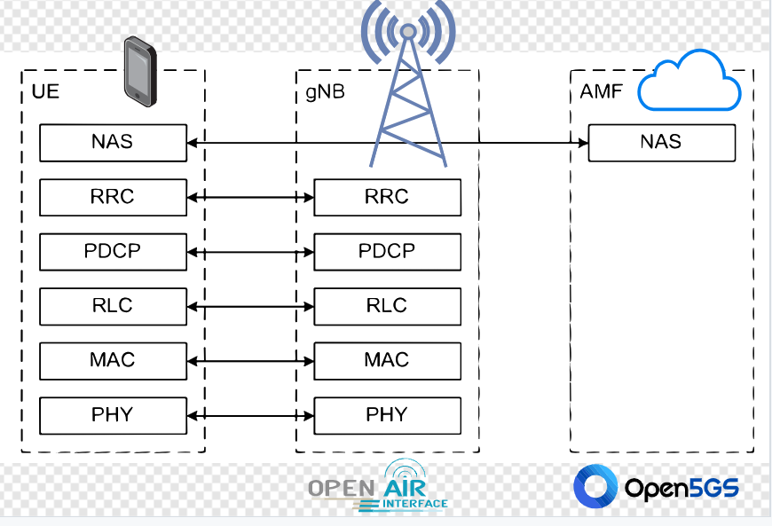

- https://paper.seebug.org/3087/
  - 5ghoul 中文翻译
    - 5Ghoul漏洞及其影响分析.pdf
- https://asset-group.github.io/disclosures/5ghoul/

- https://github.com/asset-group/5ghoul-5g-nr-attacks#5ghoul---5g-nr-attacks--5g-ota-fuzzing

- 根据 https://github.com/asset-group/5ghoul-5g-nr-attacks#5ghoul---5g-nr-attacks--5g-ota-fuzzing 可以确定实验采用的设备架构
  - USRP B210 + OpenAirInterface 5G 软件堆栈 +  Sysmocom 的可编程 SIM 卡（可选）
  - OpenAirInterface 5G 软件堆栈 实现了 5G协议栈的第1 2层网络协议，属于基站上的网络协议栈，open5g实现了第三层以及更高的网络协议栈，属于核心网的网络协议栈
  - 
  - 网络层 1-2 的实现：5G MAC, RRC, RLC and PDCP
    - 基站 （gNB） - OpenAirInterface（开放源代码）
  - 第 3 层及以上的实现：NAS, IPV4, etc
    - 5G 核心网 - Open5GS （开放源代码）
  - 画外，怪不得ch项目使用Open5G（https://github.com/open5gs）该开源项目是5g核心网的实现，而5ghoul属于ue到基站的攻击，故属于一二层网络协议的攻击，

- 一二层关键协议栈如下
  - 
- 寻找相关资料，学习图中协议
  - https://www.3gpp.org/technologies/5g-system-overview
  - 5g系统架构
  - https://portal.3gpp.org/desktopmodules/Specifications/SpecificationDetails.aspx?specificationId=3144
  - 谷歌搜索 5G NR 3GPP RRC potocol 可以定位到对应协议标准
    - https://www.etsi.org/deliver/etsi_ts/138300_138399/138331/15.03.00_60/ts_138331v150300p.pdf
    - https://portal.3gpp.org/desktopmodules/Specifications/SpecificationDetails.aspx?specificationId=3197


- https://www.securityweek.com/5ghoul-vulnerabilities-haunt-qualcomm-mediatek-5g-modems/
  - ***大多数安全漏洞都会影响无线资源控制 (RRC) 附加过程，其中包含 RRC 连接建立消息。根据记录这些问题的论文，身份验证过程也受到影响，所有 5Ghoul 问题“都是在 UE 和 gNB 之间通信的预身份验证阶段发现的”。***
  - ***这些漏洞可以通过格式错误的 RRC 连接设置消息或精心设计的 NAS 身份验证请求来触发。***
  - 在高通调制解调器中发现了三个错误 - CVE-2023-33042、CVE-2023-33043 和 CVE-2023-33044。该芯片制造商在其 2023 年 12 月安全公告中提到了这些问题，并警告称，超过 70 种芯片组型号受到影响。
  - 七个缺陷 – CVE-2023-32842、CVE-2023-32844、CVE-2023-20702、CVE-2023-32846、CVE-2023-32841、CVE-2023-32843 和 CVE-2023 -32845 – 影响 MediaTek 调制解调器。该公司在 2023 年 12 月安全公告中警告称，超过 30 种芯片组型号受到影响。


- 大模型问答 其中部分信息可以和5ghoul相匹配到
```txt
针对5g协议栈 中的MAC, RRC, RLC, PDCP 协议，请介绍下

Assistant
Assistant

Poe
在5G协议栈中，有几个关键的协议层负责不同的功能。以下是对MAC（Media Access Control）、RRC（Radio Resource Control）、RLC（Radio Link Control）和PDCP（Packet Data Convergence Protocol）协议的简要介绍：

MAC（Media Access Control）：
MAC层是无线通信系统中的一个关键协议层，用于管理物理层与数据链路层之间的接口。MAC协议负责调度和管理无线资源，控制数据的发送和接收，以及处理多用户之间的冲突和调度问题。它还处理调制解调、编码和解码、调度算法、多址访问控制等。MAC层在5G协议栈中起到关键的调度和管理作用，确保数据的可靠传输和高效利用无线资源。

RRC（Radio Resource Control）：
RRC层是无线通信系统中的控制层协议，负责设备之间的无线连接管理和无线资源控制。RRC协议负责建立和释放无线连接、配置和管理无线资源（如频率、功率、时隙等），以及控制设备的状态转换（如连接建立、连接保持、连接释放等）。RRC层在5G协议栈中起到关键的控制和管理作用，确保设备之间的无线通信能够有效地进行。

RLC（Radio Link Control）：
RLC层是无线通信系统中的数据链路层协议，负责提供可靠的数据传输和错误控制。RLC协议通过分段、重组和重传机制来保证数据的可靠传输。它还负责流量控制和拥塞控制，以避免网络拥塞和数据丢失。RLC层在5G协议栈中起到关键的数据链路控制作用，确保数据的可靠性和完整性。

PDCP（Packet Data Convergence Protocol）：
PDCP层是无线通信系统中的协议层，负责数据包的压缩和解压缩、加密和解密、重传请求等功能。PDCP协议可以提供数据传输的安全性和效率，并确保高质量的用户体验。PDCP层在5G协议栈中起到关键的数据包处理和转发作用，确保数据的安全性和高效性。

这些协议层在5G协议栈中相互配合，共同实现高速、可靠、安全的无线通信。它们各自负责不同的功能，但彼此之间也存在着密切的交互和协调。

针对rrc协议层，请介绍下协议数据包的结构及其关键字段

Assistant
Assistant

Poe
RRC（Radio Resource Control）协议层是无线通信系统中的控制层协议，负责设备之间的无线连接管理和无线资源控制。RRC协议数据包的结构由各个字段组成，这些字段包含了用于控制和管理无线连接的关键信息。以下是RRC协议数据包的一般结构及其关键字段：

RRC协议数据包的一般结构：
RRC协议数据包通常由一个固定的头部和可变长度的消息体组成。

asciidoc
复制
+------------------+
|     RRC Header   |
+------------------+
|    RRC Message   |
|     (variable)   |
+------------------+


RRC Header：
RRC头部包含了一些必要的控制信息，用于标识和解析RRC消息。它通常包括以下字段：

消息类型（Message Type）：指示RRC消息的类型，例如连接请求、连接设置等。
消息长度（Message Length）：指示RRC消息体的长度。
RRC Message：
RRC消息体包含了特定的控制信息，用于实现无线连接的建立、维护和释放。具体的消息类型和字段取决于不同的RRC消息。以下是一些常见的RRC消息及其关键字段：

RRC Connection Request：用于请求建立与基站的无线连接。

UE标识（UE Identity）：标识发起连接请求的用户设备。
无线配置（Radio Configuration）：包含无线参数，如频率带宽、功率等。
带宽请求（Bandwidth Request）：请求分配的无线带宽。
RRC Connection Setup：用于响应连接请求并建立无线连接。

基站标识（Cell Identity）：标识基站。
安全配置（Security Configuration）：包含加密和完整性保护的安全设置。
系统信息（System Information）：包含基站的广播信息。
RRC Connection Release：用于释放无线连接。

原因（Cause）：指示连接释放的原因，如用户请求、基站指令等。
这只是一些常见的RRC消息示例，实际上，RRC协议定义了多个消息类型和相应的字段，以支持无线连接的各种操作和配置。

RRC协议数据包的结构和字段可以根据具体的无线通信标准和网络架构有所差异。上述内容提供了一般性的介绍，更具体的细节和消息类型可以在相关的5G标准文档中找到。

正常情况下5G网络中 UE和 gNB如何从最开始建立连接并进行数据交互

Assistant
Assistant

Poe

在5G网络中，UE（User Equipment，用户设备）和gNB（gNodeB，基站）之间建立连接并进行数据交互通常遵循以下步骤：

小区搜索和同步：
UE首先执行小区搜索，以发现附近的gNB。它会监听系统信息广播，获取小区的参数和标识信息。UE选择一个合适的小区，并与其进行同步。

随机接入过程（Random Access Procedure）：
UE执行随机接入过程，向选定的小区发送随机接入请求。该过程包括以下步骤：

随机接入前导（Random Access Preamble）：UE发送随机接入前导来预留资源和通知gNB。
随机接入响应（Random Access Response）：gNB通过随机接入响应回复UE，并为UE分配RA-RNTI（Random Access Radio Network Temporary Identifier）和时间资源。
随机接入确认（Random Access Confirmation）：UE发送随机接入确认，确认随机接入过程的成功。
建立RRC连接：
UE和gNB之间建立RRC（Radio Resource Control）连接，用于控制和管理无线资源。该过程包括以下步骤：

RRC连接请求（RRC Connection Request）：UE向gNB发送RRC连接请求，请求建立RRC连接。
RRC连接设置（RRC Connection Setup）：gNB通过RRC连接设置回复UE，确认RRC连接的建立，同时提供连接配置信息。
RRC连接完成（RRC Connection Complete）：UE发送RRC连接完成，表示已成功建立RRC连接。
进行安全性协商：
UE和gNB之间进行安全性协商，以确保数据传输的安全。该过程包括协商密钥、进行加密和完整性保护等操作。

配置数据传输：
gNB配置UE的无线资源和参数，以支持数据传输。这包括分配信道、调度资源、设置传输模式等。

数据交互：
UE和gNB之间开始进行数据交互。UE可以通过下行链路（gNB到UE）接收数据，同时可以通过上行链路（UE到gNB）发送数据。数据交互可以通过不同的物理和逻辑信道进行。

连接维护和释放：
UE和gNB之间的连接在需要时可以进行维护和释放。例如，当UE不再需要连接时，可以发送RRC连接释放请求，通知gNB释放连接。

需要注意的是，上述步骤是一个一般的过程，具体的细节和消息交互可能会因5G协议标准、网络配置和运营商策略而有所不同。详细的步骤和消息交互可以在相关的5G协议规范中找到。
```


- 确定具体协议定义在3gpp哪个标准中，问llm
  - 5G NR的RRC协议定义在3gpp哪个标准中
  - 具体来说，5G NR RRC 协议定义在 3GPP TS 38.331 标准中。这个标准描述了 5G NR 系统中 RRC 协议的规范和细节，包括状态机、消息格式、过程和行为等。


# GSM核心网
- 2G相关协议定义在3gpp哪些标准中  
  - 2G 相关的协议定义在 3GPP（Third Generation Partnership Project）的一系列标准中。以下是一些与2G相关的主要标准：
  - GSM（Global System for Mobile Communications）和 GPRS（General Packet Radio Service）：
    - 3GPP TS 05.xx 系列标准：GSM 核心网络和无线接口的规范。
    - 3GPP TS 44.xx 系列标准：GPRS 核心网络和无线接口的规范。
  - EDGE（Enhanced Data rates for GSM Evolution）：
    - 3GPP TS 45.xx 系列标准：EDGE 核心网络和无线接口的规范。
  - GERAN（GSM/EDGE Radio Access Network）：
    - 3GPP TS 43.xx 系列标准：GERAN 系统架构、接口和协议的规范。
  - 请注意，上述标准系列中的 "xx" 部分是具体的标准编号，用于指定不同的规范内容。每个标准中都包含了与2G网络相关的各个方面的规范，包括物理层、无线接口、核心网络、信令协议、接口定义等。
  - 对于详细了解2G相关协议的具体规范和细节，建议参考最新的 3GPP 标准文档，以获取最准确和最新的规范信息。
- https://www.3gpp.org/ftp/Specs/archive/05_series
