# https://blog.csdn.net/HiWangWenBing/article/details/112293396
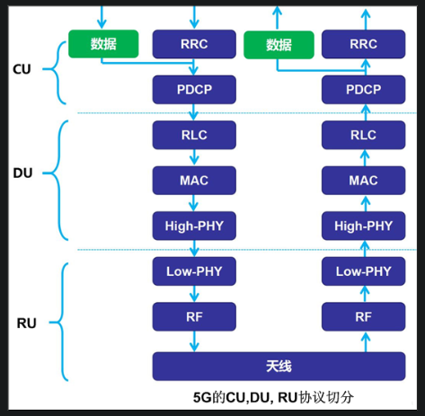
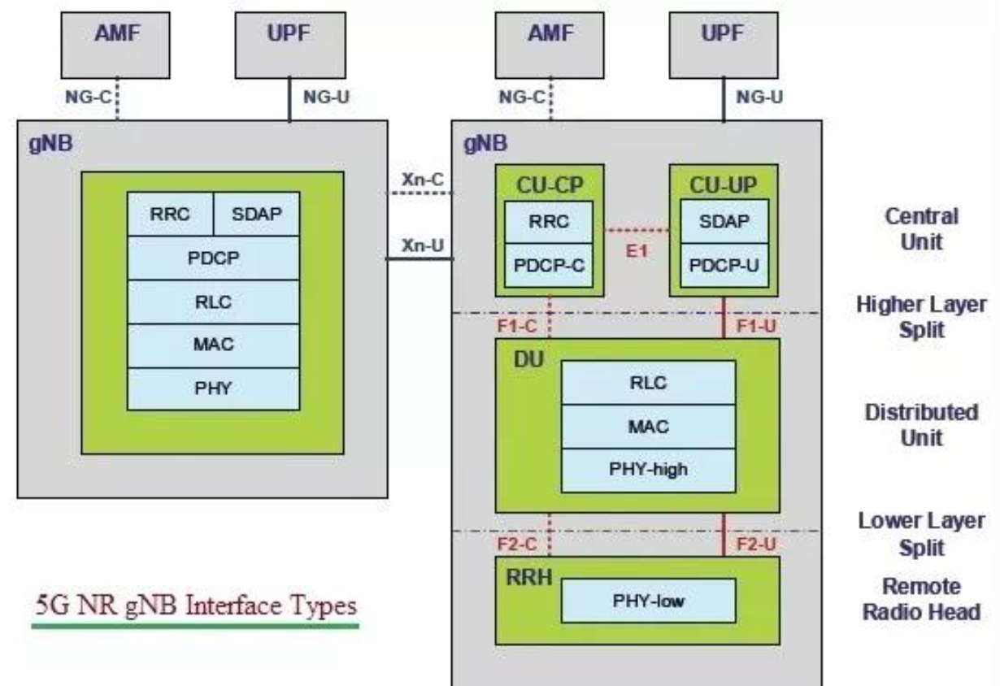
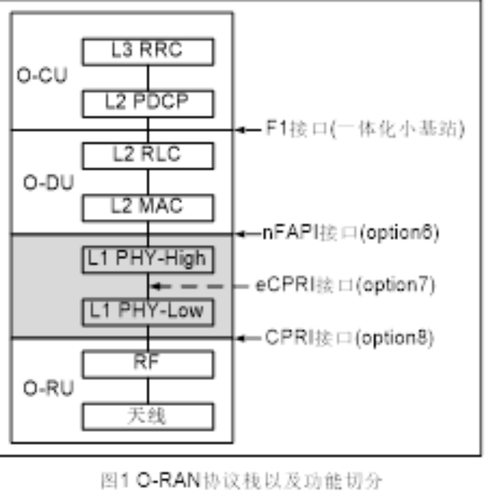

# https://blog.csdn.net/HiWangWenBing/article/details/113200967
- 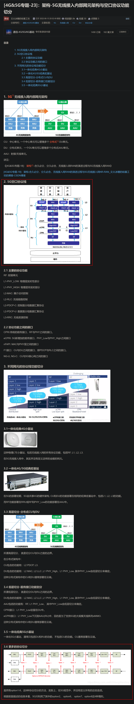
- 上述图中RAN架构的含义
- 在5G（第五代移动通信）协议通信中，RAN架构代表“无线接入网络”（Radio Access Network Architecture）。
  - RAN是5G网络的一部分，它负责无线信号的传输和接收，连接移动设备（如智能手机、平板电脑等）与核心网络之间的通信。RAN负责提供无线接入技术，将数据从移动设备传输到核心网络，并将来自核心网络的数据传输回移动设备。
- 在5G中，RAN架构包括以下主要组件：
  - 基站（Base Station）：也称为gNB（gNodeB），是RAN的关键组件，负责与移动设备建立通信连接并传输数据。每个基站可以覆盖一个特定的地理区域，提供无线信号覆盖和接入服务。
  - CU（Centralized Unit）：集中单元负责对RAN的整体控制和管理，包括无线资源管理、连接管理和调度策略等。它与基站的DU进行通信，并与核心网络的控制平面（如AMF，Access and Mobility Management Function）进行交互。
  - DU（Distributed Unit）：分布单元是基站的一部分，负责无线信号的处理和调度。它与RU（Radio Unit）协同工作，处理无线资源分配、调度和干扰管理。
  - RU（Radio Unit）：无线电单元负责物理层的无线信号传输，包括调制解调、信道编码和解码等功能。它与DU协同工作，实现无线信号的传输和接收。

# 重点 https://blog.csdn.net/HiWangWenBing/article/details/113204833
- [4G&5G专题-24]：架构-5G接入网协议栈规范_3gpp 中4ggtpu和5ggtpu的区别-CSDN博客 (2023_12_26 23_20_40).html
- 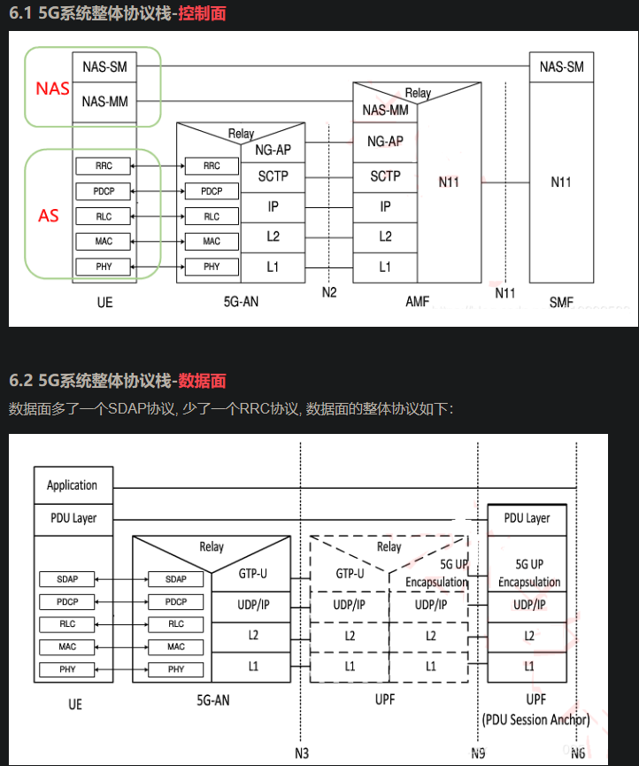
- 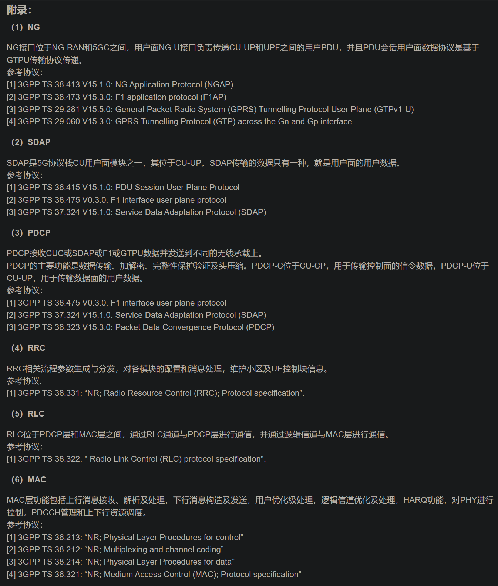
5G空口协议相比于4G的空口协议变化不大。

在用户面协议栈，5G新空口用户面协议栈多了一层SDAP(Service Data Adaptation Protocol ）。

SDAP协议定义于TS37.324，PDCP定义于TS38.323，RLC定义于TS38.322，MAC定义于TS38.321。

从协议分层来看，除了数据面的SDAP协议，其他层协议与4G LTE是一致的。

但协议的内容，是有差别的，在这里不细说。

其中物理层PHY协议相差最大，其次是MAC层，越往上层，LTE与5G的相差越小。

（1）SDAP：Service Data Adaptation Protocol，服务数据适配协议

把核心网包含Qos的数据流映到特定的下层的无线承载RB上.

（2）RB: Radio bearers，无线承载

由PDCP层提供的特定类型的数据传输服务，根据承载的内容不同分为SRB (Signaling Radio Bearer)和DRB (Data RadioBearer)。不同的用户有一个SRB和多个不同类型的DRB.

（3）PDCP: Packet Data Convergence Protocol分组数据汇聚协议

IP头压缩ROHC
数据加密与完整性保护
（4）RLC: Radio Link Control 无线链路层控制协议

数据的分段：把一个长IP包分拆成多个无线帧的数据净荷，以满足无线帧传输的需要；
数据的合并：把多个短IP包合并成一个无线帧的数据净荷，以满足无线帧传输的需要；
数据重复性检查
出错或超时重发
（5）MAC：无线介质访问控制层，即用户数据发送和接收的调度

用户的调度（什么时候发送用户数据，通过信道发送数据等）, LTE的调度周期是1ms，而5G的调度周期可以是0.5ms或0.25ms或0.125ms。

发送的数据格式的选择：用户数据的格式
Qos的处理：根据用户的Qos进行调度。
多路用户数据的复用：逻辑信道到物理信道的映射，即不同用户的数据填充到10ms帧的特定位置（物理空间位置和时间位置）
单用户的多载波聚合CA：一个用户的数据，通过多个不同的载波进行发送。
出错包的快速重新发送HARQ：混合自动重传请求（Hybrid Automatic Repeat reQuest，HARQ），是一种将前向纠错编码（FEC）和自动重传请求（ARQ）相结合而形成的技术。
备注：HARQ重传的基本单位不是10ms帧，而是一次调度周期传送的数据，LTE是一个子帧，5G是一个mini slot

# https://blog.csdn.net/HiWangWenBing/article/details/118437789
- [4G&5G专题-123]：5G培训部署篇-1-5G网络架构与关键技术_phy-low phy-high-CSDN博客 (2024_1_17 08_04_56).html
- 5G系统架构
  - 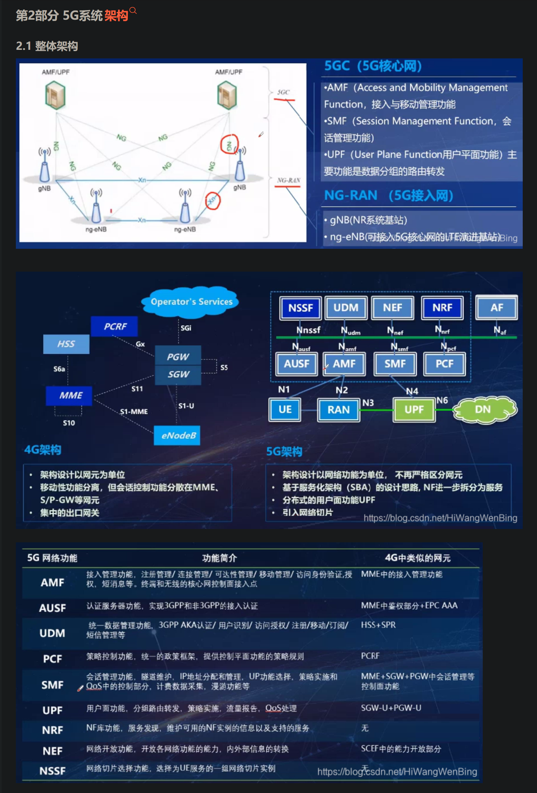
- 无线接入网侧架构
  - 即基站侧各个组件的组成
- sa与nsa
- 5G协议栈
  - 空中接口，即Uu接口，是终端和接入网之间的接口
  - 控制面协议栈与4g相同
  - 数据面协议栈（也称空口协议栈）与4G相比 5G数据面协议栈增加新的协议层SDAP,用于完成QoS，提供业务差异化保障
  - 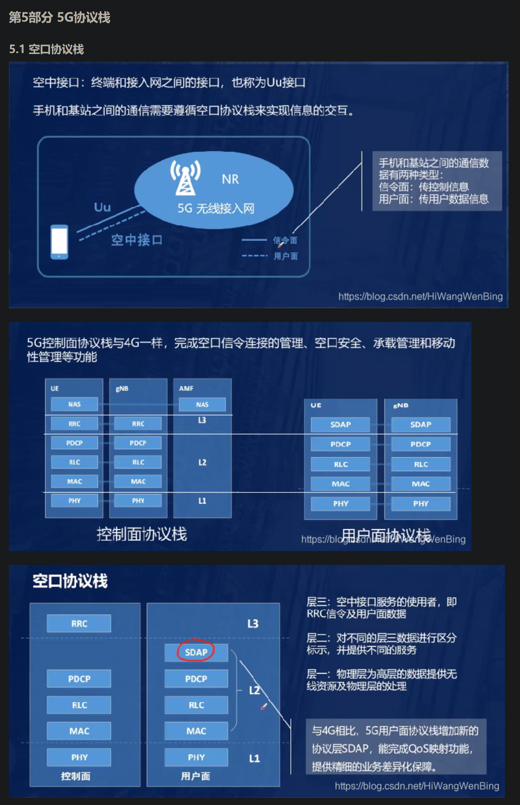
- 5G NR信道
  - rlc-mac之间 逻辑信道 具体可以分为控制信道和物理信道
  - mac-phy之间 传输信道 
  - phy 物理信道
  - 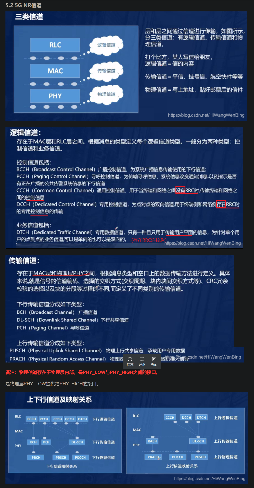

# https://blog.csdn.net/HiWangWenBing/article/details/123055653
- [4G_5G专题-136]_ 终端 - 5G终端硬件和软件总体架构_5g_4g终端的低功耗设计-CSDN博客 (2024_1_17 09_07_53).html
- 5g终端在消费级智能终端层面，以器件和芯片形式存在，例如手机基带芯片，看重功耗
- 5g终端在行业终端层面，以模组形式存在，其中封装了一体化的soc芯片，追求极致性能，这起始也是一个攻击面，因为针对5g模块中与5g芯片通讯代码存在攻击面

- 5g终端的整体架构
  - 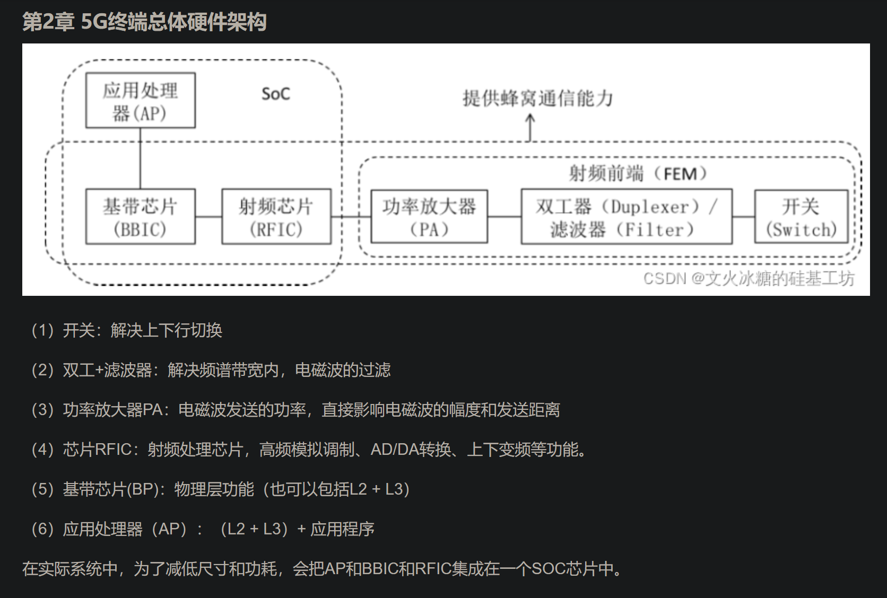
  - 注意其中说明了基带芯片(BP)：主要物理层功能，也可以包括L2 + L3，实际上应用处理器（AP）中也可以包括L2 + L3层功能（L2mac L3RRC），所以L2 L3层功能也可以在ap上实现

- 5G 协议栈 控制面
  - 在控制面，终端除了实现传统的无线空口协议栈L1/L2/3外，还需要实现NAS协议栈。NAS协议主要是与核心网通信，实现主机的注册等信令控制。
  - 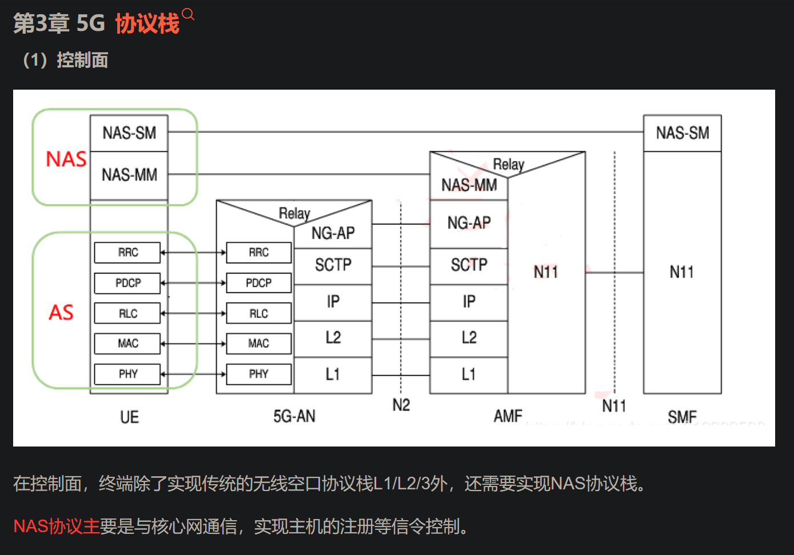
- 5G 协议栈 数据面
  - 数据面多了一个SDAP协议, 少了一个RRC协议, 数据面的整体协议如下：
  - 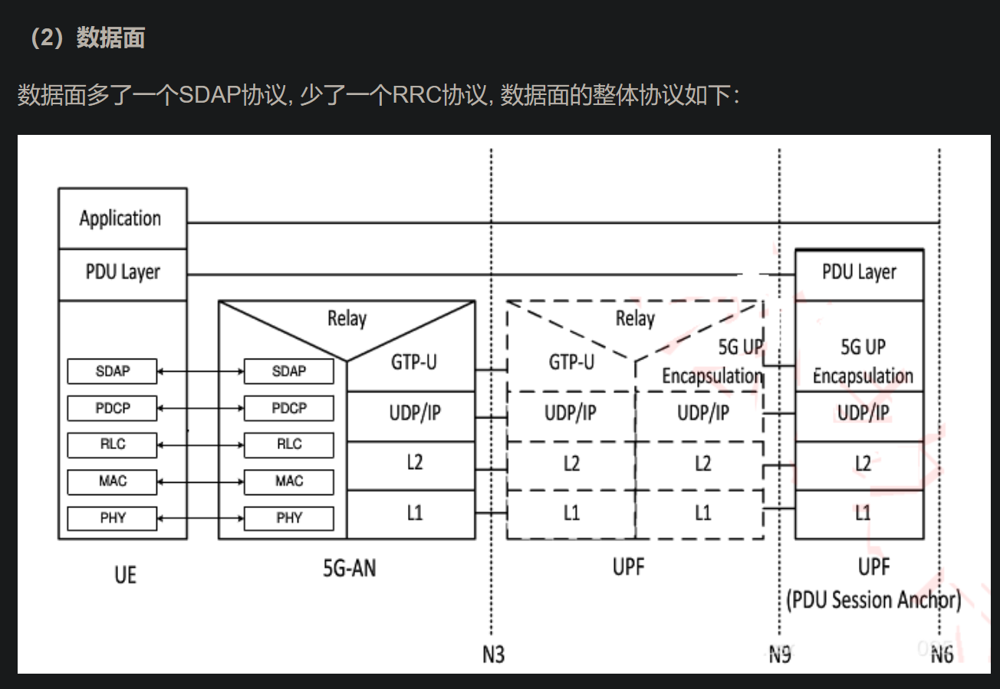

