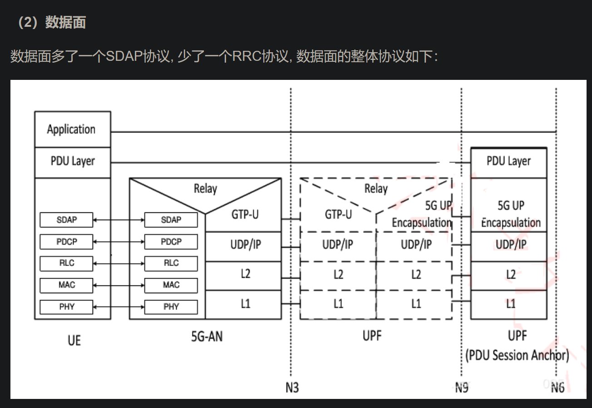

# https://blog.csdn.net/HiWangWenBing/article/details/123055653
- [4G_5G专题-136]_ 终端 - 5G终端硬件和软件总体架构_5g_4g终端的低功耗设计-CSDN博客 (2024_1_17 09_07_53).html
- 5g终端在消费级智能终端层面，以器件和芯片形式存在，例如手机基带芯片，看重功耗
- 5g终端在行业终端层面，以模组形式存在，其中封装了一体化的soc芯片，追求极致性能，这起始也是一个攻击面，因为针对5g模块中与5g芯片通讯代码存在攻击面

- 5g终端的整体架构
  - 
  - 注意其中说明了基带芯片(BP)：主要物理层功能，也可以包括L2 + L3，实际上应用处理器（AP）中也可以包括L2 + L3层功能（L2mac L3RRC），所以L2 L3层功能也可以在ap上实现

- 5G 协议栈 控制面
  - 在控制面，终端除了实现传统的无线空口协议栈L1/L2/3外，还需要实现NAS协议栈。NAS协议主要是与核心网通信，实现主机的注册等信令控制。
  - 
- 5G 协议栈 数据面
  - 数据面多了一个SDAP协议, 少了一个RRC协议, 数据面的整体协议如下：
  - 

# https://blog.csdn.net/HiWangWenBing/article/details/123070605
- [4G_5G专题-141]_ 终端 - 测试仪表详解_4_5g便携测试-CSDN博客 (2024_1_17 09_25_44).html
- 5G终端综合测试仪 可以模拟5G基站以及整核心网，可以用于测试5g终端的下述情况
  - ***（1）协议一致性（基带）：关注空口基带协议栈的各层协议的控制面和数据面的数据包的封装、消息交互流程。***
  - （2）射频一致性（射频前端 + RFIC）：关注空口射频无线电磁波的收发
  - （3）RRM（调度）：关注无线资源的管理与调度策略

# https://blog.csdn.net/HiWangWenBing/article/details/123056650
- [4G+5G专题-137]: 终端 - 射频前端（滤波器、功率放大器）详解

# https://blog.csdn.net/HiWangWenBing/article/details/123057706
- [4G+5G专题-138]: 终端 - 射频+基带SOC芯片
- 

# https://blog.csdn.net/HiWangWenBing/article/details/123059000
- [4G+5G专题-139]: 终端 - 5G终端主要的产品形态 - 智能终端

# https://blog.csdn.net/HiWangWenBing/article/details/123064525
- [4G_5G专题-140]_ 终端 - 5G终端主要的产品形态 - 行业终端_5g直连产品形态包括什么-CSDN博客 (2024_1_17 09_41_54).html
- 5G通信模组的本质是把AP和BP分开，ARM AP实现应用层协议，模组实现基带功能（L1/L2/L3），称为BP，BP实际上一个基带芯片+5G协议栈。
- 通信模块的缺点就是体积比智能机的SOC芯片大，但通信模组的好处是，减低了垂直行业利用5G终端的门槛，业务应用适用自己的硬件，集成一个5G的通信模组，就是实现5G的功能，通信模组通常有少数的专业公司提供，而5G行业应用的终端则由5G终端产品供应上或行业应用集成商提供。通过通信模组，把行业应用与5G协议进行了物理芯片上的分离与隔离。
- 通常情况下，通信模组是在基带芯片的基础之上的集成，它把基带芯片,RFIC, 射频前端等硬件集成在一起，提供一个包装后的5G通信模组，第三方的基带芯片是核心。
- 接入类终端 5G CPE(对外用于接收5G通讯，用于以网线和wifi形式提供网络通讯
- 