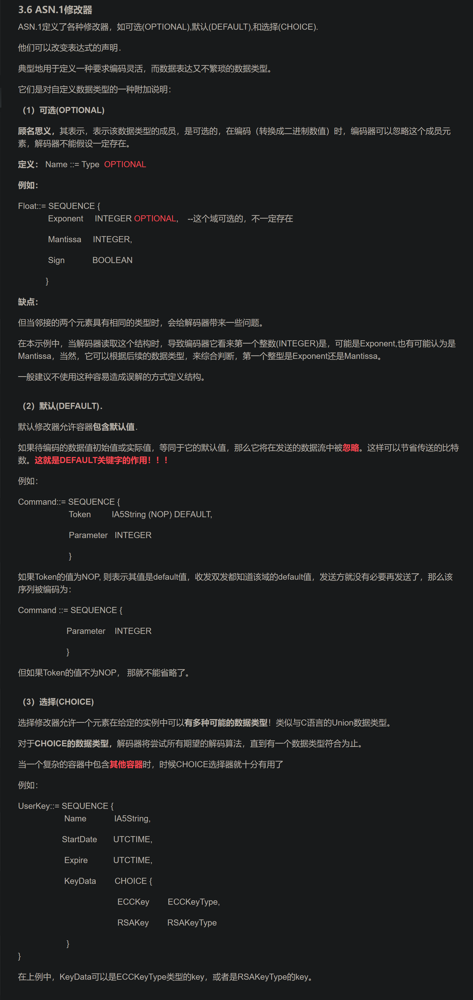

# https://blog.csdn.net/HiWangWenBing/article/details/114745229
- [4G&5G专题-60]：L3 RRC层 - 定义数据类型与数据结构的超级神器：ASN.1抽象语法标记_rrc消息封装格式-CSDN博客 (2023_12_31 14_42_19).html
- 重要资料，对理解asn1规范很重要
## 支持的编码规则
ASN.1支持的编码有：基本编码规则（BER） -X.209 、规范编码规则（CER）、识别名编码规则（DER）、压缩编码规则（PER）和 XML编码规则（XER）。

BER：Basic Encoding Rule，基本编码规则，这种编码规则长被应用于设备与网管中心使用SNMP协议的场合。

XER： XML Encoding Rule，XML编码规则，这种编码规则，常被应用与基站OAM平面与网管中心的消息通信。

PER： Packed Encoding Rules，压缩性编码，因为空口资源比较紧张，***RRC消息采用PER编码，不需要按照8比特做对齐 ，最大限度的减少了空口传输的数据量。***

## 应用
OSI 协议套中的应用层协议使用了 ASN.1 来描述它们所传输的 PDU，这些协议包括：

用于传输电子邮件的 X.400、用于目录服务的 X.500、用于 VoIP 的 H.323 和 SNMP。它的应用还可以扩展到通用移动通信系统（UMTS）中的接入和非接入层，这里就是RRC协议和NAS协议。

## 语法规则
在ASN.1中，符号的定义没有先后次序：只要能够找到该符号的定义即可，而不必关心在使用它之前是否被定义过。
所有的标识符、参考、关键字都要以一个字母开头，后接字母（大、小写都可以）、数字或者连字符“-”。不能出现下划线“_”。不能以连字符“-”结尾，不能出现两个连字符（注释格式）。
关键字一般都是全部大写的，除了一些字符串类型（如PrintableString，UTF8String，等。因为这些都是由原类型OCTET STRING衍生出来的）。
在标识符中，只有类型和模块名字是以大写字母开头的，其它标识符都是以小写字母开头的。
带小数点的小数形式不能在ASN.1中直接使用，在ASN.1中实数实际定义为三个整数：尾数、基数和指数
注释以两个连字符“--”开始，结束于行的结尾或者该行中另一个双连字符。
如同大多数计算机语言，ASN.1不对空格、制表符、换行符和注释做翻译。但是在定义符号（或者分配符号Assignment）“::=”中不能有分隔符，否则不能正确处理。

## 数据类型

## 修改器

## 实例分析
- 见html
[4G&5G专题-60]：L3 RRC层 - 定义数据类型与数据结构的超级神器：ASN.1抽象语法标记_rrc消息封装格式-CSDN博客 (2023_12_31 14_42_19).html

## 推荐资料
一般推荐阅读《ASN.1 Complete》这本书和 X.691 《ASN.1 encoding rules: Specification of Packed Encoding Rules (PER)》。