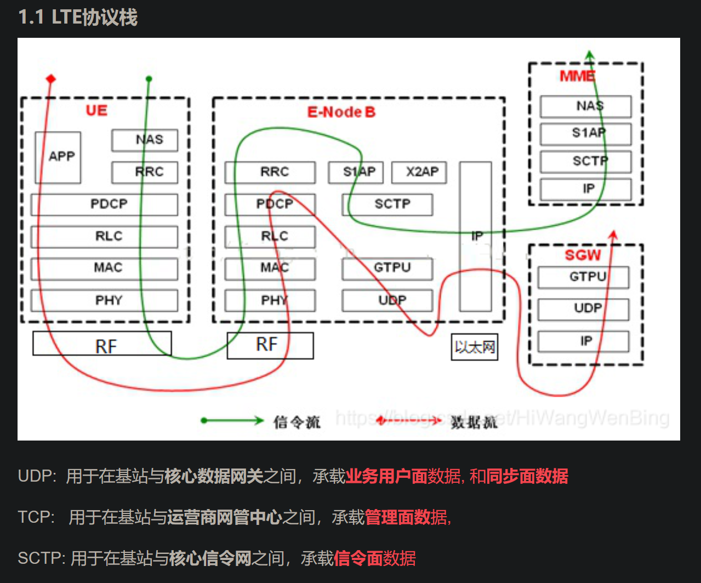
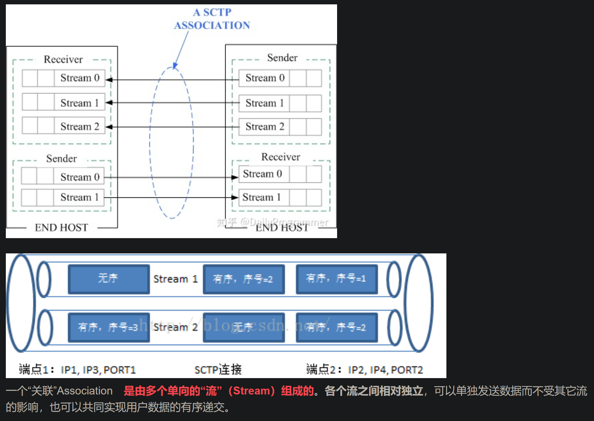

https://blog.csdn.net/HiWangWenBing/article/details/114790343
[4G&5G专题-61]：IP传输层 - 三种IP传输层协议TCP、UDP、SCTP与通信系统四面：管理面、业务数据面、同步面、信令面_5g中控制面和用户面 同步面-CS….html
# 三种协议在LTE协议栈中的位置与作用

UDP:  用于在基站与核心数据网关之间，承载业务用户面数据, 和同步面数据
TCP:   用于在基站与运营商网管中心之间，承载管理面数据,
SCTP: 用于在基站与核心信令网之间，承载信令面数据

# SCTP协议
- 
- 该协议与tcp类似，关键区别是，sctp在接收与传送的部份，可使用多个串流进行数据的传送与接收。而tcp单一字节流中任何位置的字节丢失都将阻塞该连接上其后所有数据的递送，直到该丢失被修复为止。
- 详见html