# RRC协议
# https://blog.csdn.net/HiWangWenBing/article/details/114695395
  - [4G&5G专题-59]：L3 RRC层-RRC层概述与总体架构、ASN.1消息、无线承载SRB, DRB、终端三种状态、MIB, SIB,NAS消息类型-CSDN博客 (2023_12_20 01_17_59).pdf

- 5G NR的RRC协议定义在TS38.331, 下载地址是https://www.3gpp.org/ftp/Specs/archive/38_series。
- 访问对应下载目录如下，发现其中文件按时间顺序排序，最早的文件中只有目录，没有内容，但最新的文件中有最多的内容，说明随着时间该协议规范被逐步完善，故学习最新的规范 即38331-h60.zip
  - https://www.3gpp.org/ftp/Specs/archive/38_series/38.331
- 使用kimichat解析该文档 38331-h60.docx，进行学习
  - 全部学习则超过限额，需要减少，

## 概述 
- 使用kimichat 解析 https://blog.csdn.net/HiWangWenBing/article/details/114695395 文章，直接输入url即可分析
  - RRC（Radio Resource Control protocol）位于空口协议栈的L3层，处于PDCP与NAS层之间。RRC协议有两个基本功能：
    - 在基站和手机之间传递L3层无线资源控制信令（接入层信令AS） 是主要功能
    - 帮助手机和核心网信令网关在空口传递非接入层信令（NAS消息）。
  - RRC层的对外接口包括与底层空口承载的接口和与核心网的接口。在RRC层，无线承载分为SRB（信令无线承载）和DRB（数据无线承载）。
  - 4G LTE终端的RRC状态主要有空闲状态（包括NULL和IDLE子状态）和连接状态（包括RACH、CON和HO子状态）。而5G NR终端的RRC状态除了空闲状态和连接状态外，还引入了一个新的INACTIVE状态，以降低终端功耗。
  - RRC层消息的通用格式采用ASN.1（Abstract Syntax Notation One）进行描述。ASN.1是一种用于描述数据表示、编码、传输和解码的数据格式，具有紧凑的编码方式、不需要定义私有协议和不需要开发编码器和解码器等优点。
  - RRC信令消息类型包括小区级系统信令消息（如MIB和SIB消息）、用户与核心网之间的专有信令消息（NAS消息）以及UE终端与基站之间的专有信令消息与其他消息。

## 空口协议栈
- 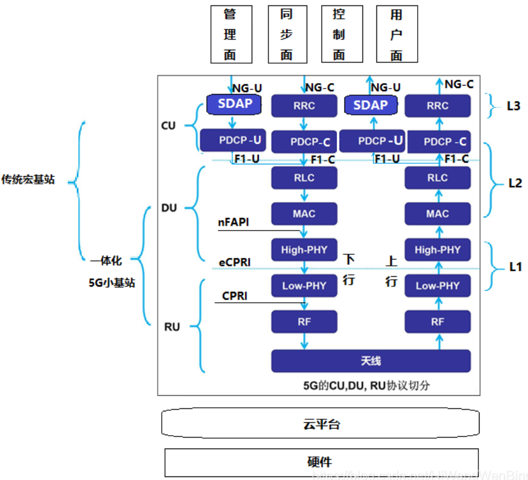
- RRC是空口协议栈的第三层，根据资料中图以及llm回答，大致可知空口协议栈不同层级以及对应协议
  - L1:物理层
  - L2：数据链路层 协议由低到高为 
    - MAC（Medium Access Control）子层、
    - RLC（Radio Link Control）子层和
    - PDCP（Packet Data Convergence Protocol）子层。
    - MAC子层负责控制无线资源的分配和调度，
    - RLC子层负责可靠的数据传输，
    - PDCP子层负责数据包的压缩和解压缩以及数据包的传输。
  - L3：网络层 
    - RRC（Radio Resource Control）RRC子层负责控制无线接口的连接管理、移动性管理和无线资源的控制
  - 以上是大致分类，根据具体3g4g5g规范不同，会有一些新的协议层被引入或者现有的协议层进行了重组。

## 无线资源的定义
- 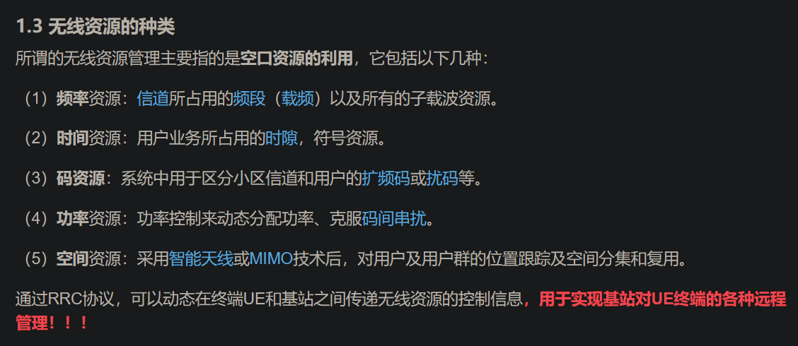


## RRC层与底层空口承载的接口 即手机与基站的通讯接口
- RRC消息是手机与基站之间的无线资源控制信令消息，承载在PDCP-C（信令面）消息中，其内容最终会被搬移或翻译到S1AP/SCTP协议中。
- 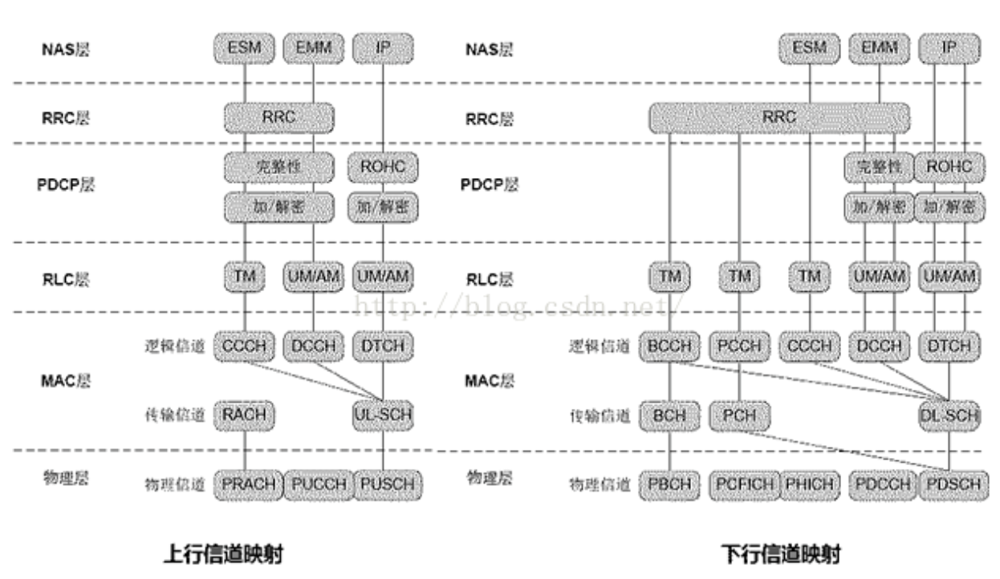

## 手机与核心网的接口
- 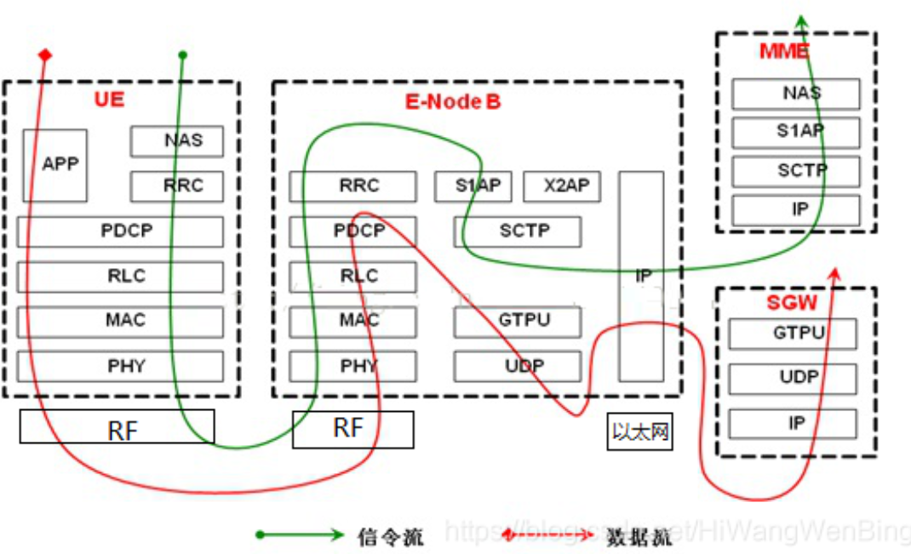
- - RRC协议之上还有NAS协议，该协议用于手机与核心网信令网关在空口传递"非接入层信令NAS"，即NAS消息是承载在RRC消息中在空口传输的，NAS消息在有线传输网是承载在S1AP消息中。
- 根据文章中图片，数据流不经过rrc协议，直接由app到pdcp协议
- （1）上行
- 承载在RRC消息NAS消息，经过RRC层之后，基站提取出NAS消息，并重新封装在S1-AP/SCTP/IP消息中，并传递给核心网的信令网关。
- （2）下行
- 核心网的信令网关发送给手机的NAS消息，通过S1-AP/SCTP/IP发送基站，基站提取出NAS消息，并重新封装在RRC消息中，然后通过空口无线承载发送给手机。


## 无线承载 与 建立流程
- 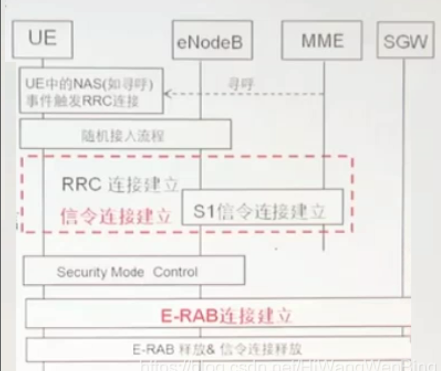
- 图中各个单元 UE、eNodeB、MME和SGW 含义如下 from llm
- UE（User Equipment）：UE是指用户设备，也就是终端用户使用的移动设备，比如智能手机、平板电脑或物联网设备等。UE与网络进行通信，发送和接收数据。
- eNodeB（Evolved NodeB）：eNodeB是5G网络中的基站，负责与UE建立连接，处理数据传输和信号覆盖等功能。它提供了无线接入功能，将UE的数据传输到核心网。
- MME（Mobility Management Entity）：MME是一个核心网元，负责处理UE的移动性管理功能。它负责UE的注册、鉴权、位置管理、会话管理和安全等任务。MME还与HSS（Home Subscriber Server）进行交互，以获取用户的订阅信息。
  - MME 处理信令
- SGW（Serving Gateway）：SGW是核心网中的服务网关，负责处理数据传输和转发。它实现了数据平面的功能，将数据从eNodeB传输到PGW（PDN Gateway）或其他相应的网关。SGW还负责UE的移动性管理，包括UE的位置跟踪和切换等。
  - SGW 处理数据

- 信令连接包括：
  - Uu接口的专用RRC连接
  - S1接口的专用S1连接
  - 专用信令连接的目的是的:
- 建立专用的数据连接E-RAB
  - 信令消息交换

- 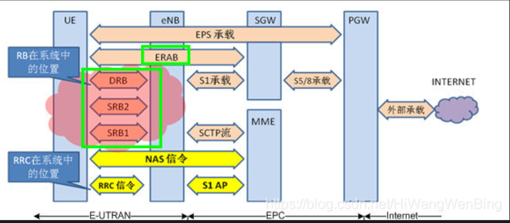
- 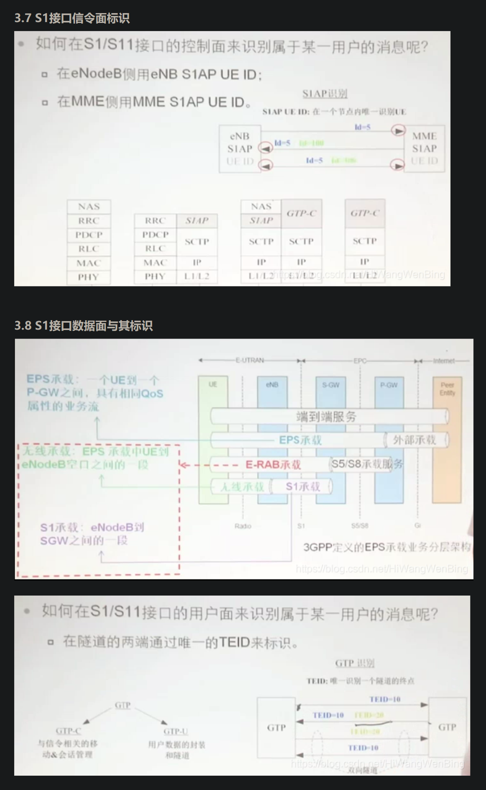
- 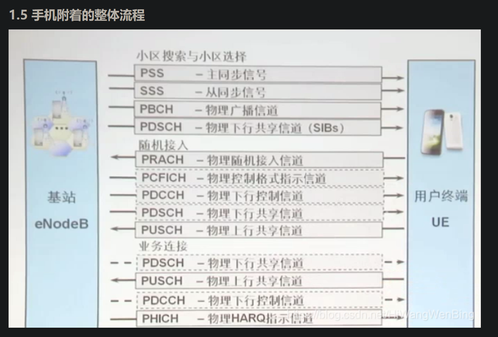
- 上述暂时还不太理解

### SRB（信令无线承载）与DRB（数据无线承载）
- 在RRC层，有一个非常重要的概念，就是SRB（信令无线承载）与DRB（数据无线承载）
  - 信令无线承载”（SRB）定义为仅仅用于RRC和NAS消息传输的无线承载（RB）。包括PDCP-C协议实体、RLC协议实体、MAC协议实体和PHY分配的一系列资源等。
  - 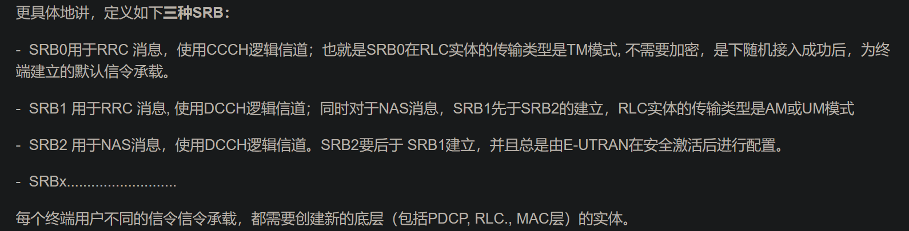
  - 数据无线承载”（DRB）定义为仅仅用于UE和基站的空口之间的用户面IP数据包的无线承载。包括PDCP-U协议实体、RLC协议实体、MAC协议实体和PHY分配的一系列资源等。
    - ***根据QoS不同，UE与eNodeB之间可同时最多建立8个DRB。***
    - ***注意：DRB承载的不是RRC层的RRC消息，而是终端与核心网数据网关之间的IP数据包。***

- 无线承载：Radio Bearer (RB)是RRC层的概念，是基站为UE分配的不同层协议实体及配置的总称，包括PDCP协议实体、RLC协议实体、MAC协议实体和PHY分配的一系列资源等。

- RRC层的无线承载分为小区系统级静态无线承载和手机专有级动态无线承载。
- 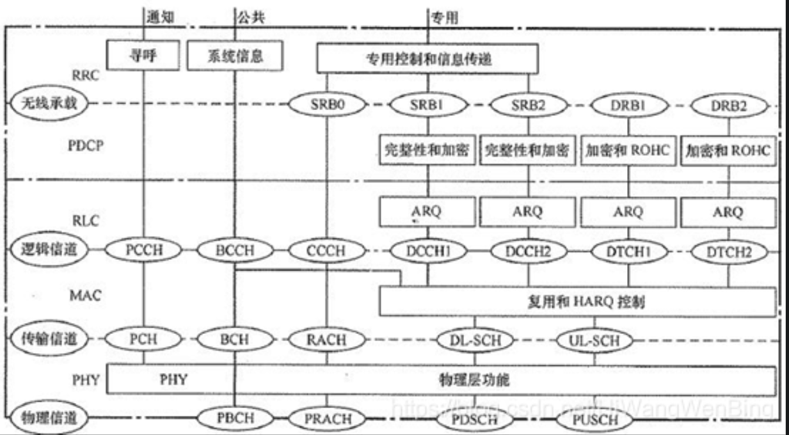
  
### 小区系统级静态无线承载
- MIB和SIB消息的无线承载, 在Cell setup阶段建立，通过小区级的BCCH信道发送。
- 寻呼消息的无线承载，在Cell setup阶段建立，通过小区级的PCCH信道发送。
- UE随机接入的无线承载，是一个特殊的无线承载。在Cell setup阶段建立，为所有UE共享，并通过RACH信道发送与接收
- 关于 小区系统级静态无线承载 from llm
  - 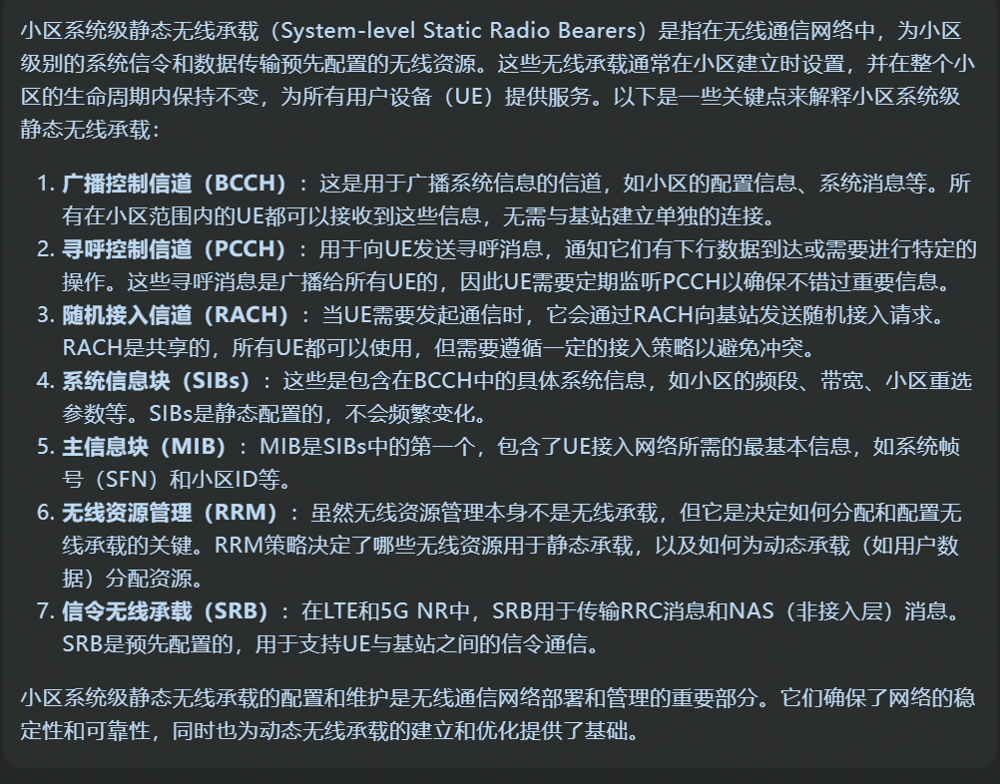

### 手机专有级动态无线承载
- SB0的无线承载，在发起随机接入时建立，并通过Cell setup就已经建立的RACH信道发送与接收。
- SRBx：随机接入RACH之后，为UE建立的专有信令承载。
- DRB：随机接入RACH之后，为UE建立的专有数据承载。
- form llm
  - 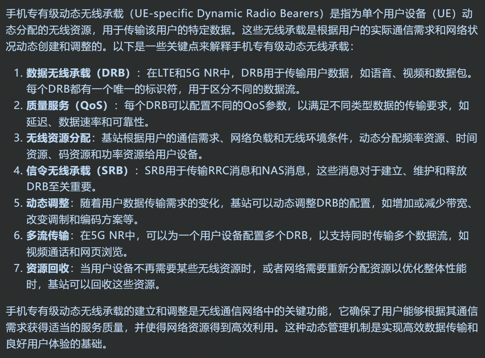

## 4G LTE终端的RRC状态
- 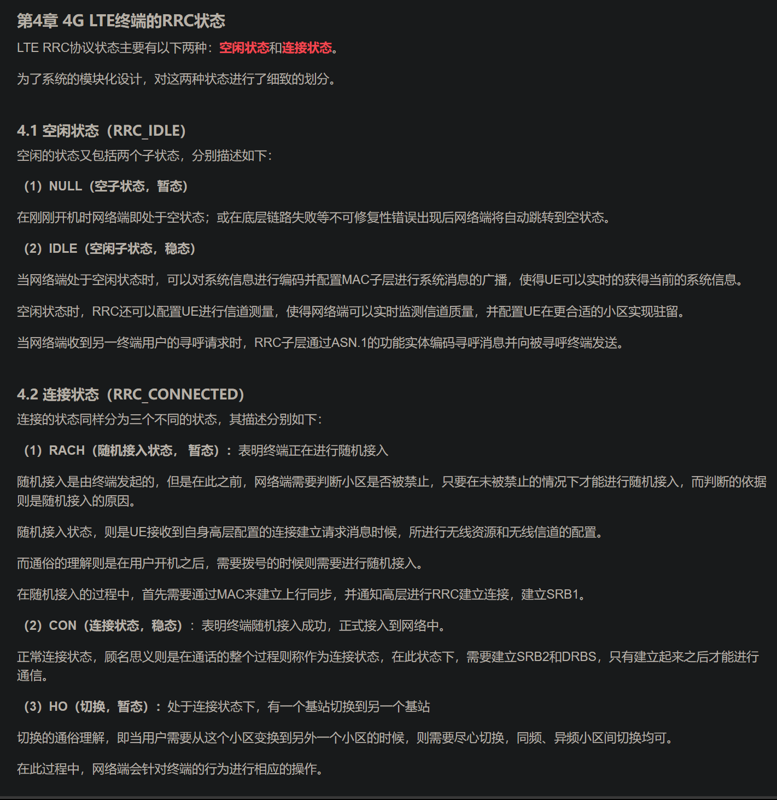
- RACH（随机接入状态， 暂态） 状态下 首先需要通过MAC来建立上行同步，并通知高层进行RRC建立连接，建立SRB1。
- CON（连接状态，稳态），在此状态下，需要建立SRB2和DRBS，只有建立起来之后才能进行通信。

## 5G NR终端的RRC状态
- 5G引入了一个新的状态：INACTIVE，5G NR下RRC有三种状态：IDLE、INACTIVE、CONNECTED。相对于LTE, 增加了一个INACTIVE状态.该状态位于IDLE和CONNECTED状态中间
- UE从RRC_CONNECTED跃迁至RRC_IDLE态时，需要释放核心网的上下文。
- UE从RRC_IDLE态跃迁至RRC_CONNECTED态时，需要与核心网侧进行信令的交互，建立与核心的上下文。
- UE在进入RRC_INACTIVE态时，会保留核心网的上下文，不会进行释放，并且在核心网侧是不知道UE进入了RRC_INACTIVE的，也就是对于核心网该状态是透明的；
- RRC_INACTIVE态下如果有数据接收或发送，则需要跃迁至RRC_CONNETED态时，只需要通过恢复过程，携带核心网唯一UE标识进行恢复即可，并且gNB收到连接恢复完成后就可以接收和发送数据包了。并不需要终端重新与核心网建立连接。

- 上述三种状态的功能特征
  - 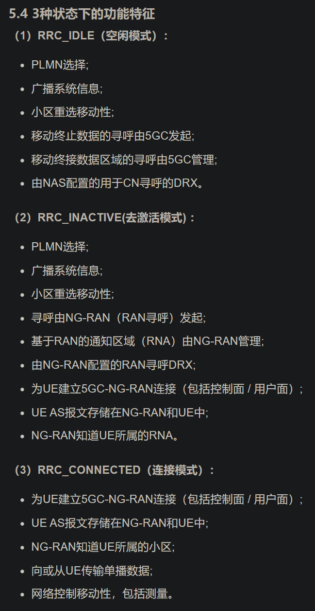

- 三种状态的功能切换
  - 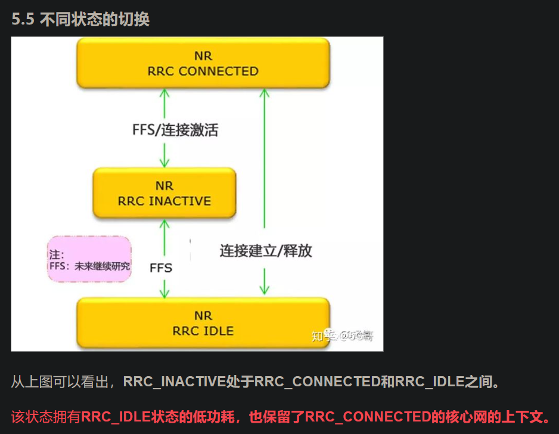

## 4g 5g切换
- 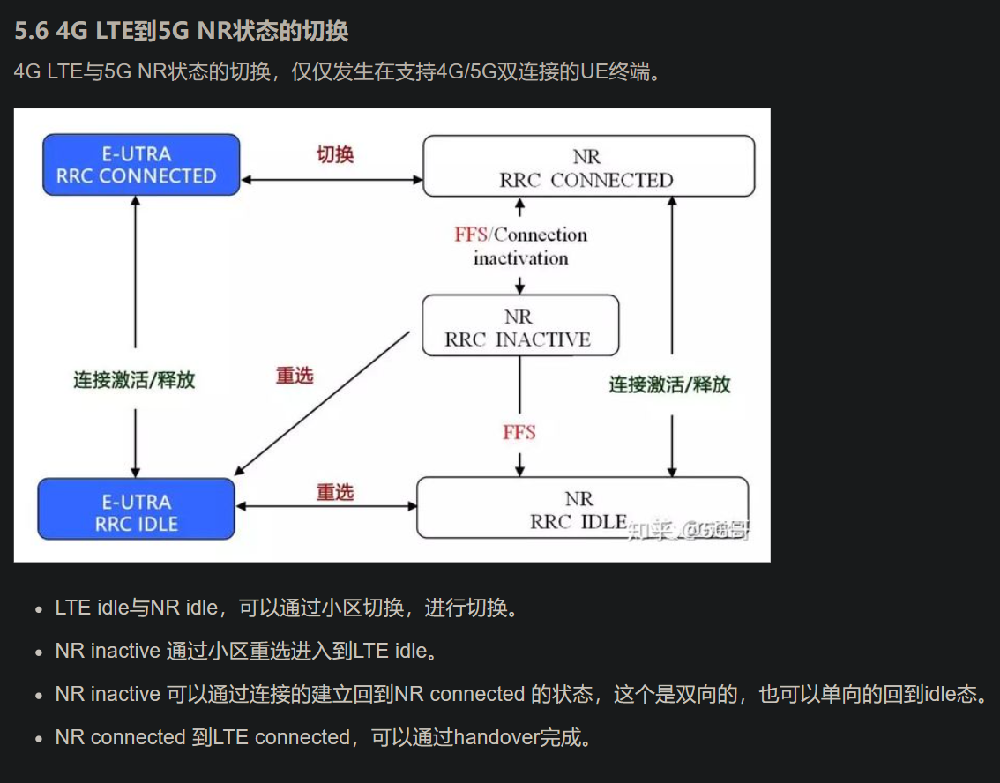


## rrc消息通用格式
- RRC协议是使用ASN.1文法描述的，学习RRC协议都要先去了解一下ASN.1协议。
- 一般推荐阅读《ASN.1 Complete》这本书和 X.691 《ASN.1 encoding rules: Specification of Packed Encoding Rules (PER)》。
- ASN.1协议支持PER编码、BER编码和XER编码等对齐方式。
- PER： Packed Encoding Rules，压缩性编码，因为空口资源比较紧张，***RRC消息采用PER编码***，不需要按照8比特做对齐 ，最大限度的减少了空口传输的数据量
- BER：Basic Encoding Rule，基本编码规则，这种编码规则常被应用于设备与网管中心使用 ***SNMP协议的场合***。
- XER： XML Encoding Rule，XML编码规则，这种编码规则，常被应用与基站OAM平面与网管中心的消息通信。
- ASN.1 的描述可以容易地被映射成 C 或 C++ 或 Java 的数据结构，并可以被应用程序代码使用，并得到运行时程序库的支持
- ASN.1 取得成功的一个主要原因是它与几个标准化编码规则相关，如基本编码规则（BER） -X.209 、规范编码规则（CER）、识别名编码规则（DER）、压缩编码规则（PER）和 XML编码规则（XER）
- 简洁的二进制编码规则（BER、CER、DER、PER，但不包括 XER）可当作更现代 XML 的替代。然而，ASN.1 支持对数据的语义进行描述，所以它是比 XML 更为高级的语言。
- 在任何需要以数字方式发送信息的地方，ASN.1 都可以发送各种形式的信息（声频、视频、数据等等）。
- OSI 协议套中的应用层协议使用了 ASN.1 来描述它们所传输的 PDU，这些协议包括：用于传输电子邮件的 X.400、用于目录服务的 X.500、用于 VoIP 的 H.323 和 SNMP。它的应用还可以扩展到通用移动通信系统（UMTS）中的接入和非接入层，这里就是RRC协议和NAS协议。


### ASN.1消息举例
- NGAP的 NGSetUp消息的编码： （NGAP协议，一种核心网协议）
- RRC消息的描述是文本，然而传输时是是二进制，因此，发送是需要把文本描述编译成二进制，接收展现时，需要通过解码器，翻译成文本。
- 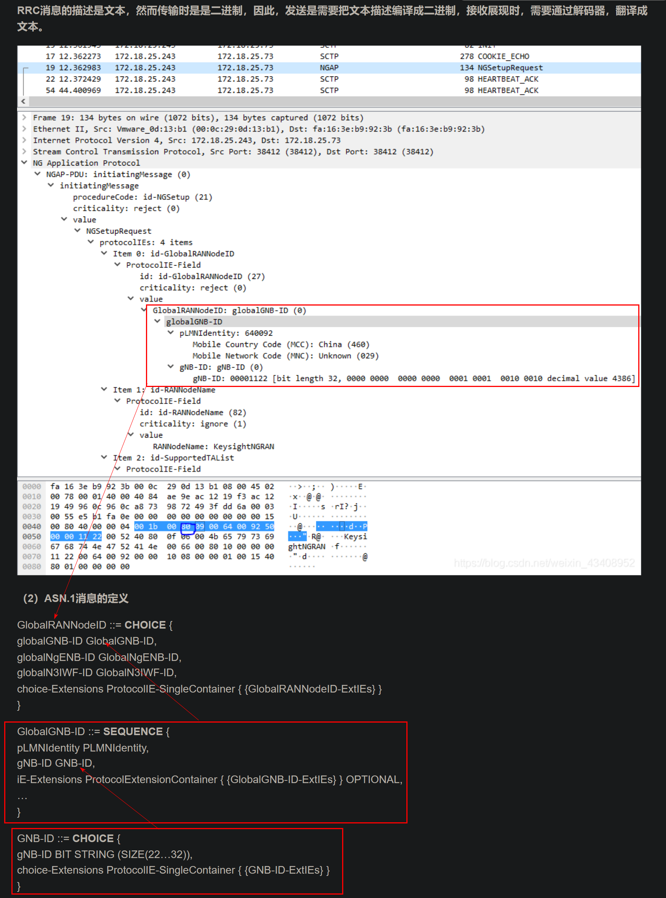


## RRC信令消息类型
- 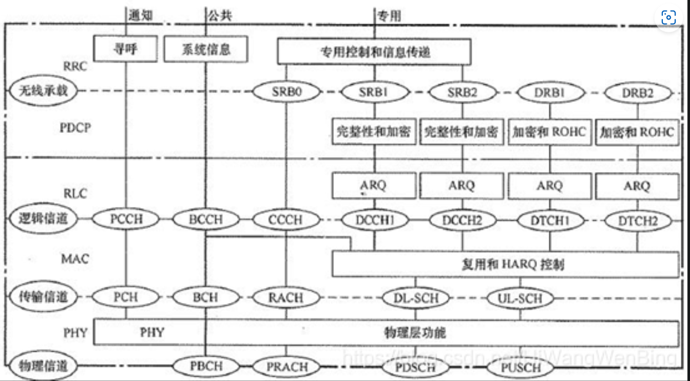
- 小区级系统信令消息--MIB与SIB
  - 主要用于UE获得小区相关系统消息，系统信息可分为MIB （ MasterInformationBlock）和多个 SIB （SystemInformationBlock）。每个系统信息包含了与某个功能相关的一系列参数集合。
  - 参考资料：https://blog.csdn.net/dxpqxb/article/details/104062886
  - 上述系统消息可以分为
    - 来自接入网基站的接入层（AS）相关系统信息的广播。
    - 来自核心网和接入网的寻呼
- 小区级系统寻呼消息
- ***用户与基站之间的专有信令消息 攻击面***
  - 随机接入消息
  - 建立、维护和释放UE与E-UTRAN之间的RRC连接，包括UE与E-UTRAN之间临时标识的分配和用于RRC连接的信令无线承载的配置。
  - 移动性功能包括：UE测量上报和对小区间、RAT间移动性上报的控制；切换；UE小区选择和重选，以及对小区选择和重选的控制；切换时上下文的转移。
  - 密钥管理的安全功能。
  - MBMS业务的通知，MBMS无线承载的建立、配置和维护。
  - QoS管理功能。
- 用户与核心网之间的专有信令消息
  - 来自核心网非接入层（NAS）相关系统信息的广播  
  - 手机与核心网NAS消息在空口的传输（在有线传输网backhual中是通过S1-AP协议进行传输的）
- 下一章中详细探讨
## RRC主要的流程
- 8.1 小区建立的流程
- 8.2 UE接入的流程
- 8.3 UE在线状态下的流程
- 下一章中详细探讨

# https://blog.csdn.net/HiWangWenBing/article/details/114755138
- [4G&5G专题-61]：L3 RRC层 - MIB、SIB、寻呼消息详解_5gmib是什么-CSDN博客 (2024_1_18 08_43_23).html
- 重要资料
- RRC协议有两个大的基本功能
  - 1.在基站和手机之间传递L3层无线资源控制信令, 即接入层信令AS，比如为终端建立无线数据承载，
  - 2.帮助手机和核心网信令网关在空口传递"非接入层信令NAS"。也就是说NAS消息是承载在RRC消息中在空口传输的，NAS消息在有线传输网是承载在S1AP消息中。
- 四种RRC消息类型
  - （1）小区级系统信令消息--MIB与SIB
  - （2）小区级系统寻呼消息
  - （3）用户与基站之间的专有信令消息
  - （4）用户与核心网之间的专有信令消息
- 小区级系统信令消息--MIB与SIB
  - 目标是让UE获取到小区的系统信息，
  - 系统信息可分为MIB （ MasterInformationBlock）和多个 SIB （SystemInformationBlock）。
  - 小区会不断的广播这些系统信息，有三种类型的RRC消息用于传输系统信息
  - 每种消息的具体含义与格式见原文章
- 文章中给出了LTE MIB、NR MIB消息的格式与含义
- 文中给出LET SIB1消息的格式与对应消息详解
```c
//ASN.1的总结构
SystemInformationBlockType1::=      SEQUENCE {
       cellAccessRelatedInfo                SEQUENCE { 
                                          plmn-IdentityList                       PLMN-IdentityList,    --  网络的 PLMN 识别号
                                          trackingAreaCode                     TrackingAreaCode,  --  跟踪区域码
                                          cellIdentity                                 CellIdentity,              -- 小区标识
                                          cellBarred                                  ENUMERATED{barred, notBarred},--小区是否使能
                                          intraFreqReselection                 ENUMERATED {allowed,notAllowed}, --同频切换是否允许
                                           csg-Indication                           BOOLEAN,             -- 闭合用户组
                                           csg-Identity                         CSG-Identity           OPTIONAL --  --闭合用户组id
      },
      cellSelectionInfo                         SEQUENCE {
                                          q-RxLevMin                               Q-RxLevMin,                                   -- 接入小区允许的最小接收电平
                                          q-RxLevMinOffset                     INTEGER (1..8)             OPTIONAL -- 接入小区允许的最小接收电平 偏移
     },
     p-Max                                      P-Max                           OPTIONAL,              -- 小区的最大传输功率
     freqBandIndicator                   INTEGER(1..64),                                            -- 小区频带指示，如Band46，Band4等
     schedulingInfoList                   SchedulingInfoList,                                         -- 其他SIB消息的调度信息
     tdd-Config                               TDD-Config                      OPTIONAL,            -- TDD特有的配置信息
     si-WindowLength                          ENUMERATED { ms1,ms2, ms5, ms10, ms15, ms20, ms40},  --SI消息的发送窗口的长度
     systemInfoValueTag                   INTEGER (0..31),                                         -- 系统信息
     nonCriticalExtension                 SystemInformationBlockType1-v890-IEs                   OPTIONAL -- 扩展信息
}

//ASN.1的子结构
SystemInformationBlockType1-v890-IEs::=  SEQUENCE {
     lateNonCriticalExtension                 OCTET STRING           OPTIONAL,                               
     nonCriticalExtension                     SystemInformationBlockType1-v920-IEs OPTIONAL
}
SystemInformationBlockType1-v920-IEs::= SEQUENCE {
     ims-EmergencySupport-r9              ENUMERATED {true, false}               OPTIONAL,     -- 
     cellSelectionInfo-v920               CellSelectionInfo-v920               OPTIONAL,     --
     nonCriticalExtension                 SEQUENCE {}                              OPTIONAL --
}
PLMN-IdentityList::=                    SEQUENCE (SIZE(1..6)) OF PLMN-IdentityInfo
PLMN-IdentityInfo::=                    SEQUENCE {
     plmn-Identity                            PLMN-Identity,
     cellReservedForOperatorUse               ENUMERATED {reserved,notReserved}
}
--SI调度
SchedulingInfoList::= SEQUENCE (SIZE (1..maxSI-Message)) OF SchedulingInfo
SchedulingInfo::= SEQUENCE {
     si-Periodicity                           ENUMERATED { rf8,rf16, rf32, rf64, rf128, rf256, rf512},
     sib-MappingInfo                      SIB-MappingInfo
}
SIB-MappingInfo::= SEQUENCE (SIZE (0..maxSIB-1)) OF SIB-Type
SIB-Type::=                         ENUMERATED {
                                              sibType3,sibType4, sibType5, sibType6,
                                              sibType7,sibType8, sibType9, sibType10,
                                              sibType11,sibType12-v920, sibType13-v920, spare5,
                                              spare4,spare3, spare2, spare1, ...}
CellSelectionInfo-v920::=           SEQUENCE {
     q-QualMin-r9                         Q-QualMin-r9,
     q-QualMinOffset-r9                INTEGER (1..8)                           OPTIONAL -- Need OP
}

```
- 文中给出SIB2-SIB11消息的具体功能
- 文中给出寻呼消息的格式，该消息也可以作为一个攻击面

# https://blog.csdn.net/HiWangWenBing/article/details/126238674
- [4G_5G_6G专题基础-157]_ 无线数据承载DRB与无线信令承载SRB_5g 什么是bearer-CSDN博客 (2024_1_18 10_07_02).html
- 感觉这一部分更多是概念性的东西
- 注意：协议栈中本身并没有无线承载层，无线承载只是各层协议栈在L3层的服务访问点。
- Radio Bearer (RB)是基站为UE分配不同层协议实体及配置的总称，包括PDCP协议实体、RLC协议实体、MAC协议实体和PHY分配的一系列资源等。
- RB是Uu接口连接eNodeB和UE的通道（包括PHY、MAC、RLC和PDCP），任何在Uu接口上传输的数据都要经过RB。
- RB包括SRB和DRB，SRB是系统的信令消息实际传输的通道，DRB是用户数据实际传输的通道。SRB0是缺省承载，UE在RRC_IDLE时该承载已经存在。
## 理解无线承载的概念
- 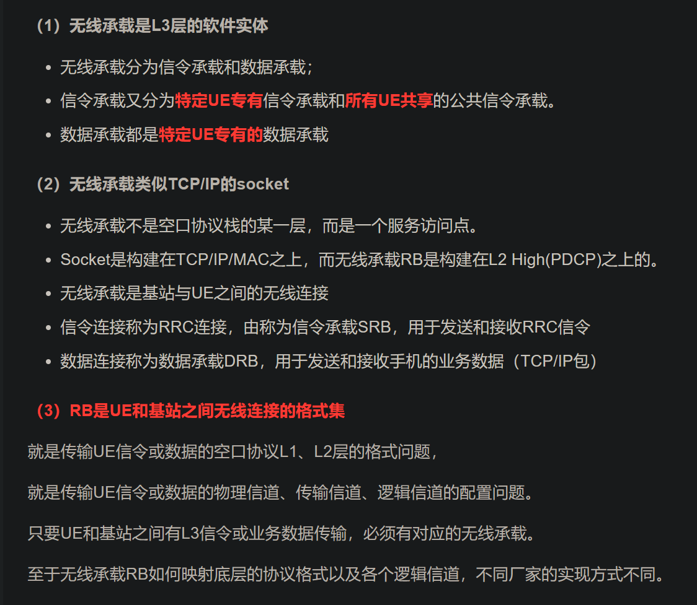
## RRC是管理RB的协议实体
- 通过RRC信令连接的RRC消息的交互完成RB的建立、修改以及释放等功能。
- 通俗的讲，RRC信令连接指的是UE和eNodeB之间建立的SRBx, 因为标准规定SRB0是不需要通过信令建立的，UE在RRC_IDLE状态时就可以获得SRB0的配置和资源，可以直接使用SBR0发送信令。
- ***系统中业务发起的过程，就是通过SRB0上传输信令建立SRB1, SRB1建立之后UE就进入RRC_Connected状态；*** 
- 进一步，通过SRB1信令承载传输信令建立SRB2用来传输NAS信令；
- 利用SRB1传输信令建立DRB来传输用户数据，在业务过程中通过SRB1进行管理；
- 当业务结束后，SRB1上传输的信令可以将所有的DRB、SRB释放，使得UE进入到RRC_IDLE状态，在需要时UE唯一可以直接使用的资源就是SRB0，而且需要在完成随机接入之后进行。
## LTE中的无线承载
- 根据LTE中的不同网元与ue的交互阶段，可以将无线承载划分为多个阶段
- 在LTE系统中，一个UE到一个P-GW(PDN-Gateway)之间，具有相同QoS待遇的业务流称为一个EPS (Evolved Packet System)承载
- EPS承载中UE到eNodeB空口之间的一段称为无线承载RB
- eNodeB到S-GW (ServingGateway)之间的一段称为S1承载。
- 无线承载与S1 承载统称为E-RAB （Evolved RadioAccess Bearer）即Uu口和S1承载合称。无线承载根据承载的内容不同分为SRB (Signaling Radio Bearer)和DRB (Data RadioBearer)。
- SRB承载控制面（信令）数据，根据承载的信令不同分为以下三类SRB：
  - 1. SRB0 承载RRC连接建立之前的RRC信令， 通过CCCH逻辑信道传输， 在RLC层采用TM模式；
  - 2. SRB1 承载RRC信令(可能携带一些NAS信令)和SRB2 建立之前的NAS信令， 通过DCCH逻辑信道传输，在RLC层采用AM模式；
  - 3. SRB2 承载NAS信令，通过DCCH逻辑信道传输，在RLC层采用AM模式。SRB2 优先级低于SRB1，在安全模式完成后才能建立SRB2；
- DRB承载用户面数据，根据QoS不同，UE与eNodeB之间可同时最多建立8个DRB。
## 5G中的无线承载
  - 5G NR取消了4G LTE的端到端的EPS承载，取而代之的是端到端的Qos Flow
  - Qos Flow与EPS承载最重要的区别是，Qos Flow无须端到端的信令，就可以动态创建。
  - Qos Flow被切成两段：无线空口侧的DRB承载和核心网侧的Qos Flow
  - Qos Flow与DRB承载可以通过SDAP协议进行动态映射, 这种动态映射，提升了QosFlow创建的效率，避免了LTE需要通过端到端的信令才能创建的低效
## 4G 5G的区别 这部分未看太懂
## 无线承载的类型
- 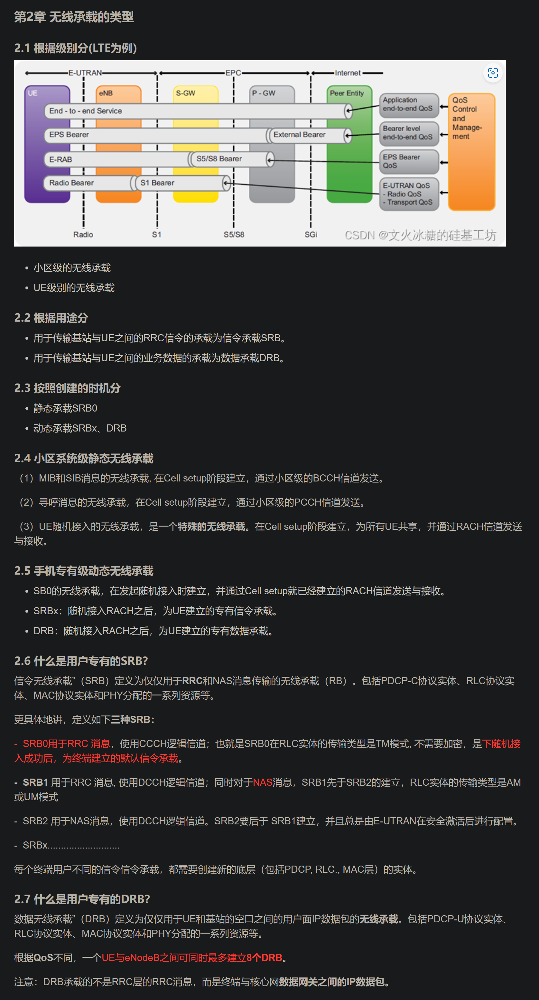
## 无线承载的建立流程
- 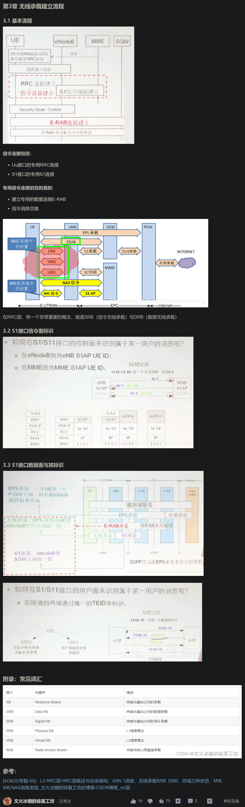


# 相关资料
- https://blog.csdn.net/hiwangwenbing/category_10692763.html
- 该专栏还有其他层级是协议栈可以学习（已经全部学习完毕）
