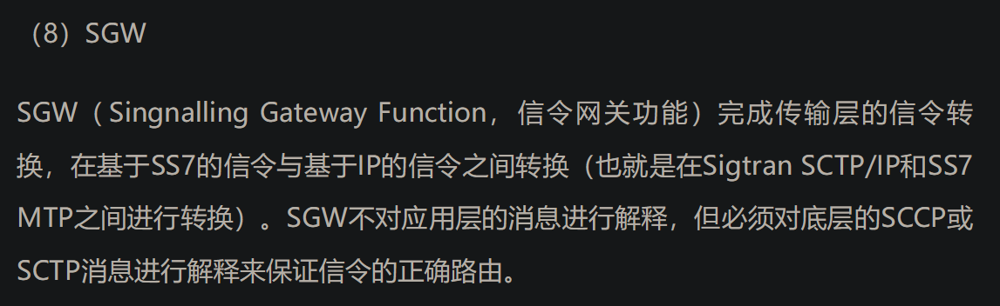
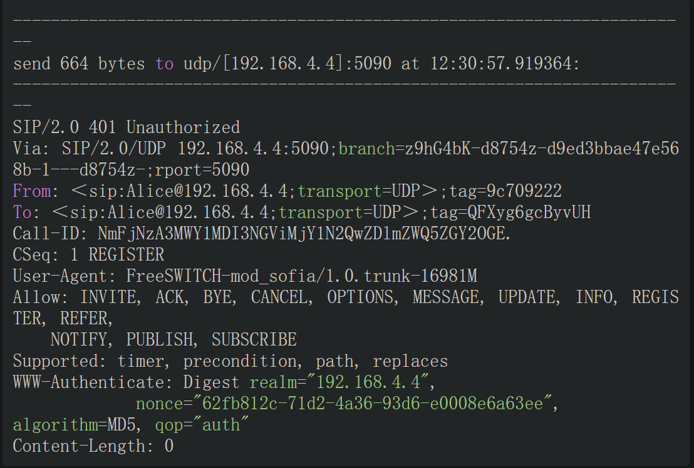
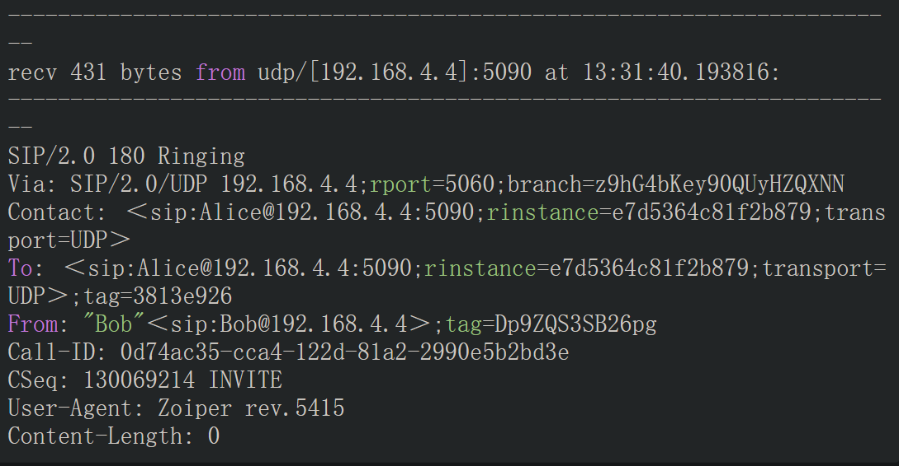

# 第一章PSTN与VoIP基础
- VoIP的英文原意是Voice Over IP，即承载于IP网上的语音通信，VoIP技术使我们可以在网上打电话。
- PSTN（Public Switched Telephone Network，公共交换电话网）就是我们日常打电话所使用的电话网络
## PSTN起源与发展
- 多个交换机通过中继线相连，出现了现代意义上的PSTN网络
- 专门用于移动电话交换的通信网络称为移动网，而原来的程控交换网则称为固定电话网，简称固网
- ***移动网就是在普通固网的基础上增加了许多基站（Base Station，可以简单理解为天线），***并增加了归属位置寄存器（Home Location Register，HLR）和拜访位置寄存器（Visitor Location Register，VLR），以记录用户的位置（在哪个天线的覆盖范围内）、支持异地漫游等。移动交换中心称为MSC（Mobile Switch Center）。
- 随着分组交换技术的成熟及因特网的发展，人们认识到了 ***将原始的基于电路交换的语音网络与基于分组交换的因特网络进行融合（即语音通信和数据通信相结合）*** 的必要性，因此一个称为NGN（Next Generation Network）的概念被提了出来 
- 人们提出了各种NGN的解决方案，但最终基本上都统一到了IMS（IP Multimedia Subsystem）技术[插图]。IMS运行于标准的IP网络上，使用一种基于第三方伙伴计划（3GPP）的SIP标准的VoIP实现方式。IMS的目标不仅是在现有网络基础上提供新的业务，它还要能提供在未来的因特网上能够承载的所有的业务。***出现了，关键的概念，ims!***
- IMS属于核心交换层的技术，它全部基于IP网络，但在接入层，目前的语音大部分还是基于电路接入的方式接入的，因此，这就要求在一定时间内IMS在接入层要继续兼容电路接入
- 无线通讯领域，对高速ip网络需求迫切，最新的3G[插图]、4G[插图]技术就是应此要求而产生的
- 相对于1g 2g，3g主要是支持高速ip数据传输，4g数据是3g的延伸，其实速率达到一定程度，即可被称为4g
- 要完全取消低效的电路传输及电路交换，而全部集中到IP通信上来，也就催生了一个新的无线通信标准LTE
- 关于通信网络的演进，简单来说，在无线方面体现为从GSM/CDMA/UMTS等向LTE发展，在核心网方面则体现为从电路交换向IMS发展
- LTE标准不再支持用于支撑GSM、UMTS和CDMA2000网络下语音传输的电路交换技术，它只能进行全IP网络下的分组交换，因此随着LTE网络的部署，运营商需选择VoLTE（）、CSFB（）、SVLTE（）、OTT（）等方法之一解决LTE网络中的语音传输问题
  - 关于VoLTE，即基于IMS，语音以数据流形式在lte中传输，不需要原有的电路交换网络，volte即lte网络下的voip业务
    - 
  - 关于CSFB，即lte只用于数据传输，语音拨号或呼入时仍使用原有电路交换网络
    - 
  - 关于SVLTE 即同时支持lte和原有电路交换网络的终端，成本高
    - 
  - 关于OTT 将语音服务完全建立在网上，类似skype
    - 
- 在网络建设初期大部分运营商都选择使用CSFB方式建设网络，这种方式便于快速部署系统。当然，CSFB只是过渡时期的临时解决方案。从长远来看，VoLTE及其他几种方案更符合未来网络的发展方向
## 电话相关技术
- 现行的电话网中采用E.164号码格式。
- 模拟信号与数字信号
  - 模拟（Analog）量是连续的变化的量，如温度、声音等。早期的电话网也是基于模拟交换的。会引入噪声
  - 数字（Digital）信号是不连续的（离散的），是按一定的时间间隔（单位时间内抽样的次数称为频率）对模拟信号进行抽样（见图1-6）得出的一些离散值。然后通过量化和编码过程就可将这些离散值变成数字信号
- PCM（Pulse Code Modulation）的全称是脉冲编码调制。它是一种通用的将模拟信号转换成以0和1表示的数字信号的方法。
- 局间中继与电路复用技术
- 我国电话网结构
  - 我国的电话网由本地网与长途网组成，并通过国际交换中心进入国际电话网。
  - 技术发展很快，为响应国家“光进铜退”[插图]的号召，现在已经实现了直接光纤到户，也就是说很快全网都能IP化了
- 在我国的移动网络中，大量部署了IMS。IMS具有组网灵活的优点，但涉及的网元和基本概念很多

## 信令
- 用户设备（如话机）与端局交换机之间，以及交换机与交换机之间需要进行通信。这些通信所包含的信息有（但不限于）用户、中继线状态、主叫号码、被叫号码、中继路由的选择等。我们把这些消息称为信令（Signaling）
- 用户信令：从用户终端（通常是话机）到端局交换机之间经常需要传送一些控制信息，如用户摘机、挂机、拨号、主叫号码显示等，这些信息称为用户线信令。用户线信令可以通过模拟或数字信号传递。
- 局间信令：交换机与交换机之间也需要传送控制信号，用于话路的建立、释放等，这些控制信号就称为局间信令。局间信令主要在局间中继上传送，传送局间信令的电路称为信令链路
  - 目前在传统的PSTN网络中常见的局间信令有ISDN PRI（Primary Rate Interface，基群速率接口）信令和七号信令
  - 七号信令主要在运营商的设备上使用，而运行商与用户设备（如PBX）一般使用PRI信令对接。
  - 七号信令（Signaling System No.7，SS7）是我国目前使用的主要信令方式，用于局间通信。我国的电话网络中有专门的七号信令网。
  - 一个七号信令支持的固定电话通话流程
    - 
    - 
    - 

### H.323与SIP信令
- H.323与SIP属于VoIP领域的通信信令，它们适用于用户线信令和局间信令，由于IP终端比普通话机更加智能，因此这些信令在用户线信令及局间信令使用方式上已没有太大区别。
- H.323是ITU多媒体通信系列标准H.32x的一部分，该系列标准使得在现有通信网络上进行视频会议成为可能
- SIP（Session Initiation Protocol，会话发起协议）是由IETF（Interne工程任务组）提出的IP电话信令协议。正像其名字所隐含的那样，SIP用于发起会话，它能控制多个参与者参加的多媒体会话的建立和终结，并能动态调整和修改会话属性，如会话带宽要求、传输的媒体类型（语音、视频和数据等）、媒体的编解码格式、对组播和单播的支持等。
- H.323和SIP设计之初都是作为多媒体通信的应用层控制（信令）协议，目前一般用于IP电话。它们能实现的信令功能基本相同，也都利用RTP作为媒体传输的协议
- H.323是由国际电信联盟提出来的，它企图把IP电话当作众所周知的传统电话，只是传输方式由电路交换变成了分组交换，就如同模拟传输变成数字传输、同轴电缆传输变成了光纤传输
- 而SIP侧重于将IP电话作为Internet上的一个应用，较其他应用（如FTP，E-mail等）增加了信令和QoS的要求。
- sip与H.323之间的区别
  - 

## 媒体
- 信令主要传输一些控制信号，而通信双方需要听到的是对方的语音数据，这些语音数据就称为媒体（Media）
- 媒体类型可能是语音、视频、传输等
- 在SIP通信中，除文字外，媒体都是在RTP协议中传输的。由于媒体一般都是持续传输的，因此又称RTP流。
- 以张三坐火车为例子，在SIP通信中，SIP相当于这里的火车控制信号，RTP流中的语音数据相当于很多张三，他们被RTP又“包”了一层，***通过以太网承载到达目的地。***
  

## 电路交换与分组交换
- 传统的电话都是基于电路交换的。电路交换在通信之前要在通信双方之间建立一条被双方独占的物理通路（由通信双方之间的交换设备和链路逐段连接而成），
- 报文交换以报文作为数据交换的单位，携带目标地址、源地址等信息，在节点间采用存储转发的方式，不需要建立专门的通信线路，可以大大提高通信线路的利用率。分组交换是报文交换的特殊情形
  - IP交换采用的就是分组交换的方式。它仍采用存储转发的传输方式，但将一个长报文先分割为若干个较短的分组，然后把这些分组（携带源、目的地址和编号信息）逐个地发送出去

## VoIP
- IP电话（Voice over Internet Protocol，VoIP，又称宽带电话或网络电话）是一种通过互联网或其他使用IP技术的网络来实现的新型电话通信。（使用ip网络实现语音通讯）
- IP电话也开始应用于固网通信    
- VoIP呼叫控制协议主要有SIP、H.323、MGCP与H.248/MEGACO等。

## IMS
- IMS的全称是IP多媒体子系统（IP Multimedia Subsystem），它是一个基于IP网提供语音及多媒体业务的网络体系架构
- 从目前来看，IMS是独立于接入网技术的，尽管它与底层传输功能有着很多联系。
- 从另外一个角度看，IMS实际上是IP网上的一个应用系统。IP网的相关技术标准主要由IETF制定，包括应用层（如Email（POP3、SMTP）、文件传输（FTP）、网页浏览（HTTP）等）的相关协议标准。IETF负责制定了与实时应用（Real-time Applications）相关的协议标准，包括SIP、RTP等。IMS使用的基本都是IETF相关的协议标准（SIP、Diameter等），
- IP多媒体的全套解决方案是由终端、GERAN（GSM EDGE Radio Access Network，GSM/EDGE无线通信网络）或UTRAN（UMTS Terrestrial Radio Access Network，UMTS陆地无线接入网）、GPRS核心网和IP多媒体核心网子系统的一些特殊的功能单元来支持的。这些功能单元包括呼叫会话控制功能（CSCF）、媒体网关控制功能（MGCF）、IP多媒体网关功能（IM-MGW）、多媒体资源功能控制器（MRFC）、多媒体资源功能处理器（MRFP）、签约定位功能（SLF）、出口网关控制功能（BGCF）、应用服务器（AS）、信令网关功能（SGW）等。
- IMS核心网络架构
  - 
- IMS的特点
  - 
  - 
- IMS核心网元
  - IP多媒体子系统，可以完成呼叫的发起、保持、释放等功能。另外，它还要对多媒体进行转换控制以及对多媒体业务提供支持，所以包含更多的功能实体来分别完成不同的功能。
  - 
  - 
  - 
  - 
  - 
  - 
  - 
  - 
  - 
  - 
- SIP协议的参考点
  - 
  - 但IMS本身作为SIP协议的最大用户仍有了解的价值。通过对后面章节的学习，读者就能更深入了解FreeSWITCH可以在IMS网络中充当什么角色，进而更容易理解通信网的总体架构和设计思想

# 第二章 PSTN、PBX及呼叫中心业务
- 主要关于传统的电话网及交换设备

# 第三章 初识FreeSWITCH
- FreeSWITCH是一个开源的电话交换平台。官方给它的定义是——世界上第一个跨平台的、伸缩性极好的、免费的、多协议的电话软交换平台[插图]
- FreeSWITCH支持SIP、H323、Skype、Google Talk等多种通信协议，并能很容易地与各种开源的PBX系统（如sipXecs、Call Weaver、Bayonne、YATE及Asterisk等）通信，它也可以与商用的交换系统（如华为、中兴的交换机或思科、Avaya的交换机等）互通，如图3-1所示。
- FreeSWITCH可以用作一个简单的交换引擎、一个PBX、一个媒体网关或媒体支持IVR的服务器，或在运营商的IMS网络中担当CSCF或Application Server等。
- 从技术上讲，FreeSWITCH是一个B2BUA[插图]，它作为一个背靠背的用户代理用来帮助通信的双方进行实时的语音视频通信
- 

# 第五章 FreeSWITCH架构
# 第六章 拨号计划
# 第七章 sip协议 大部分内容上一本书中有了
- SIP协议是FreeSWITCH的核心协议
- 会话初始协议（Session Initiation Protocol）是一个控制发起、修改和终结交互式多媒体会话的信令协议。它是由IETF（Internet Engineering Task Force，Internet工程任务组）在RFC 2543[插图]中定义的，最早发布于1999年3月，后来在2002年6月又发布了一个新的标准RFC 3261[插图]
- 
- SIP是一个对等的协议，类似P2P，双方都可以发起请求
- 还有一种特殊的UA称为背靠背用户代理（Back-to-Back UA，B2BUA）。需要指出，其实RFC 3261并没有定义B2BUA的功能，它只是一对UAS和UAC的串联。FreeSWITCH就是一个典型的B2BUA，事实上，B2BUA的概念会贯穿本书始终，所以在此我们需要多花一点笔墨来解释。
- 为了理解B2BUA，我们来看上述故事的另一个版本。M和W是一对恩爱夫妻。M认识Bob而W认识Alice。M和W有意撮合两个年轻人，但见面时由于两人太腼腆而互相没留电话号码。事后Bob想知道Alice对他感觉如何，于是打电话问M，M不认识Alice，就转身问爱人W（注意这次M没有直接把W的电话给Bob），W紧接着打电话给Alice，Alice说印象还不错，W就把这句话告诉M，M又转过身告诉Bob。这样，M和W一个面向Bob，一个对着Alice，他们两个合在一起，称为B2BUA
- 这里，Bob是UAC，因为他发起请求；M是UAS，因为他接受Bob的请求并为他服务；我们把M和W看做一个整体，他们背靠着背（站着、坐着、躺着都行），W是UAC，因为她又向Alice发起了请求，最后Alice是UAS。其实这里UAC和UAS的概念也不是那么重要，重要的是要理解这个背靠背的用户代理。因为事情还没有完，Bob一听说Alice对他印象还不错，开心得不得了，便想请抽空请Alice吃饭，他将这一想法告诉M，M告诉W，W又告诉Alice。然后Alice问去哪里吃啊，W又只好问M，M再问Bob……在这对年轻人挂断电话之前，M和W只能“背对背”不停地工作，如图7-2所示。
- 
- 在SIP世界中，所有UA都是平等的。具体到实物，则M和W就组成了实现软交换功能的交换机，它们对外说的语言是SIP，而在内部它们使用自己家的语言沟通。Bob和Alice就分别成了我们常见的软电话，或者硬件的SIP话机。
- SBC
  - 
## sip基本方法和头域
- 
- 

## sip注册
- 通常的注册流程是，Alice向FreeSWITCH发起注册（REGISTER）请求，FreeSWITCH返回401消息对Alice发起Challenge（挑战），Alice将自己的用户名密码信息与收到的Challenge信息进行计算，并将计算结果以加密的形式附加到下一个REGISTER请求上，重新发起注册，FreeSWITCH收到后对本地数据库中保存的Alice的信息使用同样的算法进行计算和加密，并将其与Alice发过来的计算结果相比较。如果计算结果相匹配，则认证通过，Alice便可以正常注册。交互流程如
- 
- 发起注册的首条消息 alice发出，freeswitch接收
  - 
- 该消息具体解析如下
  - ●第1行的REGISTER表示这是一条注册消息。
  - ●第2行的Via是SIP的消息路由，如果SIP经过好多代理服务器转发，则会有多条Via记录。
  - ●第3行，Max-forwards指出消息最多可以经过多少次转发，主要是为了防止产生死循环。
  - ●第4行，Contact是Alice的联系地址，即相当于Alice家的地址，本例中FreeSWITCH应该能在192.168.4.4这台机器上的5090端口找到她。
  - ●第5和第6行的To和From表示以Alice注册。
  - ●第7行，Call-ID是本次SIP会话（Session）的标志。
  - ●第8行，CSeq是一个序号，由于UDP是不可靠的协议，在不可靠的网络上可能丢包，所以有些包需要重发，该序号则可以防止重发引起的消息重复。
  - ●第9行，Expires是说明本次注册的有效期，单位是秒。在本例中，Alice的注册信息会在一小时后失效，它应该在半小时内再次向FreeSWITCH注册，以免FreeSWITCH“忘记”她。实际上，大部分UA的实现都会在几十秒内重新发一次注册请求，这在NAT的网络中有助于保持连接。
  - ●第10行，Allow是说明Alice的UA所能支持的功能，某些UA功能丰富，而某些UA仅有有限的功能。
  - ●第11行，User-Agent是UA的型号。
  - ●第12行，Allow-Events说明她允许哪些事件通知。
  - ●第13行，Content-Length是消息正文（Body）的长度，在这里只有消息头（Header），没有消息正文，因此长度为0。
- freeswitch返回的401消息
  - 401消息表示未认证，它是FreeSWITCH对Alice请求的响应。各消息头的含义基本上与请求中的含义是一样的。其中，“CSeq:1 REGISTER”表示它是针对刚刚收到的CSeq为1的REGISTER请求的响应。同时，它在本端生成一个认证摘要（WWW-Authenticate），一起发送给Alice。
  - 
- Alice收到带有摘要的401后，重新发起注册请求，这一次加上了根据收到的摘要和她自己的用户名密码生成的认证信息（Authorization头）。同时，下面你可能也会注意到，CSeq序号变成了2。下面是重发的注册请求信息：
  - 
- FreeSWITCH收到带有认证的注册消息后，核实Alice身份，如果认证通过，则向Alice回应200 OK消息，表示注册成功了。返回的200 OK消息如下：
  - 
- 如果认证失败（可能是Alice的密码填错了），则回应403 Forbidden或其他失败消息，消息内容如下：
  - 
- 在整个注册过程中，Alice的密码是不会直接在SIP消息中传送的
- 如果Alice注册成功，则FreeSWITCH会将Alice在SIP消息中的联系地址（Contact字段）记录下来。以后如果有人呼叫Alice，FreeSWITCH就可以向该联系地址发送SIP消息以建立呼叫。
## sip呼叫
### UA间直接呼叫
- SIP的UA都是平等的，如果一方知道另一方的地址，就可以通信
- 在笔者的机器上，启动了两个软电话（UA），一个是Bob的X-Lite（左），另一个是Alice的Zoiper。它们的IP地址都是192.168.4.4，而端口号分别是26000和5090，当Bob呼叫Alice时，它只需直接呼叫Alice的SIP地址sip:Alice@192.168.4.4:5090
- 
- 详细的呼叫协议
  - 
- 首先Bob向Alice发送INVITE消息请求建立SIP会话。Alice的UA回100 Trying消息，意思是说我收到你的请求了，先等一会儿。接着Alice的电话开始振铃，并给对方回消息180 Ringing，说我这边已经振铃了，Alice听到后可能一会就过来接电话。Bob的UA收到该消息后即可以播放回铃音，以提示Bob对方的话机正在振铃。接着Alice接了电话，她发送200 OK消息给Bob，该消息是对INVITE消息的最终响应（所有大于1的状态码都是最终响应），而先前的100和180消息都是临时状态，只是表明呼叫进展的情况。Bob收到200后向Alice回复ACK证实消息。INVITE-200-ACK完成“三次握手”的操作，保证了呼叫可以正常进行。其中，INVITE-1xx-200等消息合在一起称为一个事务（Transaction）。这时候Bob已经在跟Alice通话了，他们通话的内容（语音数据）是在SIP之外的RTP包中传递的，我们后面再详细讨论RTP。
- 最后，Alice挂断电话，向Bob发送BYE消息，Bob收到BYE后回送200 OK，通话完毕。其中BYE和200 OK也是一个事务，而上面的所有消息，则称为一个对话（Dialog，也译作会话）
- 上面描述了一个最简单的SIP呼叫流程。实际上，SIP还有其他一些消息。SIP消息大致可分为请求和响应两类。请求由UAC发出，到达UAS后，UAS回送响应消息。某些响应消息需要证实（ACK），以完成三次握手。其中请求消息包括基本的INVITE、ACK、OPTIOS、BYE、CANCEL、REGISTER，以及re-INVITE、PRACK、SUBSCRIBE、NOTIFY、UPDATE、MESSAGE、REFER等一些扩展。而响应消息则都包含一个状态码和一个原因短语（Reason Phrase）。与HTTP响应类似，状态码由三位数字组成：●1xx组的响应为临时状态，表明呼叫进展的情况；●2xx表明请求已被成功收到、理解和接受；●3xx为重定向，表明SIP请求需要转向到另一个UAS处理；●4xx表明请求失败，这种失败一般是由客户端或网络引起的，如密码错误、空号等，客户端应该重新修改请求，然后重发；●5xx为服务器内部错误，表明服务器出错，不能响应合法的请求；●6xx为全局性错误，如600 Busy Everywhere。状态码后面跟着一个原因短语（如200 OK中的OK及刚才讲到的BusyEverywhere），它是对前面的状态码的一个简单解释。
### 通过B2BUA呼叫
- Bob和Alice可以会经常改变位置，那么它们的SIP地址也会相应改变，并且，如果他们之中有一个或两个处于NAT的网络中时，直接通信就更困难了。所以，他们通常会借助于一个服务器来实现通信。这样Bob和Alice通过注册到服务器上即可获得一个服务器上的公有SIP地址。注册服务器的地址一般是不变的，因此他们的SIP地址就不会发生变化，他们也就总是能够进行通信了。
- 作为例子，我们让他们两个都注册到FreeSWITCH上。上面已经说过，FreeSWITCH监听的端口是SIP默认的5060端口。Bob和Alice注册后，他们分别获得了一个服务器的地址（SIP URI）：sip:Bob@192.168.4.4和sip:Alice@192.168.4.4（默认的端口号5060可以省略）。***注意此时名称是用户的，但是ip是服务器的***
- 如果Bob只是发起呼叫而不接收呼叫，他并不需要向FreeSWITCH注册（有些软交换服务器规定需要先注册才能发起呼叫，但SIP是不强制这么做的）。
- 发送消息的具体过程
  - Bob向FreeSWITCH发送INVITE消息，请求建立一个呼叫，发送的INVITE消息如下：上面的消息中省略了SDP的内容
  - 
  - Bob的UAC通过INVITE消息向FreeSWITCH发起请求。Bob的UAC用的是X-Lite（User-Agent），它运行在端口26000上（由Contact字段给出。实际上，它默认的端口也是5060，但由于在笔者的实验环境下它与FreeSWITCH运行在一台机器上，5060端口已被FreeSWITCH占用，因此需要选择另一个端口）。其中，From为主叫用户的地址，To为被叫用户的地址。此时FreeSWITCH作为一个UAS接受请求并进行响应
  - 但在此之前，它先通过100 Trying消息通知Bob它已经收到了他的请求
  - 
  - FreeSWITCH通过100 Trying消息告诉Bob：“我已经收到你的消息了，别着急，我正在设法联系Alice……”，该消息称为呼叫进展消息。但就在此时，FreeSWITCH发现它还不认识Bob，即它还不确定Bob是否有权通过它发起呼叫，因而它需要确认Bob的身份。在SIP中，它通过回送带有Digest验证信息（Proxy-Authenticate头）的407消息来通知Bob（类似于注册流程中的401），
  - 
  - Bob回送ACK证实消息向FreeSWITCH证实已收到认证要求，至此，从INVITE开始发起的事务就结束了。下面是FreeSWITCH收到的ACK消息
  - 
  - Bob重新发送INVITE请求。这次还附带了Proxy-Authorization验证信息，该信息是根据上次收到的Proxy-Authenticate中的信息与Bob提供的认证用户名和密码计算出的结果。该INVITE重新开始了一个事务
  - 
  - FreeSWITCH收到INVITE请求后，重新回送100 Trying，通知Bob呼叫进展情况
  - 
  - 然后FreeSWITCH对Bob发来的认证信息进行验证，发现Bob是本地的授权用户，因而呼叫可以继续进行
  - 至此，Bob与FreeSWITCH之间的通信已经初步建立，这种通信的逻辑通道称为一个Channel。该Channel是由Bob的UA和FreeSWITCH的一个UA构成的，我们称之为FreeSWITCH的一条腿，又称a-leg
  - 呼叫进入路由阶段，FreeSWITCH根据路由，发现Bob要呼叫Alice，由于FreeSWITCH是一个B2BUA，因而它需要要建立另外一条腿去呼叫Alice，与a-leg相对，这条新腿就称为b-leg
  - FreeSWITCH通过查找本地数据库，得到了Alice的位置（Alice的联系地址，Alice必须事先已经向它注册），接着启动一个UA（用作UAC），向Alice发送一个新的INVITE消息，内容如下（注意，这完全是一个新的事务，理论上与a-leg没有任何关系
  - 
  - 可以看到，该INVITE的Call-ID与上一次INVITE消息中的不同，说明这是另一个SIP对话（Dialogue）。另外，消息中还多了一个Remote-Party-ID，它主要是用来支持主叫号码显示功能（俗称来电显示，有了这个功能，Alice的话机上就可以显示Bob的号码，知道是Bob打来的）。与普通的POTS通话不同，在SIP通话话中，不仅能显示电话号码（这里是Bob），还能显示一个可选的名字（Bob）。这也说明了FreeSWITCH这个B2BUA本身是一个整体，它虽然是以一个单独的UA呼叫Alice，但还是跟负责Bob的那个UA有联系——就是这种背靠背的串联关系，使得Alice这一侧的Channel（b-leg）知道Bob那一侧（a-leg）的一些信息（如这里的主叫号码）。
  - 同理，Alice会回送100 Trying消息通知FreeSWITCH它已经正常接收到该INVITE请求，正准备进行下一步处理。消息内容如下：
  - 
  - 虽然我们曾经说过，所有的SIP UA都是对等的。但Alice的身份与FreeSWITCH不同，它作为一个被叫用户，不需要对FreeSWITCH发起的呼叫进行认证，因而，Alice的话机直接振铃，并向FreeSWITCH回送180 Ringing消息，通知FreeSWITCH Alice的话机已经开始振铃了。FreeSWITCH收到的180消息
  - 
  - 上述代码中，180也是呼叫进展消息，它说明Alice的电话已经开始振铃了，如果Alice听到了，则过一会她可能会接听电话。FreeSWITCH在收到180以后，有以下两个选择。
    - ●直接给Bob回180消息。Bob的话机收到180后，知道Alice那边已经振铃了。注意，这里只是Bob的话机知道，Bob并不知道收到了180。因而Bob的话机会自己产生一个回铃音，播放给Bob听，以提示Bob对方正在振铃。
    - ●给Bob回183消息。与180不同，183消息包含媒体SDP。这时，FreeSWITCH就有机会产生一个回铃音，通过RTP发送给Bob。Bob的话机就不需要自己再产生回铃音。通过这种技术，FreeSWITCH可以为呼叫Alice的用户产生个性化的回铃音，也称彩铃。
  - 不过，在此我们先不深入讨论。不管是180还是183，Bob都会听到回铃音。FreeSWITCH默认是183，消息内容如下：这里省略了SDP消息。
  - 
  - 再看Alice这端，她听到电话响了，一看主叫号码是Bob，心里非常甜蜜，便迫不及待地接起电话。在她接起电话的一刹那，她的SIP话机给FreeSWITCH回送了200OK消息，表示Alice已经接听了。消息内容如下：这里省略了SDP消息。
  - 
  - FreeSWITCH向Alice回送ACK证实消息，证实它已经收到200 OK了。至此，FreeSWITCH与Alice这一端的通话已建立完毕。ACK消息内容如下：
  - 
  - 当然，FreeSWITCH作为中间人也不敢怠慢，它立即向Bob的话机发送200 OK消息，并切断原先自动产生的回铃音，把Alice甜美的声音接进来。200 OK消息如下：这里省略了SDP消息
  - 
  - 多半这时Alice已经开始说话了：“Hi,Bob，你好……”，Bob的UA在收到200消息后也启动本地的麦克风，至此，他们两个就可以对话了。当然，Bob作为一个有责任的男人，他还顺便通过ACK消息通知FreeSWITCH他确实收到了上面的200消息。ACK消息如下：
  - 
  - 至此，a-leg和b-leg的通话分别建立完毕，FreeSWITCH作为一个中间人将两个leg桥接起来，使得双方可以正常通话，通话进入稳定阶段。一般来说，在需要计费的场合，FreeSWITCH可以对Bob进行计费。计费的开始时间是以FreeSWITCH给Bob发送200的时间为准的。当然，FreeSWITCH本身并不做任何计费处理，它只是记录通话的起止时间，实际的费率和计费工作由其他软件完成。***通话进入稳定阶段后，一般不再有SIP消息交互，所有的语音数据都在RTP中传送。***
  - 终于Alice挂断了电话，它的话机会给FreeSWITCH发送BYE消息，通知FreeSWITCH要再见（拆线）了。消息内容如下：
  - 
  - FreeSWITCH回送200 OK，并释放b-leg。消息内容如下：
  - 
  - 同时，FreeSWITCH也给Bob发送BYE消息，通知Bob要拆线了。在下面的消息中，它还包含了挂机原因（Hangup Cause，在Reason头中给出），此处NOMAL_CLEARING表示正常释放。BYE消息内容如下：
  - 
  - Bob的话机回送200 OK消息，FreeSWITCH收到后，也释放a-leg，通话结束。FreeSWITCH收到的200 OK消息如下：
  - 
  - 
- 完整流程
  - 
  - 右半部分与图7-6是一样的，而左半部分也与图7-6类似。这就更好的说明了实际上有4个UA（两对）参与到了通信中，4个UA组成了通信中的两条腿。
## 深入理解SIP
###  SIP URI
- 如果我们有三台机器，其中192.168.1.9是FreeSWITCH服务器，而Bob和Alice分别在另外两台机器上，那么情况可能是图7-9所示的样子。
- 
- Alice注册到FreeSWITCH，Bob呼叫她时，使用她的服务器地址（因为Bob只知道服务器地址），即sip:Alice@192.168.1.9，FreeSWITCH接到请求后，查找本地数据库，发现Alice的实际地址（Contact地址，又叫联系地址）是sip:Alice@192.168.1.200，便可以建立呼叫。
- SIP URI除使用IP地址外，也可以使用域名，如sip:Alice@freeswitch.org.cn。更高级及更复杂的配置可能需要DNS的SRV记录，在此就不做讨论了
### SDP和SOA
- 这一部分与kamailio实战 中对应内容相同
- SIP负责建立和释放会话，一般来说，会话会包含相关的媒体，如视频和音频。
- 媒体数据是由SDP（Session Description Protocol，会话描述协议）描述的。
- SDP一般不单独使用，它与SIP配合使用时会放到SIP协议的正文（Body）中，从而实现会话建立和媒体协议协商同时完成
- 这里我们来看一个FreeSWITCH参与的单腿呼叫的例子。客户端607呼叫FreeSWITCH默认的服务echo，它是一个回声服务，呼通后，主叫用户不仅能听到自己的声音，还能看到自己的视频（如果有的话）。在此，为了显示直观一些，我们使用了Wireshark抓包并进行分析，图7-10显示了该SIP呼叫的流程
- 
- 客户端（192.168.1.118）呼叫FreeSWITCH（192.168.1.9），INVITE中带了SDP消息。其认证过程与我们上面讲到的类似。最后，FreeSWITCH回复200 OK对通话应答，然后双方互发RTP媒体流（G711A，即PCMA的音频和H264的视频）。并且，在图中可以看出，客户端的SIP端口号是35526，音频端口号是50452，视频端口号是52974；FreeSWITCH端的端口号则分别是5060、31988和19008。后面我们会在SIP消息中找到这些端口，这里就不再赘述了，大家只要知道用到的是这些端口就可以了。
- 在本章前面的例子中，为了节省篇幅，我们都省略了SDP部分。下面是一个完整的SIP INVITE消息 仅显示body部分的sdp
- 
- ●v=：Version，表示协议的版本号。●o=：Origin，表示源。值域中各项（以空格分隔）的涵义依次是username（用户名）、sess-id（会话ID）、sess-version（会话版本号）、nettype（网络类型）、addrtype（地址类型）、unicast-address（单播地址）。●s=：Session Name，表示本SDP所描述的Session的名称。●c=：Connecton Data，连接数据。其中值域中以空格分配的两个字段分别是网络类型和网络地址，以后的RTP流就会发到该地址上。注意，在NAT环境中如果我们要解决RTP穿越[插图]问题就要看这个地址。NAT问题将在第9章节中讲到。●b=：Badwidth Type，带宽类型。●t=：Timing，起止时间。0表示无限。●m=：audio Media Type，媒体类型。audio表示音频，50452表示音频的端口号，跟图7-10中的一致；RTP/AVP是传输协议[插图]；后面是支持的Codec类型，与RTP流中的Payload Type[插图]（载荷类型）相对应，在这里分别是8、0、98和101，8和0分别代表PCMA和PCMU，它们属于静态编码，因而有一一对应的关系，而对于大于95的编码都属于动态编码，需要在后面使用“a=rtpmap”进行说明。●a=：Attributes，属性。它用于描述上面音频的属性，如本例中98代表8000Hz的ILBC编码，101代表RFC2833 DTMF事件。a=sendrecv表示该媒体流可用于收和发，其他的还有sendonly（仅收）、recvonly（仅发）和inactive（不收不发）。●v=：Video，视频。可以看出它的端口号52974也是跟图7-10中是一致的。而且与H264的视频编码对应的也是一个动态的Payload Type[插图]，在本例中是123。
- FreeSWITCH收到上述的请求后，进行编码协商，这里我们省去SIP交互的中间环节，直接看200（应答）消息：
- 
- 为节省篇幅，我们省略了一部分SIP头。下面直接看200返回的SDP数据。在这里我们也能找到音、视频的IP地址192.168.1.9以及端口号31988和19008。该SDP也携带了FreeSWITCH协商后的编码PCMA（8）以及“a=ptime”项，其中ptime表示RTP数据的打包时间，其实这里也可以省略，默认是20毫秒。至此，双方都有了对方的RTP地址和端口信息，它们就可以互发RTP流了。
- ***媒体流的协商过程称为SOA[插图]***（Service Offer and Answer，提议/应答）。通俗地讲，它首先由一方提供支持的Codec类型，由另一方选择。如本例中，607先在INVITE中提议：“我支持PCMA、PCMU和ILBC编码（在m=audio 50452RTP/AVP 8 0 98 101行中说明），你看咱俩用哪种通信比较好？”，FreeSWITCH在200 OK中回复说：“那我们就用PCMA吧”（m=audio 31988RTP/AVP 8 101）。具体SOA流程及FreeSWITCH选择Codec的策略和依据我们将在第8章中详细解释。
### 3PCC
- 并不是所有的INVITE请求都是带SDP的，在3PCC中可能没有SDP。
- 3PCC（Third Party Call Control，第三方电话呼叫控制）指的是由第三方控制者（Controller）在另外两者之间建立的一个会话，由控制者负责会话双方的媒体协商。3PCC是一种非常灵活的会话控制方式。在PSTN网中，第三方呼叫控制通常用于会议、接线业务（接线员创建一个连接另外双方的呼叫）。同样，使用SIP协议也可以借助3PCC来完成PSTN网中的一些相关业务，例如点击拨号、通话过程中放音等等，而且实现起来非常方便。
- 3PCC的实现关键就在于控制者如何使用SOA在会话双方之间使用SDP消息协商即将建立的会话。RFC3725[插图]描述了几种实现3PCC的方法，我们在此以第一种为例简单介绍一下。详细了解3PCC已超出本书的范围，在此笔者仅以此为例帮助读者理解不带SDP的INVITE呼叫的交互流程，而对3PCC则避重就轻。一个典型的3PCC呼叫如图7-11所示。
- 
- 1）Controller向A发送一个不带SDP的INVITE请求。2）A给Controller回送200 OK，其中的offer指的是SDP消息，其中还有描述与A相关的媒体处理能力的数据，详见SDP协议。3）Controller向B发送INVITE请求，这其中带有A的SDP相关描述。4）B给Controller回送200 OK应答，其中的answer指的是SDP消息，其中描述与B相关的媒体处理能力的数据。5）Controller给B回送ACK，不含任何SDP信息，因为在前面的INVITE中已经有了。6）Controller对A回送ACK，其中带有B的SDP相关信息，这其实就可使媒体流在A和B之间传输了，而不用Controller去转发媒体流。
- 这就是用一个第三方的Controller进行呼叫控制的例子。FreeSWITCH默认不支持没有SDP的INVITE请求，如果需要响应这种请求，则可以尝试在SIP Profile中开启enable-3pcc参数。
### sdp 承载
- 大家已经熟知，HTTP是用TCP承载的，而SIP则支持TCP和UDP承载。事实上，RFC3261规定，任何SIP UA必须同时支持TCP和UDP[插图]。我们常见的SIP都是用UDP承载的，由于UDP是面向无连接的，在大并发量的情况下与TCP相比可以节省TCP由于每个IP包都需要确认带来的额外开销[插图]。不过，在SIP包比较大的情况下，如果超出了IP层窗口的大小（通常是1500），在经过路由器的时候可能会被拆包，使用UDP承载的SIP消息就可能发生丢失、乱序等，这时候就应该使用TCP。
- 在需要对SIP加密的情况下，可以使用TLS[插图]。TLS是基于TCP的。在新的网络时代，又出了一个新的草案，称为SIP over WebSocket[插图]。当前有些浏览器如Chrome和FireFox已经实现了WebSocket，从而可以通过它承载SIP；而它们也实现了WebRTC[插图]，这意味着可以通过浏览器与普通的SIP话机（甚至PSTN）进行音频、视频通话。关于WebRTC的内容我们将在第12章讲解。
### 资料推荐
- 最权威的资料还是RFC 3261，
- http://www.freeswitch.org.cn/2012/06/20/guan-yu-voipni-ceng-jing-yi-wei-ni-bu-bi-zhi-dao-de-suo-you-dong-dong.html●http://arstechnica.com/business/2010/01/voip-in-depth-an-introduction-to-the-sip-protocol-part-1/
- http://arstechnica.com/tech-policy/2010/03/voip-in-depth-an-introduction-to-the-sip-protocol-part-2/

# 第八章 媒体
- 媒体，即传输的音视频数字信号
- 常见的媒体有音频、视频、图像（传真）、文本等。下述以音频为例
##  音频编码
- 从模拟信号变成数字信号的过程称为模数转换（Analog Digital Convert，AD）。AD转换要经过采样、量化、编码三个过程。编码（Code）就是指按照一定的规则将采样所得的信号用一组二进制或者其他进制的数来表示。经过编码后的数据便于在数字网络上传输，到达对端以后，再通过解码（Decode）过程变成原始信号，进而经过数模转换（Digital Analog Convert，DA）再恢复为模拟量，即转换为人们能够感知的信号。
- ***该过程中是否存在问题，同样是编解码器***
- 一般来说，编码与解码过程都是成对出现的，所以习惯上人们把它们合起来说，称为编解码（Codec），即Co（de）与Dec（ode）的合成写法，但有时候为了方便，也简称为编码，如我们常说的音频编码或视频编码。
### PCM编码
- 使用PCM方式对原始声音信号进行采样、量化后得到线性编码，然后再进行压缩，这种编码方式就称为PCM编码
- PCM的两种压缩方式A律和μ律（alaw和ulaw）对应的编解码名称分别为PCMA和PCMU
- 在带宽比较紧张或比较昂贵的场合（如卫星线路上）又出现了一些更高级的压缩算法，目的都是降低带宽、提高传输效率。
- VoIP是在IP网上传输的，而大多数的网络没有QoS（Quality of Service）保证，容易产生丢包（Packet Loss）、延迟（Delay）或抖动（Jitter）,好的压缩算法又平衡了这些因素带来的影响，在质量不好的网络上也能得到较好的声音质量。
- 如果在网络上传输语音，则要将编码后的语音数据打包。通常使用的打包时间间隔为20ms，即将20ms的音频数据放到一个数据包里传送，也可以理解为每20ms打一个包。如果采样频率是8000Hz，那么1秒就能传输1000ms/20ms=50个包，每个包携带8000/50=160个采样数据。在PCMA或PCMU方式中，每个采样数据占1字节，因此一个20ms的PCM包的数据净荷就是160字节。
- 
- 
- 音频编码最基本的两个技术参数就是采样频率和打包周期。采样频率越高，声音就越清晰，保留的细节就越多，当然它会占用更大的带宽。对于普通“人声”通话来讲，8000Hz就够了，但对于高品质的音乐来讲，就需要更高的采样率才能保证“悦耳”
### 媒体工作机理和相关配置
- 在基于SIP的通信中，媒体数据是在RTP流中传输的。
- 以PCM音频数据为例，我们上面已经讲过，如果打包周期是20ms，则每个音频包得到160字节的数据，在这些数据前面加上12字节的RTP包头，就成为了一个RTP包。RTP包头中携带了音频的编码类型及时间戳等数据，以便于对方收到后进行解码回放及同步等。
- RTP包使用与SIP不同的UDP端口传送，因而在实际传输前需要先通过SIP信令与对方“协商”好该往哪个端口传送，一个高度简化的SIP/RTP交互流程示意图如图8-1所示。从图中我们可以看到，A和B首先通过SIP信令“协商”好双方将要使用的RTP端口号（当然还有双方的IP地址，我们省略了），然后双方互相向对方发送RTP媒体流。
- 
- SIP可使用TCP或UDP承载，但RTP数据一般只使用UDP承载。更详细的协商过程我们稍后讨论，下面先来看一下FreeSWITCH中与媒体相关的配置。
## 媒体协商
- 不同的SIP终端有不同的特性。支持不同的语音编码。所以不同的SIP终端进行通信时需要先与支持的编码进行“协商”，以便双方互相能够“理解”对方发来的媒体流中的数据。
- SIP采用Offer/Answer（请求/应答）机制来协商。请求发起的一方提供（Offer）自己支持的媒体编码列表，被请求的一方比较自己支持的媒体列表最终选择一种（或几种）编码以应答（Answer）方式通知请求者，然后它们就可以使用兼容的编码进行通信了
### SDP及其在编码协商中的作用
- SIP信令格式类似HTTP协议，由请求/应答行、消息头及消息体构成。一般的SIP INVITE消息体都包含SDP[插图]，我们来看一个INVITE请求（为节省篇幅，消息头部分做了删节），消息如下：
- 
- SDP消息从v=0一行开始。“C=IN”一行表示媒体所在机器的IP地址。“m=audio”一行描述音频数据，其中59820就是RTP的端口号，该端口用于收、发RTP数据；RTP/AVP表示使用RTP承载的Audio/Video Profile[插图]；8和101表示音频编码的代号，它是由IANA[插图]负责分配和管理的，因而又称为IANA代码，在此8代表PCMA，18代表G729。a=sendrecv表示双向收发，其他的还有sendonly（只发）、recvonly（只收）及inactive（不发不收）等。
- 当FreeSWITCH收到后，即启动协商过程。如上一节的Log所示，服务器端提供PCMU和PCMA，因此当比较到PCMA时协商成功，FreeSWITCH将返回如下SIP消息：
- 
- 以上消息中的SDP说明FreeSWITCH这端的RTP端口号是28512，使用PCMA编码。至此，协商完毕，双方互相知道了对方的IP地址和端口号，就可以互发音频RTP包了。
- 在本例中，FreeSWITCH回复的是200消息以此作为对Offer的Answer，当然具体回复的消息要视具体情况而定，如果在早期媒体的情况下则需要先回复，这时可能是183消息。我们第7章已经讲过，1xx消息是呼叫进展消息。当UA发出一个请求后，如果对方回复的是180，证明呼叫进展顺利，主叫这一端即自己产生回铃音给用户一个有效的反馈。如果对方回复的是183，则183是可以携带SDP的，从而可以在协商成功后把自己个性化的媒体也传送过来，如彩铃或呼叫失败之前播放的录音通知等，这些媒体称为早期媒体（即Early Media，与正常的通话数据相比，它来得早了那么一点点）。对方在回送180或183时，自己的话机开始振铃，如果有人接听，则切断回铃音，并发送200 OK消息，一般来说交换机会在此时开始计费，因为正常的通话开始了。
- 上面SDP消息中有一行“a=rtpmap:8 PCMA/8000”，它是对其上一行中音频代码列表中“8”的描述，在本例中，这一行不是必需的。但是IANA代码只规定了96以下的代码的一一对应关系，大于或等于96的称为动态编码，动态编码不能只用代码来区分，还必须同时使用其名称，因而，对于动态编码来讲，rtpmap行就是必需的。而UA在进行编码协商时，对于大于或等于96的编码，必须使用其名称来对比（如iLBC）。也许更糟糕的是，若双方约定了iLBC，一方的代码是96，另一方的代码是98，那么在RTP中，它们就必须使用自己的代码来发送，却需要以对方指定的代码来接收。当然，虽然代码不同，但双方都知道这是iLBC，所以编码和解码都没有问题。很遗憾的是，有一些UA没有充分理解这一点，因而在互联互通时可能会出问题。
### 协商时机与策略
- FreeSWITCH的协商可分为早协商和晚协商。当呼叫到达一个SIP Profile时，即某端口收到INVITE请求而未到达路由阶段时，就先行协商的，称为早协商。而如果等到路由阶段，到达拨号计划时再进行协商的，称为晚协商（Later Negotiation）。通过使用晚协商，用户可以有更多的自由去确定协商策略。

## 其他媒体相关的问题
### RTP和RTCP
- 完成SIP及SDP协商后，真正的语音数据是在RTP协议中传送的。即双方在前面的SDP协商中都已经获得了对方的IP地址、端口号，以及支持的媒体类型。接下来，就是将本地的媒体数据以指定的编码格式进行编码并通过RTP协议发送到对方去。
- RTP[插图]协议的全称是Real-time Transport Protocol，即实时传输协议，它是由IETF的多媒体传输工作小组在RFC 3550[插图]中定义的。RTP协议详细说明了在互联网上传递音频和视频的标准数据包格式。它一开始被设计为一个多播协议，但后来被用在很多单播应用中。RTP协议是建立在UDP协议之上的，常用于流媒体系统、视频会议和一键通（Push to Talk）系统（配合H.323或SIP），它已成为IP电话产业的技术基础。
- 
- 一般来说，在没有任何扩展的情况下，RTP包头的长度为12字节。其中主要字段的含义简介如下： 
  - ●version（V）：1 bit。标明RTP版本号。RFC3550中规定的版本号为2。
  - ●padding（P）：1 bit。如果该位被设置，则将在该packet末尾包含额外的附加信息，附加信息的最后一个字节表示额外附加信息的长度（包含该字节本身）。该字段之所以存在是因为一些加密机制需要固定长度的数据块，或者为了在一个底层协议数据单元中传输多个RTP packets。
  - ●extension（X）：1 bit。如果该位为1，则在固定的头部后存在一个扩展头部，格式定义在RFC3550中。
  - ●CSRC count（CC）：4 bit。在固定头部后存在多少个CSRC标记。
  - ●marker（M）:1 bit。该位的功能依赖于RTP中实际传输媒体类型的Profile的定义。Profile可以改变该位的长度，但是要保持marker和payload type总长度不变（一共是8 bit）。一般来说，音频跟视频中该位的定义是不同的。在视频中，marker值为1通常表示一帧图像的结束[插图]。
  - ●payload type（PT）：7 bit。标记着RTP packet所携带信息的类型，标准类型列在RFC3551中。如果接收方不能识别该类型，必须忽略该包。
  - ●sequence number：16 bit。序列号，每个RTP包发送后该序列号加1，接收方可以根据该序列号检测丢包或重新排列数据包顺序等。
  - ●timestamp：32 bit。时间戳。反映RTP包中所携带信息包中第一个字节的采样时间。
  - ●SSRC：32 bit。数据源标识。在一个RTP Session期间每个数据流都应该有一个不同的SSRC。如果视频源发生变化，则应该改变SSRC，以让接收端感知到该变化。
  - ●CSRC list：0到15项，每个源标识为32 bit。贡献数据源标识。只有存在多路混发的时候才有效。多路混发的情况，如一个将多声道的语音流合并到一个RTP流中发送，在这里就可以列出原来每个声道的SSRC。
  - 实时传输控制协议[插图]（Real-time Transport Control Protocol或RTP Control Protocol，RTCP）是实时传输协议（RTP）的一个姊妹协议，前者由RFC 3551[插图]定义。RTP使用一个偶数UDP端口，而RTCP则使用RTP的下一个相邻的奇数端口。RTCP除为RTP媒体流提供信道外（out-of-band）的控制。RTCP本身并不传输数据，但会和RTP一起协作将多媒体数据打包并发送出去。RTCP定期在多媒体会话参加者之间传输控制数据。RTCP的主要功能是为RTP提供的服务的质量（Quality of Service）提供反馈信息。RTCP收集相关媒体连接的统计信息，例如传输字节数、传输分组数、丢失分组数及拉动（jitter）、单向和双向网络延迟等等，网络应用程序即可利用RTCP的统计信息来控制传输的品质，比如当网络拥塞比较严重时，可以限制信息流量或改用压缩率较高的编解码器。
### 转码
- FreeSWITCH是一个B2BUA，因而在桥接两条腿时，如果两条腿分别使用不同的编码，则需要经过一个转码过程分别转成对方需要的编码。

### 透传、媒体绕过与媒体代理
- 一般情况下，RTP媒体流也是经过FreeSWITCH转发的（见图8-1中的虚线部分）
- 透传是指在不经过转码的情况下，将从一方收到的媒体流原样转给另一方。这种情况下，仍然可以建立通话，但在需要媒体处理的情况下，如在IVR、录音时，就会有些限制。
- 另一种极端的情况是采用媒体绕过（Bypass Media）技术，即真正的媒体流使用点到点传输，根本不经过FreeSWITCH。即使是FreeSWITCH从来没听说过的编码，只要通话的双方都支持，FreeSWITCH也能正常建立通话，而RTP则通过点对点直接传输，如图8-2中粗实线部分的RTP（2）路径。当然，使用媒体绕过与透传一样，要求通话的双方必须支持同样的媒体编码。
- 还有一种情况称为媒体代理（Proxy Media），即不管FreeSWITCH是否支持对该种编码转码，它都对RTP数据在不进行任何处理的情况下发给另一方，注意这里它跟透传的区别是，它只改变SDP中的“c=”部分，而不对RTP进行任何改变，如仍然保留其时间戳等数据。
- 
### 视频
- 所有编码的视频流都是透传的，在本书截稿时，FreeSWITCH还不支持视频编码的转码。它支持透传的视频编码如表8-4所示
- 
- 下面我们来看一个视频SDP的例子。在如下的SDP中，可以看到除m=audio外，还有一个m=video，它表示这是一个视频流，IANA编码123（注意，它属于大于等于96的动态编码）及后面的rtpmap属性说明该视频流是 ***H264编码的。***
- 
- 视频编码的协商过程与音频类似，不同的是，由于视频不支持转码，因而必须保证两端都使用相同的视频编码才可以互相看到视频
### debug
- 使用外部的抓包工具（如tcpdump或Wireshark）来抓包分析

# 第九章 sip模块

- 之后内容基于 freeswitch 不深究
