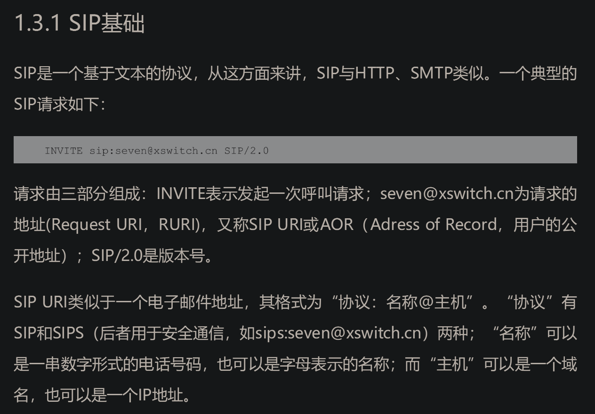

- 微信读书 Kamailio实战
# 前言
- 推荐资料 FreeSWITCH权威指南 其中包括 ims网络架构 voip sip 相关知识
- 推荐资料 FreeSWITCH实例解析
- 推荐资料 《Asterisk，电话未来之路》《Trixbox 不相信眼泪》
- FreeSWITCH势必要做集群，而做集群就需要一个SIP代理服务器。Kamailio是一个很好的SIP代理服务器
- Kamailio主要是一个代理服务器(Proxy)，它不会主动发起呼叫，而是对呼叫SIP消息进行转发，因此不能“开箱即用”，你需要自己写一些转发逻辑（支持lua编写转发逻辑）。从另一个方面来讲，如果使用Kamailio，你必将会用到像FreeSWITCH或Asterisk那样的软件。
- Kamailio 与  FreeSWITCH 关系 与 用户
- 
# 第1章 Kamailio与SIP
- Kamailio[插图]是一个开源的SIP服务器，主要用作SIP代理服务器、注册服务器等，而FreeSWITCH[插图]是一个典型的SIP B2BUA，主要用于VoIP媒体相关的处理。
- 关于 SIP B2BUA 和 SIP proxy
  - http://www.ctiforum.com/news/guandian/554610.html
  - B2BUA_SBC_Proxy的SIP消息重构和RFC7092详解 - 文章精选 - CTI论坛-中国领先的ICT行业网站 (2023_12_2 16_37_16).html
- Kamailio主要处理SIP，可用于构建大型的VoIP实时通信服务——音视频通信、状态呈现(Presence)、WebRTC、实时消息等，□ 支持异步的TCP、UDP、SCTP、TLS、WebSocket。□ 支持WebRTC，支持IPv4和IPv6。□ 支持VoLTE相关的IMS扩展。
## sip
- SIP（Session Initiation Protocol，会话初始协议）是一个控制发起、修改和终结交互式多媒体会话的信令协议
- RFC 2543
- RFC 3261
### sip请求和响应
- 
- 
- 

- SIP相关设计和http很像，消息结构为，响应码也很类似
  - 起始行
  - 消息头
  - 正文

### SIP的基本概念和相关元素
- 对等协议，即p2p，不需要中间服务器也能通讯，只要能知道对方地址
- UA
  - UAC
  - UAS
- 
- 代理服务器
- 
- 重定向服务器
- 
- 注册服务器/寻址服务器
- 
- 一种特殊的UA称为B2BUA，它只是实现一对UAS和UAC的串联。我们前面提到的FreeSWITCH就是一个典型的B2BUA
- 边界会话控制器(Session Border Controller，SBC)。它主要位于一堆SIP服务器的边界，用于打通内外网的SIP通信、隐藏内部服务器的拓扑结构、抵御外来攻击等。SBC可能是一个代理服务器，也可能是一个B2BUA。其应用位置和拓扑结构如图1-7所示。
- 
- Kamailio是一个典型的代理服务器
- Kamailio也可以做注册服务器、SBC等。
### SIP的基本方法和头域
- 基本方法 类比post、get等
- 
- 头域 类比 Content-length
- 
### URI
- 呼叫者可以不在sip代理上注册，被呼叫者必须事前注册
- 可以使用ip 可以使用域名，涉及域名解析
- 
### SDP和SOA
- SIP负责建立和释放会话，一般来说，会话会包含相关的媒体，如视频和音频
- 媒体数据是由SDP（Session Description Protocol，会话描述协议）来描述的。
- SDP一般不单独使用，它与SIP配合使用时会放到SIP的正文(Body)中。
- 会话建立时，需要媒体协商，这样双方才能确定对方的媒体能力以交换媒体数据。Kamailio不处理媒体
- 
- 在图还可以看出，客户端的SIP端口号是35526，音频端口号是50452，视频端口号是52974；FreeSWITCH的端口号则分别是5060、31988和19008。到后面我们会在SIP消息中找到这些。
- 客户端呼叫FreeSWITCH，使用sip携带sdp数据完成协商操作，之后互发RTP媒体流（音频和视频）过程
  - 见1.3.5
- SOA
  - 媒体流的协商过程称为SOA（Service Offer and Answer，提议/应答），即首先有一方提供它支持的Codec类型，另一方基于此进行选择。
  - 上述例子中
    - 607(客户端)先提议：我支持PCMA、PCMU和ILBC编码，你看咱俩用哪种通信比较好
    - FreeSWITCH回复说：“那我们就用PCMA吧。”然后双方就可以互发RTP流进行媒体交换了
### SIP承载
- HTTP是用TCP承载的，而SIP支持TCP和UDP承载（当然也支持TLS等其他承载方式）。
- 事实上，RFC 3261规定，任何SIP UA必须同时支持TCP和UDP。我们常见的SIP都是用UDP承载的。由于UDP是面向无连接的，故在大并发量的情况下与TCP相比，可以节省TCP由于每个IP包都需要确认带来的额外开销。
- 不过，在SIP包比较大的情况下，如果超出了IP层的最大传输单元（MTU，即Maximum Transmit Unit，通常最大是1500字节）的大小，在经过路由器时可能会被拆包，使用UDP承载的SIP消息就可能会发生丢失、乱序等，这时候就应该使用更可靠的传输层协议TCP。
- 在需要对SIP加密的情况下，可以使用TLS[插图]。TLS是基于TCP实现的。
- websocket也可以用于承载sip 
- SIP over WebSocket的承载为SIP/WS或SIP/WSS，其中后者是基于TLS实现的。WebRTC必须加密后才能传输，所以网上实际在用的信令协议都是SIP/WSS。

### 事务、对话和会话
- Kamailio在大多数情况下都被用作SIP代理(SIP Proxy)，典型的应用场景是处理用户注册、呼叫路由、负载均衡等。要理解SIP代理，	
- 事务概念：一个请求消息以及这个请求对应的所有响应消息的集合
  - Via头域中的branch参数能够唯一确定一个事务
  - 一个事务由5个必要部分组成：From、To、Via头域中的branch参数、Call-ID和CSeq
  - 事务的生命周期用于表示从请求产生到收到最终响应的完整周期。
- 对话概念：
  - 两个UA之间持续一段时间的点对点的SIP连接，它使UA之间的消息变得有序，同时给出请求消息的正确的路由。Call-ID、from-tag以及to-tag三个值的组合能够唯一标识一次对话。对话只能由INVITE或SUBSCRIBE来创建。
- 会话概念
  - 会话(Session)是一次通信过程中所有参与者之间的关联关系以及它们之间的媒体流的集合，是端到端的。只有当媒体协商成功后，会话才能被建立起来
- 一个例子
  - 大致能理解意思，实际看上去还听抽象
- CSeq
  - 在请求中作为一个请求头存在
  - 包含两部分：一个32位的序列号，一个请求方法。
  - 通常在会话开始时确定一个初始值，其后在发送消息时将该值加1。主叫方与被叫方各自维护自己的CSeq序列，互不干扰。CSeq序列有点像TCP/IP中IP包的序列。
  - 一个响应消息有与其对应的请求消息相同的CSeq值，不过 SIP中CANCEL消息与ACK消息是比较特殊的。CANCEL消息的CSeq中的序列号总是跟其将要撤销(Cancel)的消息相同，而对于ACK消息，如果它所要确认的INVITE请求是非2××响应，则ACK消息的CSeq中的序列号与对应INVITE请求的相同；如果是2××响应，则不同，此时ACK被当作一个新的事务
  - Call-ID、from-tag以及to-tag这三个值相同代表是同一个对话；branch值相同代表是同一个事务，否则代表不同的事务
### Stateless与Stateful
- SIP代理服务器有两种工作状态——Stateless与Stateful，即无状态和有状态。
- 在无状态情况下，代理服务器只是机械地路由消息，将收到的消息根据一定的规则转发到下一跳，它不关心会话、对话和事务。在这种情况下代理服务器不会维护状态机
- 在有状态的情况下，代理服务器在收到请求消息（如INVITE）时会启动一个状态机，跟踪一个事务，一直到收到200 OK或其他最终响应。所以，如果一个代理服务器在收到200 OK消息时知道与之关联的INVITE消息，那么该代理服务器就是有状态的。
- 在有状态的情况下，状态只维护在一个事务内，而不是整个对话。即状态只维护在从收到INVITE消息到200 OK消息的过程中，而不是在从INVITE到BYE的过程中。有状态模式适合处理更复杂的应用，如语音信箱、会议、呼叫转移、计费等
###  严格路由和松散路由
- Strict Router和Loose Router分别称为严格路由和松散路由。松散路由是SIP Version 2中才有的概念。
- 我们可以看到，在Router字段中设置的SIP URI经常有一个lr的属性，例如<sip:example.com;lr>，这就是表示这个地址所在的代理服务器是一个松散路由，如果没有lr属性，它就是一个严格路由
- 松散路由实际上表示代理服务器依据RFC 3261处理Route字段的规则，而严格路由表示Proxy Server根据RFC 2357处理Route字段的规则
- 

### Record-Route
- 即决定相关响应是否仍通过代理服务器
- 当一个代理服务器收到一个SIP消息时，它可以决定是否留在SIP传输的路径上，即后续的SIP消息是否还要经过它。比如在A呼叫B时，如果代理服务器只起到“找到B”的作用，则它可以将第一个消息原样传送，B回送的消息将可以不经过代理服务器而直接回到A上，这种方式称为Forward，如图1-14所示
- 
- 如果代理服务器想保留在SIP路径上，则它在将消息转发到下一跳之前要把它自己的地址加到Record-Route头域中。那么，当B在回复响应消息的时候，就会将消息发回到Record-Route指定的地址上，这种方式称为Relay，如图1-15所示。
- 

## Kamailio基本架构

# 第二章 理解Kamailio配置文件

# 第三章 Kamailio基本概念和组件	

# 第四章 KEMI详解

# 第五章 kamailio运行环境与实例

# 第六章 使用Kamailio做SIP路由转发
- Kamailio最主要的作用就是转发SIP消息。根据需要，Kamailio可以做无状态和有状态的路由转发，并且可以进行并行或串行的多目的地转发，而且在转发过程中可以修改SIP消息头、SDP，以及对主、被叫号码进行号码变换等
- Kamailio的路由就是控制SIP包从哪里来、到哪里去。
## 什么是路由
- 传输路径就称为中继。中继是有方向的
  - 单入中继
  - 单出中继
- 查找路由/选路
- 下一跳概念
- 中继——》中继组——》中继组策略
- 拥塞
- 中继故障
- 串行重选
- 并行转发
- 入中继计费/出中继计费
- 呼叫源
- 路由码：在Kamailio中，路由码可以在SIP头域中传送，也可以在主、被叫号码中传送，相当于C把路由选择的部分权利开放给了A。，A可以选择在C进行路由时，通过那个路径到达目的地
- 单点故障 通过双平面解决
- 
  - abd是城市的电话交换机
  - 通过c（sip代理）进行路由
  - a城市的手机用户将电话拨打到a电话交换机，到达c代理，到达b城市的b电话交换机，最终到达目的
  
# 第七章数据库操作

# 第八章15个典型的路由示例
## sbc
- SBC（Session Border Controller，边界会话控制器）相当于一个SIP防火墙，部署在运营商侧以及企业侧的“边界”位置。一般来说，SBC如果部署在企业网，会部署在企业网的DMZ区；如果是双网卡，则一个网卡对外，一个网卡对内。这样是为了保护SIP安全。SBC没有一个统一的规范，但通常都有防SIP攻击、限流、代理注册、代理媒体、协助NAT穿透、信令和媒体加解密转换、音视频编码转换等功能。SBC可以是一个普通的SIP代理(Proxy)，也可以是一个背靠背用户代理(B2BUA)。Kamailio可以作为一个SBC使用，配合rtpengine或FreeSWITCH使用可以代理媒体，也可以分别实现Proxy和B2BUA功能。这一节的内容和示例并不限于SBC，但它们或多或少都与SBC相关，因此我们统一将它们放到这里。

## WebRTC
- WebRTC[插图]的全称是Web RealTime Communication，即基于Web的实时通信。实际上WebRTC提供了在浏览器中使用JavaScript API访问本地的音频和视频设备的手段，以及点对点流媒体实时传输等功能。目前大部分浏览器都已经支持WebRTC，包括一些移动端的浏览器。WebRTC只是媒体层的标准，没有规定信令。从理论上讲，用户可以使用任何信令在通话的双方间交换SDP，进而建立点对点的媒体连接。由于SIP的广泛使用并深入人心，因而将SIP移植到浏览器里也成为理所当然的事。由于浏览器没有原生的UDP和TCP通信协议，但支持WebSocket，因此，WebSocket也成了浏览器中信令传输层的协议。基于WebSocket实现的SIP称为SIP over WebSocket[插图]，缩写为SIP/WS或SIP/WSS，分别对应非安全连接和安全连接。

# 第九章 性能

# 第十章 安全
- 比如，SIPvicious[插图]是一个著名的SIP安全扫描工具，它通过扫描服务器来检测其有没有漏洞，进而在黑客攻破系统之前就已修补漏洞。但网上有些人却直接拿它来扫描别人的系统。如果你的系统经常受到这种扫描，可以先从User-Agent头域下手，屏蔽一部分扫描。示例代码如下。

□ APIBAN是一个SIP安全网站，提供免费API，用于检查恶意呼叫。其网址为https://apiban.org/。□ Fail2Ban让Kamailio在鉴权失败时打印客户端的IP地址，通过监控Kamailio日志并调用iptables屏蔽这些IP地址，并可以在指定的时间后自动解封，具体参见https://www.fail2ban.org/wiki/index.php/Main_Page。□ Kamailio安全的相关内容可以参见http://www.kamailio.org/wiki/tutorials/security/kamailio-security。□ 关于18小时SIP扫描攻击的相关介绍可以参考https://kb.asipto.com/kamailio:usage:k31-sip-scanning-attack。□ 关于SIP安全的内容可以参见https://www.wiley.com/en-gb/SIP+Security-p-9780470516362。

# 在Debian和Ubuntu上安装Kamailio
搭建环境时用得到

#  FreeSWITCH快速入门
- Kamailio主要是一个SIP转发服务器，本身不能发起通话，不应答通话，也不处理媒体，因而一般与媒体服务器（如FreeSWITCH）配合使用。与Kamailio专注于处理信令相比，FreeSWITCH更侧重于处理媒体，执行各种不同的呼叫流程，如应答、放音、桥接通话、会议等。本书很多例子中都使用FreeSWITCH作为后端的媒体引擎。为了照顾不熟悉FreeSWITCH的读者，这里对FreeSWITCH进行简单介绍。
