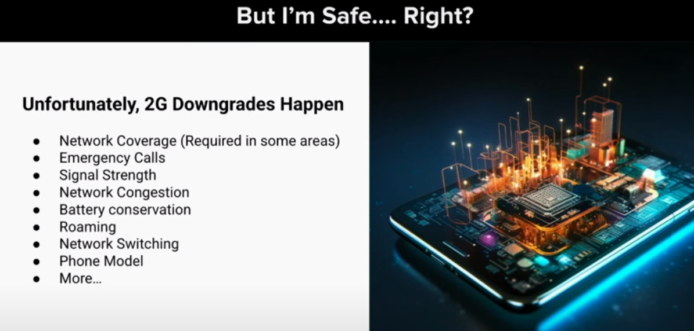

- 
- https://www.youtube.com/watch?v=R-XXpG_mZZI

- 没找到blackhat2023usa对应视频，但是找到defcon对应议题
- https://www.youtube.com/watch?v=QrkB_enz2Pk
  - 发现视频中ppt和black有所不同

- 目标是pixel6 分享的是2021年的研究成果 是三星基带
- 网络上找到不到演示中的两个cve的信息
- 

- 主要任务
- 
- 

- 为什么是基带，热度上升，攻击成本降低，谷歌大量漏洞提交是通过sdr发现的
- 

- 
- DDoS 僵尸网络
● SMS/RCA 嗅探和欺骗  SMS（短信服务）
● MFA 妥协
● 将机会转向内核
- pixel中基带以特权模式执行
- 通过嗅探sms/rcs可以获得相关消息

- 基带概览
- 
- 调制解调器一览：
● 能够访问敏感信息的关键组件用户数据
● 可通过各种无线电进行远程访问技术
● 一个备受瞩目的目标，可以从中受益安全强化缓解措施
● 漏洞的历史来源 外部研究人员和调制解调器所有者
● 许多安全性过时的遗留协议实践
- 即使在当前4g5g网络下，2g仍受基带支持

攻击面
- 
- 主要是针对2g中的asn1编码进行了漏洞利用，且是授权前的利用
- aka 身份验证和密钥协商

- 2g仍然存在，且可以降级
- 
- 上图中给出可能导致降级的原因

- 研究方法
- 
- 主要采用fuzzing，使用基于主机的fuzzing，即找到目标，将其编译为可以在linux主机上运行的模糊器，，这就需要破解build系统，并标记硬件依赖项，最终编译了目标，并不连接物理设备的linux环境中运行目标（基于三星泄露源码实现的？？）
- 研究了全系统仿真
- 其中codeql实现了静态分析，这是我们要学习的，针对反编译伪代码实现codeql
  
- fuzz成果
- 
- 开发了一套框架，可以将任意可疑的基带组件转换为fuzz的一部分
- fuzzing用于指导哪部分代码较为高危（根据crash的次数），同时发现bug
- fuzz可能被一些问题阻碍，例如未定义的解引用，oob读，做法是直接修改代码，保证fuzzing执行 
- 如何确定fuzz组件的优先级
  - 研究中被给予代码库，大概2gb源码和库，怎末确定先研究哪个
  - 通过研究3GPP标准，确定要研究哪个组件处理未授权数据，处理解码器代码，例如ASN.1解码器很热门

- codeql成果
- 
- 基带源码涉及复杂的配置选项和编译宏
- 定位组件入口函数
- 显示不同组件之间的交互
- 使用codeql分析fuzzing发现的bug

- 基带模拟
- 
- 基于firmwire，创建了自己的全堆栈仿真
- 

- 发现
- 
- 一个研究通过电话攻击基带，一个是通过恶意基站攻击基带
- 打脸p0团队，即asn上还是发送漏洞的
- 
- 3-4个月在2g和asn1上发现了120个漏洞，其中50个与asn1相关，80%漏洞是fuzzer发现的
- 两个关键洞
  - 越界写
  - 错误配置导致堆上可以直接执行代码
- 
  - 固定缓冲区，但是写入多少数据由用户决定 该漏洞在呼叫建立阶段触发，基站会向基带发送大量asn1数据，无需授权
  - 通过上述漏洞，获得了任意写原语
- 堆管理结构详解
- 
- 每个堆块头部包括32字节的头部信息，其中包含了分配该堆块的驱动id信息，其中在系统动态内存驱动程序中找到了利用点：因为该驱动程序分配的堆块-使用双链表来管理分配/空闲块-堆头包含双链表和空闲函数指针！

- 利用思路
- 通过堆溢出，修改相邻堆块的头部信息，将其驱动id修改为0100，即系统动态内存驱动程序管理的堆块，进一步伪造双向链表，之后被伪造的堆块会稳定释放，所以形成了一个稳定的任意地址写原语，使用该原语可以hook free函数，该函数的地址作为一个指针，写在一个全局变量中，所谓hook的方法就是重写该全局变量函数指针
- 
- 越界写入发生在 2G 堆栈内的 ASN 解码器中 (CVE-2022-20170)。这允许我们在堆中写入有限数量的受控字节并损坏相邻的堆对象。 ● 损坏的相邻堆对象在释放这些对象时为我们提供了任意指针写入原语。 ● MMU 中的错误配置(CVE-2022-20405) 允许我们在堆中暂存可执行shellcode。 ● 覆盖指向堆分配器的free 函数的函数指针，使其指向我们的shellcode。 ● 当堆对象被释放时，它将执行我们的shellcode。
- 
- 覆盖头信息，将其修改为系统动态内存驱动程序管理的堆块，修改堆块中prev指针指向我们伪造的堆块头，该堆块头伪造在可读可写可执行的全局变量数据区，这些都是shellcode的一部分，当unlink发生，则任意地址写成功修改free函数的地址，将free函数内容指向上述全局变量数据区的shellcode

- 上述全局变量数据区的shellcode是如何写入的
- 
- 定位到了将shellcode写入全局变量的原语，此时最多允许写入80字节，同时可以知道该80字节的地址，没有aslr，故该地址固定的
- 上述攻击中首次发送的shellcode称为0阶段shellcode，该shellcode用于接受1阶段的shellcode，后者也是每次80字节，以chunk的形式发送，整个1阶段的shellcode会使用多个80字节的chunk进行承载，最后0阶段shellcode会将1阶段shellcode重新组装，将其完全复制到可执行的堆中，最终重新hook free函数，从而执行1阶段shellcode，从而实现任意复杂度的功能，此时实现了短信转发功能，用于将sms消息从受害者手机转发到攻击者控制的号码

- poc展示
- 攻击链
- 
- 要求受害者必须来连接到蜂窝网络，可以是4g 5g等
- 要求设备必须开启2g网络，部分设备是默认开启的，到达受害者附近，让受害者连接到而恶意基站的2g网络（有很多公开资料），发送exppayload 攻陷基带
- 使用openbts作为伪基站，修改了openbts源码，从而注入恶意数据包

- 
- 该过程中发现的部分bug说明可以使攻击从基带转向安卓操作系统的无线驱动程序或HAL side
- 
- 攻击者使用usrp b200

- 遇到的挑战
- 
- 将 SDR、攻击者和受害设备打包到法拉第笼中以避免干扰并不容易 
  - ○ 受无线电波长的影响 
- ● 利用的可靠性和迭代之间的时间 ○
  -  涉及多个复杂系统的利用：SDR + OpenBTS &调制解调器
- 在生产调制解调器映像上调试 shellcode （因为存在源码）
  - 在调制解调器崩溃时收集 ramdump，然后检查内存状态 
  - 修补调制解调器中的 AT 命令处理程序，以确认在受害设备上本地利用成功
- 80 字节的thumb2 指令非常紧凑实现阶段 0 shellcode 
  - ○ 由于堆“unlink”原语的具体情况，有效 shellcode 区域小于 80 个字节
- 将三个设备放入法拉第笼会导致其相互干扰，需要避免干扰，解决方案是随机放置设备位置，直到正常通讯

- 漏洞修复于补救措施
  - 

- 2G安全已经过时。 2G 标准没有将恶意蜂窝塔作为攻击媒介（缺乏相互身份验证）。 ● 弱加密加上设备和塔之间没有身份验证，意味着通过 2G 很容易进行冒充。 ● Pixel 设备上可以选择2G。禁用设备上的“允许 2G”开关。 Radio HAL >1.6 的所有 Android (12+) 设备均支持此功能 ● 不强制执行 2G 禁用，因为某些位置需要 2G

- 
- Android 安全性优先考虑强化裸机固件 ● 系统强化和漏洞缓解措施 ● 在固件中探索并启用基于编译器的清理程序（BoundSan、IntSan）和其他漏洞缓解措施（CFI、kCFI、Shadow Call Stack、Stack Canaries）。 ● 在固件中启用更多内存安全功能（自动初始化内存）。 ● 探索Rust在裸机固件中的应用

- 
- 确保 Pixel 2G 安全的红队已经过时 我们的工作从未完成 在 Pixel 6 发布之前，已识别并修复了大约 100 个安全问题 漏洞利用开发有助于阐明影响 模糊测试是我们在模糊测试方面投入巨资的方式，开发了 8 个模糊测试程序，识别了 >60%参与期间记录的错误数。这些模糊器持续运行并发现问题。 Google 已采取保护措施来限制 2G 过时的安全性和缺乏相互验证的情况。关闭 2G 可以保护您免受大多数攻击。现代缓解措施 我们应用了各种缓解措施来消除整类漏洞，并将采取更多强化措施。许多 Google 团队齐心协力进行这些安全投资，优先考虑安全和补救措施我们永远不会完成！团队继续测试新功能和发布

- 2g协议实现本身就存在巨大安全问题，因为缺乏基站与设备之间的双向认证