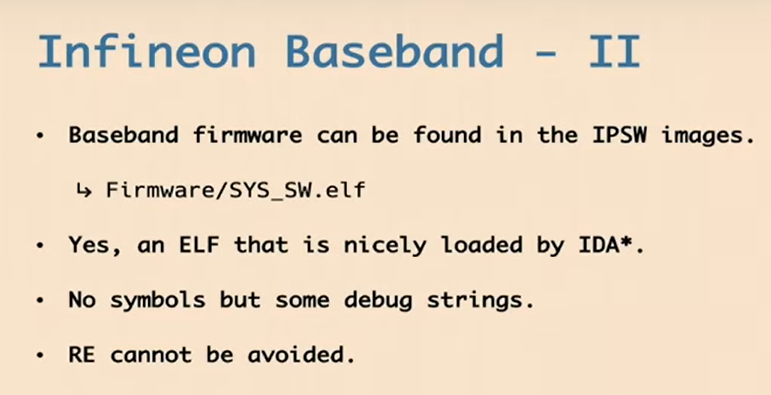
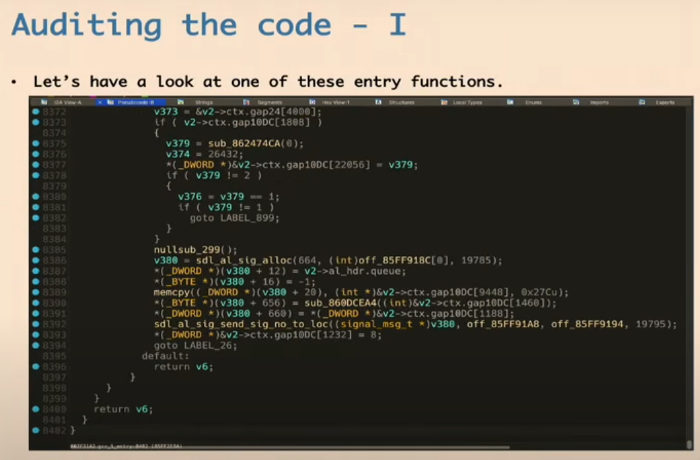
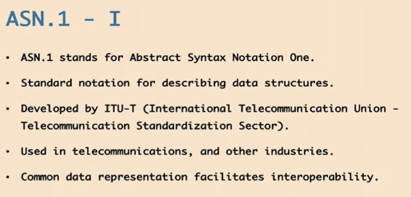
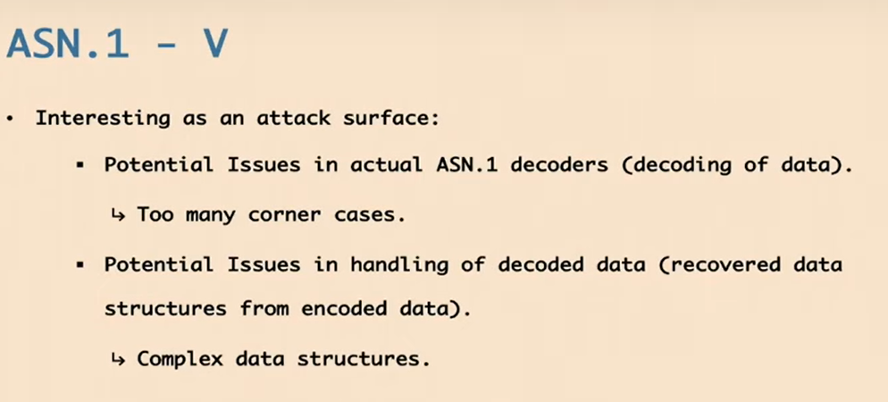
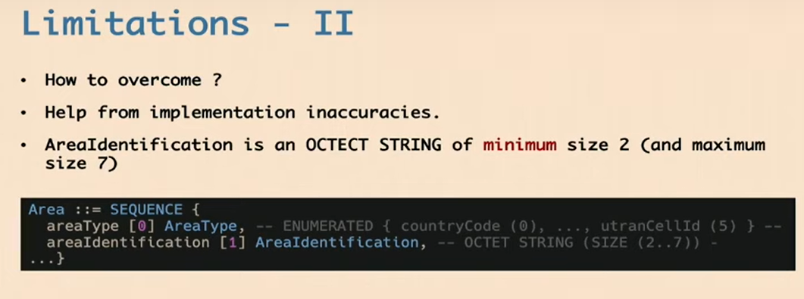

https://www.youtube.com/watch?v=Blytiwrf9bY
- 历史工作
- 

- intel收购英飞凌的无线业务，之后该业务被卖给苹果
- 
- 
- 基带固件以IPSW镜像形式存在解压后得到elf文件，可以直接加载到ida
- 
- 存在arm版本和x86版本的固件，可以从iphone11中找到x86版本的固件，基带都运行某种rtos，即以任务为核心，存在调度器对不同的任务进行调度
- 
- 

- 一个典型的任务伪代码，不同任务之间交互是通过将相关消息放置到其他任务的queue中，而目标任务在死循环中取出对应消息进行处理
- 

- 通过debug string识别了部分函数的名称
- 

- 初始化的伪代码，用于创建对应queue，并启动对应任务线程
- 

- 任务结构体中存在任务名，入口函数，id等字段，任务结构体组成数组，描述了系统中所有任务
- 

- 攻击面选择，初步计划
- 

- 首先识别rtos中的任务，根据任务名称和dubug字符串，尝试猜测该任务实现的功能，着重于找到与蜂窝网络协议栈相关的代码
- 
- 一些猜测结果
- 

- 每一个任务的入口函数可能都是极为巨大的，一个函数8k多行伪代码，反编译一个函数都要很久，甚至会猜测是否是编译器的内联或恶作剧
-  
- 

- 逆向不可避免，需要找到一种方法指导逆向，停止阅读代码，转而阅读gsm规范，找到规范中的复杂特性，从而确定阅读代码时需要关注什么，避免盲目看代码，并试图从中找bug
- 

- 阅读GSM标准
-  

- 针对ss服务 用于提供相关的扩展功能，电信公司可以使用ss服务客制化他们的网络，从而提供更多的服务，而不仅仅是打电话、发短信等，例如可以扩展功能实现呼叫转移 呼叫保持 等 ss服务使用ASN1编码数据，这本身就是一个攻击面，之前有ASN.1的成功研究经验
- 
- 

- ASN.1介绍
- 是一种描述数据结构的符号，用于电信很多场景，也用于解析证书
- 
- ASN.1独立于编码定义数据结构，其可以表示多种数据结构，包括整数、字符串、队列、集合等，允许在数据结构中增加新字段而不破坏兼容性，其使用多种编码规则（包括snmp所使用的BER编码规则），从而将数据结构转换为二进制流（物理表示）
- 

- 一个ASN.1示例，存在多种不同数据类型字段，其中[]中的被称为tag，用于唯一标识字符串
- 

- asn.1的不同编码规则,BER十分类似tlv，即type length value，且存在DER CER的子集，PER编码规则被设计为保证最小开销
- 

- asn.1解码器可能作为一个有趣的攻击面，因为解码器存在大量边界情况，且解码器需要恢复原本的复杂数据结构，故带来了复杂性
- 

- 首先需要识别ss服务，通过识别，应该是mns任务，主要思路就是通过对协议规范中的常量进行交叉引用分析，最终发现是一个极大的函数
- 
- 

- 简化的mns任务处理函数，主要流程 处理ss数据-》分配信号-》将信号分配到另一个任务
- 

- 漏洞分析
- lcs服务是ss服务的一部分，该服务是一组功能的集合，用于定位地理位置，可以用于紧急呼叫服务（定位呼叫者），也运行在某种gsm协议栈上，似乎可以被滥用，从而定位设备
- 

- 该服务使用的消息称为区域事件请求，该消息允许你请求设备的地理位置，当设备离开指定地理区域后，该请求触发，规范如下
- 

- 该请求包含client id字段、区域定义字段
- 

- asn定义的 区域事件请求 的简化结构，很复杂，值得研究该消息的解析过程，特别是标识size的8进制字符串
- 

- 漏洞1 该函数仅仅解析asn1消息，不用对其相关数据含义进行理解，其中num_aeis表示要解析元素的总量，循环次数由该变量控制，未进行检查，这是漏洞1；此外在第三行，memset显示目标内存大小为7字节，但之后的for循环可以持续向目标内存中写入数据，从而超过7字节，这是bug2
- 

- 开始exp
- 
- 尝试实现debug ios中只在log中提到一个crash的地址，无法提供有效信息，一些老手机使用英飞凌基带，且允许你patch、修改基带固件，没有完整性质检查，但是与目标基带存在较大的代码差别，只是有助于获得一些数据可达信息，即部分数据是否可以到达指定代码处
- 

- 触发bug 的关键数据被编码在设施信息元素中，设施信息元素 可以在大量三层消息中找到，例如set消息，该消息用于初始化电话呼叫消息 ，连接、断开呼叫等，或者注册或释放某些协议
- 

- 该bug存在限制，即，GSM中不能发送超过252字节下的消息，如果减去用于编码的字节，可以用于溢出的数据甚至更少
- 

- 如何克服 利用实现不准确问题，asn中描述了AreaIdentification，该字段是上述消息的一部分，该字段大小最小为2
- 
- 因为我们尝试发送多种不同的元素，并以此利用该oob，但代码实现中并未限制最小字节，所以我们可以尝试避免发送上述2字节，这样可以节约很多字节，因为我们只有252字节，你可以发送的字节越少，就越容易，最终，我们可以将目标定位到超过252字节之外
- 

- 选择要破环的结构体
- 下述为任务在一开始分配上下文对象，该上下文对象本质上用于ss服务的任务函数，该结构体中存在一个destq0指针，该指针指向其他任务队列，该指针被用于向其他任务发送消息
- 

- send_signal_to_queue实际上做了什么？是否能从中破坏destq0指针？
- 

- 通过研究发现该指针指向的queue_t结构体中存在魔数和函数指针，且不存在aslr，当我们能控制该指针，就能指定特定函数
- 

- 其他相关的
- 
- 该漏洞最近才更新
- 

- 关于香农基带的攻击面选择 香农基带也存在大量asn1解析漏洞
- 

- 招聘  
- 

- 问答
- asn中存在很多整数溢出，例如将一个数字解析为1字节数据？四字节数据？对于基带存在风险，但是由于消息本身大小限制为252字节，故不是很好利用
- 上述漏洞存在于GMS协议栈，利用时需要连接到设备的gms网络，即可攻击
- 花费了一两个月挖掘到了该漏洞，在pwn2own之前，即使成功利用，未找到能用该漏洞攻击做些什么
- ***看上去似乎是threadX！！！我记得微软最近好像开源了该rtos！！！可以研究了！！！！！***