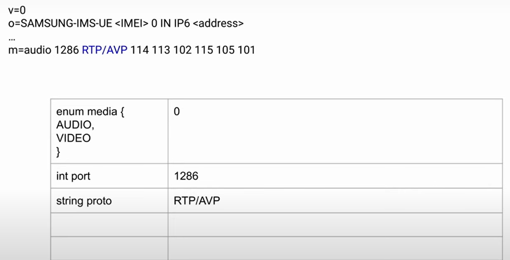
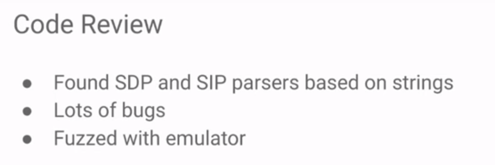
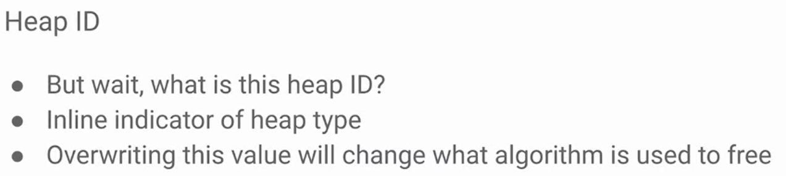

- https://www.youtube.com/watch?v=quw8SnmMWg4
- 目标 pixel7 使用 三星香农芯片g5300
- 未使用sdr来发现基带漏洞，因为缺少技能
- 未使用自建基站方案，同样是缺少相应技能
- 攻击场景，攻击者位于英特网或目标设备附近，该如何实现对目标手机的数据窃取
- GSM网络结构简图，目标设备可以通过GSM网络或VoLTE与网络相连，一般的攻击场景是黑客与受害者临近，通过sdr搭建伪基站，从而通过协议漏洞实现破解
- 
- 随着3g4g5g的发展，其大多数功能都需要授权验证，所以在临近攻击的场景下，只有2G网络协议栈可以作为攻击面，在这方面ASN.1编码是一个未授权攻击面，同期有一个基带相关研究针对英飞凌基带找到了asn.1的解析漏洞，但是p0在其中没有找到好的漏洞，或即使存在漏洞，也需要sdr触发
- 
- 上述攻击场景中，攻击者在目标附近，通过sdr伪造了基站与目标通信，以此实现漏洞利用
- 
- 注意gsm即常说的2g
- 新的攻击面，不再需要出现在目标设备附近，攻击者作为移动网络中的一个成员存在，可以远程攻击
- 

- 想到了之前的webtrc的研究，是一个开源软件，运行在几乎所有会议app中也运行在浏览器中，基本工作模式是两个对等的通讯对象通过一系列协议（sms websocket）交换信息并建立点对点通讯
- 部分大型项目不使用webrtc（例如facetime或whatsapp）但也使用类似软件
- 

- VOLTE也是类似的一个架构，存在一些区别，但本质上还是两个设备进行点对点通讯，其中没有服务器保证两者的通讯必然会到达，更多的只是一个设备到另一个设备的通讯

- webrtc存在很多漏洞，且存在实际在野攻击，攻陷了whatsapp，并进一步实现了大量安卓app的0click的利用
- 
- 
- 

- 将上述webrtc攻击场景扩展到volte上，两者本质上差不多

- p2p协议攻击场景，下述四种协议是volte的主要参与者
- 
- sip 通过服务器传输，并执行建立连接的第一步
- sdp 基于文本的协议，也用于webrtc，也包括一些加密协议，类似密钥传输等 一旦完成上述交换，就可以开始发送一个rtp协议（从一个对等点到另一个对等点）rtp本身是类似H264等类似协议的包装器，故实际上传输了H264等相关协议，
- 对部分设备而言，上述均发生在用户空间，例如三星设备，但谷歌pixel中sip sdp rtp都是香农基带的一部分，所以上述协议构成了攻击面
  
- 获取三星基带方法，通过crashdump获得基带
- 

- 将三星基带load到ida中后，通过字符串可以定位到sip和sdp，rtp还未定位到，需要进一步研究，不清楚代码实际执行流程，但是通过审计发现了一个可以导致crash的bug，并据此对代码执行流程有了更好的理解，仍需要更好的调试手段
- 

- 基带每次crash时，都会进行dump，可以使用界面中的功能在没有crash的情况下获得crashdump，只要输入如下内容即可，获得crashdump之后，是一个tar包，可以解压，泄露的三星工具以及github上的开源工具scat可以让你获在三星设备上获得log信息，但不适用于pixel 故实际上有用的仅仅是crashdump中获得的相关字符串
- 

- 如何确定bug是可达的，即两个具体问题 1如何确定那些代码被执行了 2确定gsm网络中可能存在各种过滤，poc发送的消息是否能通过这些过滤
- 
- 

- 这些可能根据网络不同而异 ，但上述四种协议通过移动网络，移动网络会对其进行过滤，但这样做不是为了安全，而是为了某种功能，例如si必须有个中间服务器，该服务器必须解析sip，之后可能会编码sip的某些字段，sdp可以传输某些字段，通常sdp通过sip进行传输，以便网络可以确定相关连接属性，部分协议是单纯点对点的，除非在特定情况下，否则网络传输过程中不会解码此类协议，例如rtp和h264，不幸的是，p2p和0click之间可能没有重叠的部分，sip和sdp是0clik的，但这两个必须经过服务器处理，而rtp和h264相关call必须要求用户接听，故这些事1click攻击面，故主要关注0click攻击面
- 

- 一个sip/sdp被过滤的示例 ，是一个通过volte传输语音的示例，中间服务器将解析该请求，首先将解析音频，在sdp中volte只有两种可能性，视频或音频，故这里可能是一个枚举类型，即为0或1，之后是一个整数端口1286，之后是传输的协议，此类协议在服务器中可能以字符串表示，也可能以枚举表示，故此处可能遇到基于字符串的溢出漏洞，但是因为此处服务器可以解析的协议类型有限，故此处一些显然错误的字符会被过滤，从而无法基于此字符串实现溢出，因为不同中间服务器解析规则不同，故漏洞利用可能可以到达另一端，也可能无法到达另一端，故需要分析大量中间服务器，查看那些协议类型允许通过，你知道的协议越多，相关漏洞利用越可能正常通过中间服务器到达另一端，这可能因为运营商不同而不同，
- 
- 
- 

-  总的来说，攻击者运营商环境比被攻击者的运营商环境更重要，就是恶意请求是否能正常到达对端这一点，尽管部分接收端运营商会对数据进行一些过滤，此外这些协议都有保留字段，必须要小心，如果不正确设置可能导致错误
-  

- 尝试将基带加载到qemu模拟器中，不是一个完整的模拟器，不支持与基站进行通讯，仅支持单个功能的执行，可以用于测试漏洞是否实际存在，可以用于fuzz基带的单个功能，fuzz的确发现了bug
- 

- 通过对sdp sip进行代码审计以及fuzz，发现了很多bug
- 
  
- 漏洞1 位于SDP的accept-type，代码中因为存储该字段的空间为固定的12字节，故过长的该字段值，会导致溢出，是一个字符串溢出
- 

- 漏洞2 基于chatroom字段，与上面相比是一个类似的溢出
- 

- 漏洞3 也是一个溢出，但是相关字符串被转为16进制数据写入，故可以控制要溢出的任意值
- 

前三个漏洞大部分运营商都支持传输，并且能导致crash

- 漏洞4 该漏洞大部分运营商不支持，原理仅仅是将数据拷贝到固定8字节地址，故造成溢出
- 

- 一个sipbug 通过fuzz发现了7个sip bug 此类bug一般运营商并不支持 ，此时需要将运营商或sip服务器攻陷，才能发挥作用 大多数是简单的字符串溢出 如下，
- 

- 使用下述方案验证p2p的漏洞 三星s9中使用resip开源库在用户态处理sip和sdp，hook该库，从而实现了一部手机向网络发送任意sdp请求，三个sdp的bug被验证可以远程触发，甚至跨国触发
- 

- 开始漏洞利用
- 
- 不完善的安全检测机制反而为漏洞利用提供了进一步的机会
- 

- 堆情况 相关堆机制缺少安全的ulink，故有了利用机会
- 
- 
- 
- 

- 首次尝试，因为附近被覆盖的堆块不合适，导致利用失败
- 

- 继续尝试利用 连续分配三块堆 溢出 释放堆块
- 
- 
- 
  - poc的实际形态

- 开始听不懂 需要详细分析
- 
- 
  - 演讲中最有意思的一部分
  - 这个gadget在任意arm芯片中都有，用于负载均衡，可以用于调用任意多个函数

- 绕过nx
- 

- 编写shellcode
- 

- poc
- 

- 扩展利用
- 在网络中设置代理，从而监听流量 电话 短信
- 将控制权提升到ap
- 

- 总结
- 

- 同期另一个基带 关于asn.1解码器 https://www.youtube.com/watch?v=Blytiwrf9bY