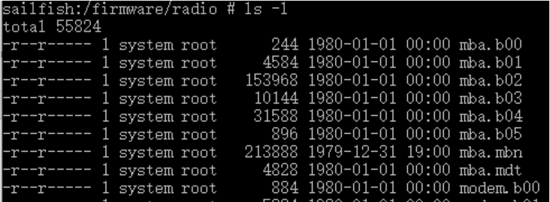

# 固件提取
## 方案1
- 
## 方案2
- pixel以及nexus该目录下保存基带固件
- 
# 固件处理
## 该脚本用于将基带固件整合为一个elf文件
- https://github.com/laginimaineb/unify_trustlet  
- https://github.com/bkerler/qc_modem_tools 该项目中也存在unify_trustlet脚本，且针对python3进行了修改(from https://bkerler.github.io/2019/11/15/bring-light-to-the-darkness/)
- https://github.com/carstenbru/qc-baseband-mod/ 项目中相关脚本可以整合基带固件为elf文件
# 固件反汇编
- https://github.com/rpw/hexagon
- https://github.com/programa-stic/hexag00n
- https://github.com/gsmk/hexagon
- 较新的hexagon反汇编器 https://github.com/bkerler/idp_hexagon 
- Radare2可以提供支持
- Ghidra可以提供部分支持
# 针对ida反汇编后的固件进行处理
- https://bkerler.github.io/2019/11/15/bring-light-to-the-darkness/ 中提出qcmodemat.py脚本用于处理加载到ida中的基带固件，脚本会在基带中搜索指定字符串，根据基带不同，搜索不到可能导致脚本运行失败
  - 相关项目：https://github.com/bkerler/qc_modem_tools