# 3GPP架构
- 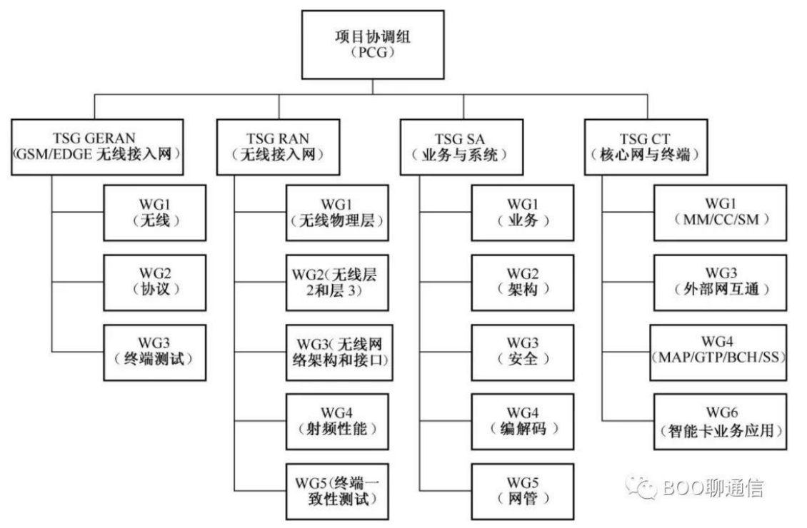
- 在 5G 技术标准中，最关键的技术就是编码技术，其中主要分为数据信道（就是用来传输数据的，比如视频啊、微信聊天啊）的编码和控制信道（就是用来传输基站对手机的指挥信息的）的编码。
- 这次投票就是来决定这两种编码的方式到底是采用哪家公司提出的方案的。最终的结果是，数据信道编码得票第一的是高通公司提出的 LDPC 码，而控制信道编码得票第一的是华为提出的 Polar 码。

# 通讯基本原理：波
- 你就是一个“基站”，而听你说话的人就是“手机”，你的声带相当于天线，把声波（无线电波）发射出去，而对方的耳朵相当于手机天线，对方的大脑相当于手机的芯片，分别接收下了无线电波，并通过声波的波形不同，解析出了你的话语内容。
- 不同无线电波使用的频率不同。频率的定义是 1s 内波周期性变化的次数，频率的单位是 Hz（赫兹），一个“波”如果一秒钟周期变化一次，那么他就是 1Hz，如果两种通信使用的无线电波频率相同，那么他们之间必然存在干扰，结果就是谁也没法传输了
- 工信部无线频率分配
- 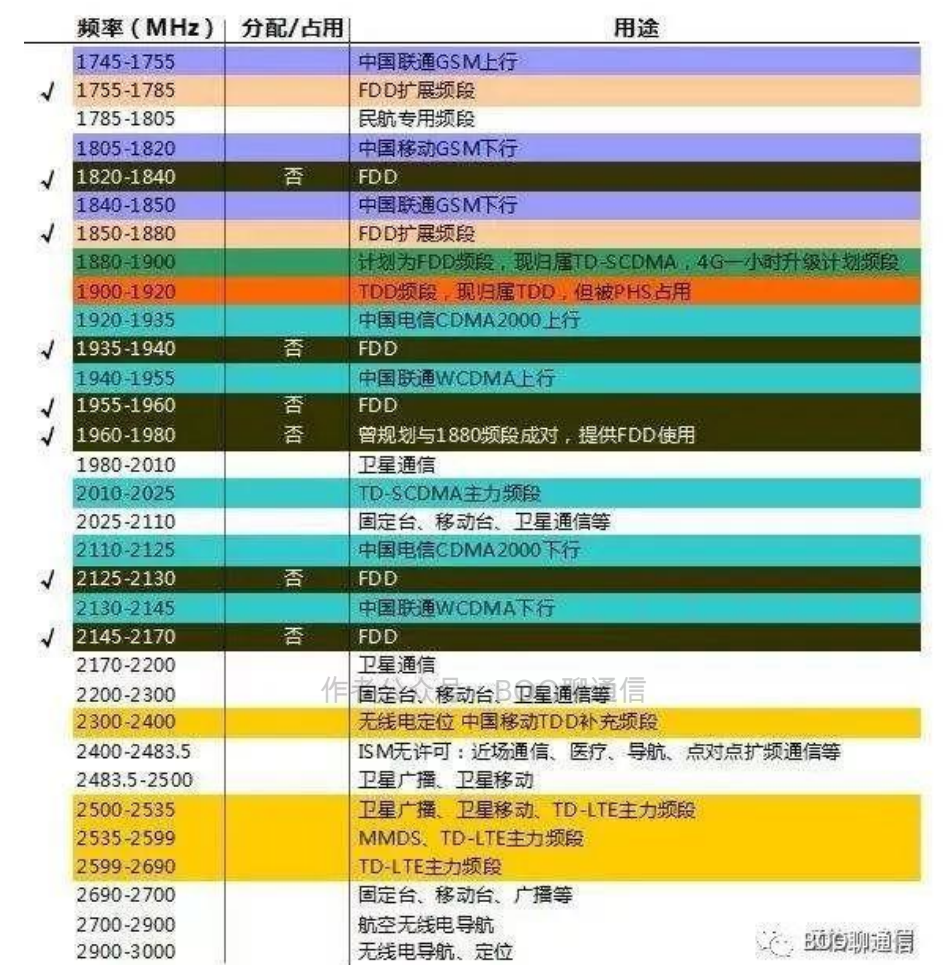
- 信息传输的数据量往往比较大，是需要一定的频率范围来传输的，这样的频率范围在通信中叫做“频带宽度”，简称带宽，带宽越大，传输数据的速率越快。
- 频段越低（即频率越低），无线电波能传输的范围越广，越高传输的范围越近，高频电波穿透能力较低频传输和穿透建筑物等阻断物能力弱的多，频率低一点好
- 既要保证频率够低，又要保证带宽足够（起码得有几十上百 MHz 带宽），那么，几百 MHz 到 2、3000MHz 的频段便是最佳的选择，因此各行业企业争夺十分激烈。而在这个频段内，当然是频率越低越好
- 工信部分配给运营商的5g频段。
- 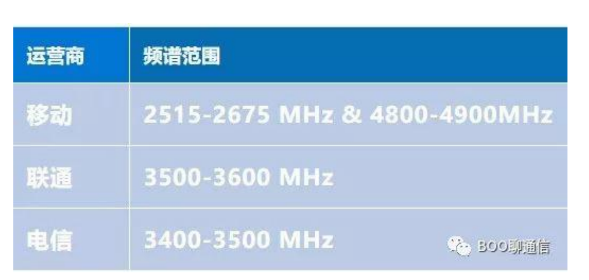
- 每一代移动通信系统的升级，最主要的变化就是数据传输速率的提升。
- 香农定理定义了传输速率的极限，
- 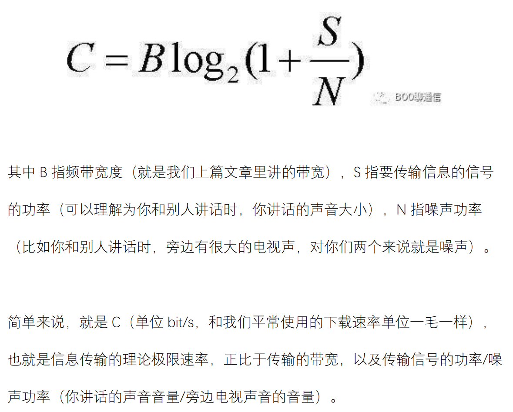
- 在频带宽度固定、信号发射功率固定、信道噪声固定的情况下，传输数据速率的极限已经被定下来了，就是香农定理中的 C
- 目前提升信号发射功率基本已经不可能（耗电太大），空气中的噪声又没法降下去（毕竟空气中有无数的各类无线电波），因此，每一代的移动通信技术的升级，都是在提升带宽，以及在发射功率不变的情况下如何压缩数据（即本来货车送货量是有限的，想办法如何在里面装更多的货物），以及是不是能“作弊”再加几条公路同时用多辆货车运送货物上下功夫来接近香农极限
- 移动通信只有使用几百到 2、3000MHz 的低频频段，才能在运营商承受的范围内为用户提供服务

# 调制解调
- “模拟”，就是连续变化的量，波是一个模拟量
- 虚线为模拟的波，为了将这个波的信息数字化，只好四舍五入大约的采集到每个时间点的数值（蓝色柱）。“模数转换”因此一定会损失信息，因为没有模拟那么精确了
- 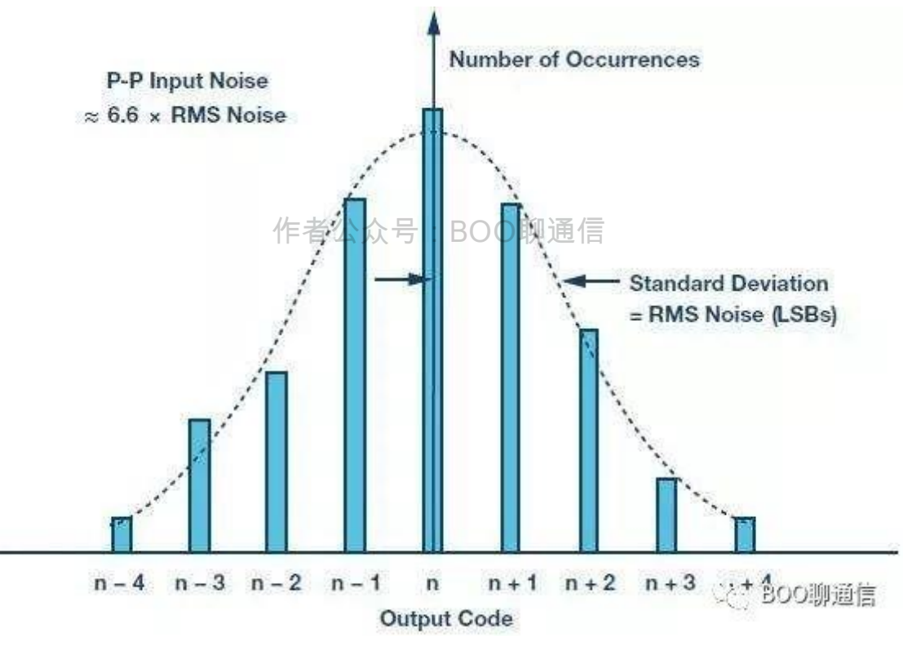
- 手机上的图片，是数字信号，需要转为模拟信号的波，才能作为无线电波发送
- 数字调制：想实现数字比特到无线电波的“数模转换”
- 5g数字调制方法导致其同样的波能代表的bit更多，导致速度更快
- 然在手机中所有应用的数据都是以比特，也就是“0100101”这的二进制序列来传输的，但是如果想将数据通过空气在手机与基站之间传输，那么则需要使用数字调制技术。
- 0101直接进行调制后传输，因为没有纠错功能，所以需要对0101先进行信道编码，从而实现纠错功能
- 信道编码基本原理  ：为了保证传输数据的准确，采用信道编码技术，在传输的有用数据上，添加一些冗余的比特，就可以做到即使数据传输时受到干扰，导致接收端收到错误的数据，也可纠正过来
- 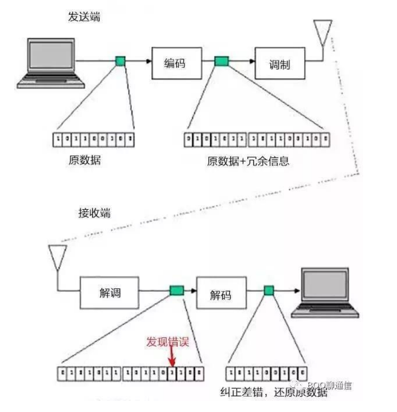
- 三种信道编码方法
- 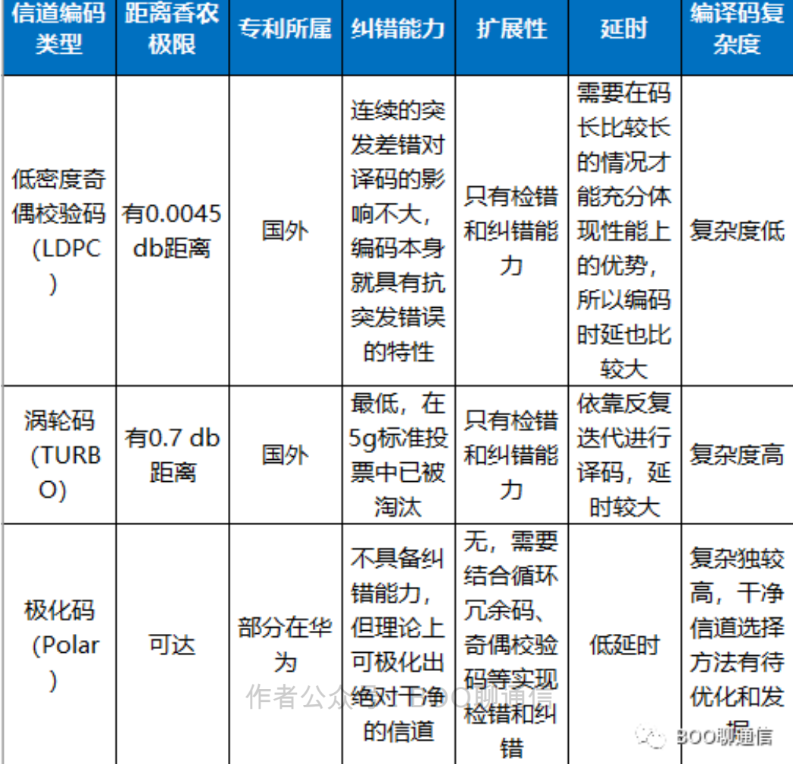

# 天线
- 天线的功能始终变化不大，那就是：将从基站（经过 RRU，下面会提）传来的信号通过天线下面捅进来的一坨馈线在对应的频段（给忙碌者的 5G 基础知识课（一）——比黄金还贵的频率），通过无线电波的形式发射到你的手机（叫做下行方向），或者从你的手机接收到无线电波，再传输给基站处理（叫做上行方向）。
- 能同时实现多个独立收发通道的天线，在通信术语里被称为叫“MIMO”天线，读作“买猫”天线，MIMO 是英文“Multiple-Input Multiple-Output”的缩写，也就是“多收多发”的意思，这个很好理解了，就是一个能同时收发多路信号的天线
- 5G 之所以能实现超大速率与超大容量，主要原因就是在天线技术上的突破。
- 由于使用了同时集成 64 个独立收发天线的 Massive MIMO 天线，5G AAU 非常逆天的可以同相控阵雷达（同样是内置多个发射和接收单元）一样，将无线电波像聚光灯一样分别打向不同用户，天线发射的信号一方面能量更加集中，一方面对其他用户干扰极小，大大提升了用户接收到信号的质量，这就是波束赋形

# 组网
- 世界各大运营商当前试商用的基本都是 NSA 组网（Non-Standalone，非独立组网）的 5G 网络，、
- 除了华为外各大手机厂商当前推出的也都是仅支持 NSA 的 5G 终端（因为除了华为用的都是高通的仅支持 NSA 的基带
- SA（Standalone，独立组网）是另一种5G组网方式
## 移动通信的基本架构谈
- 不管是 234G，还是 5G，移动通信的网络架构基本没有太大的变化，都是无线网--承载网--核心网的三级网络架构。
- 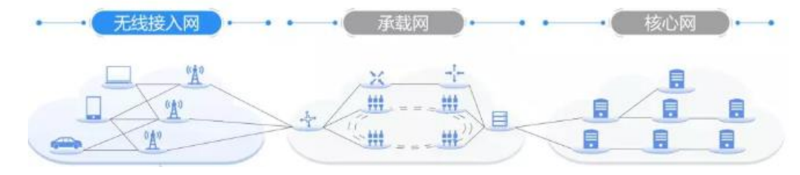
- 其中无线接入网，就是直接向用户手机发射信号的“地面上看得见”的基站所组成的网络。
- 而承载网，则是负责将基站接收到的用户数据，通过“地面下看不见”的有线网络，传递到核心网的网络，本质上就是无线网到核心网的“高速公路”。因此，如果画一张简化的 5G 端到端网络架构的话，基本就是：我的手机-我所在的无线网-核心网-对方所在的无线网-对方的手机
- 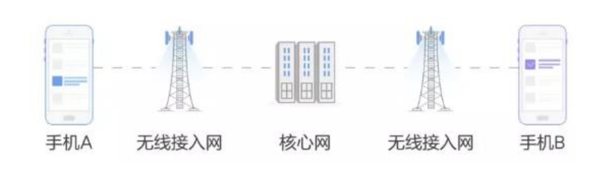
- 而核心网，则是整个移动通信中最最核心的一堆设备的集合，放置在电信运营商最安全的机房中。这些设备基本决定了用户之间能否互联互通。正所谓无线网故障影响几个基站的用户，承载网故障影响一片基站的用户，而核心网故障则影响一个城市甚至几个城市的用户
- NSA使用5g基站，仍沿用4g核心网    SA 使用5g基站+5g核心网
- 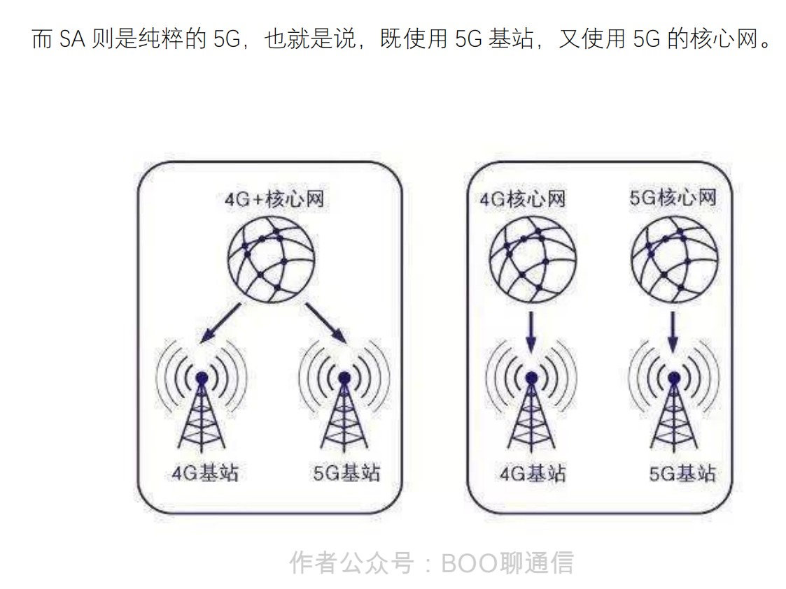
- 如上图所示，左边的 NSA 组网下，现网的 4G 基站与 5G 基站都接入 4G 核心网，当然由于需要适配 5G 的一些功能，此时的 4G 核心网设备也要做一些软件升级，也就是成为了 4G+核心网。
- 而右边的 SA 组网下，现网的 4G 核心网只需要为 4G 基站提供服务，5G 网络完全新建一套 5G 核心网，需要采购与布置整套 5G 核心网设备，使得 5G 基站可以接入纯 5G 核心网为用户提供 5G 服务。\
- 这样的好处是，我们都知道 5G 并不仅仅是在数据速率上相比 4G 有了提升，5G的三大应用场景中，高速率业务，也就是 eMBB 仅占其中之一，而另外两大应用场景高可靠低时延 uRLLC 与海量机器通信 mMTC（就是大规模物联网）都是需要 5G 核心网才可以支持的。
- 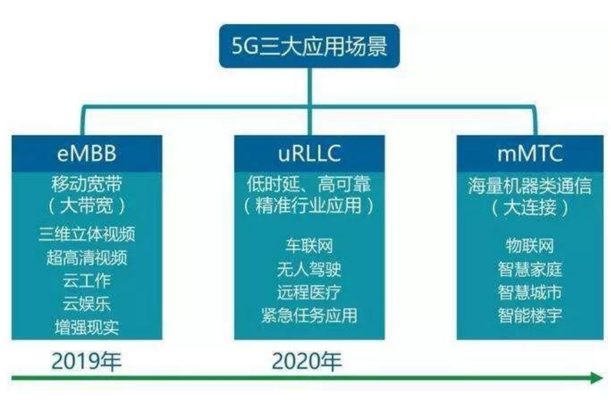
- 述 NSA 与 SA 的组网区别，只是目前主流的 SA 与 NSA 的区别。而 SA、NSA其实还要细分 N 种核心网与基站的组网方式，不同的组网方式被叫做optionX，也就是选项几，
- 就算是选项 3，其实还要再细分 3 种架构，分别是：3、3a、3x。先说说他们的共同点。不管是 3、3a 还是 3x，都是 5G 基站连接 4G 核心网。并且，如果用户终端连接 5G 基站时，都需要一个 4G 基站作为“锚点”
- 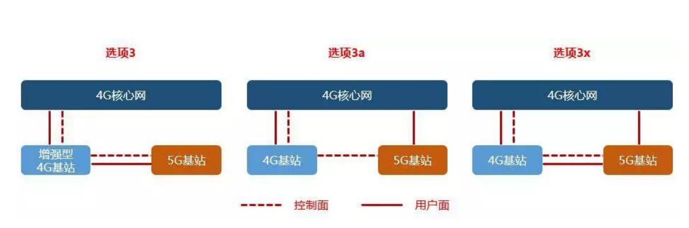
- 而“锚点”的作用则是将 5G 基站固定在 4G 核心网。作为锚点的 4G 基站，相当于 5G 基站与 4G 核心网通信的信使，核心网下发的主要的控制信令（相当于指挥 5G 基站如何传输数据的语言），通过 4G 基站传递给 5G 基站，或者传递给用户的手机。
- 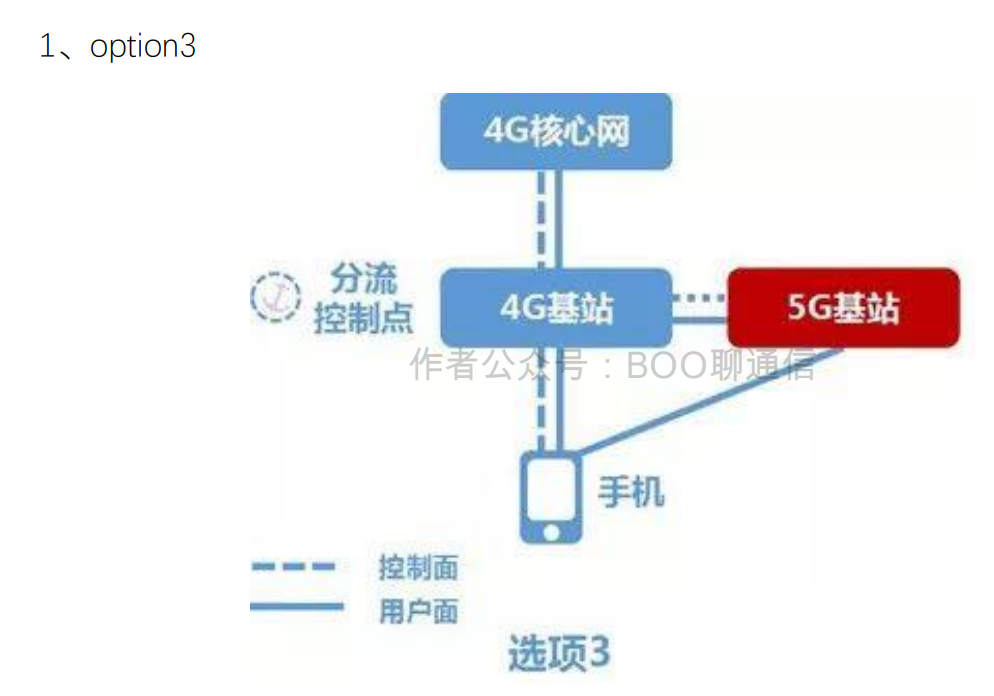
- 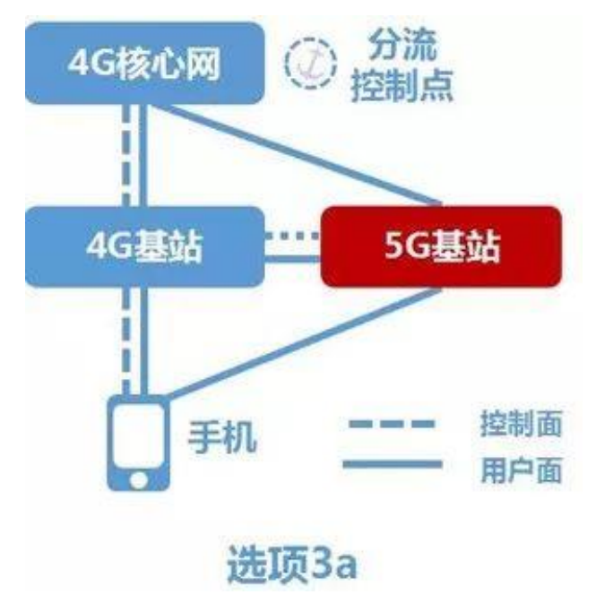
- 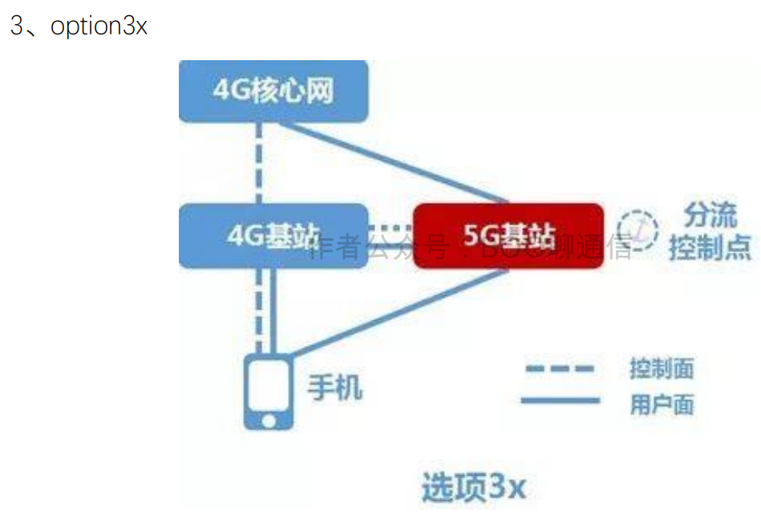
- 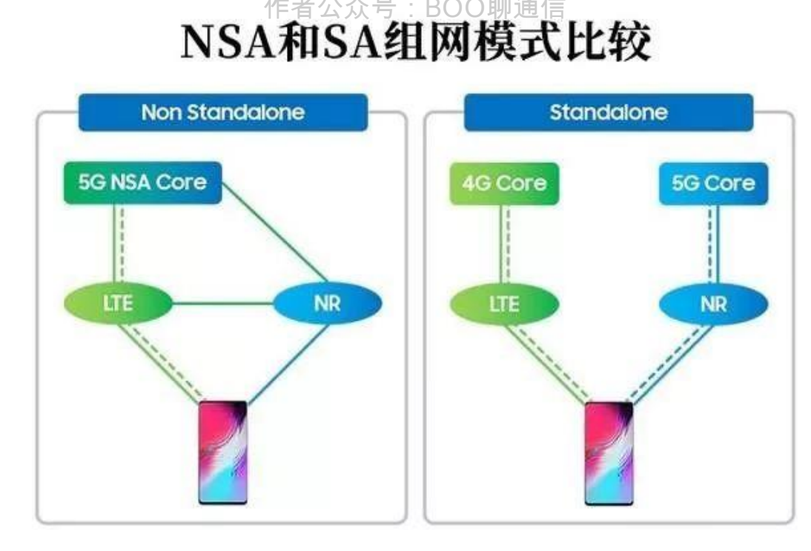
- NSA 只是 5G 建设初期快速部署的应急办法，而若想支持超大连接物联网、超低时延通信等 5G 真正的杀手级功能，未来是一定要演进成 SA 网络，通过建设 5G 核心网来实现真正端到端的 5G 的。

# 移动通信基础概念介绍 
- 不管是 1234 还是 5G，我们的移动通信都是基于蜂窝网络的。所谓蜂窝网络，就是假设每个基站发出的无线电波覆盖的范围是一个正六边形，理想情况下每个移动基站的正六边形，可以像蜂窝一样无缝拼接在一起，实现互不干扰的百分百的覆盖（想得美）
- 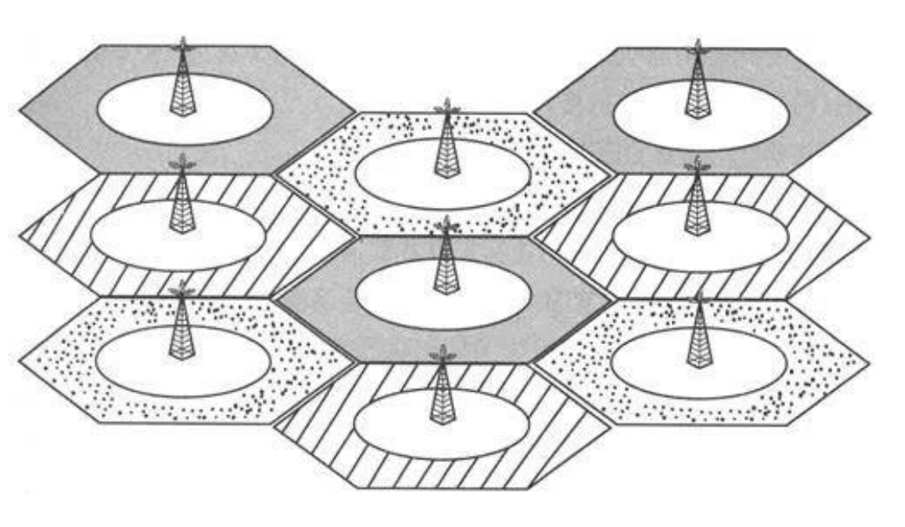
- 之前反复提到过，基站要想发出无线电信号，最终是要靠天线发射出去的，一般来说，每个基站会配置 3 个天线分别覆盖 3 个方向，而这 3 个天线至少每个独立发射出去 1 个小区（逻辑上的概念），3 个小区才组成一个基站的覆盖六边形。所以说小区才是为手机用户服务的基本单元，同一个基站下的不同小区、不同基站间的不同小区，都是独立工作、独享运营商所使用频段的全部带宽。而每个小区实际覆盖的范围，受限于天线的能力，都是很不规则的，类似下图这样婶儿的奇形怪状，3 个天线发射出去的 3 个小区根本不可能组成一个完美的六边形。
- RSRP（参考信号接收功率）
  - 简单来说，RSRP 就是代表信号强度，RSRP 越高你手机上的信号越满格，反之则是信号格数越低，OVER。
- 切换
  - 而能做到移动着通信的原因，就是因为小区之间可以切换。做个比较形象的比喻，小区间的切换就像是接力赛跑中，运动员之间传递接力棒，接力棒就像是手机，运动员就像是小区，对于接力棒来说，自己就算是移动，也不会掉在地上的，因为一直被运动员传递。
  - 而用户手机从一个小区的覆盖范围移动到另一个小区的覆盖范围时（最简单的判断覆盖范围已经变化的方法是：手机测量到的其他小区 RSRP 大于自己所占用的小区的 RSRP，相当于有更优的小区，这种切换事件叫做 A3 事件），小区之间通过控制信令做好配合（相当于两个运动员沟通好什么时候递棒、什么时候接棒），顺利把用户的手机从一个小区的服务几乎无缝的传递给另一个小区。
  - 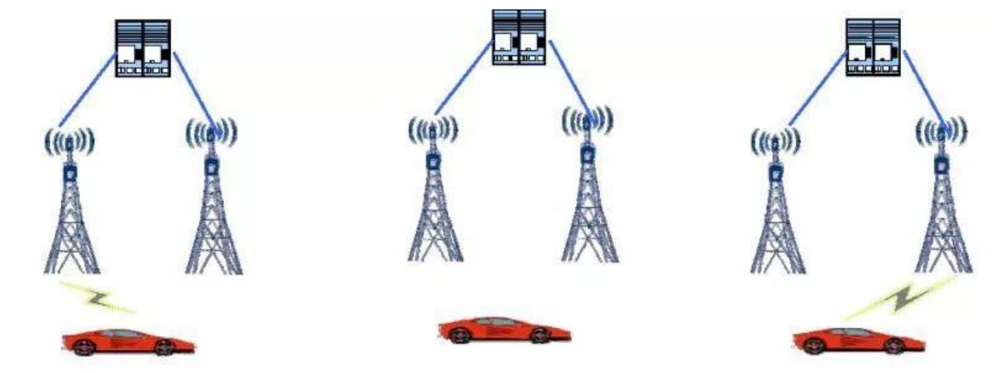
- 5g nsa组网 手机连接过程 p129
- 5g nsa组网 手机移动过程 p134
  

# 语音是怎么在移动通信网络下传输的
- 语音转为数字信号：模拟的语音信号转化为数字信号，那么就需要进行模数转化，方法就是：采样-量化-编码。
- ，在 NSA 也就是非独立组网的 5G 下的语音，其实是完全使用 4G 网络来进行的，也就是说，NSA 的 5G 用户，在语音通话时，其实是使用 VoLTE（Voice over LTE，LTE 就是 4G 网络的制式）的
- 2G 网络，大家可能第一反应就是：慢。现阶段，如果你的手机没有 4G 信号了，上面是显示 2G 的 logo，那么大家肯定是会处于崩溃的状态，因为 2G 网络下手机基本上不了网，只能发短信或者打电话。
- 234g制式和速率
  - 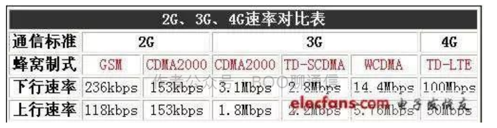
  - 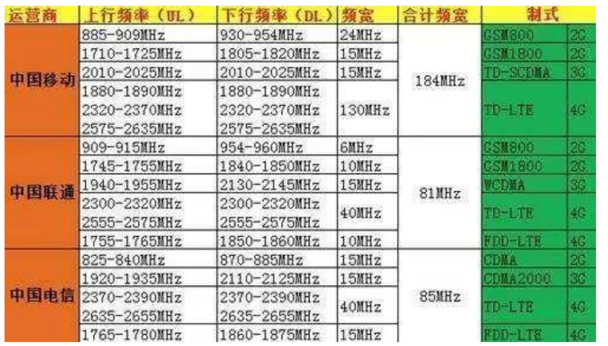
- G，目前现网中还有大量的物联网设备，比如共享单车、移动 POS 机是仅支持 2G 网络的，如果 2G 退了，这些政企用户得罪不起啊。
- 2G 网络最重要的功能还有一个：那就是在 4G 网络覆盖不足（毕竟频段高）以及用户 4G 手机不支持 VoLTE（现网真的还有不少）的情况下，要为用户提供能“保命”的语音服务
## 2g语音实现
- 2G 网络其实最重要的功能主要是语音业务的承载。2G 网络下的语音实现，是使用一种被叫做电路交换 CS（Circuit Switched）的网络来实现的
- 就相当于你使用原来的老式电话机打电话，你打电话时，网络会为通话双方分配一条固定的通道。在整个通话过程中，通话双方可以一直占用这条“专用”的通道，其他人是没有办法再占用这条通道的，所以你在使用 2G 网络打电话时，是没法上网的、

## 4Gs网络实现
- 4G 网络，则使用一种叫做分组交换 PS（Packet Switch）的网络，其实就同用手机上微信、刷微博、看视频一样，不管是语音包还是数据包，都是在网络中以 ip 包的形式通过各种交换、路由设备，通过 ip 地址寻址到目的地的。
- 如果仅仅依靠 ip 数据包去传输语音业务，有个很致命的问题：那就是没法保证业务质量
- 如果想真正使用 4G 网络承载语音业务，必须要针对语音包实现更高的质量保障，必须得区别于一般的上网数据包
- 这不单单需要对基站进行改造，而是要实现端到端的改造，因此核心网也需要大改动，需要完全新建一套叫做 IMS（IP Multimedia Subsystem，IP 多媒体子系统）的核心网。而 IMS 包含的设备太多太复杂了
- 于是乎，在 4G 网络建设初期，各大运营商为了尽快能够商用 4G，纷纷采用不建设 IMS，直接硬上不能实现语音业务的 4G 网络的方法。即语音使用2g，4g仅仅跑数据
- 那语音咋整？只能用 2G 来硬挺啦！于是乎，有没有发现，在以前的 4G 网络下打电话，手机上面的 4G 都会变成 2G，而且不能上网了？这是因为这种被叫做CSFB（CS Fallback，也就是回落到 2G 的 CS 网络的语音）的 4G 语音方式，必须需要手机从 4G 网络硬生生“掉线”然后重新接入 2G 网络，才能通话，其实就
是走 2G 网络的语音。

## CSFB vs VoLTE 
- 各大运营商在 17、18 年开始纷纷商用了VoLTE 语音，也就是 4G 语音，想取代 CSFB 这种辣鸡的语音方式，这是因为VoLTE 相比 CSFB 优势简直不要太明显
- 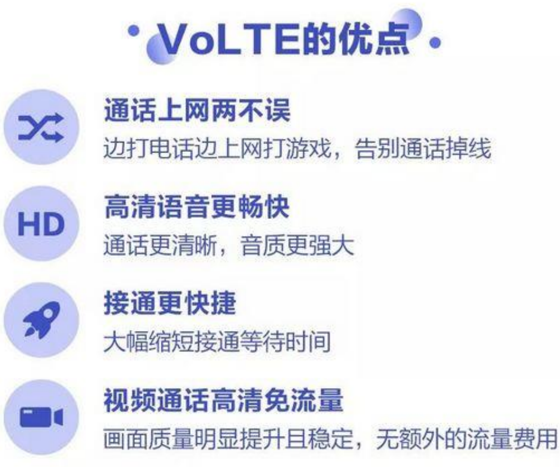

# NSA 下的5G 语音电话是怎么打的？
- p168
- 4G 网络怎么保证使用 ip包传输的 VoLTE 语音的质量？二是 VoLTE 与微信语音、QQ 语音这种同样是走4G 网络的语音有啥区别？
## 区别服务的 QCI 
- 在 4G 网络中有个特别重要的概念，那就是 QCI（QoS Class Identifier），翻译过来就是服务等级指示。名字已经把 QCI 是干啥的展示的很清楚了，就是用来区分服务的。
- 在 4G 网络中，不管是上网、看视频，玩游戏，手机与互联网公司的服务器之间传输的 ip 数据包都是要经过很多很多设备的，比如基站、传输网设备、承载网设备、核心网设备，在这些设备间传输的 ip 数据包所走的路径，可以看成是一条条大马路，在 4G 网络中有个专业术语叫做“承载”，英文叫做 Bearer
- 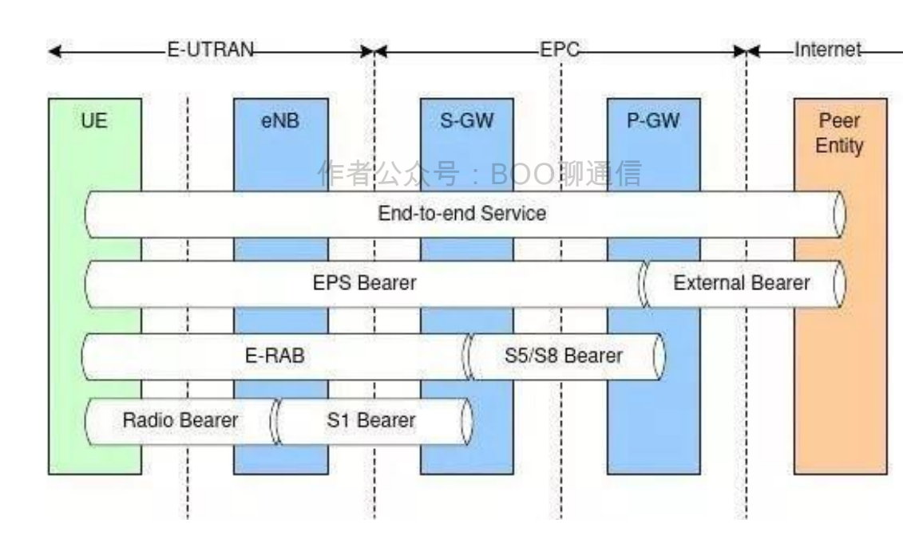
- 上图中展示的就是手机到核心网传输数据的路径，其中 UE 就是手机的意思（User End），而 eNB 就是 4G 基站，SGW、PGW 都是在网络中传递数据的一种设备，PGW 是把数据传递至互联网的设备，因此可以说运营商的移动网络基本管到PGW 就停止了。其中手机到 PGW 间的这段路径，被叫做 EPS Bearer，也就是 EPS承载。
- 而你手机与微信服务器之间、王者荣耀服务器之间、优酷服务器之间等等，所传输的所有数据，都要经过这么一条大马路，也就是 EPS 承载。
- 移动网络中是不是也能根据用户的付费情况选择走不同的承载呢？
- 答案是肯定的。EPS 承载的等级，就被叫做 QCI。不同的 QCI 等级，对应的道服务质量是不一样的
- 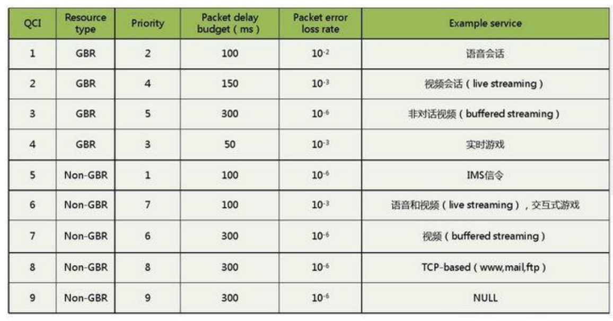
- 首先，并不是 QCI 等级越大或者越小道路就越好。不同 QCI 等级对应的优先级（priority）从图表中可以查到，这个数值才是越小越高级。而不同的 QCI 等级，主要决定的是三个因素：一是数据传输的时延（图表中的
Packet delay budget），二是数据传输的丢包率（图表中的 Packet error loss rate），三是数据传输的最低速率（图表中的 GBR/Non-GBR）。也就是说，如果你使用的 QCI=1 的马路传输数据的话，整个网络中的所有传输设备会保证你的数据包传输的时延低于 100ms，丢包率低于 1%，而且是可以给你一个保证的最低传输速率的（GBR，Guranteed Bit Rate），即使网络再拥塞也会比这个速率高。
- 咱们现在的网络中，在 VoLTE 语音诞生之前，虽然有这么多种定制化的高速公路可选，但是运营商把所有用户、所有应用的业务都放在了一条大马路上传输，就是 QCI=9 的这条不保证传输速率的马路。所以说一旦在演唱会啥的人多的地方，大家就都上不了网了。
- VoLTE 诞生后，运营商可不敢让语音和其他业务都挤在 QCI=9 这条大马路上啊，毕竟语音感知不好可不是闹笑话的，用户看视频卡一下，或者微博刷出来慢点一般都能忍忍，如果基站一拥塞，直接用户就掉话或者电话一点听不清，那就得骂娘了，运营商就把 QCI=1 这条高速公路利用起来了，专门给 VoLTE 也就是 4G 语音使用，这样一方面可以保证再拥塞也可以保留最低的语音传输带宽（GBR 的好处），另外呢，由于 QCI=1 的传输时延低，这样通话也不会出现不同步。
- 这也能解答为啥 VoLTE 也就是 4G 手机电话质量肯定是要比微信语音们好的，因为微信语音也是与其他所有数据挤在 QCI=9 这条大马路上传输的，如果网络拥塞、或者无线环境差，运营商的网络对于微信语音根本是没有保障的。

# 5g信号的显示
- 181
# 5g信号多路复用
- 188

# 神奇的OFDM
- 201
- OFDM 这种复用技术的出现，彻底改变了移动通信技术的历史，通过将不同用户的数据转换成互相正交的载波来传输，大大提升了频带的利用效率，使得数据传输速率飞跃式的提升。
- 后来几乎所有主流商用的无线通信技术都使用了 OFDM，包括 4G、WIFI（没错，你家连接同一个无线路由器的不同设备也是通过 OFDM 复用在一起的），以及 5G。、
  
# OFDM+NOMA 强强联手
- 213

- 5g三大应用场景
- 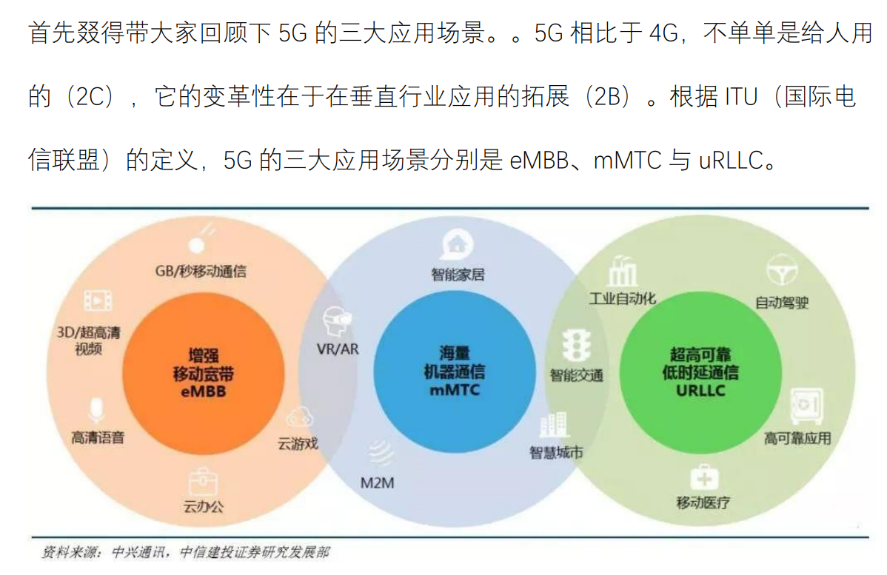
- 其中 eMBB 就是高速率应用场景，主要适用 2C 的 VR、AR、8K、云游戏等应用，mMTC 是大规模物联网应用场景，比如智慧城市、智慧工厂，uRLLC 是超低时延应用场景，比如车辆网、远程手术，后两者均是主要应用于 2B 场景，需要网络端到端的支持，也就是承载网、核心网都得换成 5G 设备了，网络变成SA（独立组网）组网了，才可以实现。
- NOMA（non-orthogonal multiple-access），翻译过来就是非正交多址复用，相当于是直接把他哥 OFDM 正交多址复用技术从技术原理就给否了。。意思就是，谁说在频率上正交的无线电波才能复用在一起传输？不正交的也能、

# 数据是如何在 5G 基站下传输的？
- ，一个完整的移动通信系统其实是包含无线接入网、承载网和核心网三个部分的，不论是 2345G 万变不离其宗。其中无线网是和用户直接接触的网络，也就是所谓基站与天线所组成、真正发射 5G 无线信号的网络。
- 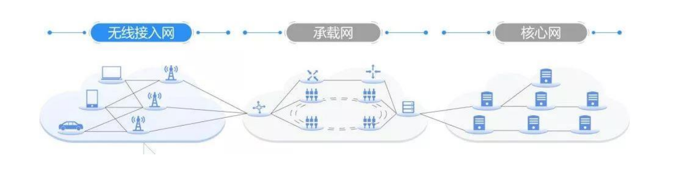
- 
- 而承载网和核心网，则是由在地下埋着的光纤线缆、运营商高度机密的各类机房中的各类电信级设备所组成的，对于用户来说基本是看不到且感知不到的。承载网在三张网络中更特殊一些，更像是无线接入网（也就是几百万的基站）与核心网（也就是核心网机房中各类很牛逼的设备）间传输数据的火车道，因此常常被忽略，于是 5G 网络可以简化成这个样子
- 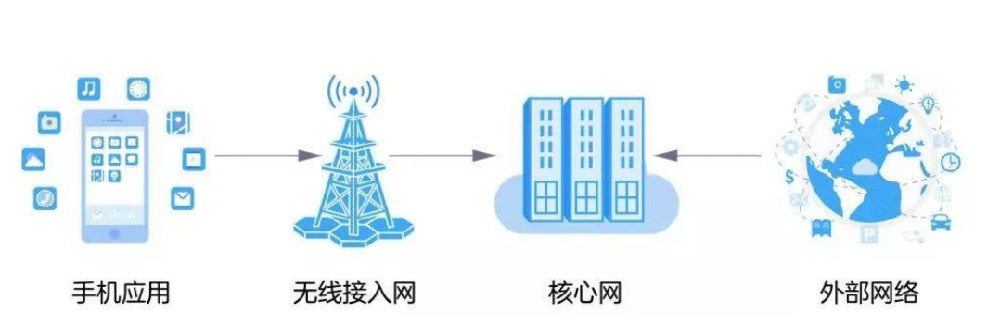
- 当李狗蛋点击了《庆余年》视频的播放按钮，手机会把腾讯视频 APP 这个播放请求（可能就是几 KB 的数据），转化成无线电波，通过无线电波上传到基站（无线接入网），随后由基站通过有线网络发送给承载网，再由承载网通过有线网络传送到核心网，最终才能走出运营商的庞大“内网”，走进外网，来到腾讯视频的存储《庆余年》视频数据的服务器。
- 现在的移动通信系统中，数据在地面下（光纤）地面上（无线电波）的传输速度都是与光速是一个量级的，因此几千甚至上万公里的数据的传输时间都是以毫秒为单位来计算的，1 毫秒等于 0.001 秒，所以对于普通用户来说根本感知不到这么一丢丢时延。
- 三张网络中变化最大、新技术最多的部分是无线接入网，原因就是目前制约移动通信网络速度、时延的主要瓶颈就在无线网络中
  
## 什么是基站
- 一套完整的基站系统，是由三部分组成的，分别是 BBU、RRU 与天线（天馈）。其中 BBU，也就是基站处理单元才是通信人口中真正的基站设备，而 RRU 与天线则是为了将无线电波发射到用户手机上的最后一道关卡
- 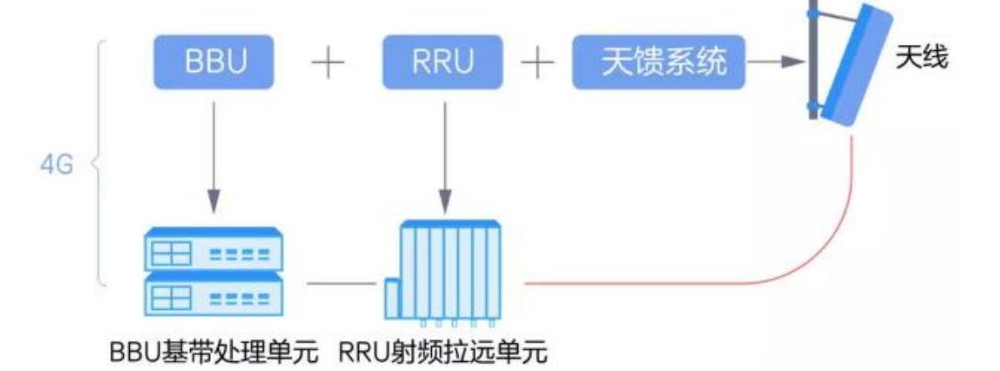
- BBU 用户一般是看不到的，因为 BBU 是外表上看上去像服务器一样的设备，被堆叠在运营商在各个不起眼角落里的无线机房中，BBU 的外型就是下面这个鬼样子。
- 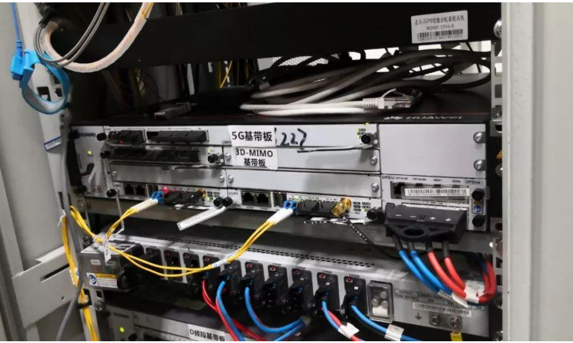
- BBU 是组成无线接入网的最核心部分，我们前面所讲的所有的 5G 关键技术，中的绝大多数实现（还有一小部分在 RRU 中实现）都是在这个和电脑主机差不多大小的铁盒子里完成的，而华为、中兴、爱立信等设备厂家在 5G 时代主要争夺的战场就是 BBU 战场。
- RRU 与天线，虽然也很重要，但技术含量远远不及 BBU。其中 RRU 射频拉远单元主要是为了能将 BBU 处理完的数据（被称为基带信号）转化成运营商所被分配的频段上的无线电信号，并给无线电加上足够大的功率，这样才能发射出去，而且能传播足够远（无线电的功率越大传播越远）。
- 一般 RRU 都和天线挂在一起，而不是和 BBU 放在一起。因为 BBU 和 RRU间是用光纤（可以用来传输基带信号）连接的，传播损耗极小，可以离远一些比如几百米或者公里级别
- 而 RRU 和天线之间是用馈线（用来传输已经被转换到高频上的无线电信号）连接的，损耗较大，所以不能传输太远。如果大家下回看到挂着天线的铁塔或者灯杆可以仔细瞅瞅旁边是不是还有这么个玩意。天线和“暖气片”中间的一坨坨黑线就是馈线
- 无线电信号最后要发射出去，就要靠经常被大家误认为是基站的天线啦。在整个基站系统中，技术含量最低、最便宜、但最影响用户实际感知的就是天线
  - 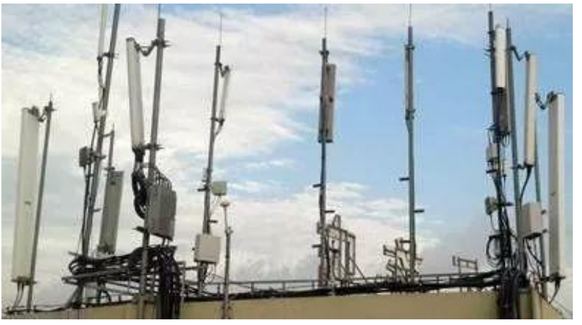

# 交互的艺术：双工
- 讲天线的 238
- 而 5G 建网中，真正能让华为、爱立信、中兴等设备商赚的盆满钵满的也正是卖基站。因为基站以及其配套设施，正是 5G 网络的主体，而且需求量太太太大了。
- 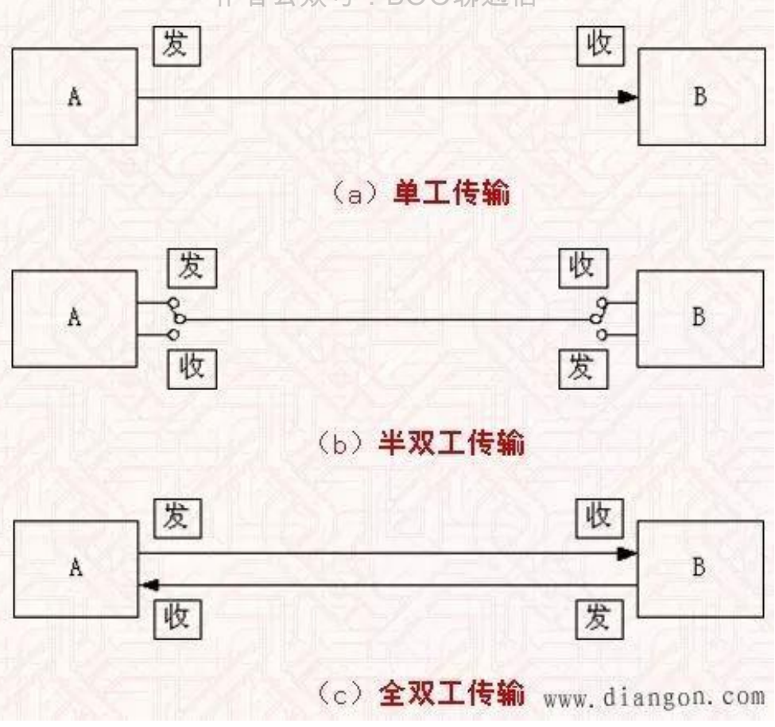

# —TDD or FDD，5G 怎么选？
252

# 5G协议栈
- 数据在手机（UE）和 5G 基站（gNB）间传输时，要经过 5 层协议，从上到下，分别是 SDAP 层、PDCP 层、RLC 层、MAC 层、PHY 层。
- 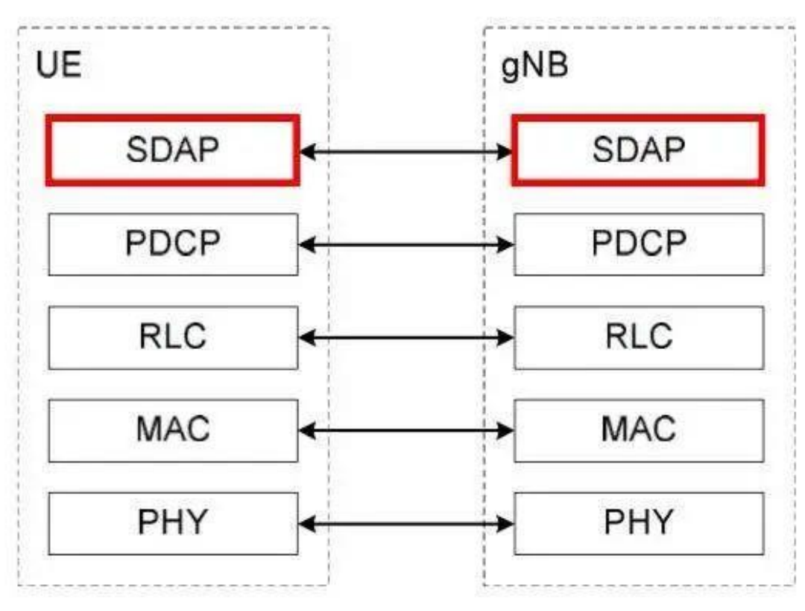
- 应用数据（比如你的微信聊天内容），在每一层都要经过不同的处理，添加上对应的包头，最终才会在 PHY 层被调制成无线电波发送到基站。
- 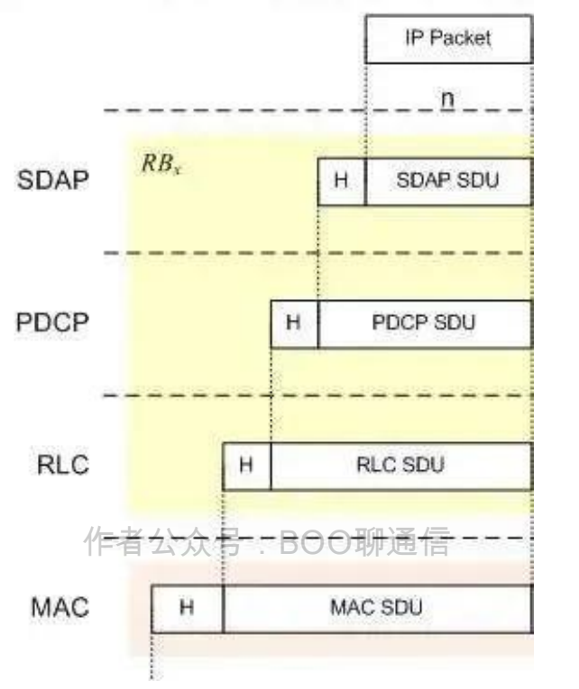
- 基站接收到数据后，也要层层处理解读包头内容，最终才会将剥光各层包头的应用数据再转发到传输网、进而转发到核心网
- 这还只是用户数据。如果是基站和手机之间的控制信令，就是用来沟通数据要咋传的对话数据，又要走另一套协议栈，如下：
- 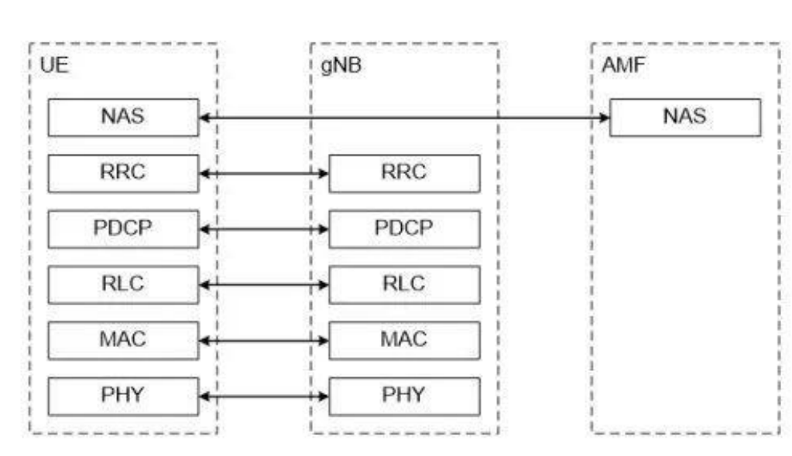
- 其实下面四层都相同，就是最上层的 SDAP 没了，变成了 RRC 和 NAS，而且，NAS 层似乎并不在基站停留，直接转到了核心网的 AMF。
  

- 具体内容，下节课说 文章内容结束