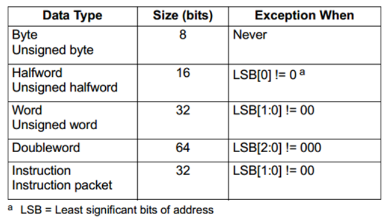

- 资料总集：https://blog.csdn.net/u010182064/category_2745423.html
- 学习目的：理解高通dsp所使用的汇编语言，读懂基带固件汇编结果
# Qualcomm_HexagonDSP开发入门与提高概述
- https://blog.csdn.net/u010182064/article/details/41592561
# HexagonDSP的简要硬件与指令介绍overview（1）
- https://blog.csdn.net/u010182064/article/details/41675131
# Qualcomm_HexagonSDK初入门
- https://blog.csdn.net/u010182064/article/details/41754357
# Hexagon DSP的所有寄存器
- https://blog.csdn.net/u010182064/article/details/43154161
# Hexagon DSP的指令集
- https://blog.csdn.net/u010182064/article/details/44138703
# Hexagon对数据的操作指令（没有完全看懂）
- https://blog.csdn.net/u010182064/article/details/44773623
# Hexagon处理器的一些特殊操作（没有完全看懂）
- https://blog.csdn.net/u010182064/article/details/44788565
# HexagonDSP的内存操作
- https://blog.csdn.net/u010182064/article/details/45970307
# Hexagon DSP的十二种寻址模式
- https://blog.csdn.net/u010182064/article/details/46009441
# Hexagon处理器的条件执行机制
- https://blog.csdn.net/u010182064/article/details/47381153
# Hexagon的程序执行顺序（一）
- https://blog.csdn.net/u010182064/article/details/47426785
# Heagon的程序流程（二）
- https://blog.csdn.net/u010182064/article/details/47682293
# Heagon的软件栈
- https://blog.csdn.net/u010182064/article/details/47789049
# Hexagon处理器的特殊功能
- https://blog.csdn.net/u010182064/article/details/47835695
# Hexagon处理器的指令编码
- https://blog.csdn.net/u010182064/article/details/48549351
# HVM，Hexagon处理器的虚拟器解决方案
- https://blog.csdn.net/u010182064/article/details/49120359
# HVM下的两种模式-用户模式与访客模式
- https://blog.csdn.net/u010182064/article/details/49120715
# HVM的初始化状态
- https://blog.csdn.net/u010182064/article/details/49230285
# HVM的事件模型
- https://blog.csdn.net/u010182064/article/details/49231561
# HVM的缓存与内存控制
- https://blog.csdn.net/u010182064/article/details/49339803
# HVM的中断与异常处理
- https://blog.csdn.net/u010182064/article/details/49339703
# HVM的虚拟处理器资源管理
- https://blog.csdn.net/u010182064/article/details/49492303
# HVM的调试方法
- https://blog.csdn.net/u010182064/article/details/49492707
# HVM的常用虚拟指令与详解
- https://blog.csdn.net/u010182064/article/details/49509897

- 以上资料部分来源于高通官网提供的hexagon 程序员参考手册，手册中对dsp汇编指令进行了详细介绍

- hexagon处理器属于32位小端
- 数据类型以及对应位数
  - 
- 通用寄存器
  -     
  - 栈寄存器
  - 
- 控制寄存器
  - 
  - gp 全局寄存器 The Global Pointer (GP) is used in GP-relative addressing. For example
- 栈帧结构
  - 
- 分配与回收栈帧
  - allocframe：分配堆栈帧。该指令在调用后使用。它首先将 LR 和 FP 推到栈顶。然后它从 SP 中减去一个无符号立即数，以便为局部变量分配空间。 FP 设置为堆栈上旧帧指针的地址。汇编语法中表示的立即值指定字节偏移量。该值必须是 8 字节对齐的。有效范围为 0 到 16 KB
  - deallocframe：释放堆栈帧。该指令在返回之前使用，以释放堆栈帧。它首先从 FP 的地址加载保存的 FP 和保存的 LR 值。然后它将 SP 指向前一帧。
  - dealloc_return：子程序返回堆栈帧解除分配。执行deallocframe操作，然后执行子程序返回（7.4.3节）到deallocframe从链接寄存器加载的目标地址
  - allocframe 和 deallocframe 将 LR 和 FP 寄存器加载和存储在堆栈上作为单个对齐的 64 位寄存器对（即 LR:FP）
- call指令执行后，会将pc赋值为之后要执行的指令的地址，并将返回地址保存到lr寄存器中
- 条件寄存器P3:0，一共四个条件寄存器p0 p1 p2 p3 每个寄存器8位，用于保存标量和矢量的对比结果 P3:0可以作为一个32为寄存器被使用
  - 
- 函数的第一个参数以及返回值似乎用r0传递
- 跳转指令使用过程中可能会根据其后的后缀用于表示跳转发生的可能性
  - 提示可以通过指示在程序过程中预期如何执行推测性跳转来提高程序性能：指定的提示越频繁地指示指令实际执行的方式，性能就越好。通过将后缀“:t”或“:nt”附加到跳转指令符号，以汇编语言表示提示。例如： ■ jump:t – 跳转总是发生 ■ jump:nt – 跳转不总是发生