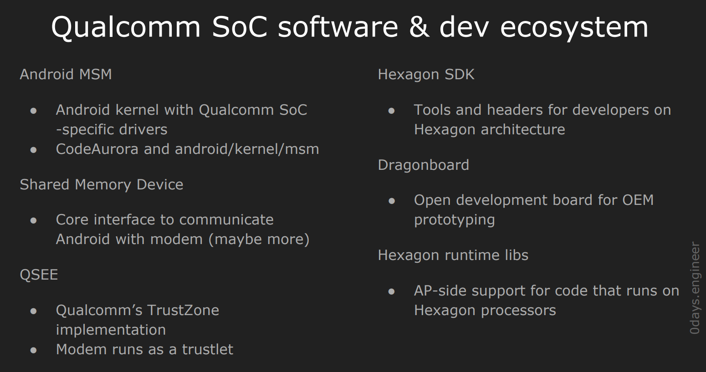
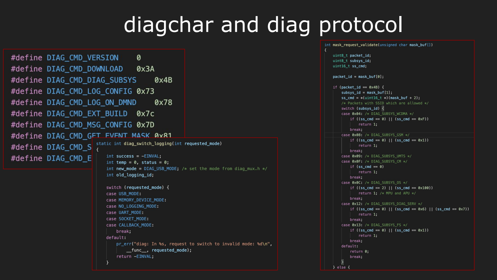
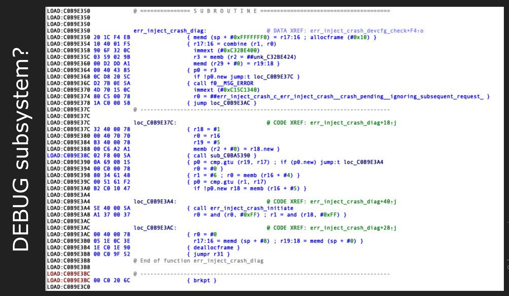
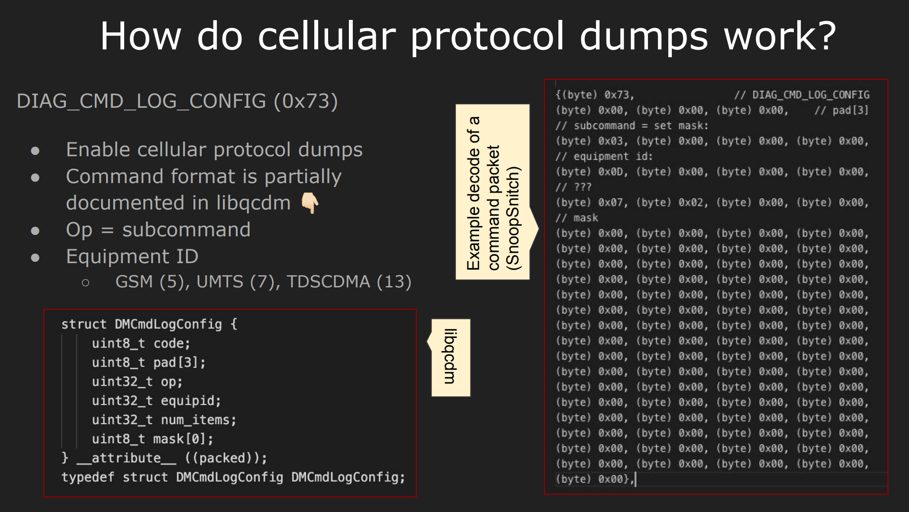

- 一句话总结，开发了diagtalk框架，与手机中/dev/diag进行交互，从而接受基带运行过程中输出的log字符串信息，即是实现了基带的log输出

- 需要研究diag驱动程序！！！！！！！！！！！！！！！！！！！！

• Advanced Hexagon Diag and getting started with baseband vulnerability research, 2020, Alisa Esage ***该研究很有用***
  - https://www.youtube.com/watch?v=94NwlrtGF7I

- 研究目标是nexus 6p

- 
- 该演讲致力于 基带中的一般漏洞研究，但本次演讲的主要焦点是六边形诊断，也称为 qcdm 高通诊断管理器，这是高通开发的专有协议，用于其基带，并且包含在所有 snapdragon 中
- 本次演讲的主要焦点是现代国家和制度Qualcomm DIAG (QCDM) 的内部结构，专有基带管理和诊断协议包含在所有 Snapdragon SoC (SDxxx) 上的高通基带操作系统以及MDM/MSM/SDM 蜂窝调制解调器芯片
- 现代高通蜂窝调制解调器在定制硅胶上运行(QDSP6) 以及名为 Hexagon 的 Qualcomm 专有 ISA，所有 Qurt RTOS 代码均由其中编写，包括 DIAG 处理程序和 OTA 载体
-  对基带漏洞进行一些概括性概述为那些真正阅读幻灯片的人进行研究

- 
在过去的三年里，我致力于虚拟化和管理程序漏洞的研究和利用
开发人员。 2019 年初，我刚刚完成了一个关于 Microsoft Hyper-V [HYPERVISORS] 的小研究项目，
对虚拟机管理程序感到厌倦，并寻找一些新的、具有挑战性的东西来让我的大脑思考
短期的干扰。
基带面临的挑战与虚拟机管理程序的原因相同，但程度更大：
技术堆栈极其广泛且多样；数据流跨越多个权限边界；
最低级别的操作处于纯物理的边缘；超低级访问的组合
远程无线攻击向量的要求。
基带不允许进行琐碎的调试内核，这对于低级黑客来说是一个立即有趣的挑战
在大多数现代 OTS 实现中，JTAG 已融合，而基带操作系统则没有导出任何内核调试工具（类似于 iOS）
另外，我有一个旧的 USRP B100（原文如此！），来自我的黑客空间基础时期，需要一些良好的使用
让我们开始吧

- 
- 完全忽略了服务器因素，只看ue端

- 
- 两个要点
  - 1g2g3g中的g仅仅代表不同技术代际，对用户而言没有严格技术含义
  - Air interface即空口协议是最底层的协议，规定蜂窝信号信号如何准确地数字化和从电磁波中读取，以及该领域的不同参与者如何准确地划分空间，历史上有两种这种低级别协议的两种主要实现 tdma和cdma
    - 补充 多址技术分为频分多址（FDMA）、时分多址（TDMA）、码分多址（CDMA），可以自己查询
    - cdma由高通开发，主要用于美国
  - 2g中有两种主要协议 GSM(基于tdma) cdma one（基于cdma）
  - 3g中两个分支继续进化，gsm进化为UMTS , cdma one进化为cdma2000，注意此时gsm中已经使用到了cdma的低级空中接口协议
  - 4g中上述量分支共同开发出lte
  - 5g也是类似
  - 上述空口协议在所有基带中都会存在，且一定存在对应的解析算法，这是攻击面
  - 协议之间并不是完全不同的（由于进化的过程）所以如果你考虑一下LTE，它并不是与GSM完全不同的协议，而是它很大程度上基于相同的内部结构，事实上，如果你看一下规范，其中一些几乎与GSM的规范直接相关

- 
- L3层攻击面最有趣，因为其处理了大量高级协议，例如sms gsm ，实际上包含处理 tlb 值等有趣的数据结构的数据代码

- 
- 基本上是ap mp分开分别运行各自操作系统
- 基带实现过程中基本上都会受到TEE保护（安卓：TrustZone 苹果SEPOS），基于此即使获得ap中linux内核级别权限，ap仍无法访问基带内存或进行相关操作，同时，基带也无法直接访问ap，两者相互不信任
- rtos中三个攻击面
  - 蜂窝协议栈:一般是运行在rtos的几个任务中
  - 大量管理协议：
    - 例如AT协议通常存在于所有基带中，甚至暴露给ap，从而直接向ap发命令
    - 例如厂商特定的协议，例如诊断协议，由于基带极度复杂，故供应商需要专门的协议进行配置和诊断
      - 高通中diag是众多诊断协议之一，
  - RTOS
    - 其中实现的与ap接口的代码
- ap中的攻击面
  - soc外围设备驱动
  - ap中用于与基带通讯的接口 （高通使用共享内存，非常复杂，该共享内存是双方共同的攻击面）
- 可信环境的攻击面,因为基带运行在可信环境中，所以可信环境方面的问题也是一个攻击面
  - 安全管理器的调用程序call handlers 该调用会从ap到基带
  - trustlet，由TEE执行和保护的独立代码片段。
  
- 
  - 蜂窝网络中的数据编解码器可以由蜂窝堆栈实现，也可以有rtos实现，特别是asn1

- 
- 上述攻击面已经有了一些成果

- 
- 注意sdr的通讯技术的实现落后于技术的发展
- 目前不存在用于实现CDMA基站的软件实现

- 
- 高通基带为什么难
- QDSP6 / 六角形
● 陌生的架构
  ○ VLIW，比CPU更接近GPU
  ○ 与 x86/ARM/MIPS 非常不同
● 无反编译器
  ○ 只能反汇编
● 无QEMU 完整系统模拟
  ○ 想要！
● 无二进制补丁差异
对比。
●三星香农（举例）
  ○ 按需内存转储、下载器模式，熟悉的架构，大量日志字符串、反编译器、二进制比较
● 调试
  ○ 现成的设备带有固化的保险丝，
  ○ 基带 RTOS 运行在单独的芯片，受 QSEE TrustZone 保护
  ○ 没有调试，没有故障转储，不能读取 mDSP 存储器
● 逆向工程
  ○ 巨大的二进制文件
  ○ 无调试符号
  ○ 晦涩的 RTOS
  ○ 部分代码被压缩 /重定向
  ○ 无日志字符串

- 
- 早期高通营销材料中有此类架构图，现在没有了
- 针对Snapdragon 820E的框架，我们主要关注处理器，包括
  - 4个基于arm的cpu，作为ap
  - adreno gpu
  - 多个hexagon处理器，例如mdsp adsp cdsp

- 
- VLIW 多条指令可以在单独的执行单元并行执行
- 同时使用了硬件多线程实现并行
- 
- 更多关于hexagon，参照指导手册
  - https://developer.qualcomm.com/download/hexagon/hexagon-v62-programmers-reference-manual.pdf
  - 80-n2040-36_b_hexagon_v62_prog_ref_manual.pdf

- 为何高通要开发hexagon架构
- 技术的未来在于优化数字信号处理。日益增长的要求
VR 带来的图形、在线流媒体带来的媒体编解码器不断增长的需求、人工智能（AI）
神经网络处理和深度学习。
尤其是人工智能。这项技术正以惊人的速度发展，并呈现出多种趋势
同时。当前的趋势之一是将 ANN 处理卸载到最终用户设备，而不是
在云中运行它。虽然对专业人工智能硬件的需求已经存在一段时间了，而且很高
在地球上每个主要芯片供应商的议程上；但随着卸载的趋势，它进一步
缩小到对紧凑且具有成本效益的可插入专用芯片的要求
进入移动设备。
深度学习在具有有理数的巨大矩阵上运行，其中常见的 CPU 架构
非常糟糕。 SIMD 无法解决这个问题。芯片组供应商开始致力于专门的 NPU 架构，
与此同时，软件供应商迫于市场需求的压力，被迫在 GPU 上运行 ANN。但
GPU 不是为此而设计的。仍然需要专门的硬件来实现具有成本效益的人工神经网络操作。
结果：Hexagon 作为一款针对蜂窝网络的一体化、经济高效且优化的 DSP，几乎没有竞争对手
信号转码、硬件加速音频和视频、传感器处理和人工智能

- 
- 正如我所说，生产熔断的概念很常见，以前移动设备供应商的常见做法是在设备进入市场之前锁定设备，以防止修改和修补，
- 为实现锁定，通常是将各种高级诊断和调试功能从软件或硬件中移除
- 很常见的是，这些功能仅从软件中删除，而硬件保留在这里，在这种情况下，研究人员提出他们自己的基于软件的实现从而使用此类功能，例如一些ios内核调试器，在高通的情况下，在某个时候有一份泄露的内部备忘录，其中讨论了他们在生产融合设备方面到底做了什么，
  
- 
- 在现代的安卓的生产熔断中，基带在baseband内运行，在我的实现中，它已经被完全锁定，它使用一个单独的组件，基带使用一个名为 mba 的单独组件，即调制解调器基本身份验证器，整个事情是由android 内核的PIL子系统运行的，能找到其源代码并研究它，
- mba用于验证基带，故无法任意注入代码并刷新到基带，这使得注入数据到基带很困难，唯一的办法是基于漏洞去实现

- 
安卓MSM
  ● 采用高通 SoC 的 Android 内核
  -特定驱动程序
  ● CodeAurora 和 android/kernel/msm
共享存储设备
  ● 通讯核心接口带调制解调器的 Android（也许更多）
QSEE
  ● 高通的TrustZone实现
  ● 调制解调器作为 trustlet 运行
hexagon SDK
  ● 供开发人员使用的工具和标头六边形架构
龙板
  ● 面向OEM的开放开发板原型设计
Hexagon 运行时库
  ● AP 端对运行于其上的代码的支持六边形处理器

- 
- 固件提取
● unify_trustlet
● pymdt
反汇编
● 多个 IDA Pro 插件可用
  ○ GSMK
● 通过Hexagon进行原始反汇编软件开发工具包
  ○ 对象转储
● mDSP：缺少关键部分OTA矢量代码（解压&在运行时重定位）
  ○ q6zip
逆向工程分析 (mDSP)
● 从一些根点开始
  ○ RTOS 任务结构
  ○ 分配原语（很多）
● IDA 脚本添加 Qshrink’ed调试日志字符串
  ○ 之后您可以找到感兴趣的代码通过grep
调试
● 没有开箱即用的
  ○ JTAG – 融合在生产设备上
  ○ Qcombbdbg – 用于过时的 ARM 实现
  具有可用的 Diag R/W 命令
  ○ 可能通过漏洞利用

- 从谷歌官网下载固件（OTA镜像），找到与基带相关的二进制文件
  - https://developers.google.com/android/ota?hl=zh-cn#angler
- 基带相关固件被分为多个二进制文件，可以使用unify_trustlet将其合并为一个文件
- 可以加载到ida中，作者使用gsmk插件支持hexagon反汇编
- 基带中部分代码被压缩和重定位，故除非解压，否则无法静态分析，具有挑战性，因为高通使用内部的压缩算法
- 逆向过程中，针对rtos，先定位任务结构体，以此定位有趣的处理代码，对于hexagon，其没有log字符串，故比较困难，即使定位到任务结构体，因为没有log字符串，故无法确定其代码功能
- 逆向分析第一步要恢复log字符串，log字符串被qshrink4工具从二进制文件中移除，唯一的恢复方式是使用msg_hash.txt文件，该文件来自泄露的高通源码，正常来说不应该被获取（大多数日志字符串由链接器阶段删除
工具Qshrink4，替换带有 MD5 哈希值）
- log字符串恢复成功后可以重命名一些函数，因为log字符中常常包含代码源文件、源模块的名称（我知道到在哪里找到高通泄露源码，好像下载过）
- 调试并非不可能，但是需要几个月的工作，最好的办法是建立基于软件的调试器即一个modkit（gongxilin实现的，基于一个基带自身或身份验证器或trustzone的软件漏洞）从而将代码注入基带，并在远端连接gdb调试

- 
- 大多数日志字符串由链接器阶段删除工具Qshrink4，替换带有 MD5 哈希值
- 使用泄露的源码中的msg_hash.txt文件 将hash值替换

- 
- 恢复log字符串并重命名函数后，可以得到数百个diag相关的函数
- 也可以得到OTA相关函数，但此类函数绝大多数位于特定段中，该段数据被压缩和重定位，无法静态分析

- 
项目中期反思
对于 1 个月的项目来说太难了；严重的vulndev是不可能的
我还能在规定的时间内做出一些有趣且有用的东西吗
分配？
也许启用调试日志记录？使用文本字符串，而不仅仅是协议
转储。看看基带到底在做什么应该很有趣，并且
这并不简单，因为日志字符串被剥离了
另外：ramdump

- 
构建并刷新 Android MSM 内核 ✅
  ● 没什么特别的，只是一个常规的交叉构建
固件降级✅
  ● 琐碎
构建 qcom 固件 ⚠
  ● 时间不够了，可能是错误的来源
  ● 有人刚刚在私下谈话中证实这是可能的，会再试一次
内存转储 🚫
  ● AP 内核回调不存在 +产品融合？
Shady Q* 诊断工具 ❌
  ● QPST、QXDM 等。
  ● 跳过此部分
龙板❌
  ● 保存以供稍后使用（也许）
  ● 对于漏洞利用开发，您需要调试被攻击的实际设备，而不是一些抽象的高通调制解调器芯片
劳特巴赫调试器 ⚠
  ● 对于产品设备无用，已跳过
  ● 将再次检查我是否可以绕过JTAG熔断
- 成功交叉编译msm内核
- 固件和基带的降级攻击一定是有效的
- 通过泄露代码构建了高通固件

- 
  - 调试日志记录位于二进制代码中，肯定以某种方式使用了它吗？
  - 可以启用选择加入吗？它将登录到哪里？是否导出到Android核心？
  - DIAG 协议对于配置来说似乎很强大，这可能是答案吗？

- 
概述
● Qualcomm 专有协议 蜂窝调制解调器 RTOS 管理
● 与 QMI 和其他Q 协议一起
● 理论上约 200 个命令
历史
● Libqcdm/ModemManager
  ○ ~2010年，部分逆向
● CCC2011，纪尧姆·德吕格雷
  ○ Diag消息格式+HDLC
  ○ 一些有趣的命令
  ○ 大部分与基带无关
应用领域
  ● OEM 开发人员的高级调试
  ● 基带固件重配置
  ●（已过时）强大的诊断工具:例如下载模式、直播模式、转储、内存读/写
进攻视角
  ● 来自AP 的本地EoP 攻击向量 ap内核到基带 RTOS
● 常见场景：移动运营商解锁漏洞
● 场景#2：利用该漏洞启用自定义软件调试器注入

- 突然象到部分ppt和白皮书中讲到diag协议，似乎该协议很强大，可以用于重新配置基带
- 尝试使用协议开启log转储功能
- Qualcomm Diag / QCDM 是一个东西，用于高级基带软件配置和诊断
- 主要针对OEM开发
- 理论上至少支持200多个命令，根据资料，甚至支持download模式和读写内存
- diag在2010年被逆向，且被包含在调制解调器管理器（ModemManager）的开源项目中
- 它也被 在 guillain-barre 举办的 2011 年通信大会上的演讲中展示，但是相关信息与设备基带不相关，代表了应用程序处理器到基带本地攻击向量，
- 该协议常用于将锁定于特定移动服务的手机设备进行解锁，在直接协议中发现内存损坏漏洞，则可以直接在基带上执行代码并更改一些设置，这通常是通过 80 个通用处理程序完成的，但内部 专有协议也非常方便
- 此外该协议可以用于注入基于软件的调试器，若能在diag中发现内存读写相关漏洞，可以注入hook代码，最终连接到gdb，这样即使jtag不可用，也能调试

- 
公开信息
  ● 基于ARM
  ● 实时操作系统REX
  ● 下载器模式*
  ● 存储器读/写命令*
  ● 实时快照*
  ● 直接访问通道USB*
--
* 可能仍然与不知名的 OEM 设备相关，该设备用于Qualcomm MDM/MSM 芯片上
当前状态
● 基于QDSP6/Hexagon
● 实时操作系统 QuRT
● 无下载器模式*
● 无内存RW*
● 无实时快照*
● 无USB通道*
○ 可以在某些（？）上通过boot设置启动？？？
--
* 与现代生产设备相关（在 Nexus 6P 上测试，预计在 Google pixel和其他一切上都是用）
- 历史上高通基带基于arm 操作系统为rex，且diag支持多种命令模式，现在高通基带基于hexagon， 使用qurt作为系统，diag高级命令被删除，且不暴露可连接的接口（usb））（似乎通过添加特定boot设置可以开启usb连接）
- 作者研究基于nexus 6p ，属于中等防护，pixel等更更现代的设备有更高级的防护，通过是一些无名设备例如开源调制解调棒可能更容易调试

- 
- 左边是安卓系统，右边是基带系统
- diag不仅仅ap可以发送命令到基带，基带也可以给ap发送消息
- 它们的命令并不是真正的命令，它们更像是令牌，也可用于对消息进行编码。
- 绿箭头表示一个基带到ap的数据流
- 基带中diag task用于管理diag，用于处理于diag协议相关的各种操作
- diag任务与其他任务之间使用ring buffer交互
- 在log输出的例子中，其他任务通过调用指定api将log信息输入ring buf ，diag任务从ring buf中取出数据（通过软中断或定时器），此时数据将被包装到 dia 协议中，从那里它将发送到SIO 任务中（负责串口io），并发送到特定接口
- 当前正在研究位于安卓内核中diagchar驱动的共享内存
- ap向基带发送数据的过程与上述相反
  - 制造diag数据包发送给diag驱动，驱动将数据写入共享内存，从那里数据进入基带特定的任务
  
- 
概述 
  ● diagchar + diagfwd 内核驱动程序 高通 MSM Android 内核
功能 
  ● 支持Diag 接口 ● 多路Diag 通道到USB 或内存设备
  ● 到用户区的 IOCTL 接口 ● 屏蔽不必要的 Diag 命令
实现方式 
  ● 基于SMD/SMEM共享内存设备（MSM 特定）
- 安卓中/dev/diag表示diag
- diagchar驱动用于支持diag接口，代码很复杂，但功能很简单，包括一些在基带中可以配置的基本diag命令，能够将diag信道通道多路复用到 USB 或内存设备，它还包含一些ioctl详细信息，用于可以从android用户界面访问的配置
- 驱动中删除了部分命令，当您需要发送特定diag命令时，需要重建diag驱动从而删除其中的屏蔽，否则命令不会到达基带侧
- 核心diag驱动基于smb共享内存接口，该接口是高通基带的核心接口

- 
- diag的实际位置，即位于管理协议的位置
- diag驱动位于ap，是厂商特定的驱动，基带中有一些共享内存的实现用于处理diag，基带中还有diag的实现本身

- 
- diagchar驱动用于支持diag接口，代码很复杂，但功能很简单
- 它确实实现了一些ioctl，这些ioctl启用了一些配置，还未检查该ioctl具体做什么，这些ioctl暴露了/dev/diag设备，以可写的方式

- 
- 默认情况下无法访问diag信道，因为存在diag_switch_logging函数，该函数将信道切换到用于diag通讯的信道 diag_switch_logging函数有很多模式，但实际上仅支持usb模式（默认模式）和共享内存设备模式
- 这就是为什么如果您只是打开设备diag驱动程序并尝试从中读取某些内容，它将无法工作，它会被束缚到 USB，为了重新配置它以使用存储设备，您需要发送一个特殊的ioctl 代码，该过程称为名称掩码请求验证，它对您尝试通过此接口发送的命令采用相当严格的过滤，因此它会过滤大多数核心请求，除了一些基本配置请求

- 
- 核心diag驱动使用共享内存设备与基带通讯，smd实现十分复杂，它公开了 smd 读取api，实际使用该API用于从共享内存读取数据
- 共享内存的一个api也对通道的阻塞进行操作，这些通道是通过名为smd的api名为open an edge访问的，所以你可以注意到这里有一些直接可以打开的特定通道

- 
- 现在让我们看一下 在 smd实现中，这有点重要，因为共享内存设备代表从调制解调器升级到应用程序处理器的攻击面的一部分，这是一个非常重要的攻击面，因为如果您只是在基带实现代码执行，那么它几乎毫无用处因为它无法访问主操作系统，为了使其有用，您需要将它们链接起来以创建一个漏洞利用链，并且基于该块的另一个漏洞利用
- 综上内存共享设备是实现从基带到ap提权的攻击面

- 
- 共享内存设备的实现由高通外设暴露出来，专门的 msn 驱动程序将映射它，驱动程序名为smem_ram_phys，该驱动是共享内存的基础

- 
- 共享内存区域基于条目和通道的概念进行操作，其被分为远程部分（可以通过smem_get_entry程序访问）
- 其中一个条目是smem_channel_alloc_tbl，其中包括了可打开的可用通道列表，从这里我们可以打开channel并且使用内存共享接口

- 
- 研究整个高通生态系统并不是我的目标，所以当我准备这次演讲时，我注意到源代码中一些更有趣的事情，例如处理jtag的驱动程序，该驱动似乎由高通系统中某些芯片所暴露，从驱动来看，主要用于读数据，作者不认为可以写数据，不过值得检查

- 
- ● SnoopSnitch（开源） ● 可以在 root 设备上启用协议转储 ● 通过利用的 /dev/diag 接口发送模糊的 QCDM 命令 blob 👉🏻 ● 更改基带固件配置 ● 您能解释一下这个命令 blob 对您的手机到底做了什么吗电话？ ● 我很好奇
- diag协议被用在很多其他开源项目中，而不仅仅是之前说的Libqcdm
- SnoopSnitch (open source) 该工具 Can enable protocol dumps on rooted devices
- 为实现协议dump 该工具发送 blob数据(包含diag命令)到/dev/diag接口，这个块是正常的没有记录所以这让我很好奇这些命令到底在做什么

- 
- 但是在我们查看转储之前让我们了解协议，Diag 协议由大约 200 个命令或令牌组成，其中一些已在开源中记录，但不是全部，因此您可以在屏幕截图中注意到一些注释丢失，其中丢失的注释之一实际上是十六进制的令牌，它表示编码的哈希日志消息

- 
- 通用格式非常简单，其基本原语是diag令牌编号0x7e，它并不是真正的分隔符，它是一个单独的diag命令(0x7e即126) 开源代码中没有0x7e对应的解释，正如上图中所示。diag 命令是嵌套的，外层由0x7e十六进制的包装器组成，然后是主命令，然后是一些可变长度数据，可以包含更多子命令，这整个命令是使用 crc 验证的，并且一些字节被专门转义，你可以在代码片段中看到

- 
- 基带子系统的诊断系统扩展 
  - ○ ~100 个子系统 + OEM 保留 
  - ○ 子系统可以使用 DIAG 任务注册其自定义处理程序 
  - ○ 数据包不透明 
  - ● DIAG_CMD_SUBSYS = 75 
  - ● struct { ○ u8 subsys_id; ○ u16 子系统命令； ○ 有效负载（可变长度）}
- diag协议支持子系统扩展，基本上基带中不同的子系统都可以注册它们自己的diag处理函数，并且有一个特殊的diag命令75，它简单地转发指令，即diag系统将此命令转发到相应的子系统，然后它将在那里进行解析。

- 存在相当多的子系统，但有些未被文档公开，通过调查发现存在DIAG subsystem subsystem（18）以及DEBUG（37）子系统，对后者很好奇，尝试通过该系统开启一些高级调试功能

- 
- 
- 但事实证明调试子系统非常简单，它只支持一个命令 注入崩溃，所以你可以发送一个特殊的直接命令，这会将崩溃注入基带

- 
- 查看一个diag协议例子
- 这是来自 snoop snitch 的注释片段
- 这个blob实际上由三个逻辑部分组成 
  - 第一部分无关紧要，它是命令用于请求来自基带的各种信息，例如时间戳版本和version、buildid等
  - 第二组注释以命令号 0x73 开头，这是diag的日志配置命令，该启用协议转储并配置它们，
  - 该 blob 的第三部分以命令号 0x7d 开头，这是消息配置的diag命令，这实际上是应该启用文本消息登录的命令，除了在监听告密的情况下，它会禁用 所有日志记录都在一起
- 这部分没有听太懂

- 
- ● 启用蜂窝协议转储 ● 命令格式部分记录在 libqcdm 👇🏻 中 ● Op = 子命令 ● 设备 ID ○ GSM (5)、UMTS (7)、TDSCDMA (13)
- 那么，蜂窝协议转储实际上是如何工作的，为了启用蜂窝协议转储，我们需要一个diag命令log配置号 0x73 它部分记录在 lipqcdm 中,数据包的结构将包含代码、子命令（将设置掩码），在这种情况下，它还需要一个设备 ID，该id值与要转储的特定协议相对应的，最后是用于过滤转储某些部分的掩码，这部分相对简单

- 
- DIAG_CMD_EXT_MESSAGE_CONFIG (0x7D)
  - 启用/禁用和配置文本消息日志记录 
  - ● 命令格式未记录 
  - ● 对子命令进行操作 
    - ○ 设置日志记录掩码 
  - ● 日志掩码 
    - ○ 根据报告的消息日志级别按位应用  
    - ○ 掩码 0x0 禁用所有日志记录，0xFFFFFFFF 启用所有日志记录
  - ● SSID
    - ○ 按子系统 ID 过滤 
    - ○与 DIAG 子系统不同
- 第二个命令是diag文本消息配置命令（对应0x7D 即DIAG_CMD_EXT_MESSAGE_CONFIG），该命令开启文本消息log输出，该消息格式未公开
- 此处存在一个子命令 0x4，用于设置掩码，之后是两个16位整数，表示ssid start 和 ssid end（ssid是子系统id，与diag子系统不同），最后一个是掩码，
- 因此子系统 id 用于根据特定子系统过滤消息，因为基带有大量的子系统，如果所有子系统都开始记录，这将是大量的数据
- 此处python代码用于开启所有子系统的消息日志，会产生很多日志消息

- 
- 现在，为了解析传入的日志消息，有两种类型diag令牌中，它们都没有记录，
- 第一种 DIAG_CMD_LOG_MESSAGE (0x79/121)
  - 简单的基于asc的消息，通过diag接口到达，故可以直接解析
- 第二种 DIAG_CMD_LOG_HASH (0x92/146)
  - 这是对日志消息进行编码的令牌，该令牌仅包含哈希值，可以通过msg_hash.txt文件解析
- 两者结构类似
  - 第一字节cmd字段
  - 第三字节参数数量
  - 64bit的时间戳
  - 16bit的ssid
  - 最后是ascii字符串或log字符串hash
  - 可以包含一些参数，位于两种消息的不同位置

- 
- 这是一个diag数据包，至少在理论上使您能够将崩溃注入基带，因为在我的情况下它不起作用
- 我所说的不工作是指它对基带没有任何作用，通常是期望该消息能在生产设备中触发并获得crashdump
- 它应该能在其他一些设备上触发crash，所以值得检查一下，您可以通过这种方式请求几种类型的崩溃

- 
- 
- 
为了实现这一点，我需要一个非常简单的工具，基本上有两个功能，首先是直接轻松访问 diag 接口，理想地通过某种 pythonshell，其次是能够使用高级日志字符串读取和解析数据，为此我编写了一个简单的框架，我将其命名为 diag talk，它直接基于android 内核中的 dev diag 接口
- 因此左侧是一些带有链接值的高级解析的示例，右侧是高级消息日志的示例，其中包括从中提取的日志字符，正如我所期望的那样，它有很多详细的数据，例如 GPS坐标和基带连接到不同通道的各种尝试，我认为它对于进攻性研究目的非常有用，有时它甚至包含正如您在屏幕截图中看到的那样，原始指针

- 
- 结论 需要实现基于软件的调试器
- Qualcomm Hexagon 
  - ● 其他 Qualcomm 专有诊断协议  （例如QMI）
  - ● QEMU Hexagon（现代！）全系统仿真 
  - ● 用于产品熔断设备的基于软件的调试器 
  - ● JTAG 熔断旁路 
  - ● OTA 矢量 
  - ● MP -> AP 升级 
  - ● 反编译器 
  - ● 二进制补丁比较
- 基带：社区研究 
  - ● CDMA BTS 软件实施 
  - ● 稍微更新 osmocommBB 
  - ● 开放频谱的开源蜂窝生态系统 
    - ○ 从技术上讲，没有什么可以阻止蜂窝协议在未经许可的无线电频段上运行 
    - ○ 但基带通过硬件功能锁定到无线电频段 +固件编程 
    - ○ 有些手机表面上似乎支持 2.4Ghz/5Ghz (bb) 
    - ○ 所以应该可以重新配置基带无线电层 
    - ○ SDR 上的 BTS 没有做任何假设

- 参考
- References
[CCC2011] Reverse engineering a Qulacomm baseband 
https://fahrplan.events.ccc.de/congress/2011/Fahrplan/attachments/2022_11-ccc-qcombbdbg.pdf
[HEXAGONDSP] Qualcomm Hexagon DSP: An architecture optimized for mobile multimedia and communications 
https://developer.qualcomm.com/download/hexagon/hexagon-dsp-architecture.pdf
[HEXAGONISA] Hexagon V62 Programmer's Reference Manual 
https://developer.qualcomm.com/download/hexagon/hexagon-v62-programmers-reference-manual.pdf
[MODKIT] Exploring Qualcomm Baseband via ModKit (2018) 
https://cansecwest.com/slides/2018/Exploring%20Qualcomm%20Baseband%20via%20ModKit%20-%20Peter%20Pi,%20XiLing
%20Gong,%20and%20Gmxp,%20Tencent%20Security%20Platform%20Department.pdf
[HYPERVISORS] Hypervisor vulnerability research: state of the art 
https://alisa.sh/slides/HypervisorVulnerabilityResearch2020.pdf
[PRODFUSING] Leaked Qualcomm memo on production fusing https://pastebin.com/DUEbnuTf
[SNAPDRAGON] Qualcomm® Snapdragon™ 820E Processor (APQ8096SGE) 
https://developer.qualcomm.com/download/sd820e/qualcomm-snapdragon-820e-processor-apq8096sge-device-specification.pdf

关于高通wifi芯片 未来得及看

- 默认情况下，diag生态不允许你发送任意diag命令，为了实现发送任意diag命令，有两种思路
  - 重建diag驱动程序，从而允许任意diag命令发送
  - 另一种方法是直接访问共享内存，因为高通共享内存机制会更加复杂，所以这更难
  - hack diag驱动程序，使用diag界面进行开发
