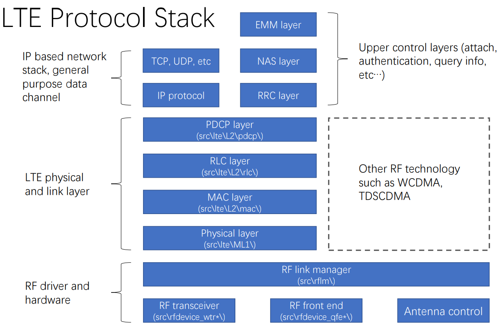

# 之前简单研究过了该文章
## 腾讯刀片团队的研究： Exploring Qualcomm Baseband via ModKit, Tencent Blade Team, CanSecWest 2018
- https://binpwn.com/papers/Embedded%20Security/Exploring%20Qualcomm%20Baseband%20via%20ModKit%20-%20Peter%20Pi,%20XiLing%20Gong,%20and%20Gmxp,%20Tencent%20Security%20Platform%20Department.pdf
- 基于Google Pixel
- 包括基带操作系统启动的过程，linux内核与基带的通讯过程（通过共享内存）
- ***用于将基带中.mdt以及.bxx组合为elf格式的基带镜像的叫脚本（已经下载）（之前学习的硕士论文中的脚本也能做到）***
  - https://github.com/laginimaineb/unify_trustlet 
    - unify_trustlet-master.zip
- ***该资料中指出，Pixel中基带固件可以从设备/firmware/radio目录下获得，测试手中的nexus设备，发现可以从相同目录获得基带固件，该方法获得的elf固件与使用论文中脚本获得的固件有一定区别，似乎该方法得到的固件更为靠谱***
  - 
- 使用https://github.com/programa-stic/hexag00n 的ids插件进行反汇编，并静态分析
- MSM 8916源码网上可得，可以学习分析，许多log字符串与 MSM 8996 Pro（骁龙821）Google Pixel的相同
  - nexus测试机中使用的芯片为msm8996，即骁龙820，所以同样可以参考8916源码进行学习
- 源码中的msg_hash.txt文件中保存log字符串，即使是旧版源码中的该文件也可以用于辅助逆向新版基带固件
  - 
- 研究了LTE的状态机
  - 
  - 
- 实现对基带的动态调试
  - 找到了一个漏洞可以允许随时从 Linux 内核读/写 Modem 内存，以此为基础实现调试工具，可以实现在基带中任意执行命令，并调试或实现内存中fuzzing，该工具为ModKit，可以实现软件断点和条件断点，同时可以读写内存以及进行内存和寄存器值的dump
  - 为实现该调试器，自己通过hexagon dsp的开发环境编写了debug server，将其在设备中运行，使用ida作为调试器前端，实现动态调试
- LTE协议栈
  - 
- 相关LTE攻击面分析

# 重新学习
- 
- 根据上图，动态调试的原理是找到一个方法绕过mba，从而注入代码到基带中

- 
- 根据上图，存在旧版的源码泄露，从而允许我们学习OTA数据处理流程
- 注意msg_hash.txt在高通源码中存在，经验证的确可以找到多个型号的泄露代码

- 下一步
  - 完成高通基带静态分析以及源码学习
  - 开展针对高通基带安卓驱动相关研究 (SMD MBA等概念)

- 高通基带源码被完整下载
# msm8916源码分析
- https://gitlab.com/qcom-sources15/sources
- 根据分析，Exploring Qualcomm Baseband via ModKit, Tencent Blade Team, CanSecWest 2018中展示的带符号的基带固件汇编代码疑似是msm8916的，所以存在相关符号
- 源码中build目录下的lib函数其实就是.o函数的打包，可以通过7z打开lib文件，查看年其中的.o文件