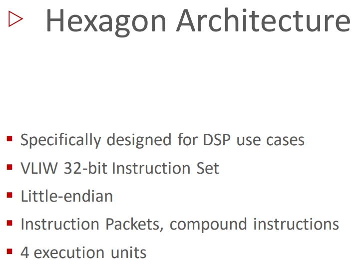
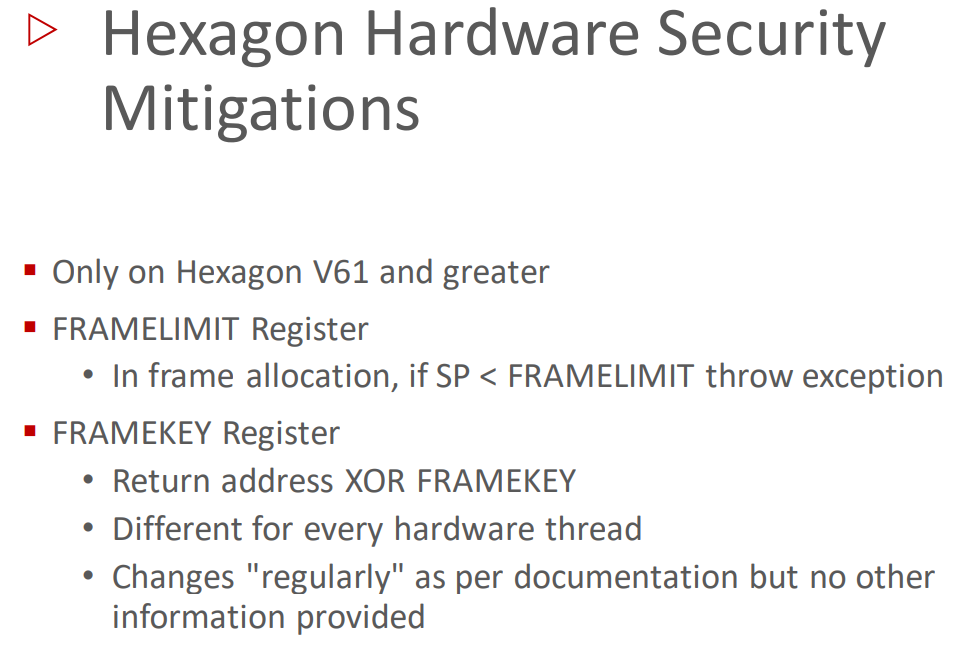
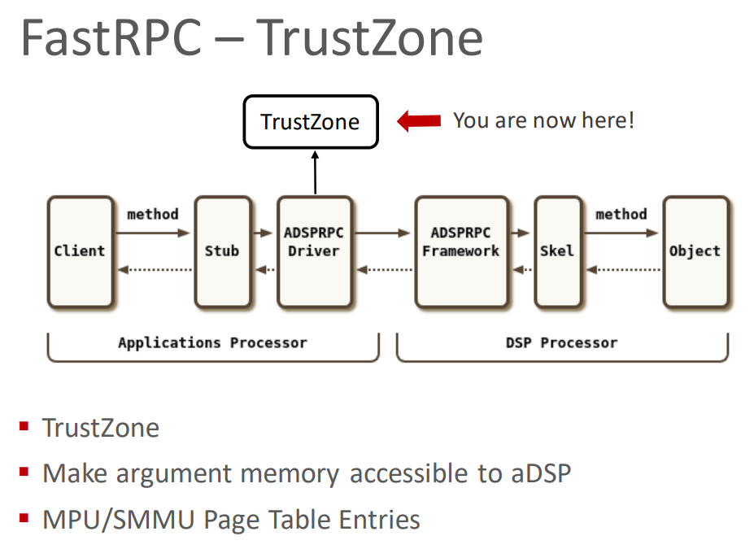
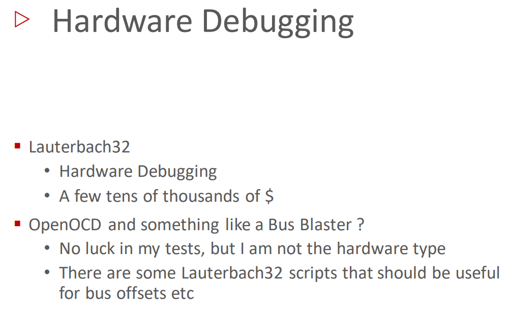
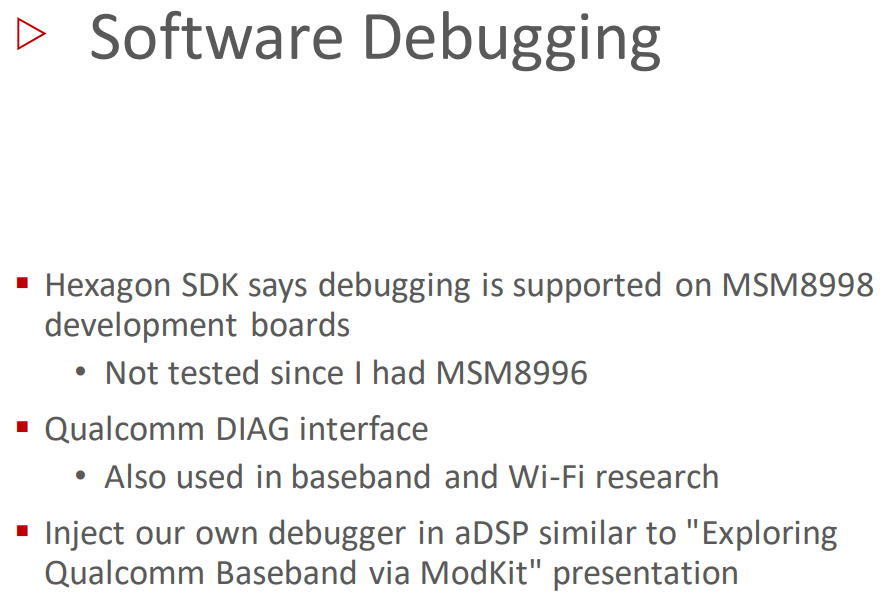
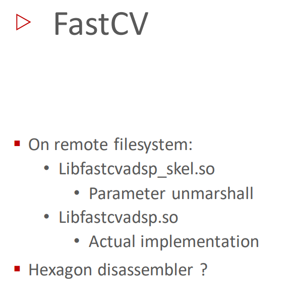
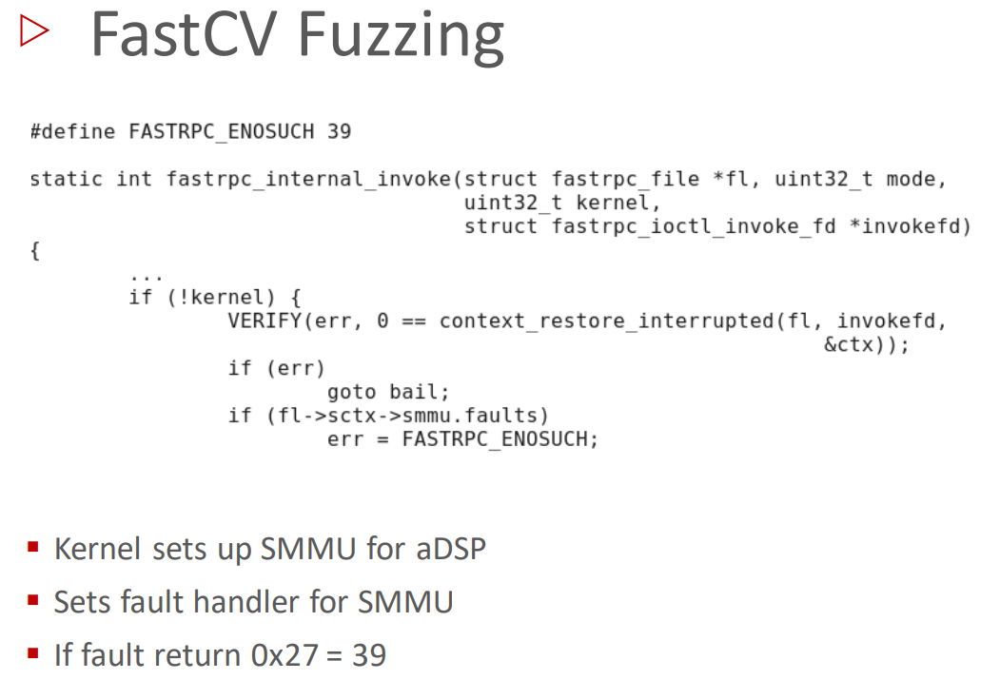

# Attacking Hexagon: Security Analysis of Qualcomm’s aDSP
- 视频 ：https://www.youtube.com/watch?v=0Ndh-W8iQmw
- 该文章着重介绍了 高通dsp芯片的 Hexagon 系统架构，以及应用系统是如何与dsp进行交互的，交互的接口是什么，分析了整个交互过程涉及哪些单元，根据逆向结果，实现了fuzz去针对adsp中的函数实现进行fuzz，同时提到了几种高通dsp的调试以及研究方法
- https://www.census-labs.com/news/2019/08/26/attacking-hexagon-security-analysis-of-qualcomms-adsp-recon-montreal-2019/
- 
- 作者出发点是探索安卓内核攻击面，然后发现了一些奇怪的adsp驱动，自此开始研究
## 关于DSP
  - 低功耗、高性能 DSP 协处理器
  - 存在于所有现代高通 SoC 中
  - 六边形架构
    - 与高通基带相同

▪ 运行自己的操作系统 QuRT
• 运行Hexagon ELF 文件
• 再次与高通基带相同
▪ DSP提供可从Android 调用的共享对象,用户空间以RPC方式调用
▪ 机器学习、计算机视觉、音频解码

▪ 高通共享内存子系统被用于dsp与系统其他部分通讯
    • 应用处理器-> aDSP 通信
    • 还用于其他子系统，例如基带和Wi-Fi
▪ aDSP 需要访问主系统内存，从而
    • 参数传递
    • 返回结果

## 内存管理架构
- 
  - dsp通过内存保护单元访问主内存，后者决定了dsp能够访问哪些内存范围
- 
- 
▪ 内存保护单元
    • 确保aDSP 只能访问特定内存
▪ aDSP内部 MMU 由实时操作系统QuRT运行 
    • 提供页表以进行地址转换 虚拟到物理地址
▪ 有限的 TLB 条目
    • 首选大型连续缓冲区，存在如下两种机制
        ▪ 内存剥离系统
            • 该系统建立在Android ION 分配器之上
            • Android ION 分配器是安卓上一个特殊分配器，用于在物理内存提供连续的缓冲区
            • 有一个特定的ION堆专供dsp使用
            • ION buffer可以映射到DSP中
        ▪ SMMU系统
            • 即系统内存管理单元
            • 该系统类似于x86 中的IOMMU
            • 该系统机制使得内存缓冲区仅看起来是连续的，但实际并非如此

## Hexagon Architecture
- 
▪ 专为 DSP 用例而设计
▪ VLIW 32 位指令集
▪ 小端数法
▪ 指令包、复合指令
▪ 4 个执行单元，可以将其视为四核 从而支持四条指令并行执行

- 
▪ 寄存器 R0 – R31
▪ 最后三个寄存器是堆栈指针、帧指针、链接寄存器
▪ 提供特殊硬件同步原语，从而同步四个执行单元
▪ 不是典型的汇编语言

- 程序栈布局情况
- 
- 与其他系统类似，栈从高到低增长，link寄存器（保存返回地址）和fp寄存器保存在栈中后，栈指针寄存器即可开辟程序栈空间
- 
- 指令包用 { … } 表示 其中指令并行执行
- 
- 上述指令包中，首先计算p0的值，之后根据p0的值的情况判断是否jump，在判断条件中，if(p0.new)中p0.new实际表示了一种同步措施，表示if判断必须在前一个指令执行之后执行
- ***这种并行执行机制是否会带来额外的漏洞模型，推测是的***

## Hexagon 架构硬件安全环节措施
- 
▪ 仅适用于 Hexagon V61 及更高版本
▪ FRAMELIMIT 寄存器 帧限制寄存器
    • 在帧分配中，如果 SP < FRAMELIMIT 抛出异常
▪ FRAMEKEY 寄存器 帧密钥寄存器
• 返回地址XOR FRAMEKEY 对应帧密钥保存在栈中
• 每个硬件线程都不同
• 根据文档“定期”更改，但没有其他信息提供

## QuRT
- 
▪ 高通实时操作系统
▪ 在 aDSP 和基带上运行
▪ 三种特权模式：
    • QuRT 操作系统 （最高权限）
    • 来宾操作系统（类似于unix中的root权限） 
    • 用户
▪ 调度、资源管理、地址转换

- QuRT 安全缓解措施
  - 
    ▪ No ASLR
    ▪ Stack cookies
    ▪ W^X
        • Can't write to executable memory
        • Can't execute data memory
    ▪ Heap corruption protection

- 
- qurt二进制文件可以在下述路径找到
    ▪ Binary can be found in TrustZone applets folder
    • /firmware/image/
- 文件特征如下
    ▪ Files: adsp.mdt, adsp.b[0-9]
▪ https://github.com/laginimaineb/unify_trustlet 可以将上述文件重新组装  已经下载 unify_trustlet-master.zip

## FastRPC Framework
- 
▪ 该框架用于APPS 处理器和 aDSP 之间的通信
▪ 该框架建立在 高通共享内存子系统 基础上
▪ 该框架存在相关中间库
    • 在Android 用户空间上存在Stub 中间库
    • 在aDSP中存在Skel中间库
▪ 存在内核驱动程序负责此类通讯

- 该框架简化版工作流程，现实会更加复杂
  - 

- 
- 假设存在一个安卓app，该应用会调用dsp相关功能，在windows on arm的场景下该过程是相同的，因为部分windows系统也可以运行在高通骁龙处理器中

- ***上述app有哪些库可以被调用？？***
  - 
  - 所有fastrpc存在一个远程文件系统，位于/vendor/lib/rfsa/adsp，该目录基本保存了所有可以从用户空间访问的库，实际可用的库因供应商而异，例如三星或谷歌pixel

- 
- 包括计算机视觉、人脸识别等库。

- 
- 对于每个库 libXXXXX.so，XXXXXX 指定库名称，都有一个libXXXXX_skel.so库与之对应，后者负责解码参数与调用函数实际实现

- 
- 高通提供了libadsprpc.so 库文件
  - ▪ 根据库名称可以获取获取远程句柄（使用remote_handle_open函数），之后可以使用句柄来调用aDSP上的函数（使用remote_handle_invoke函数）
  - ▪ libadsprpc.so
    - ▪ remote_handle_open("libname", &handle)
    - ▪ remote_handle_invoke(handle, sc, args)

- 
- 关于remote_handle_invoke(handle, sc, args) 中sc参数
    ▪ remote_handle_invoke(int handle, int sc, remote_arg_t* args)
    ▪ Argument sc: 0xAABBCCDE
    ▪ AA: Method index and attributes
    ▪ BB: Number of input buffers
    ▪ CC: Number of output buffers
    ▪ D: Number of input handles
    ▪ E: Number of output handles

- 关于 remote_handle_invoke(handle, sc, args) args参数，是一个指针数组
  - 

- 一个 remote_handle_invoke 调用示例，注意在args部分，你必须先有输入buffer参数，后有输出bubffer参数
  - 

- FastRPC – Stub 部分
  - 
  - ▪ 自动生成的“stub”库最终调用libadsprpc.so库中的 remote_handle_open/invoke 函数，该过程对用户空间透明
  - ▪ 对用户空间透明
  - ▪ Remote_handle_open/invoke 实际上是 ioctl 包装器，用于发送指定ioctl，自此，程序进入内核驱动

- FastRPC – 内核驱动部分
  - 
  - ***/dev/adsprpc-smd*** 根据llm存在方法根据该设备名定位对应驱动程序
  - 最新版本中该设备收到SELinux permissions保护，故只允许特定应用程序访问该设备
  - 该驱动程序向用户空间公开一个ioctl接口

- FastRPC – IOCTL interface 驱动支持包括如下的ioctl命令
  - 
    ▪ FASTRPC_IOCTL_INIT
    ▪ FASTRPC_IOCTL_INVOKE
    ▪ FASTRPC_IOCTL_MMAP
    ▪ FASTRPC_IOCTL_INVOKE_FD
    ▪ FASTRPC_IOCTL_SETMODE

- 针对FASTRPC_IOCTL_INIT
  -  
  - 该ioctl用于加载 hexagon二进制文件 到dsp中，具体是读取hexagon二进制文件，将其原始elf文件拷贝到ION buffer，并将ION指针和文件描述符传递给该ioctl的self
  - 有趣的是该ioctl还有一个内存参数，该内存参数来自特定可执行文件的工作内存
  - libadsprpc.so 发送 FASTRPC_IOCTL_INIT 加载 /dsp/fastrpc_shell_0文件
  - /dsp目录下还有很多 hexagon 二进制文件

- FastRPC – fastrpc_shell_0 文件 
  - 
  - fastrpc_shell_0 是一个hexagon可执行文件，该文件负责加载libXXXXX_skell.so和libXXXXX.so文件，从而进行委托执行
  - 该文件也提供了一些特定功能，例如adsp_ps，从而显示dsp中执行的进程

- 针对remote_handle_open() 函数（来自libadsprpc.so）调用如下 IOCTL,对对应功能如下
  - 
  - 其中在调用触发FASTRPC_IOCTL_INVOKE时，会调用远程函数（使用硬编码的句柄）

- 针对remote_handle_invoke() 函数是 FASTRPC_IOCTL_INVOKE的一个包装器，两种参数相同（handle, sc, remote_args），该函数就是远程调用dsp中函数时实际使用的函数
  - 

- 针对FASTRPC_IOCTL_INVOKE

- 在remote_handle_open()期间调用 触发FASTRPC_IOCTL_INVOKE ，会使用 handle = 1 即对应handle参数为1，这明显是某种特定的系统功能句柄，从而系统流程转移到aDSP，以获得库的正确句柄（听译:不保证正确性）
▪ 实际上所有 IOCTL 都会导致 FASTRPC_IOCTL_INVOKE 执行，且执行时handle = 1 同时使用不同的方法索引，例如FASTRPC_IOCTL_MMAP

- 假设我们获得了一个有效的库句柄，我们可以通过remote_handle_invoke()调用adsp中的函数，这一切建立在高通共享内存子系统中

- 此时问题是参数如何实际传输到dsp
▪ FASTRPC_IOCTL_INVOKE
• 将remote_args 映射到Hexagon
• fastrpc_buf_alloc -> hyp_assign_phys -> hyp_assign_table
• 通过 SCM call 来call TrustZone
- 如果查看FASTRPC_IOCTL_INVOKE的内核代码，有函数负责对trustzone进行scm调用，所以当传递远程参数指针到这个ioctl 会存在对trustzone的实际调用（以下述函数调用链为例fastrpc_buf_alloc -> hyp_assign_phys -> hyp_assign_table）
- 故代码执行流程来到了turstzone

- trustzone 显然负责管理内存保护单元以及SMMU Page Table Entries，所以dsp无法任意访问内存，除非trustzone明确允许
- trustzone 使参数内存可供 aDSP 访问

- 此后进入dsp的空间
▪ QuRT 将执行流程传递给 fastrpc_shell_0，从而之前打开的特定句柄，加载对应skel库

- skel库负责解码参数并根据方法下标调用函数实际实现
- dsp完成计算后会将结果传递回用户空间

▪ 现在我们知道 FastRPC 是如何工作的
▪ 仍有许多缺失的部分
  • TrustZone 如何将内存映射到aDSP
  • QuRT 如何将执行委托给库以及fastrpc_shell_0
  • 我们还看到来自libadsprpc.so 的handle = 3 的调用库，不确定在做什么，但我们也可以在没有它们的情况下执行测试

要运行自定义的dsp代码，高通提供了hexagon sdk，该基于llvm，同时提供了编译器等工具链，甚至包括模拟器，同时也提供了预编译的小工具，例如adsp-ps用于显示当前dsp中运行的进程，包括文档

- 我们想在 adsb 上运行我们自己的自定义代码，当然我们需要将我们自己的其他库放在远程文件系统上，第一个处理障碍当然是远程文件系统是只读的，所以我们只需获得 root 权限 并将分区远程设置为可写，但实际的障碍是远程库必须使用高通密钥进行签名

- 我想可能有一种方法可以绕过签名检查，该方法还未真正研究过它，我不知道是否涉及trust zone（例如典型的Android 上发生的其他标志检查）

- 实际上我得到了一个开发板，所以我从一家名为intrinsic的公司得到了一个开发板，即open EQ 820开发板，这是一个 ARM开发板 有一个 Snapdragon820，与Google Pixel 中的芯片组基本相同，原始的 Google Pixel嗯，它暴露了用于调试的 jdeck 引脚，并且启用了调试熔丝，因此基本上熔丝是一种只能从trust zone或安全世界访问的特殊存储器 并且调试熔丝在生产设备上被禁用，但在该开发板上并未被禁用，因此这基本上使我们能够在 adsp 上运行自定义库，
- 因此为了做到这一点，我们必须创建一个名为 testig.so 的库，并将其上传到远程文件系统，这个共享对象可以由hexagon SDK实用程序生成您只需要设备序列号即可生成它，之后我们可以在adsp上的开发板上运行我们自己的代码

- 所以hexagon  SDK 提供了许多关于adsp 代码的示例，我们将采用最简单的示例，称为计算器，它只是在adsp 上执行一些简单的数学运算，并且为了构建它，可以使用python build脚本以及自定义的makefile文件，这些脚本几乎可以做任何事情，包括生成 Android 端的stub库和在 adsp 端的skel库

- 修改了原本的示例代码，仅仅将参数指针的值返回，当Android 用户空间运行可执行文件时，我得到这个返回值 55cf38，即一个dsp使用的虚拟地址
- 这个示例也可以用于探索系统，例如检查内存布局，检查安全缓解措施，可以探索实时系统操作系统 API

- 存在Louderback 32 的调试板，它支持hexagon 和 dsp但是贵
- 尝试用open OCD 和bus Blaster （即jtag调试） 来实现硬件调试，但是没成功
- 在网上有一些Louderback 32脚本，其中包括一些偏移量和一些总线偏移量，我想这些偏移量对于硬件调试有用

- 文档指出MSM 8998 开发板支持软件调试不幸的是我只有一块 MSM 8996开发板，所以我不能真正使用它，
- 高通还提供了 diag接口，该接口也用于基带和 Wi-Fi 研究，用于诊断消息和调试
- 存在演讲通过Exploring Qualcomm Baseband via ModKit，基本上他们在基带一侧注入了自己的调试器，所以请记住，基带实际上具有与 adsp 相同的架构，并且实际上具有相同的操作系统，所以 我的猜测是，该演讲的工作将非常简单地转移到 asp，以便获得适当的调试环境

- 攻击面而言，dsp暴露了Skel库以及对应的代码实现库，故攻击者可以远程发送数据，此类数据在dsp中编解码，此类数据可以是视频音频等等，甚至浏览器相关函数，本地攻击而言，可以攻击对应安卓驱动

- dsp暴露大量库函数到用户空间，包括视频编解码以及数值计算，甚至是系统相关函数，问题在于即使实现了漏洞利用，能否实现对安全边界的跨越？实现在ap处理器上的类似权限提升的功能？？？

- 如果获得在dsp系统中的代码执行权限，要做什么？？
  - qurt权限提升？？
  - 利用与truszone的通讯，实现对trustzone的攻击？？
  - 利用内存共享系统，去修改安卓应用系统或安卓内核可能会用到的其他系统变量
  - 攻击其他dsp？包括计算dsp？基带dsp？adsp即应用dsp，偏向于解析各种音视频数据

- 关于fuzzing
- 
- 高通为计算机视觉提供的fastcv库，它们提供了Arm GPU 和 Hexagon 的实现，并且它存在于许多高通 Android上

- 
  - fastcv库公开了500+函数，此类函数用于矩阵计算等，adsp中可以通过fastcvadsp句柄引用此类函数

- 
  - fastcv在adsp远程文件系统中以两个库文件形式存在，Libfastcvadsp_skel.so用于解析参数Libfastcvadsp.so 用于实际的代码实现
  - 尝试分析skel库，从而分析其如何使能fastcv库
  - 需要一个反汇编器

- 
  -  hexag00n进行反汇编的时，问题是部分立即数操作未能正确解码，需要手动匹配一些偏移量，最终需要手工解码部分指令

- radare2 最新版本支持hexagon，且包含指令包，但是其不支持早期的几个版本
- capstone据说支持hexagon，但是不公开
- 最有效的反汇编器，且持续在更新 https://github.com/gsmk/hexagon/releases/tag/v1.5
  - 缺陷是不容易找到单独的寄存器，所以常常将寄存器作为64位寄存器使用，小问题而已 

▪ Ghidra 使添加对新架构的支持变得更加容易
▪ SLEIGH 处理器规范语言
▪ 奖励：反编译器
▪ 我已经实现了一些操作码，但还有很长的路要走
- ghidra容易添加对新架构的支持，作者有一些关于反编译器的进展

- 一些ghidra反编译的进展

▪ 计算立即值，对大括号内的指令行为进行建模
▪ 插入符“^”表示Rd 实际上不是指令助记符
▪ 问您：如何设置“add”作为助记词？

▪ 通过 gmsk/hexagon、radare2 验证
▪ 还有很长的路要走

- 分析fasrcv的skel库，发现每个skel库都有一个skel_invoke函数，该函数用于接收sc参数，同时接收remotes_args参数指针保存到另一个寄存器中
- 上图中r0表示sc参数，r0赋值给r2，r2计算偏移后赋值给r5 ，r1表示remote_args参数

将r5于0x1f进行对比，若大于则程序返回，说明方法索引值必须小于等于0x1f

继续执行r7中保存pc+偏移的值，之后获得r7偏移r5<<2内存处的值，最后将该值加到r7上，跳转到该位置执行，上述即根据sc参数调用对应方法的代码

上述代码从remote_args中获得了inputbuf inputhandle outputbuf outputhandle 并将其相加，最终判断是否小于5，如果小于则返回

判断第一个remote_arg是否大于14

▪ 对参数长度进行更多检查
▪ 解组参数、算术移位等
▪ 一些基本块之后

经历上述参数检查后，开始后调用实际的fastcv函数，

此时我们有了一切用于fuzzing fastcv库的知识

为了fuzz，需要解决几个问题，首先获取 FastCV 的远程句柄，这只要调用对应函数即可，之后需要将具有随机数据的缓冲区作为参数传入即可
问题是如何设置sc参数，该参数描述了输入输入参数的数量，正确设置该参数有助于绕过参数长度检查，
- 可以通过解析FastCV头文件，得到预期参数数量，从而创建一个适当的“sc”
- 可以逆向FastCV stub库，该库位于安卓用户空间，我们想要在 adsp 端调用的每个函数在 Android 用户空间端都有一个相应的stub函数，该函数一定会使用正确的sc参数进行调用

- 实际上skel库并不实际检查参数数量是否大于其预期，仅仅会在参数数量小于预期才会失败，故只要保证传输大量参数即可
- 针对sc，根据之前分析，只要保证小于等于0x1f即可

fuzzing开始，有趣的是，在invoke函数返回-1后，之后的调用均返回27，且返回速度很快，类似于执行和立刻返回，这需要分析一下为什么

- 可以发现，通用驱动会为adsp设置smmu并且设置故障处理程序，当smmu故障发生后，内核会回调该故障处理函数，然后返回返回数字 39 或 0x27，此时无法调用任意adsp功能，除非在此open该文件并打开新会话
- 所以我的猜测是fastcv中存在某种错误，但它是被 smmu 捕获，所以不清楚我们是否可以使用它来获得 adsp 上的代码执行，但这只需要更多的挖掘

- 内核使用handle 1来执行一些特定的系统调用，例如打开远程句柄，可以尝试fuzz该情况
- 不需要remote_handle_open，我们可以调用这个句柄直接像内核一样

上述情况下，开发板立刻崩溃，但是最新系统中没有崩溃

使用开发板可以实现在adsp上运行自定义代码

苹果谷歌华为设备均存在用于特殊目的的芯片及其子系统，可以作为研究目标

历史研究
# 提问
- Hexagon ELF 文件解析与普通elf文件解析是否会有不同？？？ 未研究过