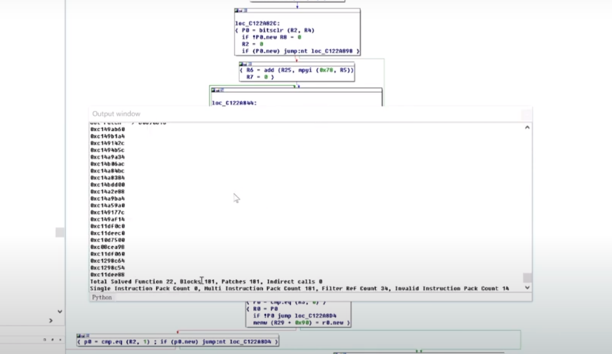

https://www.youtube.com/watch?v=V5B9zDHU2Do

- 
- 高通方案中使用hexagon架构的SOC

- 
- 是高价值的目标

- 
- adsp中存在很多编解码函数，适合进行fuzz

- 
- 
- 历史研究以及一些关于hexagon的重点信息
- 代码和数据一起保存在32位地址空间中
- 有32个32位通用寄存器
- 并行执行
- L1指令和数据缓存是分离的
- 统一的L2缓存

- 
- hexagon支持四条指令同时执行，其中包括两个数据指令和两个执行指令

- 
- hexagonv5存在三个硬件线程，三个硬件线程同时执行
- 整个架构类似一个多核处理器，之间使用共享内存通讯 

- 
- deaxagon 指令示例
- 图中loop0表示硬件循环，第一个参数表示循环起始地址，第二个参数表示循环次数，循环结束位置未endloop0

- 
- 挑战是闭源代码在奇怪的处理器上执行
- 解决方案是动态注入 或 模拟

- 
- 如何获取覆盖率？？

- 
- 通过动态注入+模拟 实现fuzz的覆盖率收集
- 即将代码注入到实际运行的目标上，触发feedback（反馈）

- 
- 动态注入和模拟的权衡，没有银弹
- 给出了动态注入和模拟的优点和缺点
- 动态注入缺点 高损耗 不稳定 无法移植 性能低下（例如在手机中进行fuzz，其性能就弱）不可扩展 目标需要能够调试
- 动态注入优点 能获得实际的运行状态 使用真实的硬件 有机会获得更好的代码覆盖率
- 虚拟化也有对应优缺点

- 
- 选择进行动态注入 原因在上面
  - 最早的hexagon qemu模拟在2019年才实现，而本工作在2018年才开始
  - 研究目标是基带，基带难以模拟，因为极度依赖运行环境和硬件 比如依赖secure boot以及trust zone 看上述模拟是不可能的，即使可行，也难以获得代码覆盖率
  - 首先需要实现代码动态注入，经过大量研究，发现在运行的基带中注入代码是不可能的，我们实现了一个复杂的调试器实现对hexagon进程进行代码注入

- 
- 动态注入的示例
- 此时是将代码注入到实际运行的目标中，此时是将代码注入运行的基带中

- 
- 注入的代码实际做的工作
- 保存环境信息
- 执行主要作业，即收集信息反馈到libfuzzer
- 重置环境
- 执行原有的代码
- 回到原有代码执行流程

- 
- 在每个代码块插入代码，从而收集反馈信息，进而收集代码覆盖率

- 
- 关于fuzzer的架构
- 安卓手机中运行debugger以及libfuzzer
- hexagon子系统中运行debug引擎以及feedback引擎
- pc用于运行debugger的patch，并分析hexagon反馈的信息

- 
- 一个fuzzer的demo
- libfuzzer是在单个进程中收集覆盖率，此处修改了libfuzzer，其会将样本喂给hexagon，当hexagon消费了样本，会将反馈信息到libfuzzer，libfuzzer会提升样本质量

- 
- debugger的demo
- 当fuzzer运行，会从fuzzer中收集到信息，会使用该信息分析目标运行状态，如果有必要，则会生成新的patch（为了提升覆盖率）

- 
- 整体架构
- 安卓上运行debug客户端以及libfuzzer
- pc上运行运行静态分析工具，用于辅助libfuzzer理解目标，同时也运行补丁生成器以及动态代码注入器去辅助fuzzer

- 
- 上述方案的一些问题
- 调试器和反馈引擎的稳定性
  -  修复错误，修复错误……
  - （堆栈深度过深导致bug、通用寄存器和条件寄存器保留、确保原始指令正确执行等）
  - 需要花时间分析crash是基带导致的还是你的调试器和引擎导致的
  - 好消息是您最终可以找到并解决所有错误
- 成本、可扩展性和性能，如果要运行自定义的fuzz，需要在三者中去取得平衡
  - ***使用开发板代替电话*** 这是一个重点的提升方向 是可以去做的工作
  - 因此您可以同时部署大量模糊器 通过购买大量的安卓开发板
  - 还要注意减少模糊器的开销

- fuzzer的结果
  - 
  - 可以发现代码质量并不好

- hexagon相关工作
  - 
• BaseSAFE: Baseband SAnitized Fuzzing through Emulation, 
2020, Dominik Maier, Lukas Seidel, Shinjo Park
• Emulating Samsung's Baseband for Security Testing, 2020, 
Grant Hernandez, Marius Muench
• Attacking Hexagon: Security Analysis of Qualcomm’s 
aDSP, 2019, Dimitrios Tatsis

- 关于高通基带相关工作
  - 
- Related Works(Qualcomm Baseband)
• Reverse engineering a Qualcomm baseband, 2011, Guillaume Delugré
• All your baseband belongs to us, 2016, Ralf Weinmann
• A Journey into Hexagon: Dissecting Qualcomm Basebands, 2018, Seamus Burke
• Exploring Qualcomm Baseband via ModKit, 2018, Tencent Blade Team
• Exploiting Qualcomm WLAN and Modem Over The Air, 2019, Tencent Blade Team
• Advanced Hexagon Diag and getting started with baseband vulnerability research, 2020, Alisa Esage ***该研究很有用***
  - https://www.youtube.com/watch?v=94NwlrtGF7I

- demo演示
- 在pc上运行脚本，生成fuzzer的patch，注意此时是在ida中运行py脚本
  - 
- 可以看到此时识别出了181个block，此时大量代码被注入到基带中
  - 
- 开始实际生成patch
  - 
  - 
  - 
  -  最终会使用adb上传patch
- 运行fuzzer，首先开始运行debugger
  - 
- 使用debugger将代码注入到基带
  - 
- 向基带中代码注入完毕，开始运行fuzzer，可以看到有99 -510个样本已经被fuzzer喂给基带
  - 
  - 
- 一旦运行fuzzer，可以在pc中查看哪些代码块被触发，这些信息是通过feedback engine 取回的
  - 
  - 