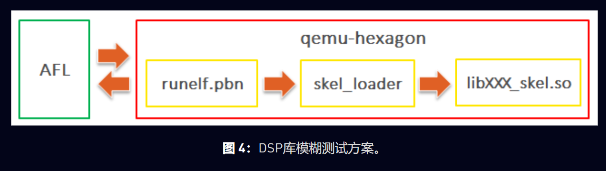
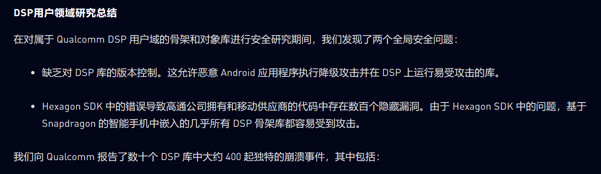
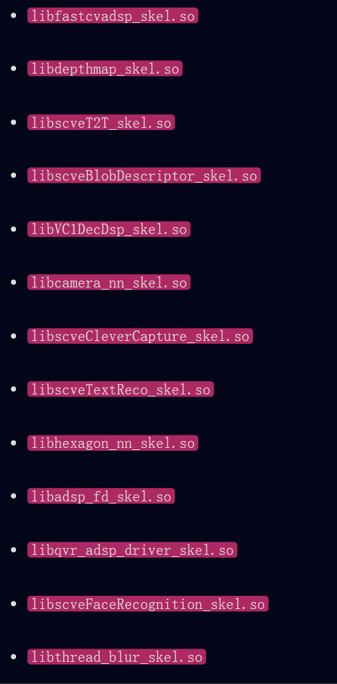
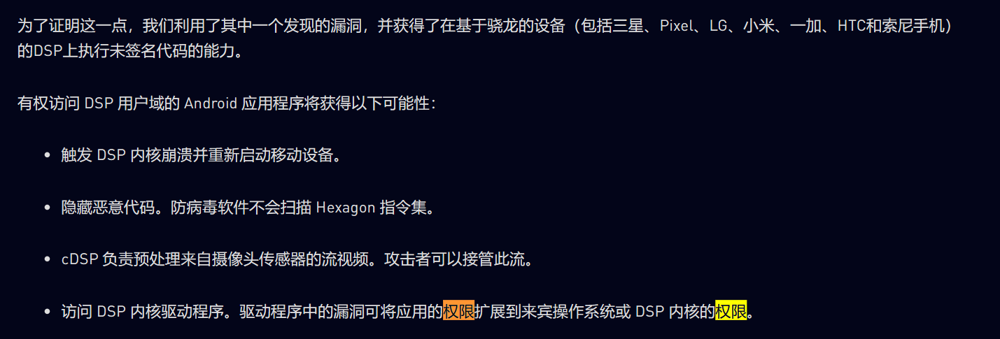
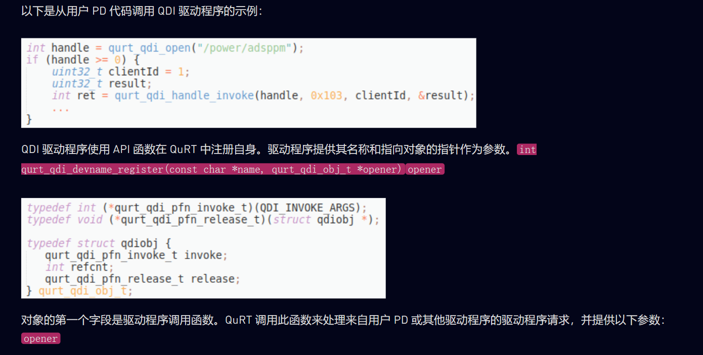
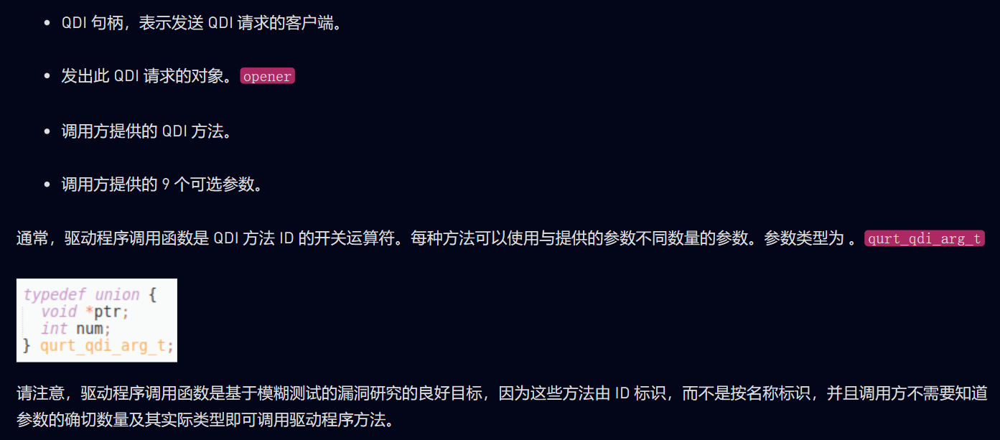
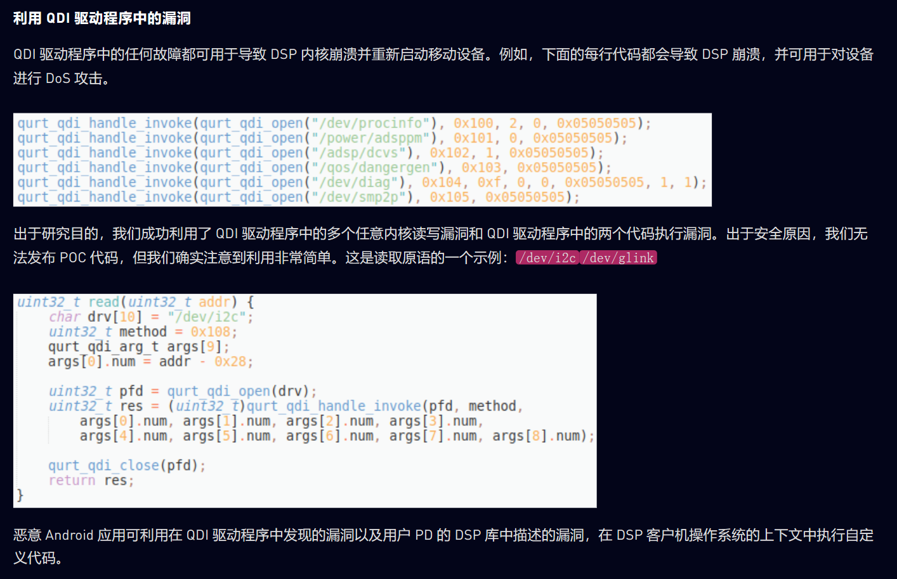

- 主要针对下述两种dsp进行研究 
  - cDSP，用于计算密集型任务，如图像处理、计算机视觉、神经网络相关计算和相机流。
  - aDSP，用于音频和语音数据的低功耗处理。

- 基带，即mdsp

- 主要的研究目标是安卓设备中的fastRPC框架中的组件，其中涉及的组件在Attacking Hexagon Security Analysis of Qualcomms aDSP.md 中已经介绍

- 谁可以在DSP上执行自己的代码
  - 出于安全原因，DSP 由 OEM 和有限数量的第三方软件供应商授权进行编程。在DSP上运行的代码由Qualcomm签名。常规 Android 应用程序无权在 DSP 上执行自己的代码。骁龙 855 和 865 SoC 除外，其中 Qualcomm 被允许在 cDSP 上执行低权限无签名动态共享对象

- dsp中先相关权限级别
  - DSP软件架构提供不同的保护域（PD），保证内核软件的稳定性。DSP 中有三个保护域：
    - 内核 – 可以访问所有 PD 的所有内存。
    - 客户机操作系统 – 可以访问其自身 PD 的内存、用户 PD 的内存和一些系统寄存器。
    - 用户 – 只能访问其自身 PD 的内存。
  - 无签名动态共享对象在无签名 PD 中运行，该 PD 是用户 PD 在访问底层 DSP 驱动程序和线程优先级方面受到限制。无符号 PD 旨在仅支持常规计算应用程序。
  - 对象库和 FastRPC shell 在用户 PD 中运行。

- 注意skel库和stub库是自动生成的，本研究主要目标就是skel库
- 公开可用的 Hexagon SDK 负责将 DSP 对象的 C/C++ 源代码编译为适用于 DSP 上执行的 Hexagon (QDSP6) 字节码。 Stub和skel代码是根据开发人员准备的接口定义语言（IDL）模块自动生成的。 Qualcomm IDL 用于定义跨内存保护和处理器边界的接口。 IDL 仅公开该对象的功能，而不公开它所在的位置或实现它的编程语言。

- 高通在Android手机上预装了很多skel库。其中绝大多数是专有的。但是，有一些开源示例，例如 和 .libdspCV_skel.solib hexagon_nn_skel.so

- 因为安卓在加载skel库时不进行版本检查，所以可以加载旧版的存在漏洞的skel库，从而达到一些漏洞利用目的，原文如下:
  - 事实上，没有对加载骨架库进行版本检查，这为在 DSP 上运行具有已知 1 天漏洞的非常旧的 skel 库提供了可能性。即使设备上已经存在更新的骨架库，也可以加载此库的旧版本，只需在原始文件路径之前指示其位置即可。这样，攻击者可以简单地绕过任何 DSP 补丁。此外，通过分析DSP软件补丁，攻击者可以发现库中内部修复的漏洞，然后通过加载未修补的版本来利用它。ADSP_LIBRARY_PATH
  - 由于缺少设备允许的已批准/拒绝框架库列表，因此可以在任何其他设备（例如，Samsung）上运行用于一台设备（例如，Sony Xperia）的库。这意味着在其中一个 OEM 库中发现的漏洞会危及所有基于 Qualcomm 的 Android 设备。

- fuzz方案
  - DSP 库是专有的 Hexagon ELF。检测 Hexagon 可执行文件的最简单方法是使用开源快速仿真器 （QEMU）。直到 2019 年底，QEMU 才添加了 Hexagon 指令集支持。我们修复了许多错误，以便能够在模拟器的用户模式下运行真正的 DSP 库。
  - AFL 与 QEMU 相结合，用于对 Ubuntu PC 上的skel库和 对象 DSP 库进行模糊测试。
  - 整个fuzz的结构如下， 
    - runelf.pbn 是一个精简版的QuRT OS 被加载到qemu中执行
    - 编写的一个Hexagon ELF 二进制程序 skel_loader 用于加载对应skel库 且 调用对应函数 被加载到qemu中执行
    - skel库，在qemu中执行
    - 
  - 在fuzz过程中，因为afl接收文件作为输入，所以将需要传递给目标程序的参数以一种格式存放在文件中，故需要创建一种文件格式，其中包含了传给目标程序的各各个参数，所编写的skel_loader程序需要以该文件为输入，并且从文件中解析出相关参数，以此调用skel库及其后面的实现函数
  - 因为是基于qemu的模拟，所以可以实现插桩以及覆盖率收集

- fuzz结果
  - 我们对模糊测试的结果感到惊讶。在我们选择模糊测试的所有 DSP 库中都发现了崩溃。仅在库中就检测到了数百个独特的崩溃。libfastcvadsp_skel.so
  - 有趣的是，大多数问题都是在skel库中发现的，而不是在对象库中发现的。这意味着 Hexagon SDK 会生成易受攻击的代码。
  
- 分析开源的stub、skel、以及实现库函数，（例如hexagon_nn相关库hexagon_nn_stub.chexagon_nn_skel.c）可以发现 使用负数作为长度字段进行输入，绕过stub的限制，进而触发越界读的问题
- 使用负数作为长度数据，可以绕过stub限制，并且触发堆溢出

- 总而言之，自动生成的代码将漏洞注入到高通、OEM 和所有其他使用 Hexagon SDK 的第三方开发人员的库中。由于 SDK 中的严重错误，Android 智能手机上预装的数十个 DSP 骨架库容易受到攻击。

- 利用漏洞
  - 关键是通过漏洞实现“read-what-where”和“write-what-where”原语。
  - 在 libfastcvadsp_skel.so 中的漏洞实现了任意读 任意写
  - 上述漏洞利用实现了以用户级别权限在dsp上执行任意代码的权限
    - 
    - 
    - 

- 针对dsp驱动程序的攻击
  - qurt系统存在自己的设备驱动模型， 即QuRT 驱动程序调用 （QDI）。无法从 Android API 访问 QDI。QDI 提供了一个简单的驱动程序调用 API，该 API 隐藏了与特权模式关联的所有实现详细信息。
  - 在 QuRT 可执行二进制文件中可以找到数十个 QDI 驱动程序。它们通常被命名为 、 、 、 或 。该函数可用于访问 QDI 驱动程序。返回一个小整数设备句柄。这与 POSIX 文件描述符直接并行。/dev/../qdi/../power/../drv/../adsp/../qos/..int qurt_qdi_open(const char* drv)
  - 通过逆向qurt，可以找到在qurt中调用QDI驱动程序的代码以及注册QDI驱动的代码
    - 
    - 

- fuzzing方案 ：基于反馈的 QDI 驱动程序模糊测试
  - 原理和之前类似，使用afl+qemu 但是fuzz的目标是qurt中的设备驱动程序

- fuzz成果
  - 模糊器在Snapdragon 855 aDSP内置的十几个QDI驱动程序中发现了许多崩溃。它们中的大多数也适用于cDSP。

- 利用 QDI 驱动程序中的漏洞
  - QDI 驱动程序中的多个任意内核读写漏洞和 QDI 驱动程序中的两个代码执行漏洞
  - 

- 尝试从dsp系统请求到安卓系统
  - 发现QuRT 将我们的请求重定向到一个特殊的 Android 守护进程。如图 9 所示，在 Snapdragon 855 设备上，有两个 aDSP 守护程序和一个 cDSP 守护程序，它们以不同的权限运行
  - 这些高特权守护程序处理 DSP 来宾操作系统请求。它们作为系统用户运行，但同时它们受到 SELinux 的极大限制。 上下文只能访问与 DSP 相关的目录和对象。vendor.adsprpcdvendor.cdsprpcdu:r:adsprpcd:s0u:r:cdsprpcd:s0

- 相关漏洞信息
  - Qualcomm针对已披露的DSP漏洞，为CVE-2020-11201、CVE-2020-11202、CVE-2020-11206、CVE-2020-11207、CVE-2020-11208和CVE-2020-11209分配了CVE-2020-11201、CVE-2020-11202、CVE-2020-11206、CVE-2020-11207、CVE-2020-11208和CVE-2020-11209。对于在QDI驱动程序中发现的漏洞，Qualcomm决定不分配CVE。2020 年 11 月的 Qualcomm 安全补丁已成功修复所有问题。

